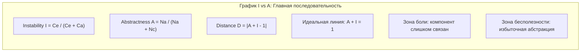
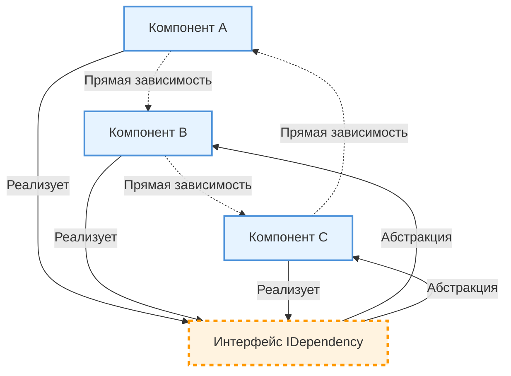

## Модуль I-0. Принципы проектирования: SOLID, DRY, KISS, YAGNI и другие

### Цели модуля

После изучения этого модуля вы сможете:
- Классифицировать 10+ принципов проектирования по группам
- Выявлять нарушения SRP, OCP, LSP, ISP, DIP в кодовой базе
- Применять метрики стабильности (Instability, Abstractness) для анализа зависимостей
- Использовать ADP и SDP для устранения циклических зависимостей
- Распознавать антипаттерны

### Теоретическая часть

#### Классификация принципов

```mermaid
flowchart TD
    classDef oop fill:#4A90D9,color:#fff,stroke:#2C5F8A
    classDef modular fill:#7B68EE,color:#fff,stroke:#5A4FCF
    classDef simplicity fill:#2ECC71,color:#fff,stroke:#1B8A4A
    classDef coupling fill:#E67E22,color:#fff,stroke:#B85C1A

    A[Принципы проектирования] --> B[Принципы ООП: SOLID]
    A --> C[Принципы модульности]
    A --> D[Принципы простоты]
    A --> E[Принципы связей]

    B --> B1[SRP: единственная ответственность]
    B --> B2[OCP: открытость/закрытость]
    B --> B3[LSP: подстановка Лисков]
    B --> B4[ISP: разделение интерфейсов]
    B --> B5[DIP: инверсия зависимостей]

    C --> C1[CRP: принцип повторного использования]
    C --> C2[REP: принцип эквивалентности релиза]
    C --> C3[ADP: принцип ацикличности зависимостей]
    C --> C4[SDP: принцип стабильности зависимостей]

    D --> D1[DRY: не повторяйся]
    D --> D2[KISS: будь проще]
    D --> D3[YAGNI: тебе это не понадобится]

    E --> E1[LoD: закон Деметры]
    E --> E2[SoC: разделение ответственности]

    class B,B1,B2,B3,B4,B5 oop
    class C,C1,C2,C3,C4 modular
    class D,D1,D2,D3 simplicity
    class E,E1,E2 coupling
```



#### Ключевые принципы: таблица

| Принцип | Полное название (SUT) | Суть | Антипаттерн | Пример нарушения |
|---------|------------------------|------|-------------|------------------|
| **SRP** | Single Responsibility Principle *(Принцип единственной ответственности)* | Класс должен иметь **только одну причину для изменения** — то есть отвечать за одну логическую обязанность. | **God Class** *(Бог-класс)* | Класс `OrderService`, который: валидирует данные, сохраняет в БД, формирует и отправляет email-уведомление. |
| **OCP** | Open/Closed Principle *(Принцип открытости/закрытости)* | Программные сущности должны быть **открыты для расширения**, но **закрыты для модификации**. | **Модификация существующего кода** *(вместо расширения)* | Использование `if (type == "email") { ... } else if (type == "sms") { ... }` вместо полиморфной стратегии. |
| **LSP** | Liskov Substitution Principle *(Принцип подстановки Барбары Лисков)* | Объекты в программе должны быть заменимы на экземпляры их подтипов без изменения правильности выполнения программы. | **Нарушение контракта** *(изменение поведения в подтипе)* | `class Square extends Rectangle`: при изменении ширины `setWidth()` высота тоже меняется — нарушает ожидаемое поведение родителя. |
| **ISP** | Interface Segregation Principle *(Принцип разделения интерфейса)* | Клиенты не должны зависеть от методов, которые они не используют. Лучше несколько специализированных интерфейсов, чем один универсальный. | **Fat Interface** *(Толстый интерфейс)* | Интерфейс `Worker` с методами `code()`, `eat()`, `sleep()` — робот не ест и не спит, но «вынужден» реализовывать. |
| **DIP** | Dependency Inversion Principle *(Принцип инверсии зависимостей)* | Модули верхних уровней не должны зависеть от модулей нижних уровней. Оба типа модулей должны зависеть от **абстракций**. | **Жёсткая связность** *(зависимость от конкретной реализации)* | `new MySqlRepository()` внутри сервиса вместо инъекции интерфейса `Repository`. |
| **DRY** | Don’t Repeat Yourself *(Не повторяйся)* | Любое знание/логика должны иметь **единственное, однозначное, авторитетное представление** в системе. | **Копипаста** *(дублирование логики)* | Один и тот же SQL-запрос `SELECT * FROM users WHERE active = 1` скопирован в 5 разных репозиториях. |
| **KISS** | Keep It Simple, Stupid *(Постарайся оставаться простым)* | Следует стремиться к **простоте**: сложные решения чаще ломаются, тяжелее поддерживать. | **Overengineering** *(избыточное усложнение)* | Внедрение фабрики фабрик для создания всего двух объектов `User` и `Role`. |
| **YAGNI** | You Ain’t Gonna Need It *(Тебе это не понадобится)* | Не добавляй функциональность, пока она **не требуется в данный момент**. | **Предварительное проектирование «на всякий случай»** | Добавление поддержки 10 языков локализации, хотя проект локализован только на один — русский. |
| **LoD** | Law of Demeter *(Закон Деметры)* | Объект должен общаться только с **непосредственными «друзьями»**, не «знать» внутреннюю структуру зависимостей. «говори только с друзьями, не с незнакомцами». Однако это не обязательный принцип | **Train Wreck** *(Составная цепочка вызовов)* | `order.getCustomer().getAddress().getCity().getCountry().getCode()` — сильная связанность с внутренней структурой. |
| **SoC** | Separation of Concerns *(Разделение ответственности)* | Система должна быть разбита на части, каждая из которых отвечает за **свою область ответственности**. | **Смешение слоёв** *(blurred layers)* | В HTML-шаблоне прямо в JSP/Blade: `<?php $db->query("SELECT ...") ?>`. |

#### Метрики графа зависимостей (SDP)

Для каждого компонента/пакета можно вычислить:

- **Instability (I)** = Fan-out / (Fan-in + Fan-out) - мера нестабильности, где Fan-out - это количество внешних зависимостей класса/пакета, Fan-in - количество внутренних зависимостей класса/пакета (прочие зависят от него). В идеале = 0.5 - стабильный класс/пакет.
  - **Диапазон:** \(I in [0, 1]\)  
  - **\(I = 0\)** — *максимально стабилен* (все зависят от него, он ничего не вызывает)  
  - **\(I = 1\)** — *максимально нестабилен* (он много где используется, но сам много чего зависит)  
  - **\(I = 0.5\)** — *оптимальный баланс* для «серединного» компонента  
- **Abstractness (A)** = Na / (Na + Nc) - доля абстрактных классов/интерфейсов, где Na — количество абстрактных сущностей в пакете: интерфейсы + абстрактные классы, Nc — количество конкретных (неабстрактных) сущностей: конкретные классы.
  - **Диапазон:** \(A in [0, 1]\)  
  - **\(A = 0\)** — *все классы конкретные* (низкая гибкость, но простота)  
  - **\(A = 1\)** — *только абстракции* (высокая гибкость, но не всегда практично)  
- **Distance (D)** = |A + I - 1| - расстояние до главной последовательности
  - **Диапазон:** \(D in [0, 1]\)  
  - **\(D = 0\)** — *идеал* (компонент на главной последовательности)  
  - **\(D > 0.5\)** — *проблема* — см. зоны ниже  

> Главная последовательность: A + I = 1 - идеальное соотношение стабильности и абстрактности.



### 🚫 Разрыв цикла зависимостей (ADP): Acyclic Dependencies Principle  
*(Принцип отсутствия циклических зависимостей)*

> **Суть:**  
> **Компоненты системы не должны зависеть друг от друга циклически.**  
> Зависимости между пакетами/модулями должны образовывать **ациклический направленный граф (DAG)** — иначе сборка, тестирование и повторное использование становятся сложными или невозможными.

---

#### 🔄 Почему циклы — это плохо?

| Проблема | Последствие |
|---------|-------------|
| 🔗 **Циклическая компиляция** | Не удастся скомпилировать компоненты по отдельности: компонент A требует B, B требует C, C требует A → замкнутый круг. |
| 🧩 **Сложность переиспользования** | Невозможно скопировать «часть системы» без тяги за собой циклических зависимостей. |
| 🧪 **Тестирование по частям** | Тестирование одного компонента требует сборки всей цепочки, даже если он логически автономен. |
| 🔄 **Порядок сборки неочевиден** | Даже Maven/Gradle могут упасть с `cycle in dependency graph`. |

---

#### ✅ Как решать? — **Абстракция через интерфейсы**

> **Ключевая идея ADP:**  
> **Переверни зависимость в обратную сторону через интерфейс**, чтобы разорвать цикл.

##### 🔁 Пример: Циклическая зависимость → разорвана


**Как это работает:**
1. Вместо `A → B → C → A`, все три зависят от **абстракции** `IDependency`.
2. `A`, `B`, `C` *реализуют* интерфейс, но **не знают друг о друге**.
3. Зависимости теперь:  
   `A → IDependency`, `B → IDependency`, `C → IDependency`  
   → **ациклическая иерархия** (хотя и не линейная, но без циклов).

---

### 🛠 Практические техники реализации ADP

| Метод | Описание | Пример |
|-------|----------|--------|
| **Инверсия зависимостей** | Компонент зависит от интерфейса, а не от другого компонента | `PaymentService` использует `PaymentGateway`, но `StripeGateway implements PaymentGateway` |
| **Event-driven архитектура** | Разрыв через публикацию событий (`A` publishes → `B` listens) | Spring `ApplicationEvent`, Kafka-события |
| **Контейнеры внедрения** | DI-контейнер «вяжет» реализации во время рантайма | Spring `@Autowired`, Guice |
| **Слой абстракции (API-модуль)** | Выносите интерфейсы в отдельный `api/` или `core/` пакет | `user-api`, `user-service` — `user-service` зависит от `user-api`, но не наоборот |

#### 💡 Ключевая мысль

> **Циклы — это не «неудобно», а **архитектурная ошибка**, ломающая модульность.**  
> Разрывай их **всегда**, когда встречаешь — это экономит время в будущем.

### 🔍 Системный взгляд: от требований к принципам проектирования

> **Системный аналитик не спрашивает: «Какой принцип нарушается в классе?»  
> — он спрашивает: «Какое требование привело к нарушению и какие риски это создаёт для системы как целого?»**

| Тип требования | К какому принципу оно обычно сводится | Чем грозит нарушение | Как проверить на ранней стадии |
|----------------|----------------------------------------|----------------------|-------------------------------|
| **Быстрое изменение бизнес-правил** (например, «мы хотим менять логику расчёта комиссии еженедельно») | DRY, OCP, ISP | Если логика захардкожена — каждая правка = тестирование всего модуля; риск регрессии | — Формализуется ли правило отдельно? <br> — Есть ли версия логики? |
| **Интеграция с внешними системами** («нужно добавить поддержку API ВТБ») | DIP, ADP, SoC | Рост связности, циклические зависимости, «утечка» бизнес-логики в интеграционный слой | — Есть ли `PaymentGateway` или `VtbPaymentService extends PaymentService`? <br> — Выносится ли маппинг за пределы бизнес-логики? |
| **Требования к безопасности/аудиту** («нужно логировать все изменения статуса») | SRP, SoC | Логика аудита смешана с бизнес-логикой — риски: забытые log-строки, пропущенные audit-триггеры в API | — Кто отвечает за `AuditTrail`? Какой модуль? <br> — Изменяется ли `StatusChangeService` при добавлении нового канала? |
| **Масштабируемость** («нагрузка выросла в 10x, таймауты растут») | LoD, DIP, ADP | Цепочки `A → B → C → D` без кэширования/асинхронности → каскадные фейлы | — Видны ли в `jdeps`/`ArchUnit` глубокие цепочки (depth > 5)? <br> — Есть ли Circuit Breaker или Retry в критичных путях? |

> 💡 **Практика:**  
> На встрече с product owner’ом запрашивайте не «как это работает», а:  
> *«Если мы изменим это правило — какая часть системы сломается первой? Какой компонент попадёт под изменения чаще всего?»*  
> Это сразу подскажет, к какому принципу нужно применить «давление».

### 🧪 Диагностика «на ранних стадиях» — когда ещё нет кода

Методика: **анализ по требованиям (R-анализ)**  
Превращайте «нужно сделать X» в «где могут быть нарушения Y».

| Фраза из ТЗ | Вероятное нарушение | Что проверить на демо-архитектуре |
|-------------|---------------------|----------------------------------|
| *«Мы хотим менять логику расчёта без деплоя»* | OCP, DIP | — Есть ли `Strategy`-интерфейс? <br> — Меняется ли класс, реализующий расчёт, без изменения сервиса? |
| *«Нужно интегрироваться с X системами в параллель»* | ADP, SoC | — Видна ли развязка через `EventPublisher`? <br> — Есть ли `integration-context`? |
| *«Клиент хочет видеть историю всех изменений по заявке»* | SRP, DRY | — Кто отвечает за `AuditTrail`? — Общий сервис или `AuditAspect`? <br> — Используется ли `@Audited` или `@Loggable`? |
| *«Должна быть возможность отключить канал Y в одной стране, но оставить в другой»* | ISP, LoD | — Есть ли `ChannelConfiguration`? <br> — Принимается ли решение в `Gateway`, а не в `Service`? |

> ✅ **Упражнение:**  
> Дано ТЗ:  
> *«Система должна поддерживать 3 вида идентификации: биометрия, СКЗ, ЭЦП. Все типы должны работать независимо и меняться без остановки системы»*  
> **Задание:**  
> 1. Какие принципы здесь критичны?  
> 2. Какой паттерн вы предложите?  
> 3. Какие модули должны быть разделены?

### 🧭 Карта ответственности: от принципов к ролям

| Принцип | Ответственный в команде | Что проверять на ретроспективе |
|---------|--------------------------|-------------------------------|
| **SRP** | Системный аналитик + BA | — Достаточно ли чётко описано «одно дело» в user story? <br> — Есть ли «и» в acceptence criteria? |
| **ADP/SDP** | Аналитик + Архитектор | — Всегда ли диаграмма зависимостей (UML component) согласована перед спринтом? <br> — Есть ли в `jdeps` `cycle`? |
| **DRY** | DevOps + QA | — Как часто появляется одинаковый SQL в разных сервисах? (метрика: `sql_duplication_ratio`) |
| **LoD** | Tech Lead + BA | — Сколько методов `get...()` в DTO возвращают неявно вложенные объекты? |

> 💡 **Совет:** На спринт-планировке задавайте:  
> *«Какой принцип вы здесь используете как основной? SRP, DIP или что-то ещё? Где зафиксировано это решение?»*

---

### 🔐 Принцип ACID (Atomicity, Consistency, Isolation, Durability)

> **Что это?**  
> **ACID** — это набор свойств, обеспечивающих **надёжную обработку транзакций** в реляционных СУБД. Если транзакция обладает ACID-свойствами, система остаётся в согласованном состоянии даже при ошибках, сбоях или одновременных запросах.

> **Что это даёт?**  
> Понимание ACID позволяет **оценить, какие гарантии предоставляет система при сохранении данных**, и предупредить риски, связанные с потерей данных, дублированием или частичным применением изменений.

---

### ACID — таблица свойств

| Свойство | Название | Что гарантирует | Интерпретация | Пример из страхования |
|----------|----------|-----------------|----------------------------|-----------------------|
| **A** | **Atomicity** *(Атомарность)* | Транзакция **выполняется целиком или не выполняется вообще** — нет «частичного успеха». | *«Если одна часть операции падает — вся операция откатывается, как будто её и не было»*. | При оформлении полиса: если сохранение клиента прошло, а сохранение риска — нет, **никакие данные не попадают в БД**. |
| **C** | **Consistency** *(Согласованность)* | Результат транзакции должен переводить систему из **одного валидного состояния в другое** — соблюдая все бизнес-правила и ограничения (например, уникальность, проверки ссылочной целостности). | *«После транзакции не может быть «полу-данных», нарушающих правила»*. | При оформлении полиса: сумма премии по риску **не может быть < 0** и **должна совпадать с расчётом** по тарифу. Если расчёт дал `-500` — транзакция откатится. |
| **I** | **Isolation** *(Изоляция)* | Одновременные транзакции **не мешают друг другу** — каждая работает с «своей копией» данных, пока не зафиксирована. | *«Два пользователя оформляют полис по одной заявке — один не видит «полу-созданного» полиса другого»*. | Два агента одновременно добавляют нового водителя в один полис: система сохраняет оба действия **в порядке очереди**, без конфликтов или «перетирания» данных. |
| **D** | **Durability** *(Долговечность)* | **Зафиксированные изменения остаются в системе навсегда**, даже при сбое питания/СУБД (при условии, что данные записаны на диск). | *«После подтверждения «успешно» — данные не исчезнут при рестарте сервера»*. | После подтверждения оплаты — платеж **всегда появится в отчёте**, даже если сервер выключили через 5 секунд. |

---

### Критически важные нюансы

#### 1. **Не все системы обеспечивают полный ACID**
| Система | ACID? | Комментарий |
|---------|-------|---------------------------|
| PostgreSQL, Oracle, SQL Server | ✅ Полный | Подходит для критичных сценариев: страхование, финансы. |
| MySQL (InnoDB) | ✅ (с настройками) | ACID включён по умолчанию, но нужно проверять уровень изоляции. |
| MongoDB (с реплика-сетами) | ⚠️ *Частичный* | Атомарность только внутри одного документа. Глобальные транзакции появились в 4.0, но не во всех deployment-моделях. |
| Kafka + Event Sourcing | ❌ (BASE) | **Eventual Consistency** — данные могут быть «пока не согласованы». Подходит для аудита, но не для расчёта премий «в реальном времени». |

> 💡 **Вопрос:**  
> *«Если расчёт премии и сохранение полиса идут в разные СУБД (например, PostgreSQL + Redis для кэша) — как гарантировать, что оба действия либо успешны, либо откачены?»*  
> → Ответ: ** распределённые транзакции (2PC) — дорогие и рискованные. Лучше использовать Event Sourcing или Saga-паттерн.**

---

#### 2. **ACID ≠ «безопасность» — это только про данные**
> ✅ ACID гарантирует:  
> - данные не потеряются  
> - не будет частичных изменений  
> - правила валидации соблюдаются  
>  
> ❌ ACID **не гарантирует**:  
> - **безопасность от мошенничества** (доступ к данным)  
> - **корректность бизнес-логики** (если вы посчитали `premium = 0`, ACID это сохранит как валидное)  
> - **надёжность бизнес-процесса** (например, email не отправлен — транзакция сохранения полиса прошла, но пользователь не знает об этом)  

> 🔎 **Аналитическая проверка:**  
> *«Где лежит логика уведомления после сохранения полиса? В той же транзакции или отдельно? Что происходит, если email-сервис упал после коммита?»*

---

### Примеры 

| Сценарий | ACID в действии | Риск при отсутствии ACID |
|----------|----------------|-------------------------|
| **Переоформление полиса** (отмена старого → создание нового) | Обе операции в одной транзакции → если вторая упадёт, старый полис не удаляется. | Два активных полиса → двойная выплата по обеим. |
| **Внесение оплаты + привязка к полису** | Транзакция: `UPDATE premiums SET status = 'PAID'` + `INSERT payments (...)`. | Статус «оплачен», но платеж не recorded → аудиторы не найдут документы. |
| **Сброс премии после изменения риска** | `UPDATE risks SET coverage = newCoverage` + пересчёт премии в `UPDATE policies`. | Полис сохранён, но премия осталась старой → клиент доплатил, а система «забыла». |

---

### Выводы

| ACID-свойство | Ваша роль |
|---------------|-------------------------|
| **Atomicity** | Уточняйте: *«А что, если часть операции упадёт? Откатится ли вся транзакция?»* |
| **Consistency** | Формализуйте бизнес-правила как ограничения (`CHECK`, `UNIQUE`, `FOREIGN KEY`). Не оставляйте их «в коде». |
| **Isolation** | Запрашивайте: *«Могут ли одновременно обрабатывать одну заявку несколько пользователей? Какое состояние они увидят?»* |
| **Durability** | Уточняйте: *«Как долго мы храним транзакции? Есть ли бэкапы до и после коммита?»* |

> ✅ **Правило:**  
> **«Критичные операции (деньги, полисы, выплаты) должны работать в ACID-транзакциях. Прочие — смотрите, есть ли требования к eventual consistency».**

> 📌 **Источник:**  
>ACID был сформулирован в 1983 г. Грюнтером, Маодисоном и Селли. С тех пор стал стандартом для транзакционных БД.  
>  
> 💡 **Аналитический мем:**  
> *«Если ваша система не ACID-совместима — но работает с деньгами — вы просто ещё не наткнулись на ту багу.»*

---

### Ингос-секция: Принципы в нашей системе

| Принцип | Что соблюдается | Что нарушается |
|---------|-----------------|----------------|
| SRP | Классы-сервисы имеют одну зону ответственности | Есть "божественные" контроллеры с 2000+ строк |
| DIP | Используем DI-контейнер (Spring) | Некоторые legacy-классы создают зависимости через new |
| LoD | API Gateway изолирует вызовы | Есть цепочки .getA().getB().getC() |
| DRY | Утилитарные классы вынесены в общие библиотеки | SQL-запросы дублируются между сервисами |

### Примеры кода

#### LoD: Правильно и неправильно

```java
// Нарушение LoD (Train Wreck)
String city = order.getCustomer().getAddress().getCity();

// Соблюдение LoD (инкапсуляция)
String city = order.getCustomerCity();

// В классе Order:
public String getCustomerCity() {
    return this.customer.getAddress().getCity();
}
```

#### DIP: Соблюдение принципа

```java
// Нарушение DIP
public class OrderService {
    private MySqlRepository repository = new MySqlRepository();
}

// Соблюдение DIP
public class OrderService {
    private final OrderRepository repository;
    
    public OrderService(OrderRepository repository) {
        this.repository = repository;
    }
}

public interface OrderRepository { /* ... */ }
public class JpaOrderRepository implements OrderRepository { /* ... */ }
```

### Практическая часть

#### Задание 1. Найдите нарушение SRP

Класс ниже нарушает SRP. Найдите все ответственности и предложите рефакторинг.

```java
public class UserService {
    public void register(String email, String password) {
        if (!email.contains("@")) throw new IllegalArgumentException();
        String hash = BCrypt.hashpw(password, BCrypt.gensalt());
        // INSERT INTO users ...
        // sendEmail(email, "Welcome!");
        // log.info("User registered: " + email);
    }
}
```

<details>
<summary>Ожидаемый ответ</summary>

Ответственности:
1. Валидация -> вынести в UserValidator
2. Хеширование -> вынести в PasswordHasher
3. Сохранение -> вынести в UserRepository
4. Отправка email -> вынести в NotificationService
5. Логирование -> AOP-аспект или middleware

После рефакторинга:

```java
@Service
public class UserService {
    private final UserValidator validator;
    private final PasswordHasher hasher;
    private final UserRepository repository;
    private final NotificationService notificationService;
    
    @Transactional
    public void register(String email, String password) {
        validator.validateEmail(email);
        String hash = hasher.hash(password);
        User user = repository.save(new User(email, hash));
        notificationService.sendWelcomeEmail(user);
    }
}
```

</details>

#### Задание 2. Проверьте граф зависимостей через jdeps

```bash
# Анализ зависимостей пакета
jdeps -package com.ingos.service.claims -summary target/classes/

# Поиск циклических зависимостей
jdeps -cp target/classes -recursive -filter:package .
```

#### Задание 3. Вычислите метрики

Для пакета com.ingos.service.policy:
- Na (абстрактных типов) = 3
- Nc (всего типов) = 10
- Fan-in (зависимости извне) = 5
- Fan-out (зависимости вовне) = 2

**Вопрос:** Чему равны I, A и D? Находится ли пакет на главной последовательности?

<details>
<summary>Ожидаемый ответ</summary>

- A = 3/10 = 0.3
- I = 2/(5+2) ~ 0.286
- D = |0.3 + 0.286 - 1| = |0.586 - 1| = 0.414

D < 0.5 - пакет близок к главной последовательности. Близок к ядру

</details>

### Контрольные вопросы

1. Чем отличается LSP от ISP? Приведите примеры нарушений каждого.
2. В чём разница между DRY и YAGNI? Могут ли они конфликтовать?
3. Почему LoD (Закон Деметры) важен для микросервисной архитектуры?
4. Как метрика Distance (D) помогает оценить качество модуля?
5. Что произойдёт с системой, если нарушить ADP?

---
