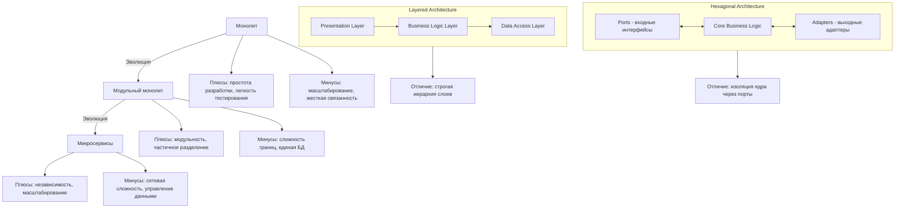

## Модуль I-1. Стили архитектуры: Монолит - Модульный монолит - Микросервисы

### Цели модуля

После изучения вы сможете:
- Сравнивать монолитную, модульно-монолитную и микросервисную архитектуры
- Выбирать стиль под задачу
- Отличать Layered Architecture от Hexagonal Architecture

### Теоретическая часть

#### Эволюция архитектурных стилей



#### 🔍 Контекст-матрица: что влияет на выбор архитектуры?  
*(ключевой инструмент системного аналитика)*

| Критерий | Монолит | Модульный монолит | Микросервисы | Как измерить? | Когда выбирать? |
|----------|---------|-------------------|--------------|--------------|----------------|
| **Команда** | 1–3 разработчика | 3–10 (но с чётными границами модулей) | 10+ (по 2–5 на сервис) | `Число команд × Частота коммитов / сервис` | Команда < 5 → **монолит**; >10 с независимыми доменами → **микросервисы** |
| **Рост нагрузки** | до ~100 TPS | до ~1K TPS (при оптимизации) | без предела | `Peak RPS / TPS по SLA` | SLA >1K TPS, прогноз роста 5x/год → **микросервисы** |
| **Частота изменений** | медленно (все в одной ветке) | умеренно (по модулям) | быстро (по сервисам) | `Кол-во изменений/день на домен` | >5 изменений/день в одном домене → **модуль/сервис** |
| **Согласованность данных** | строгая (ACID) | строгая (одна БД) | eventual (CAP) | `Кол-во кросс-доменных операций` | Требуется 2PC/XA → **монолит/мод. монолит**; допустимо eventual → **микросервисы** |
| **Регуляторика** | простая (одна схема) | сложнее (разделение схем) | максимально гибкая | `Нормативные требования: GDPR, 115-ФЗ, PCI-DSS` | Высокая регуляторная нагрузка → **модульный монолит** (контролируемый доступ к данным) |
| **Время вывода на рынок (MVP)** | ⏱️ быстро | ⏱️ среднее | ⏱️ медленно (настройка инфраструктуры) | `Дни от идеи до продакшена` | MVP < 3 мес → **монолит**; >6 мес → **мод. монолит** как запас прочности |

> 💡 **Системный принцип:**  
> *«Не выбирайте архитектуру под идеальный сценарий — выбирайте под **текущие ограничения** и **сценарий провала»**.*  
> Пример: Если срок MVP — 2 месяца, микросервисы создадут **технический долг** на следующие 6 месяцев.


### 🚧 Эволюция архитектур: не прямая, а ветвящаяся  

Миграция между стилями — это **стратегический выбор**, а не автоматическая эволюция.

| Сценарий | Правильный путь | Чего избегать |
|----------|----------------|---------------|
| Нужен MVP за 2–3 месяца | Монолит → постепенное разложение на модули при росте сложности | Микросервисы «на всякий случай» |
| Домен подвержен частым изменениям | Модульный монолит с чёткими границами + CI/CD для модулей | Делать микросервисы из-под палки без анализа |
| Требуется независимое масштабирование (например, аналитика + расчёты) | Выделить домен в отдельный модуль → при достижении критической массы → вынести в микросервис | Мигрировать сразу все домены без приоритизации |
| Высокие регуляторные требования (например, 115-ФЗ) | Модульный монолит с ACL по схемам, без распыления данных | Пытаться разнести ПДн по разным БД без валидации регуляторного соответствия |

### 🔑 Критические ошибки при эволюции  
1. **«Переписать с нуля» вместо Strangler Fig**  
   → Потеря 6–12 мес. + регрессия  
   → **Как избежать**: завести «стрangling-план» с конкретными API-контрактами и fallback-логикой.

2. **Миграция без тестов**  
   → 40%+ багов в первом релизе микросервисов  
   → **Как избежать**: добавить тестовую ветку с параллельным прогоном (canary) и контрактным тестированием.

3. **Вынос в микросервис *только* для «масштабирования»**  
   → Сетевая задержка > выигрыша от масштабирования  
   → **Как избежать**: сначала измерить `Время запроса = 2× сетевая задержка + DB query` — если не критично — оставить в мод. монолите.

---


### ⚖️ Внутренняя структура: Layered ≠ Hexagonal  
*(важно: это **не архитектурные стили**, а **паттерны проектирования внутри модуля**)*  

| Паттерн | Где использовать | Контекстный выбор системного аналитика |
|---------|-----------------|----------------------------------------|
| **Layered Architecture** | Внутри модуля, где доменная логика стабильна и не меняется часто (например, расчёт премии) | Высокая стабильность → Layered + DB view → простота тестирования и отладки. Не подходит для часто меняющихся внешних API. |
| **Hexagonal Architecture (Ports & Adapters)** | В модуле с активными внешними интеграциями (например, интеграция с госуслугами, банками) | Частые изменения внешних API → порты позволяют менять адаптеры без тронутого core. Критично для регуляторных изменений (например, ЦБ меняет формат API — меняется только адаптер). |
| **Event-Driven внутри модуля** | При оркестрации долгих процессов (например, андеррайтинг с участием 3-х сторон) | Требуется асинхронность без сетевых вызовов → `@Async` + `ApplicationEvent`. Не нужно тащить Kafka ради одного события. |

> ✅ **Правильное сравнение:**  
> — `Layered` и `Hexagonal` — **альтернативы внутри одного модуля**.  
> — `Монолит` и `Микросервисы` — **альтернативы для всей системы**.  
> *Вы можете иметь микросервисную систему, где каждый сервис реализован по Hexagonal.*

#### Пример кода: Hexagonal Architecture

```java
// === Port (выходной порт) ===
public interface OrderRepository {
    Order save(Order order);
    Optional<Order> findById(Long id);
}

// === Core Business Logic ===
public class OrderService {
    private final OrderRepository repository;
    
    public OrderService(OrderRepository repository) {
        this.repository = repository;
    }
    
    public Order createOrder(OrderData data) {
        return repository.save(new Order(data));
    }
}

// === Adapter (адаптер к БД) ===
@Repository
public class JpaOrderRepository implements OrderRepository {
    private final SpringDataJpaRepository jpaRepo;
    
    @Override
    public Order save(Order order) {
        return jpaRepo.save(order);
    }
}
```

---

### 📊 Практические сравнительные критерии  
*(вместо «высокая/низкая» — цифры и оценки)*

| Критерий | Монолит | Модульный монолит | Микросервисы | Источник измерения |
|----------|---------|-------------------|--------------|---------------------|
| **Стоимость деплоя (в человеко-часах)** | 1–2 ч (один бандл) | 3–6 ч (для одного модуля) | 10–30 ч (для 10+ сервисов) | `CI/CD pipeline time × cost/hour` |
| **Время сборки (на машине разработчика)** | <30 сек | 1–3 мин | 2–5 мин (на одном сервисе) | `./gradlew build` (реальное время) |
| **Время до продакшена (от коммита)** | 5–15 мин | 10–25 мин | 20–60 мин (в зависимости от инфраструктуры) | `Время от push до deploy` |
| **Сетевые задержки (на 1 вызов)** | 0 мс | 0 мс | 2–50 мс (в зависимости от toplogy и сетевой нагрузки) | `jfr profiler` + `zipkin` (на проде) |
| **Количество компонентов для теста** | 1 (все в JVM) | 1 (но модульные тесты с `@DataJpaTest`, `@ServiceTest`) | N (нужен контейнер с БД, Kafka, Redis, Zipkin) | `docker-compose.yml / k8s manifests` |
| **Критический путь при падении** | Весь сервис | Один модуль (если не кросс-модульные зависимости) | Зависит от оркестрации: retry, circuit-breaker, Saga/Outbox | `Chaos Engineering: failure injection` |
| **Управление версиями** | 1 версия | 1 версия (но с семантикой модулей, напр. `v2premium`) | M версий по количеству сервисов (`v1`, `v2` для API) | `Maven/Gradle versions` / `OpenAPI` |

> 📌 **Вывод:**  
> Микросервисы **не дают преимуществ** в:  
> • Малых командах (<5 человек)  
> • Критичных к согласованности доменах (без eventual acceptability)  
> • Проектах со сроком <6 мес  
> → Их нужно выбирать **только** если есть *измеримый рост нагрузки* **и** *независимость доменов*.

---

### Практика

Вы - архитектор стартапа по онлайн-калькулятору страховки. У вас 3 разработчика. Какую архитектуру вы выберете и почему?

### Контрольные вопросы

1. В каких случаях монолит лучше микросервисов?
2. Чем модульный монолит отличается от "просто монолита"?
3. Какая архитектура лучше подходит для быстрого прототипирования?

---
