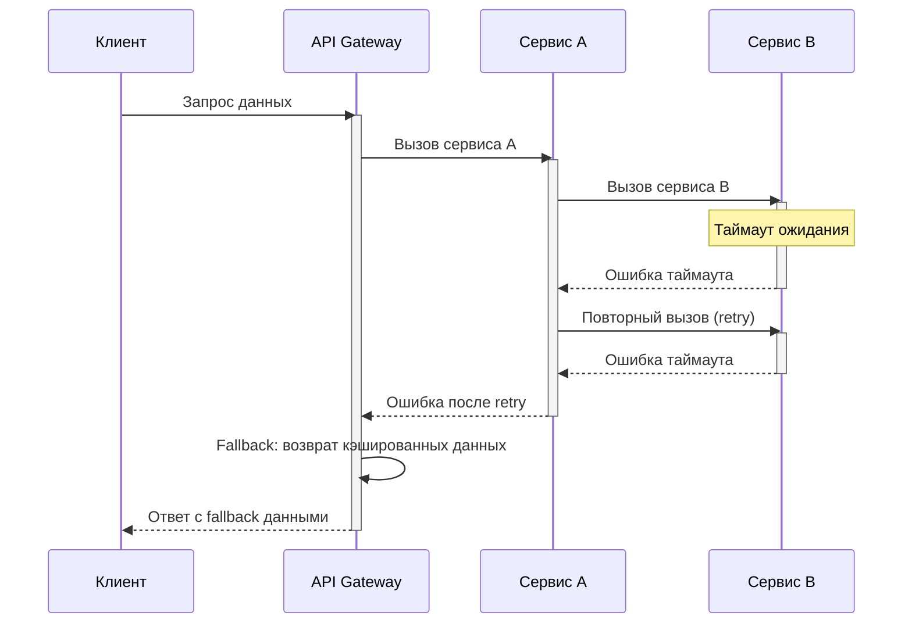
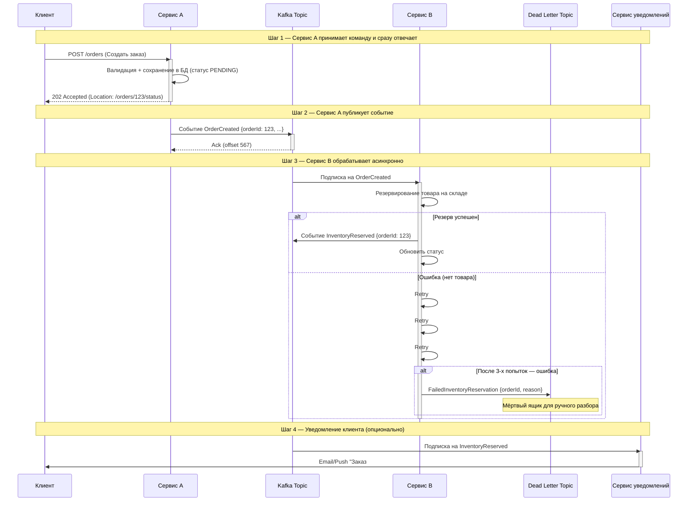
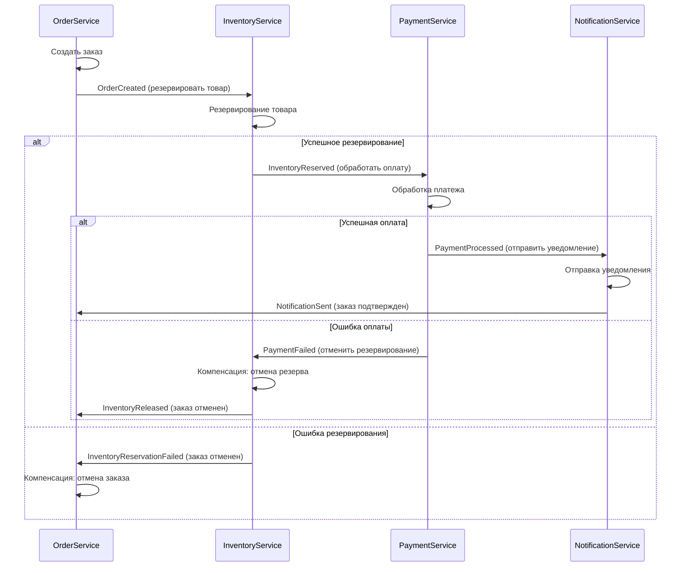
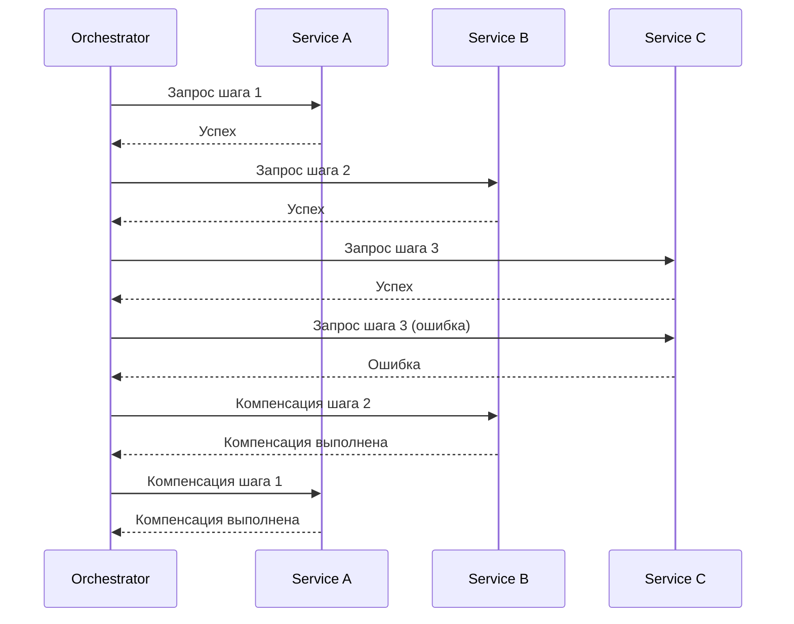
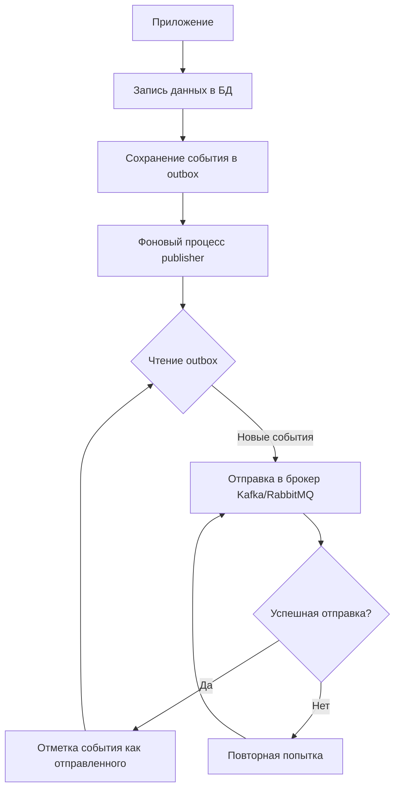

## Модуль I-2. Паттерны взаимодействия: Синхрон, Асинхрон, Транзакции

### Цели модуля

После изучения вы сможете:
- Выбирать между синхронным и асинхронным взаимодействием
- Проектировать Saga (Choreography и Orchestration)
- Реализовывать Outbox Pattern для гарантированной доставки

### Теоретическая часть

#### Sequence diagram: Каскадный отказ при синхронных вызовах



#### Sequence diagram: Асинхронный сценарий



#### Сравнительная таблица — когда что выбирать

| Критерий | Синхронный (Request-Response) | Асинхронный (Event-Driven) |
|----------|------------------------------|---------------------------|
| **Latency** | Высокая. Сумма всех вызовов | Низкая. Клиент сразу получает 202 |
| **Связанность** | Жёсткая. Gateway знает все сервисы | Слабая. Сервисы знают только события |
| **Отказоустойчивость** | Отказ одного = отказ всей цепочки | Изолированная. Остальные работают |
| **Повторные попытки** | Ручные, на каждом уровне | Встроенные в брокер (retry + backoff) |
| **Трассировка** | Сложно. Нужна распределённая трассировка | Удобно. Каждое событие — шаг, видно offset и lag |
| **Масштабирование** | Вертикальное + балансировка | Горизонтальное, через consumer groups |
| **Консистентность** | Сильная (в пределах транзакции) | Eventual (согласованность со временем) |
| **Транзакции** | ACID / 2PC (блокирующие) | SAGA с компенсациями (неблокирующие) |
| **Сложность отладки** | Низкая — стек вызовов перед глазами | Выше — нужно собирать трейс по correlationId |
| **Подходит для** | Запросы в реальном времени (авторизация, оплата) | Долгие бизнес-процессы (заказ, доставка, onboarding) |

---

#### Комбинированный подход — что применяют на практике

Чистый синхронный или чистый асинхронный стиль встречается редко.
В реальных системах почти всегда используют **гибрид**:

| Сценарий | Тип взаимодействия | Почему |
|----------|-------------------|--------|
| `POST /orders` (создать заказ) | **Синхронный** → `202 Accepted` | Клиент должен сразу узнать, принят ли заказ. Дальше — асинхронная кухня |
| `GET /orders/123` (статус заказа) | **Синхронный**, чтение своей БД | Чтение своей проекции — быстро и консистентно |
| `GET /products` (каталог товаров) | **Синхронный**, чтение своей БД | Поиск и фильтры требуют мгновенного ответа |
| Заказ → Резерв склада → Оплата → Доставка | **Асинхронный**. SAGA через события | Процесс длится минуты/часы, много точек отказа |
| Отправка email клиенту | **Асинхронный**. Fire-and-forget | Письмо не влияет на бизнес-транзакцию |
| Списание денег (payment) | **Синхронный** (иногда 2PC/XA) | Деньги любят строгую консистентность |
| Скоринг кредита (занимает 30 сек) | **Асинхронный** с callback | Клиент не должен висеть 30 секунд на одном соединении |
| Генерация отчёта (занимает 2 мин) | **Асинхронный** с polling | Nginx отрубит синхронный вызов по таймауту через 60 сек |
| Авторизация пользователя | **Синхронный** | Ответ нужен немедленно, иначе не пускаем дальше |
| Онбординг сотрудника (HR → IT → Бухгалтерия) | **Асинхронный**. SAGA | Процесс идёт часами/днями, шаги независимы |

---

> 💡 **[ДОПОЛНЕНИЕ SA]** **Совет системного аналитика:** На диаграмме выше показан классический каскадный отказ. В реальной спецификации ТЗ обязательно фиксируйте **timeout-ы для каждого звена** и политику retry (количество попыток, интервал, exponential backoff). Без этого разработчики ставят дефолтные 30 секунд — и вся цепочка подвисает. **[КОНЕЦ ДОПОЛНЕНИЯ SA]**

---

**[ДОПОЛНЕНИЕ SA: Блок 1 — Проектирование контрактов API]**

### 1.1. Проектирование контрактов: OpenAPI и AsyncAPI

В реальной работе системный аналитик пишет или ревьюит спецификации API. Ниже — примеры, которые вы встретите в продакшене.

#### 1.1.1. OpenAPI 3.0 — синхронный REST-эндпоинт

```yaml
openapi: "3.0.3"
info:
  title: Order Service API
  version: "1.0.0"
  description: |
    API для создания и управления заказами интернет-магазина.
    Все эндпоинты требуют JWT-аутентификации в заголовке Authorization.

paths:
  /api/v1/orders:
    post:
      summary: Создать новый заказ
      operationId: createOrder
      tags:
        - Orders
      requestBody:
        required: true
        content:
          application/json:
            schema:
              $ref: '#/components/schemas/CreateOrderRequest'
      responses:
        '201':
          description: Заказ успешно создан
          content:
            application/json:
              schema:
                $ref: '#/components/schemas/OrderResponse'
        '400':
          description: Ошибка валидации (некорректные данные)
          content:
            application/json:
              schema:
                $ref: '#/components/schemas/ErrorResponse'
        '422':
          description: Бизнес-ошибка (товара нет на складе)
          content:
            application/json:
              schema:
                $ref: '#/components/schemas/ErrorResponse'
        '429':
          description: Превышен лимит запросов (rate limit)
          headers:
            Retry-After:
              schema:
                type: integer
                description: Секунд до следующего допустимого запроса

components:
  schemas:
    CreateOrderRequest:
      type: object
      required:
        - customerId
        - items
        - deliveryAddress
      properties:
        customerId:
          type: string
          format: uuid
          description: Идентификатор клиента
          example: "a1b2c3d4-e5f6-7890-abcd-ef1234567890"
        items:
          type: array
          minItems: 1
          maxItems: 50
          description: Позиции заказа
          items:
            $ref: '#/components/schemas/OrderItem'
        deliveryAddress:
          $ref: '#/components/schemas/Address'
        promoCode:
          type: string
          maxLength: 20
          description: Промокод (опционально)
          example: "WELCOME2024"

    OrderItem:
      type: object
      required:
        - productId
        - quantity
      properties:
        productId:
          type: string
          format: uuid
        quantity:
          type: integer
          minimum: 1
          maximum: 999
        price:
          type: number
          format: decimal
          description: Цена за единицу на момент добавления
          example: 1499.99

    Address:
      type: object
      required:
        - country
        - city
        - street
        - building
      properties:
        country:
          type: string
          example: "Россия"
        city:
          type: string
          example: "Москва"
        street:
          type: string
          example: "Тверская"
        building:
          type: string
          example: "12"
        apartment:
          type: string
          example: "45"
        zipCode:
          type: string
          pattern: '^\d{6}$'
          example: "125009"

    OrderResponse:
      type: object
      properties:
        orderId:
          type: string
          format: uuid
        status:
          type: string
          enum: [CREATED, CONFIRMED, PAID, SHIPPED, DELIVERED, CANCELLED]
        totalAmount:
          type: number
          format: decimal
        createdAt:
          type: string
          format: date-time

    ErrorResponse:
      type: object
      properties:
        code:
          type: string
          example: "VALIDATION_ERROR"
        message:
          type: string
          example: "Поле 'quantity' должно быть от 1 до 999"
        details:
          type: array
          items:
            type: object
            properties:
              field:
                type: string
              reason:
                type: string
```

> ⚠️ **Замечание системного аналитика:** Самая частая ошибка новичков — не указывать `required` поля в схеме. Разработчик на фронтенде не поймёт, какие поля обязательны, и начнёт гадать. Второй камень — забыть про `maxLength` / `pattern` для строк. Без них в БД прилетит 100500-символьная строка и упадёт индекс. **Всегда валидируйте на уровне контракта то, что валидируется на уровне БД.**

---

#### 1.1.2. AsyncAPI — событийная интеграция через Kafka

```yaml
asyncapi: "2.6.0"
info:
  title: Order Events
  version: "1.0.0"
  description: |
    Событийная шина для обмена сообщениями между сервисами
    в процессе оформления заказа. Гарантия доставки: at-least-once.

channels:
  order.events:
    description: |
      Канал для событий жизненного цикла заказа.
      Ключ сообщения — orderId (UUID).
    publish:
      summary: Сервисы публикуют события заказа
      operationId: publishOrderEvent
      message:
        oneOf:
          - $ref: '#/components/messages/OrderCreated'
          - $ref: '#/components/messages/OrderPaid'
          - $ref: '#/components/messages/OrderCancelled'
          - $ref: '#/components/messages/OrderShipped'

    subscribe:
      summary: Сервисы подписываются на события заказа
      operationId: consumeOrderEvent
      message:
        oneOf:
          - $ref: '#/components/messages/OrderCreated'
          - $ref: '#/components/messages/OrderPaid'
          - $ref: '#/components/messages/OrderCancelled'
          - $ref: '#/components/messages/OrderShipped'

components:
  messages:
    OrderCreated:
      name: OrderCreated
      title: Заказ создан
      summary: Событие возникает при успешном создании заказа
      contentType: application/json
      payload:
        type: object
        required:
          - eventId
          - eventType
          - eventVersion
          - timestamp
          - data
        properties:
          eventId:
            type: string
            format: uuid
            description: Уникальный идентификатор события
          eventType:
            type: string
            const: "OrderCreated"
          eventVersion:
            type: integer
            const: 1
            description: Версия схемы события для обратной совместимости
          timestamp:
            type: string
            format: date-time
            description: Момент возникновения события (UTC)
          data:
            type: object
            required:
              - orderId
              - customerId
              - items
              - totalAmount
            properties:
              orderId:
                type: string
                format: uuid
              customerId:
                type: string
                format: uuid
              items:
                type: array
                items:
                  type: object
                  properties:
                    productId:
                      type: string
                      format: uuid
                    productName:
                      type: string
                    quantity:
                      type: integer
                    unitPrice:
                      type: number
                      format: decimal
              totalAmount:
                type: number
                format: decimal
              deliveryDate:
                type: string
                format: date
                description: Планируемая дата доставки

    OrderPaid:
      name: OrderPaid
      title: Заказ оплачен
      payload:
        type: object
        required:
          - eventId
          - eventType
          - eventVersion
          - timestamp
          - data
        properties:
          eventId:
            type: string
            format: uuid
          eventType:
            type: string
            const: "OrderPaid"
          eventVersion:
            type: integer
            const: 1
          timestamp:
            type: string
            format: date-time
          data:
            type: object
            required:
              - orderId
              - paymentId
              - paymentMethod
              - amount
            properties:
              orderId:
                type: string
                format: uuid
              paymentId:
                type: string
                format: uuid
              paymentMethod:
                type: string
                enum: [CARD, SBP, YANDEX_PAY, APPLE_PAY]
              amount:
                type: number
                format: decimal

    OrderCancelled:
      name: OrderCancelled
      title: Заказ отменён
      payload:
        type: object
        required:
          - eventId
          - eventType
          - eventVersion
          - timestamp
          - data
        properties:
          eventId:
            type: string
            format: uuid
          eventType:
            type: string
            const: "OrderCancelled"
          eventVersion:
            type: integer
            const: 1
          timestamp:
            type: string
            format: date-time
          data:
            type: object
            required:
              - orderId
              - reason
            properties:
              orderId:
                type: string
                format: uuid
              reason:
                type: string
                enum: [PAYMENT_FAILED, OUT_OF_STOCK, CUSTOMER_CANCELLED, FRAUD_DETECTED]
              refundId:
                type: string
                format: uuid
                description: Идентификатор возврата (если оплата прошла)

    OrderShipped:
      name: OrderShipped
      title: Заказ отгружен
      payload:
        type: object
        required:
          - eventId
          - eventType
          - eventVersion
          - timestamp
          - data
        properties:
          eventId:
            type: string
            format: uuid
          eventType:
            type: string
            const: "OrderShipped"
          eventVersion:
            type: integer
            const: 1
          timestamp:
            type: string
            format: date-time
          data:
            type: object
            required:
              - orderId
              - trackingNumber
              - carrier
            properties:
              orderId:
                type: string
                format: uuid
              trackingNumber:
                type: string
              carrier:
                type: string
                enum: [CDEK, BOXBERRY, RUSSIAN_POST, PICKPOINT]
```

> 💡 **Совет системного аналитика:** В AsyncAPI-контракте всегда указывайте `eventVersion`. Когда через полгода вы измените структуру события, старые потребители не сломаются — они увидят версию и смогут обработать или проигнорировать новое поле. Без версионирования миграция событий — это боль и продовольственные ночные деплои.

**[КОНЕЦ ДОПОЛНЕНИЯ SA]**

---

SAGA — это не аббревиатура в строгом смысле (не S.A.G.A.), а название паттерна, отсылающее к «саге» — длинной истории, состоящей из множества эпизодов. Каждый «эпизод» — это отдельная локальная транзакция в своём сервисе, а вместе они образуют целостный бизнес-процесс.

#### Saga Choreography



> ⚠️ **[ДОПОЛНЕНИЕ SA]** **Замечание системного аналитика:** В Choreography-подходе легко потерять сквозную трассировку. Когда 5 сервисов обмениваются событиями, а заказ не доехал до доставки — кто виноват? **Обязательно требуйте Correlation ID** (он же `eventId` в контракте выше) и логирование на каждом шаге. Иначе расследование инцидента превратится в гадание. **[КОНЕЦ ДОПОЛНЕНИЯ SA]**

---

#### Saga Orchestration



> 💡 **[ДОПОЛНЕНИЕ SA]** **Совет системного аналитика:** Orchestration проще отлаживать — вся логика в одном оркестраторе. Но он становится единой точкой отказа (SPOF). В ТЗ обязательно закладывайте **репликацию оркестратора** и **persistence его состояния** (например, в PostgreSQL), чтобы при падении он мог восстановиться с последнего успешного шага, а не начинать заново. **[КОНЕЦ ДОПОЛНЕНИЯ SA]**

---

#### 2PC vs Saga

Two-Phase Commit (2PC) — это протокол распределённых транзакций, который гарантирует строгую согласованность (strong consistency) между несколькими участниками. В отличие от SAGA, где согласованность достигается со временем (eventual consistency), 2PC даёт жёсткую гарантию «все или никто» прямо сейчас.

| Критерий | 2PC (2-Phase Commit) | Saga |
|----------|----------------------|------|
| Тип | Синхронная блокировка | Асинхронная |
| Консистентность | Сильная (Strong) | Конечная (Eventual) |
| Блокировка | Да (замки на время транзакции) | Нет (компенсация при ошибке) |
| Производительность | Низкая при большом числе участников | Высокая |
| Применимость в микросервисах | Крайне редка | Стандарт де-факто |

**[ДОПОЛНЕНИЕ SA: Блок 2 — Работа с данными и маппинг]**

### 1.2. Трансформация данных: маппинг реляционной модели в событие Kafka

Системному аналитику постоянно приходится описывать, как данные перетекают из одной системы в другую. Ниже — реальный кейс: заказ из реляционной БД маппится в JSON-событие для Kafka.

#### 1.2.1. Исходная реляционная модель (упрощённо)

```sql
-- Таблица заказов
CREATE TABLE orders (
    id              UUID PRIMARY KEY,
    customer_id     UUID NOT NULL,
    status          VARCHAR(20) NOT NULL DEFAULT 'CREATED',
    total_amount    DECIMAL(12,2) NOT NULL,
    promo_code      VARCHAR(20),
    delivery_date   DATE,
    created_at      TIMESTAMP NOT NULL DEFAULT NOW(),
    updated_at      TIMESTAMP NOT NULL DEFAULT NOW()
);

-- Таблица позиций заказа
CREATE TABLE order_items (
    id          UUID PRIMARY KEY,
    order_id    UUID NOT NULL REFERENCES orders(id),
    product_id  UUID NOT NULL,
    product_name VARCHAR(255) NOT NULL,
    quantity    INTEGER NOT NULL CHECK (quantity > 0),
    unit_price  DECIMAL(12,2) NOT NULL,
    CONSTRAINT fk_order FOREIGN KEY (order_id) REFERENCES orders(id)
);

-- Таблица адресов доставки
CREATE TABLE delivery_addresses (
    id          UUID PRIMARY KEY,
    order_id    UUID NOT NULL REFERENCES orders(id),
    country     VARCHAR(100) NOT NULL,
    city        VARCHAR(100) NOT NULL,
    street      VARCHAR(200) NOT NULL,
    building    VARCHAR(20) NOT NULL,
    apartment   VARCHAR(20),
    zip_code    VARCHAR(10),
    CONSTRAINT fk_order_address FOREIGN KEY (order_id) REFERENCES orders(id)
);
```

#### 1.2.2. Целевой JSON (событие OrderCreated для Kafka)

```json
{
  "eventId": "a1b2c3d4-e5f6-7890-abcd-ef1234567890",
  "eventType": "OrderCreated",
  "eventVersion": 1,
  "timestamp": "2024-11-20T14:30:00.123Z",
  "data": {
    "orderId": "b2c3d4e5-f6a7-8901-bcde-f12345678901",
    "customerId": "c3d4e5f6-a7b8-9012-cdef-123456789012",
    "status": "CREATED",
    "totalAmount": 4599.97,
    "promoCode": "WELCOME2024",
    "deliveryDate": "2024-11-25",
    "deliveryAddress": {
      "country": "Россия",
      "city": "Москва",
      "street": "Тверская",
      "building": "12",
      "apartment": "45",
      "zipCode": "125009"
    },
    "items": [
      {
        "productId": "d4e5f6a7-b8c9-0123-defa-234567890123",
        "productName": "Смартфон X Pro",
        "quantity": 1,
        "unitPrice": 3499.99
      },
      {
        "productId": "e5f6a7b8-c9d0-1234-efab-345678901234",
        "productName": "Чехол силиконовый",
        "quantity": 2,
        "unitPrice": 549.99
      }
    ]
  }
}
```

#### 1.2.3. Таблица маппинга (mapping table)

| Поле в БД (orders) | Поле в JSON | Тип в БД | Тип в JSON | Трансформация |
|---|---|---|---|---|
| `orders.id` | `data.orderId` | UUID | string (uuid) | Прямое копирование |
| `orders.customer_id` | `data.customerId` | UUID | string (uuid) | Прямое копирование |
| `orders.status` | `data.status` | VARCHAR(20) | string (enum) | Прямое копирование |
| `orders.total_amount` | `data.totalAmount` | DECIMAL(12,2) | number (decimal) | CAST to decimal |
| `orders.promo_code` | `data.promoCode` | VARCHAR(20) | string | Прямое копирование; если NULL — не включать в JSON |
| `orders.delivery_date` | `data.deliveryDate` | DATE | string (date) | Форматирование в ISO 8601: `yyyy-MM-dd` |
| `orders.created_at` | `timestamp` | TIMESTAMP | string (date-time) | Форматирование в ISO 8601: `yyyy-MM-dd'T'HH:mm:ss.SSS'Z'` |
| `delivery_addresses.*` | `data.deliveryAddress` | — | object | JOIN по `order_id`, все поля маппятся 1:1 |
| `order_items.*` | `data.items[]` | — | array | JOIN по `order_id`, каждая строка → элемент массива |

> ⚠️ **Замечание системного аналитика:** В таблице маппинга критически важно указывать **обработку NULL**. Пример: `promo_code` может быть NULL. Если вы просто скопируете NULL в JSON, потребитель получит `"promoCode": null`, что может сломать его десериализацию. **Правило:** опциональные поля с NULL-значением либо не включаются в JSON вообще, либо включаются с дефолтным значением. Прописывайте это в контракте явно.

#### 1.2.4. SQL-запрос для сборки денормализованной витрины

Типовая задача аналитика: собрать плоскую таблицу для отчёта «Заказы с детализацией по товарам и адресам».

```sql
WITH order_base AS (
    SELECT
        o.id                                                          AS order_id,
        o.customer_id,
        o.status,
        o.total_amount,
        o.promo_code,
        o.delivery_date,
        o.created_at,
        da.country,
        da.city,
        da.street,
        da.building,
        da.apartment,
        da.zip_code
    FROM orders o
    LEFT JOIN delivery_addresses da ON da.order_id = o.id
    WHERE o.created_at >= '2024-01-01'  -- фильтр по дате для инкрементальной загрузки
)
SELECT
    ob.order_id,
    ob.customer_id,
    ob.status,
    ob.total_amount,
    ob.promo_code,
    ob.delivery_date,
    ob.created_at,
    ob.country          AS delivery_country,
    ob.city             AS delivery_city,
    ob.street           AS delivery_street,
    ob.building         AS delivery_building,
    ob.apartment        AS delivery_apartment,
    ob.zip_code         AS delivery_zip,
    oi.id               AS item_id,
    oi.product_id,
    oi.product_name,
    oi.quantity,
    oi.unit_price,
    (oi.quantity * oi.unit_price) AS item_total
FROM order_base ob
LEFT JOIN order_items oi ON oi.order_id = ob.order_id
ORDER BY ob.order_id, oi.id;
```

> 💡 **Совет системного аналитика:** Этот запрос — классическая «звезда» (star schema) в действии. Обратите внимание: я использую `LEFT JOIN`, а не `INNER JOIN`, потому что заказ может быть без товаров (крайний случай — отменён до добавления позиций). В реальной витрине для отчётов **всегда проверяйте бизнес-правило**: может ли быть заказ без позиций? Если нет — смело ставьте `INNER JOIN`, это ускорит запрос.

**[КОНЕЦ ДОПОЛНЕНИЯ SA]**

---

#### Outbox Pattern



### Пример: Saga Choreography на Spring/Kafka

```java
// === OrderService ===
@Service
public class OrderService {
    @EventListener
    public void onOrderCreated(OrderCreatedEvent event) {
        // Логика создания заказа
    }
    
    @EventListener
    public void onPaymentProcessed(PaymentProcessedEvent event) {
        // Заказ подтверждён
    }
    
    @EventListener
    public void onPaymentFailed(PaymentFailedEvent event) {
        // Компенсация: отмена заказа
    }
}

// === Событие (Kafka) ===
public record OrderCreatedEvent(Long orderId, Long productId, int quantity) {}
```

### Пример: Outbox Pattern на Spring + JDBC

```sql
-- Таблица outbox
CREATE TABLE outbox (
    id UUID PRIMARY KEY,
    aggregate_type VARCHAR(255) NOT NULL,
    aggregate_id VARCHAR(255) NOT NULL,
    event_type VARCHAR(255) NOT NULL,
    payload JSONB NOT NULL,
    created_at TIMESTAMP NOT NULL DEFAULT NOW(),
    sent_at TIMESTAMP NULL
);

CREATE INDEX idx_outbox_unsent ON outbox WHERE sent_at IS NULL;
```

```java
// === Outbox Service ===
@Service
@Transactional
public class OutboxService {
    private final JdbcTemplate jdbc;
    
    public void saveEvent(String aggregateType, String aggregateId, 
                          String eventType, Object payload) {
        jdbc.update(
            'INSERT INTO outbox (id, aggregate_type, aggregate_id, event_type, payload) VALUES (?, ?, ?, ?, ?::jsonb)',
            UUID.randomUUID(), aggregateType, aggregateId, eventType, toJson(payload)
        );
    }
}

// === Outbox Publisher ===
@Component
public class OutboxPublisher {
    @Scheduled(fixedDelay = 1000)
    @Transactional
    public void publishPendingEvents() {
        List<OutboxEvent> events = jdbc.query(
            'SELECT * FROM outbox WHERE sent_at IS NULL ORDER BY created_at LIMIT 100',
            eventRowMapper
        );
        for (OutboxEvent event : events) {
            try {
                kafkaTemplate.send(event.getEventType(), event.getPayload());
                jdbc.update('UPDATE outbox SET sent_at = NOW() WHERE id = ?', event.getId());
            } catch (Exception e) {
                log.error('Failed to send event: {}', event.getId(), e);
            }
        }
    }
}
```

> ⚠️ **[ДОПОЛНЕНИЕ SA]** **Замечание системного аналитика:** В Outbox Publisher выше есть классическая проблема **двойной отправки** (duplicate delivery). Если Kafka-брокер ответил с таймаутом, но сообщение всё же было записано, publisher повторит отправку. Потребитель получит дубль. **Решение:** делайте идемпотентность на стороне потребителя — храните `eventId` обработанных событий и игнорируйте повторные. **[КОНЕЦ ДОПОЛНЕНИЯ SA]**

---

### Ингос-секция: Паттерны в нашей системе

- Saga: Используем Choreography для процесса оформления полиса
- Outbox: Используется для гарантированной отправки событий в Kafka
- Риски: Синхронные вызовы между микросервисами приводят к каскадным таймаутам

### Практика

Спроектируйте Saga для процесса 'Оформление страхового полиса':
1. Клиент отправляет заявку
2. Система проверяет данные (андеррайтинг)
3. Расчёт тарифа
4. Оплата
5. Выпуск полиса
6. Отправка уведомления

**Вопрос:** Какие компенсирующие действия нужны для каждого шага?

<details>
<summary>Ожидаемый ответ</summary>

| Шаг | Компенсирующее действие |
|-----|------------------------|
| 2. Андеррайтинг | Отменить проверку (если данные были заблокированы) |
| 3. Расчёт тарифа | Отменить расчёт (удалить кэш) |
| 4. Оплата | Возврат средств (refund) |
| 5. Выпуск полиса | Аннулировать полис |
| 6. Уведомление | Отправить уведомление об отмене |

</details>

### Контрольные вопросы

1. В чём разница между Saga (Choreography) и Saga (Orchestration)?
2. Как Outbox Pattern решает проблему dual-write?
3. Почему 2PC не рекомендуется в микросервисной архитектуре?
4. Какой паттерн выбрать, если нужна строгая консистентность?

---

**[ДОПОЛНЕНИЕ SA: Блок 3 — Диаграммы и визуализация систем]**

### 1.3. ASCII-диаграммы для спецификаций

В реальной работе вы не всегда сможете вставить Mermaid или картинку в ТЗ (например, заказчик просит текстовый документ или Wiki без поддержки графики). Ниже — ASCII-диаграммы, которые можно вставить в любой текстовый документ.

#### 1.3.1. Sequence diagram (ASCII): «Пользователь оформляет заказ»

```
Фронт                Бэк              Kafka/Warehouse         Склад (WMS)
  |                   |                    |                      |
  |--- POST /orders -->|                   |                      |
  |                   |--- validate ---->  |                      |
  |                   |<-- ok -----------  |                      |
  |                   |                    |                      |
  |                   |--- save to DB ---> |                      |
  |                   |<-- saved --------- |                      |
  |                   |                    |                      |
  |                   |--- outbox: ------->|                      |
  |                   |    OrderCreated    |                      |
  |                   |                    |                      |
  |<-- 201 Created ---|                    |                      |
  |                   |                    |                      |
  |                   |                    |--- InventoryService  |
  |                   |                    |    .reserve() ------>|
  |                   |                    |                      |
  |                   |                    |<-- reserved ---------|
  |                   |                    |                      |
  |                   |                    |--- PaymentService    |
  |                   |                    |    .charge() ------->|
  |                   |                    |                      |
  |                   |                    |<-- charged ----------|
  |                   |                    |                      |
  |                   |                    |--- NotificationSvc   |
  |                   |                    |    .sendEmail() ---->|
  |                   |                    |                      |
```

>
