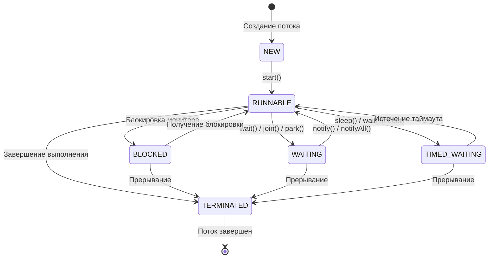
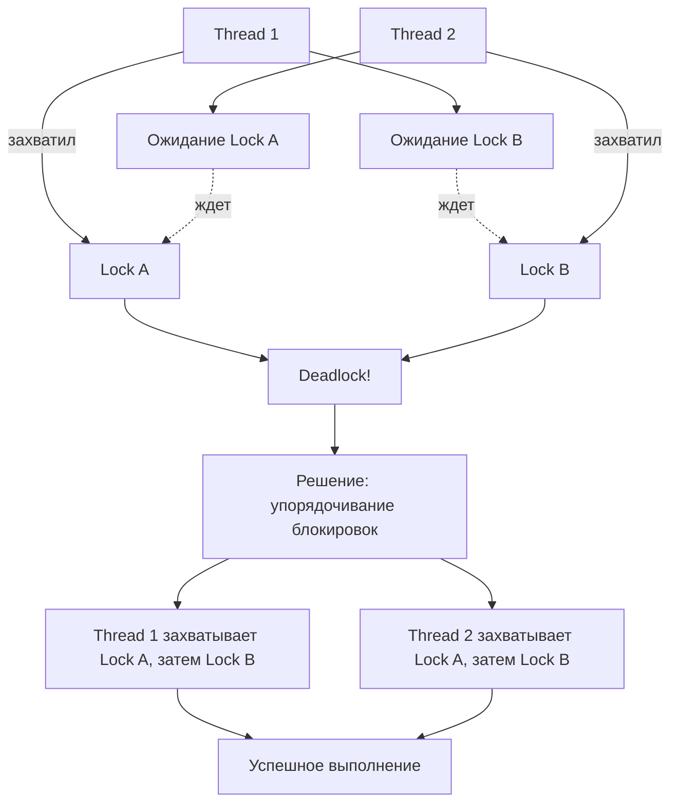
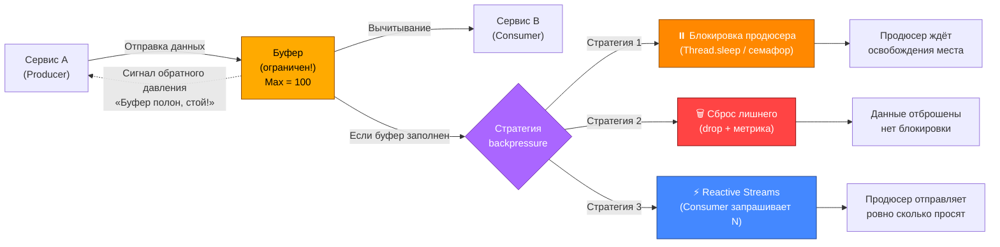

## Модуль I-3. Многопоточность

### Цели модуля

После изучения вы сможете:
- Идентифицировать race condition и deadlock
- Применять примитивы синхронизации
- Рассчитывать размер пула потоков

### Красные флаги многопоточности — чек-лист системного аналитика

Если в проектируемой системе видишь хотя бы один из этих признаков —
проблемы с конкурентным доступом в продакшене гарантированы.
Не нужно ждать нагрузочного тестирования, чтобы это понять.

---

#### Флаг 1. Разделяемое изменяемое состояние

> **Признак:** Одна и та же переменная, запись в БД, строка кэша или поле конфигурации
> меняется из нескольких потоков, сессий или экземпляров приложения.

**Пример:** Счётчик посещений, хранящийся в статическом поле.

**Что произойдёт:** Race condition. Два потока прочитали `count = 5`, оба увеличили до 6,
оба записали 6. Потеряно одно увеличение.

**Где проявляется:** При нагрузке больше одного пользователя. Воспроизводится нестабильно.

---

#### Флаг 2. Операция «прочитать — подумать — записать»

> **Признак:** Бизнес-логика читает значение из БД или памяти, принимает решение на его основе,
> затем пишет обновлённое значение обратно. Между чтением и записью нет блокировки.

**Пример:** Прочитал баланс = 1000, вычел 500, записал 500.
Другая сессия в это же время тоже прочитала 1000.

**Что произойдёт:** Потерянное обновление (lost update).
Обе операции применятся к устаревшему значению.

**Где проявляется:** Периодические неконсистентные данные, которые невозможно
воспроизвести под отладчиком.

---

#### Флаг 3. Нет упоминания транзакций или блокировок в ТЗ

> **Признак:** В техническом задании описана бизнес-логика, но ни слова про
> `SELECT FOR UPDATE`, `lock`, `synchronized`, `transaction`, `isolation level`.

**Пример:** «Система должна списать товар со склада при оформлении заказа».

**Что произойдёт:** Разработчик реализует простым `UPDATE` без проверки остатка
и без блокировки. При 10 одновременных заказах на последнюю единицу товара —
уйдёт в минус или продастся дважды.

**Где проявляется:** Первая же реальная нагрузка. На стейдже с одним пользователем всё работало.

---

#### Флаг 4. Кустарная генерация уникальных идентификаторов

> **Признак:** В коде или ТЗ встречается `SELECT MAX(id) + 1`, `COUNT(*) + 1`,
> GUID на клиенте, `DateTime.Now.Ticks` как идентификатор.

**Пример:** `SELECT NVL(MAX(order_no), 0) + 1 FROM orders`.

**Что произойдёт:** Две параллельные сессии получат одинаковый номер.
Дубликаты ключей, нарушение уникальности, ошибки вставки.

**Где проявляется:** Как только два пользователя создают сущность одновременно.
Может не проявляться месяцами, если пользователей мало.

---

#### Флаг 5. Справочник обновляется без блокировки на время чтения

> **Признак:** Один процесс обновляет справочник (тарифы, курсы валют, скидки),
> а другой в этот же момент читает его для расчёта.

**Пример:** Финансовый расчёт читает курс валюты. В середине расчёта курс обновляется
фоновым заданием. Часть строк посчитана по старому курсу, часть — по новому.

**Что произойдёт:** «Грязное чтение» (dirty read) или «фантомное чтение» (phantom read).
Неконсистентный отчёт, который невозможно перепроверить.

**Где проявляется:** Редкие, плавающие баги. Расхождение итогов на копейки,
которые накапливаются в миллионы.

---

#### Флаг 6. Списание или резервирование без атомарной проверки остатка

> **Признак:** Операция списания реализована как два отдельных действия:
> проверить остаток, затем списать. Либо проверка есть, но без блокировки строки.

**Пример:**

```sql
SELECT quantity INTO v_qty FROM inventory WHERE sku = :sku;
IF v_qty >= :requested THEN
    UPDATE inventory SET quantity = quantity - :requested WHERE sku = :sku;
END IF;
```

**Что произойдёт:** Две сессии одновременно прошли проверку (остаток = 1, запросили по 1).
Обе списали. Остаток стал -1.

**Где проявляется:** Пик нагрузки, распродажи, чёрная пятница.
Самый дорогой баг — отрицательные остатки на складе.

#### Флаг 7. Фоновый процесс и пользовательский сценарий меняют одни и те же данные

> **Признак:** Есть ночной батч, крон или фоновый job, который меняет те же таблицы,
> что и пользовательские операции днём. Либо дневной батч, пересекающийся с активностью.

**Пример:** Закрытие финансового периода (батч, 2 часа) + бухгалтер вручную
сторнирует проводку в этом же периоде.

**Что произойдёт:** Непредсказуемый порядок изменений. Батч может перетереть
ручную правку. Или наоборот — ручная правка сломает агрегацию батча.

**Где проявляется:** Ночные инциденты. Утром данные не сходятся.

---

#### Флаг 8. Упомянут «кеш в памяти» без плана инвалидации и синхронизации

> **Признак:** В архитектуре или коде встречаются слова «in-memory cache»,
> «статическая переменная», `ConcurrentDictionary`, `HashMap`, но нет
> описания того, как экземпляры приложения синхронизируют этот кеш.

**Пример:** Кеш справочника товаров в `static Dictionary`. Обновили товар
через админку на одном инстансе — второй инстанс продолжает отдавать старые данные.

**Что произойдёт:** Разные пользователи видят разные данные в зависимости от того,
на какой инстанс попали. Баг не воспроизводится при повторном запросе — попал на другой инстанс.

**Где проявляется:** При масштабировании на несколько экземпляров приложения.
На одном инстансе всё работало идеально.

---

#### Флаг 9. API возвращает 200 OK до фактической фиксации данных

> **Признак:** Сервис принял запрос, поставил задачу в очередь, ответил 200 или 202,
> но данные ещё не сохранены и не закоммичены. Клиент немедленно делает GET
> и не находит свои данные.

**Пример:** `POST /orders` → сообщение в Kafka → `200 OK`. Клиент сразу делает
`GET /orders/123` → `404 Not Found`.

**Что произойдёт:** Повторные запросы от клиента, дубликаты заказов,
жалобы в поддержку «мой заказ потерялся».

**Где проявляется:** Асинхронные сценарии, высокая нагрузка, перезагрузка брокера.

---

#### Флаг 10. Таймауты и retry описаны без идемпотентности

> **Признак:** В ТЗ написано: «При ошибке повторить запрос 3 раза с задержкой».
> Но не написано, как отличить повторный запрос от нового, и как предотвратить
> двойное выполнение.

**Пример:** П платёжный шлюз. Таймаут на ответе. Сервис делает retry.
Деньги списались дважды. Или заказ создался дважды.

**Что произойдёт:** Двойные списания, дубликаты заказов, повторная отправка уведомлений.

**Где проявляется:** Сетевые сбои, перезагрузка сервисов, высокая нагрузка.

---

#### Итоговая таблица: проблема → решение

| Флаг | Суть проблемы | Направление решения |
|------|--------------|---------------------|
| **1. Разделяемое изменяемое состояние** | Race condition. Два потока читают одно значение, оба изменяют, оба пишут. Одно изменение потеряно | C#: `lock(obj)`, `Interlocked.Increment`<br/>Java: `synchronized`, `AtomicInteger`<br/>Oracle: `SELECT FOR UPDATE`, атомарный `UPDATE` |
| **2. Операция «прочитал — подумал — записал»** | Lost update. Две сессии читают устаревшее значение и применяют к нему изменения | C#/Java: `SELECT FOR UPDATE` + транзакция<br/>Oracle: `SELECT ... FOR UPDATE`<br/>Либо оптимистичная блокировка: `UPDATE ... SET version = version + 1 WHERE version = :old_version` |
| **3. Нет транзакций или блокировок в ТЗ** | Разработчик реализует без синхронизации. Неопределённое поведение под нагрузкой | Явно описать в ТЗ:<br/>— Границы транзакций<br/>— Уровень изоляции (`READ COMMITTED`, `REPEATABLE READ`)<br/>— Где нужны `SELECT FOR UPDATE`<br/>— Где нужен `lock` / `synchronized` |
| **4. Кустарная генерация уникальных ID** | Дубликаты ключей. Две сессии получают одинаковый `MAX(id) + 1` | Oracle: `SEQUENCE` + `NEXTVAL`<br/>PostgreSQL: `SERIAL`, `BIGSERIAL`<br/>MSSQL: `IDENTITY`<br/>Распределённо: UUID v7, Snowflake, `NEWSEQUENTIALID()` |
| **5. Справочник обновляется без блокировки на время чтения** | Грязное чтение. Отчёт частично по старому, частично по новому значению справочника | Минимум: `READ COMMITTED` (значение фиксируется на момент начала чтения строки)<br/>Для отчётов: `REPEATABLE READ` или `SERIALIZABLE`<br/>Альтернатива: снапшот справочника на момент начала расчёта |
| **6. Списание или резервирование без атомарной проверки остатка** | Отрицательные остатки. Две сессии проходят проверку и обе списывают | Один атомарный запрос:<br/>`UPDATE inventory SET quantity = quantity - :n WHERE sku = :sku AND quantity >= :n`<br/>Проверить `rows affected = 1`, иначе отказать |
| **7. Фоновый процесс и пользователь меняют одни и те же данные** | Перетирание данных. Батч перезаписывает ручную правку или наоборот | Статусная модель сущности: `ACTIVE → PROCESSING → ACTIVE`<br/>Явные блокировки: `SELECT FOR UPDATE` на время обработки<br/>Разведение по времени: батч только ночью, днём запрет на ручные правки |
| **8. Кеш в памяти без плана инвалидации** | Рассогласование экземпляров. Разные инстансы приложения отдают разные данные | Вынести кеш во внешнее хранилище: Redis, Hazelcast<br/>Либо: инвалидация по TTL + Pub/Sub (Redis `PUBLISH` / `SUBSCRIBE`)<br/>Либо: отказаться от кеша, читать из БД |
| **9. API возвращает 200 до фактической фиксации данных** | Клиент получает успех, но данных ещё нет. Повторные запросы, дубликаты, потерянные заказы | Read-your-writes гарантия: перед ответом 200 дождаться фиксации в своей БД<br/>Либо: явно документировать eventual consistency («данные появятся через N секунд»)<br/>Либо: `POST` возвращает `202 Accepted` + `Location` header для polling |
| **10. Retry без идемпотентности** | Двойное выполнение. Деньги списаны дважды, заказ создан дважды, уведомление отправлено дважды | Идемпотентность через `idempotencyKey` (клиент генерирует, сервер дедуплицирует)<br/>Статусная модель: `PENDING → PROCESSING → COMPLETED` (повторный запрос видит финальный статус)<br/>Уникальный constraint на бизнес-ключ операции |

---

> **Короткое правило:** Если в ТЗ описана операция с состоянием и нет ни слова
> про атомарность, блокировки или транзакции — ты только что нашёл баг,
> который проявится на первом же нагрузочном тесте. Лучше исправить сейчас,
> чем в 3 часа ночи в день запуска.

#### Диаграмма состояний потока



#### Deadlock: причины и решение



#### Формула расчёта пула потоков

```
N_threads = N_cores * (1 + W / C)

где:
- N_cores - количество ядер процессора
- W (wait) - время ожидания (I/O, сеть)
- C (compute) - время вычислений
```

| Тип задачи | W/C | Пример N_threads (8 cores) |
|-----------|-----|---------------------------|
| CPU-bound | 0 | 8 |
| I/O-bound (БД) | ~10 | 88 |
| I/O-bound (сеть) | ~100 | 808 |
| Смешанный | ~3 | 32 |

---

[ДОПОЛНЕНИЕ SA]

#### ⚠️ Замечание системного аналитика: W/C — не константа, а распределение

Формула `N_threads = N_cores * (1 + W/C)` — это **приближение для steady-state**. В реальности W/C меняется от запроса к запросу. Если вы проектируете SLA для сервиса расчёта тарифов, учитывайте **p99 времени ответа**, а не среднее. Типичная ошибка: берут средний W/C, а на пике (когда БД тормозит) W/C улетает в 10 раз выше, и пул потоков перегружается.

> 💡 **Совет:** закладывайте в ТЗ не только `N_threads`, но и **механизм backpressure** (например, rejection policy в ThreadPoolExecutor) и **timeout на каждый внешний вызов**. Без timeout при зависании БД пул потоков схлопнется за 30 секунд.

[КОНЕЦ ДОПОЛНЕНИЯ SA]

---

[ДОПОЛНЕНИЕ BA]

#### ⚠️ Внимание, грабли! W/C — не константа, а распределение

Формула `N_threads = N_cores * (1 + W/C)` — это **приближение для steady-state**. В реальности W/C меняется от запроса к запросу. Если вы проектируете SLA для сервиса расчёта тарифов, учитывайте **p99 времени ответа**, а не среднее. Типичная ошибка: берут средний W/C, а на пике (когда БД тормозит) W/C улетает в 10 раз выше, и пул потоков перегружается.

> 💡 **Совет BA:** закладывайте в ТЗ не только `N_threads`, но и **механизм backpressure** (например, rejection policy в ThreadPoolExecutor) и **timeout на каждый внешний вызов**. Без timeout при зависании БД пул потоков схлопнется за 30 секунд.

[КОНЕЦ ДОПОЛНЕНИЯ BA]

---

> 🔗 **Связующий комментарий:** Оба аналитика (SA и BA) независимо указали на одну и ту же проблему — нестабильность W/C. Это подтверждает, что вопрос критически важен. SA акцентирует техническую сторону (распределение, p99), BA — управленческую (закладывать в ТЗ, согласовывать со стейкхолдерами). Рекомендуется учитывать обе перспективы.

---

### Примеры кода

Race condition (состояние гонки) — это ситуация, когда два или более потока одновременно обращаются к общим данным, и итоговый результат зависит от того, как перекрываются их операции во времени. Результат непредсказуем, потому что ты не контролируешь, в каком порядке планировщик ОС переключит потоки.

#### Race Condition и её решение

```java
// Race Condition
public class Counter {
    private int count = 0;
    public void increment() { count++; } // НЕ атомарно!
}

// Решение 1: synchronized
public synchronized void increment() { count++; }

// Решение 2: AtomicInteger
private AtomicInteger count = new AtomicInteger(0);
public void increment() { count.incrementAndGet(); }

// Решение 3: ReentrantLock
private final ReentrantLock lock = new ReentrantLock();
public void increment() {
    lock.lock();
    try { count++; } finally { lock.unlock(); }
}
```

```sql
-- Race Condition — ТАК НЕЛЬЗЯ
-- Сессия 1 и Сессия 2 одновременно вызывают процедуру

CREATE OR REPLACE PROCEDURE increment_counter AS
    v_count NUMBER;
BEGIN
    SELECT counter_value INTO v_count 
    FROM counters 
    WHERE counter_id = 1;
    
    v_count := v_count + 1;  -- Обе сессии прочитали одно и то же значение!
    
    UPDATE counters 
    SET counter_value = v_count 
    WHERE counter_id = 1;
    
    COMMIT;
END;

// 1 - Атомарный update

// 2 - dbms_lock

// 3 - select ... for update
```

[ДОПОЛНЕНИЕ SA]

#### ⚠️ Замечание системного аналитика: race condition на уровне данных — ваша зона ответственности

Как системный аналитик, вы должны описать **границы транзакций** в спецификации. Race condition возникает не только в коде, но и на уровне интеграций. Пример: два микросервиса одновременно обновляют статус полиса через REST. Если нет версионирования (optimistic lock), последний запрос перетирает данные первого.

> 💡 **Совет:** в контракте API для ресурса, который может изменяться конкурентно, всегда добавляйте поле `version` (или `etag`). В спецификации OpenAPI это выглядит так:

```yaml
components:
  schemas:
    Policy:
      type: object
      properties:
        id:
          type: string
          format: uuid
        version:
          type: integer
          description: "Используется для optimistic locking. При обновлении клиент обязан передать текущую версию."
        status:
          type: string
          enum: [DRAFT, ACTIVE, CANCELLED]
      required: [id, version, status]
```

[КОНЕЦ ДОПОЛНЕНИЯ SA]

---

#### C# (.NET): Task + async/await (аналог CompletableFuture в java)

```csharp
// Асинхронный пайплайн расчёта цены полиса
public class PolicyCalculator
{
    // Собственный пул потоков (ограниченный, с backpressure)
    private readonly SemaphoreSlim _throttle = new SemaphoreSlim(10);
    
    public async Task<Policy> CalculatePriceAsync(QuoteRequest request)
    {
        await _throttle.WaitAsync();  // Backpressure: ждём, пока освободится слот
        try
        {
            var validated = await ValidateQuoteAsync(request);
            var tariff = await CalculateTariffAsync(validated);
            var discounted = await ApplyDiscountsAsync(tariff);
            return discounted;
        }
        catch (Exception ex)
        {
            _logger.LogError(ex, "Failed to calculate price");
            return Policy.DefaultFallback();
        }
        finally
        {
            _throttle.Release();  // Освобождаем слот
        }
    }
    
    private async Task<ValidatedQuote> ValidateQuoteAsync(QuoteRequest request)
    {
        // Имитация: валидация через внешний API
        await Task.Delay(50);  // Не блокирует поток!
        return new ValidatedQuote();
    }
    
    private async Task<Tariff> CalculateTariffAsync(ValidatedQuote validated)
    {
        await Task.Delay(100);
        return new Tariff();
    }
    
    private async Task<Policy> ApplyDiscountsAsync(Tariff tariff)
    {
        await Task.Delay(30);
        return new Policy();
    }
}

// Использование: параллельный расчёт для множества запросов
var calculator = new PolicyCalculator();
var tasks = requests.Select(r => calculator.CalculatePriceAsync(r));
Policy[] results = await Task.WhenAll(tasks);  // Все запускаются параллельно
```

#### C# (.NET): Channel<T> — асинхронный Producer/Consumer с backpressure

```csharp
// Аналог BlockingQueue, но полностью асинхронный
var channel = Channel.CreateBounded<QuoteRequest>(new BoundedChannelOptions(100)
{
    FullMode = BoundedChannelFullMode.Wait  // Backpressure: продюсер ЖДЁТ
});

// Producer
async Task ProduceAsync()
{
    foreach (var request in requests)
    {
        await channel.Writer.WriteAsync(request);  // Если канал полон — ждём
    }
    channel.Writer.Complete();
}

// Consumer (множество параллельных)
async Task ConsumeAsync()
{
    await foreach (var request in channel.Reader.ReadAllAsync())
    {
        await CalculatePriceAsync(request);
    }
}
```

#### PL/SQL (Oracle): DBMS_SCHEDULER + асинхронные задания

```sql
-- 1. Параллельное выполнение через DBMS_PARALLEL_EXECUTE
-- 2. Планирование асинхронных заданий (fire-and-forget)
-- 3. Асинхронный вызов HTTP-сервиса (Oracle 21c+)
DECLARE
    v_response CLOB;
BEGIN
    -- Отправляем запрос к внешнему API расчёта тарифа и НЕ ЖДЁМ
    APEX_WEB_SERVICE.MAKE_REST_REQUEST_ASYNC(
        p_url         => 'https://tariff-api.internal/calculate',
        p_http_method => 'POST',
        p_body        => '{ "requestId": ' || p_request_id || ' }',
        p_callback    => 'calculate_price_pkg.handle_tariff_response'  -- Колбэк
    );
    -- Управление вернулось сразу, ответ придёт позже в handle_tariff_response
END;
```

### Нефункциональные требования к модулю расчёта цены

| Параметр | Значение |
|----------|----------|
| **Платформа** | .NET 8, ASP.NET Core |
| **Модель асинхронности** | Task + async/await + SemaphoreSlim для backpressure |
| **Максимальная конкурентность (throttle)** | 10 одновременных расчётов |
| **Очередь ожидания** | BoundedChannel (Max = 100), стратегия Wait |
| **Fallback** | Policy.DefaultFallback() при ошибке |
| **Распараллеливание** | `Task.WhenAll()` для независимых запросов |
| **Таймаут операции** | 30 секунд через `CancellationToken` |
| **Ожидаемый p99 latency** | < 500 мс |
| **Целевой throughput** | 200 запросов/сек |

---

[ДОПОЛНЕНИЕ SA]

### Проектирование контрактов: OpenAPI и AsyncAPI для многопоточных сервисов

Системный аналитик должен уметь описывать **интеграционные контракты** для сервисов, работающих с многопоточностью. Ниже — реальные примеры.

#### 1. OpenAPI-спецификация для REST-эндпоинта расчёта тарифа

Этот эндпоинт вызывается фронтом и внутри использует пул потоков для параллельного сбора данных.

```yaml
openapi: 3.0.3
info:
  title: Tariff Calculation Service
  version: 1.0.0
  description: |
    Сервис расчёта страховых тарифов.
    Внутренняя многопоточность: запросы к БД, внешним API скоринга и истории
    выполняются параллельно через CompletableFuture.
    Пул потоков: fixed (8 потоков), rejection policy — CallerRunsPolicy.

paths:
  /api/v1/tariff/calculate:
    post:
      summary: Рассчитать тариф по заявке
      operationId: calculateTariff
      requestBody:
        required: true
        content:
          application/json:
            schema:
              $ref: '#/components/schemas/QuoteRequest'
      responses:
        '200':
          description: Успешный расчёт
          content:
            application/json:
              schema:
                $ref: '#/components/schemas/TariffResponse'
        '429':
          description: Too Many Requests — сервис перегружен
          content:
            application/json:
              schema:
                $ref: '#/components/schemas/ErrorResponse'
        '503':
          description: Service Unavailable — пул потоков исчерпан
          content:
            application/json:
              schema:
                $ref: '#/components/schemas/ErrorResponse'
      x-ratelimit:
        limit: 1000
        period: "1s"
        description: "Максимум 1000 запросов в секунду. При превышении — 429."

components:
  schemas:
    QuoteRequest:
      type: object
      required: [clientId, productCode, sumInsured]
      properties:
        clientId:
          type: string
          format: uuid
          example: "a1b2c3d4-1234-5678-9abc-def012345678"
        productCode:
          type: string
          example: "KASKO-2024"
        sumInsured:
          type: number
          format: double
          example: 1500000.00
        additionalData:
          type: object
          description: "Доп. поля для скоринга (опционально)"
          properties:
            vehicleYear:
              type: integer
              example: 2022
            driverExperience:
              type: integer
              example: 5

    TariffResponse:
      type: object
      properties:
        calculationId:
          type: string
          format: uuid
        premium:
          type: number
          format: double
          description: "Итоговая премия"
        breakdown:
          type: object
          properties:
            baseTariff:
              type: number
            discount:
              type: number
            loading:
              type: number
        processingTimeMs:
          type: integer
          description: "Фактическое время обработки (для мониторинга SLA)"

    ErrorResponse:
      type: object
      properties:
        code:
          type: string
          example: "THREAD_POOL_EXHAUSTED"
        message:
          type: string
          example: "All worker threads are busy. Retry later."
        retryAfterMs:
          type: integer
          example: 500
```

> 💡 **Совет:** в OpenAPI-спецификации для многопоточного сервиса обязательно указывайте **лимиты (rate limiting)** и **коды ошибок, связанные с перегрузкой** (429, 503). Это часть нефункциональных требований, которую аналитик должен согласовать с заказчиком.

#### 2. AsyncAPI-контракт для событийной интеграции (Kafka)

Когда сервис расчёта завершает обработку, он публикует событие в Kafka. Другие сервисы (уведомления, история, аналитика) подписываются асинхронно.

```yaml
asyncapi: 2.6.0
info:
  title: Tariff Events
  version: 1.0.0
  description: |
    События, публикуемые сервисом расчёта тарифов.
    Каждое событие — результат асинхронной обработки в пуле потоков.
    Гарантия доставки: at-least-once.
    Порядок сообщений: не гарантируется (ключ партиции — calculationId).

channels:
  tariff.calculation.completed:
    publish:
      operationId: onTariffCalculationCompleted
      message:
        $ref: '#/components/messages/TariffCalculated'
      bindings:
        kafka:
          topic: tariff.calculation.completed
          partitions: 6
          replicas: 2

  tariff.calculation.failed:
    publish:
      operationId: onTariffCalculationFailed
      message:
        $ref: '#/components/messages/TariffCalculationFailed'
      bindings:
        kafka:
          topic: tariff.calculation.failed
          partitions: 3
          replicas: 2

components:
  messages:
    TariffCalculated:
      name: TariffCalculatedEvent
      title: Тариф рассчитан успешно
      contentType: application/json
      payload:
        type: object
        required: [calculationId, clientId, premium, timestamp]
        properties:
          calculationId:
            type: string
            format: uuid
            description: "Идентификатор расчёта"
          clientId:
            type: string
            format: uuid
          premium:
            type: number
            format: double
          timestamp:
            type: string
            format: date-time
          breakdown:
            type: object
            properties:
              baseTariff:
                type: number
              discount:
                type: number
              loading:
                type: number

    TariffCalculationFailed:
      name: TariffCalculationFailedEvent
      title: Ошибка расчёта тарифа
      contentType: application/json
      payload:
        type: object
        required: [calculationId, clientId, reason, timestamp]
        properties:
          calculationId:
            type: string
            format: uuid
          clientId:
            type: string
            format: uuid
          reason:
            type: string
            enum: [VALIDATION_ERROR, EXTERNAL_TIMEOUT, INTERNAL_ERROR, THREAD_POOL_EXHAUSTED]
          timestamp:
            type: string
            format: date-time
```

> ⚠️ **Замечание системного аналитика:** AsyncAPI-контракт — это аналог OpenAPI для событийных систем. Если ваш сервис публикует события в Kafka/RabbitMQ, **обязательно** описывайте контракт. Типичная ошибка: разработчик-потребитель узнаёт структуру события из логов, а не из документации. AsyncAPI решает эту проблему.

[КОНЕЦ ДОПОЛНЕНИЯ SA]

---

### Ингос-секция: Многопоточность у нас

- Расчётные задачи: Fixed thread pool (8 потоков для CPU-bound расчётов)
- I/O-задачи (запросы к внешним API): Cached thread pool
- Проблемы: Race condition при параллельном обновлении полиса
- Решение: Оптимистическая блокировка через version-поле


### Практика

У вас сервис расчёта страховых тарифов. Нагрузка: 1000 RPS, время вычисления на одном ядре - 50ms, время чтения из БД - 20ms. Сколько ядер CPU нужно для сервиса при utilisation target 80%?

**Формула:** CPU_cores_needed = RPS * CPU_time_per_request / utilization_target

<details>
<summary>Ожидаемый ответ</summary>

- RPS = 1000
- CPU_time_per_request = 50ms / 1000 = 0.05 сек (на одном ядре)
- utilisation_target = 0.8

CPU_cores_needed = 1000 * 0.05 / 0.8 = 62.5 ~ 64 cores

Для I/O-bound (50ms compute + 20ms wait): N = 64 * (1 + 20/50) ~ 90 потоков

</details>

---

[ДОПОЛНЕНИЕ SA]

### Работа с данными и маппинг: от реляционной БД к событию Kafka

Системный аналитик часто проектирует **трансформацию данных** между системами. Ниже — реальный пример маппинга объекта «Заказ» из реляционной БД в JSON-событие для Kafka.

#### Пример маппинга: Order → OrderCreatedEvent

**Исходная схема БД (реляционная):**

```sql
-- Таблица заказов
CREATE TABLE orders (
    order_id       UUID PRIMARY KEY,
    client_id      UUID NOT NULL,
    product_code   VARCHAR(20) NOT NULL,
    sum_insured    DECIMAL(15,2) NOT NULL,
    status         VARCHAR(20) NOT NULL DEFAULT 'DRAFT',
    created_at     TIMESTAMP NOT NULL DEFAULT NOW(),
    updated_at     TIMESTAMP NOT NULL DEFAULT NOW(),
    version        INTEGER NOT NULL DEFAULT 1
);

-- Таблица позиций заказа (1:N)
CREATE TABLE order_items (
    item_id        UUID PRIMARY KEY,
    order_id       UUID NOT NULL REFERENCES orders(order_id),
    item_type      VARCHAR(50) NOT NULL,
    item_value     DECIMAL(15,2) NOT NULL,
    description    TEXT
);

-- Таблица скидок (1:1)
CREATE TABLE order_discounts (
    order_id       UUID PRIMARY KEY REFERENCES orders(order_id),
    discount_type  VARCHAR(20) NOT NULL,
    discount_value DECIMAL(5,2) NOT NULL,
    promo_code     VARCHAR(20)
);
```

**Целевой JSON (событие Kafka):**

```json
{
  "eventId": "evt-001",
  "eventType": "OrderCreated",
  "eventVersion": "1.0",
  "timestamp": "2024-11-20T10:30:00Z",
  "payload": {
    "orderId": "ord-123",
    "clientId": "cl-456",
    "product": {
      "code": "KASKO-2024",
      "sumInsured": 1500000.00
    },
    "items": [
      {
        "itemId": "itm-001",
        "type": "BASE_TARIFF",
        "value": 45000.00,
        "description": "Базовый тариф КАСКО"
      },
      {
        "itemId": "itm-002",
        "type": "RISK_LOADING",
        "value": 5000.00,
        "description": "Надбавка за риск (водитель до 25 лет)"
      }
    ],
    "discount": {
      "type": "PROMO",
      "value": 10.00,
      "promoCode": "WELCOME10"
    },
    "totalPremium": 45000.00,
    "status": "DRAFT",
    "version": 1
  }
}
```

**Таблица маппинга (промежуточная):**

| Поле в БД (orders) | Тип в БД | Поле в JSON | Тип в JSON | Трансформация |
|---|---|---|---|---|
| `order_id` | UUID | `payload.orderId` | string | Без изменений |
| `client_id` | UUID | `payload.clientId` | string | Без изменений |
| `product_code` | VARCHAR | `payload.product.code` | string | Без изменений |
| `sum_insured` | DECIMAL | `payload.product.sumInsured` | number | CAST to double |
| `status` | VARCHAR | `payload.status` | string | Без изменений |
| `version` | INTEGER | `payload.version`
