# Учебное занятие: Нефункциональные требования (NFR) и CAP-теорема

> **Тип документа**: Учебное занятие (готово к публикации в Wiki/корпоративном портале)  
> **Длительность**: 40–50 минут  
> **Аудитория**: C# Developer, Oracle/Postgres Data Engineer, QA Engineer, Solution Architect, Business Analyst  
> **Уровень**: Middle / Senior  
> **Формат**: Теория + практический разбор + матрица ролей + код + визуализации  
> **Последнее обновление**: 2024

---

## Содержание

1. [Введение и постановка проблемы (5 мин)](#1-введение-и-постановка-проблемы-5-мин)
2. [Теоретическая база (12 мин)](#2-теоретическая-база-12-мин)
3. [Влияние на роли команды (10 мин)](#3-влияние-на-роли-команды-10-мин)
4. [Практический кейс (12 мин)](#4-практический-кейс-12-мин)
5. [Интеграция в процессы (6 мин)](#5-интеграция-в-процессы-6-мин)
6. [Заключение и ключевые выводы (3 мин)](#6-заключение-и-ключевые-выводы-3-мин)
7. [Приложения](#7-приложения)

---

## 1. Введение и постановка проблемы (5 мин)

### 1.1. Провал, который стоит $300k/час

**Реальная история.** Крупный fintech-проект запускал платёжный шлюз на микросервисах. BA собрал функциональные требования (ФТ) — «перевод средств со счёта A на счёт B». Разработчики реализовали. QA проверил функционал. Систему задеплоили в production. Через 2 часа при пиковой нагрузке в 15:00 упала база данных — replication lag достиг 40 секунд, пользователи видели неактуальные балансы, переводы дублировались. Потери — **$300 000 в час простоя**.

**Причина**: NFR не были формализованы. CAP-компромиссы не обсуждались. База выбрана по привычке (PostgreSQL), хотя для платёжного сценария требовалась **CP-стратегия** с явным контролем консистентности.

> *«Functional requirements make a system possible. Non-functional requirements make it work in production.»* — неизвестный SRE

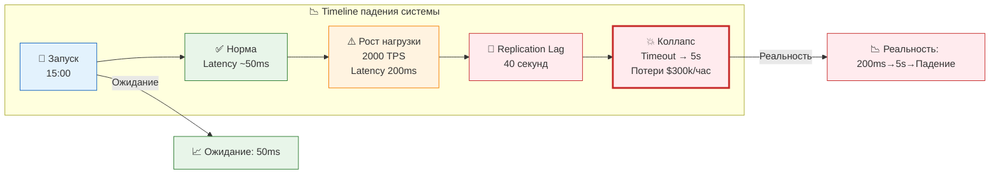

### 1.2. Что такое NFR и почему они критичны

**NFR (Non-Functional Requirements)** описывают **как** система выполняет функции, а не **что** она делает. Это требования к качеству, производительности, безопасности и надёжности.

**Почему NFR ≠ «потом»**:
- NFR, заложенные на старте, определяют выбор архитектуры, БД, протоколов
- Переделка NFR на этапе тестирования = переписывание архитектуры
- NFR без метрик = пустые пожелания, которые невозможно проверить

### 1.3. Что разберём за занятие

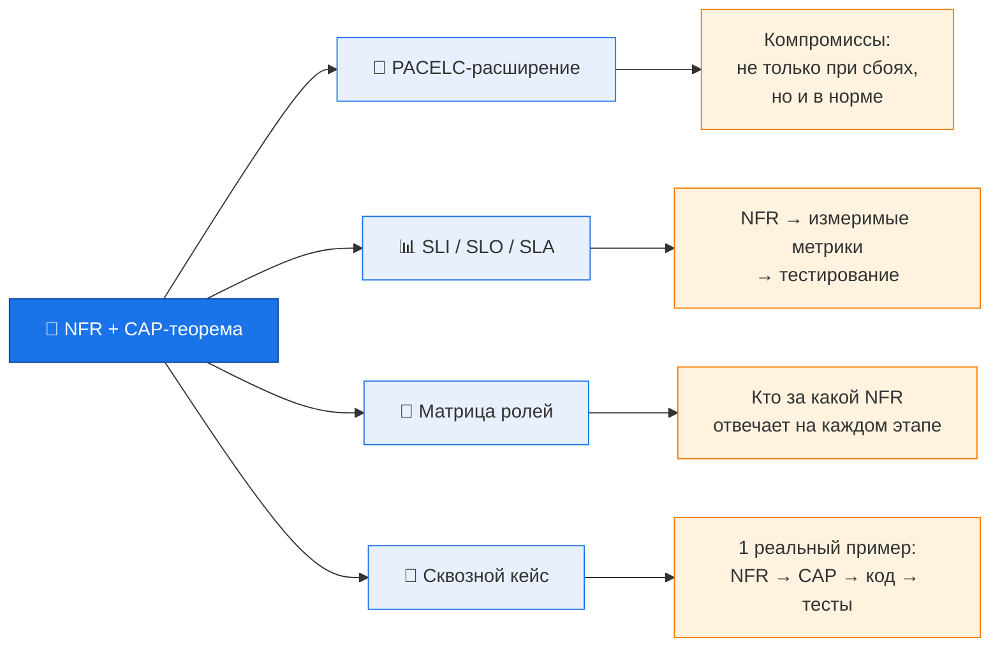

---

## 2. Теоретическая база (12 мин)

### 2.1. NFR — характеристики качества

#### ISO/IEC 25010:2023 — 8 характеристик качества

| Характеристика | Подхарактеристики (ключевые) | Пример метрики | SMART-формулировка |
|---|---|---|---|
| Performance Efficiency | Time behaviour, Resource utilization, Capacity | p99 latency, throughput | «p99 latency GET /api/v1/balance < 150ms при 500 RPS» |
| Reliability | Maturity, Availability, Fault tolerance, Recoverability | Uptime, RTO, RPO | «Availability: 99.95% (допустимый downtime ~4.38 часов/год)» |
| Security | Confidentiality, Integrity, Non-repudiation, Accountability | Время аутентификации | «Время login < 1с при 100 concurrent users» |
| Maintainability | Modularity, Reusability, Analysability, Modifiability | Cyclomatic complexity | «Cyclomatic complexity модуля < 15» |
| Compatibility | Co-existence, Interoperability | Время согласования форматов | «Время интеграции с external API < 100ms» |
| Usability | Appropriateness, Learnability, User error protection | Время выполнения задачи | «Среднее время перевода < 2 мин для нового пользователя» |
| Portability | Adaptability, Installability, Replaceability | Time to deploy | «Time to deploy нового микросервиса < 10 мин» |
| Functional Suitability | Functional completeness, Correctness, Appropriateness | % покрытия тестами | «100% critical path покрыто NFR-тестами» |

#### Критическое правило — NFR по SMART

| Неправильно | Правильно |
|---|---|
| «Система должна быть быстрой» | «p95 latency GET /api/v1/balance < 150ms при 500 RPS» |
| «База должна быть надёжной» | «Availability: 99.95% (допустимый downtime ~ 4.38 часов/год)» |
| «Данные не должны теряться» | «RPO = 60 секунд, RTO = 15 минут при отказе AZ» |
| «Система должна быть безопасной» | «Время аутентификации < 1с, шифрование AES-256 at rest» |

#### SLI / SLO / SLA — связь с NFR

| Термин | Определение | Пример |
|---|---|---|
| **SLI** (Service Level Indicator) | Непосредственно измеряемая метрика | Latency запроса, error rate, uptime, throughput |
| **SLO** (Service Level Objective) | Целевой порог SLI (*внутренний контракт*, обычно строже SLA) | 99.95% запросов с latency < 200ms за 30 дней |
| **SLA** (Service Level Agreement) | Юридическое обязательство перед клиентом (обычно мягче SLO) | 99.9% availability; пеня 5% за каждый час простоя |

> **Механика**: NFR → SLI → SLO → SLA.  
> NFR порождает SLO. SLO тестирует QA и мониторит SRE. SLA — контракт бизнеса.  
> **Важно**: SLO обычно строже SLA (внутренняя цель выше внешнего обязательства), чтобы гарантировать выполнение SLA с запасом.

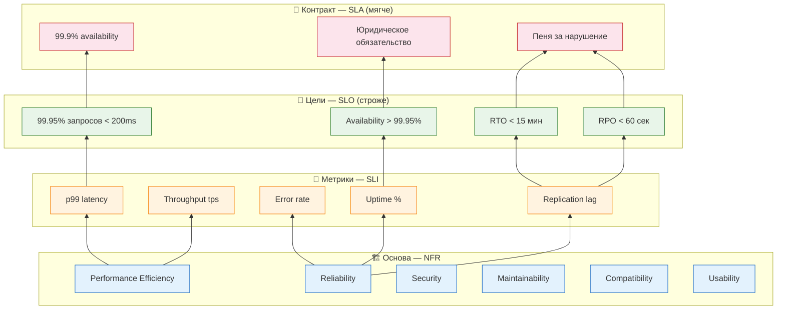

### 2.2. Business Impact Analysis (BIA) для NFR

Любой NFR — это стоимость. Чтобы обосновать SLO перед бизнесом, BA должен уметь оценить **цену простоя**.

**Формула стоимости downtime:**
```
Cost of Downtime = (Revenue per hour × Downtime hours) + 
                   (Penalty per hour × Downtime hours) + 
                   Reputation cost (экспертная оценка)
```

**Пример для fintech-сервиса:**
- Revenue: $10M/год → ~$1,141/час
- SLA-пеня: 5% от месячного revenue за час простоя → ~$41,667/час
- Репутационные потери: экспертная оценка ~$10,000/час
- **Итого: $52,808/час простоя**

**Использование для обоснования SLO:**
- Если downtime стоит $50k/час, инвестиция $100k в отказоустойчивость окупается за 2 часа предотвращённого простоя
- Запрос к бизнесу: «Какой downtime допустим?» → переводится в SLO → настраивается архитектура

### 2.3. Приоритизация NFR (MoSCoW)

Не все NFR одинаково важны. Для приоритизации используем MoSCoW:

| Приоритет | Значение | Пример для fintech |
|---|---|---|
| **M**ust have | Без этого система не работает | Performance (latency < 10s), Security (шифрование) |
| **S**hould have | Важно, но можно отложить на v2 | Usability (время выполнения задачи), Portability |
| **C**ould have | Желательно, но не критично | Multi-region deployment, Support для IE |
| **W**on't have | Сознательно откладывается | Полная перезапись на Rust |

### 2.4. CAP-теорема — фундамент распределённых компромиссов

**Формулировка (Эрик Брюэр, 2000; доказано 2002)**:

> В распределённой системе невозможно гарантировать одновременно **Consistency**, **Availability** и **Partition Tolerance**. Можно выбрать только **2 из 3**.

**Но ключевая деталь**: Partition Tolerance — **не опция**. Распределённая система **обязана** быть P-tolerant (сеть будет отказывать). Реальный выбор — **CP vs AP**.

#### Определения

| Свойство | Определение | Что теряем при приоритете |
|---|---|---|
| **C** (Consistency) | Все ноды видят одни и те же данные. После записи — любой читатель получает актуальное значение | Latency / Availability при разрыве |
| **A** (Availability) | Каждый запрос получает ответ (даже если данные устарели) | Консистентность данных |
| **P** (Partition Tolerance) | Система продолжает работу при разрыве сети между нодами | Не выбирается — обязательна |

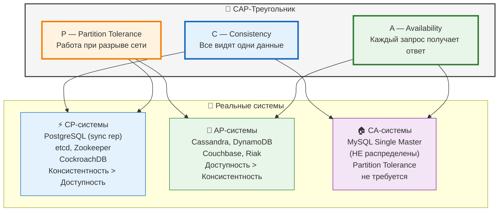

> **Важное уточнение про CA**: MySQL Master-Master — это CA только при отсутствии partition. При разрыве сети оба master продолжат писать, что приведёт к конфликтам. На практике MySQL Single Master — нераспределённая система, Partition Tolerance не требуется.

#### Ключевые паттерны выбора CAP-стратегии

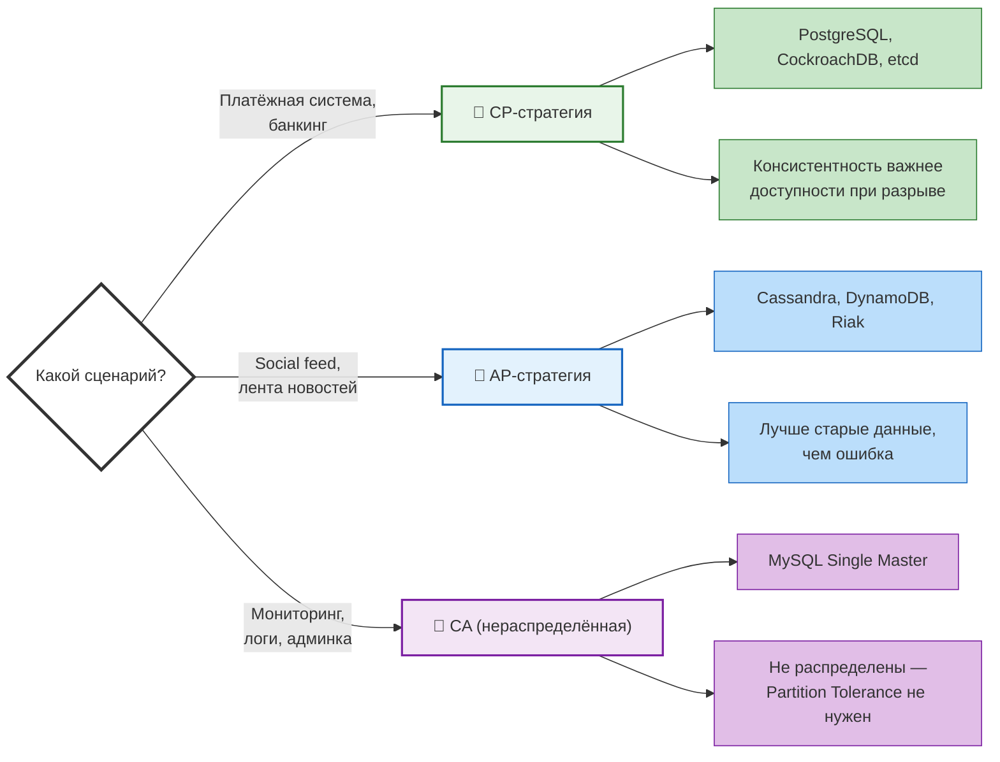

### 2.5. PACELC — расширение CAP для реального мира

**Автор**: Daniel J. Abadi (Yale, 2010)  
**Суть**: CAP описывает поведение **только при Partition** — это < 1% времени жизни системы. PACELC описывает **всё остальное время**.

```
PACELC = Partition, Availability, Consistency, Else, Latency, Consistency

If Partition (P):
    trade-off между A и C
Else (E) — 99% времени:
    trade-off между L (Latency) и C (Consistency)
```

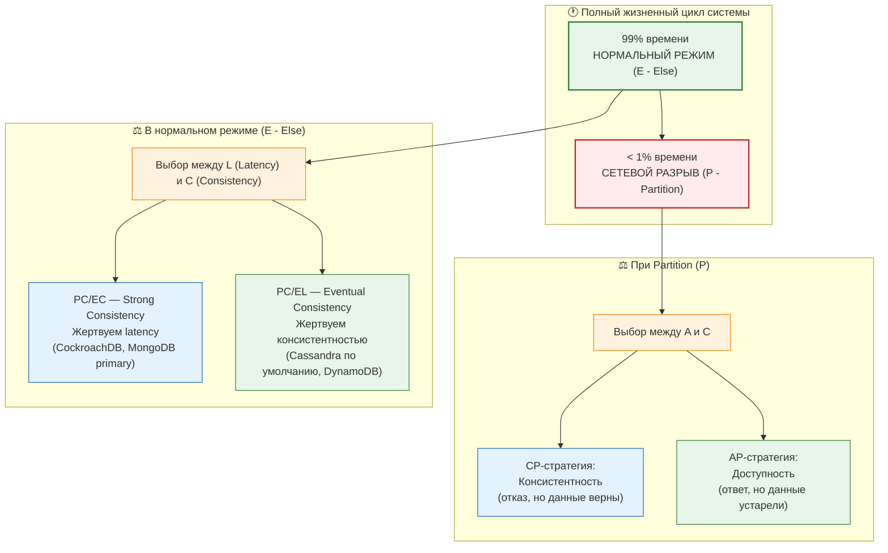

#### Разбор на примерах

| Система | При Partition | В нормальном режиме | Комментарий |
|---|---|---|---|
| **Cassandra** | AP (доступность важнее) | PC/EL — eventual consistency по умолчанию | **Гибрид**: QUORUM для critical ops даёт PC/EC |
| **MongoDB** | CP (primary отключает вторичные ноды) | PC/EC — strong consistency через primary reads | Primary = single point of consistency |
| **DynamoDB** | AP | PC/EL — eventual по умолчанию, strong consistency опционально (x2 latency) | Выбор per-query |
| **CockroachDB** | CP | PC/EC — serializable isolation через Raft | Максимальные гарантии, latency выше |

#### Зачем PACELC инженеру

- **C# Dev**: Выбор isolation level для транзакции = компромисс latency vs consistency
- **DB Engineer**: Выбор replication factor, consistency level, read/write quorum
- **QA**: Тест-дизайн — проверять поведение как при Partition, так и в нормальном режиме
- **SA**: Обосновать выбор БД для архитектурного решения
- **BA**: Перевести бизнес-требование в метрику — «допустима ли задержка в 10ms ради strong consistency?»

### 2.6. Trade-off Analysis: как разрешать конфликты NFR

**Проблема**: Бизнес хочет «максимальную скорость (p99 < 50ms) и максимальную безопасность (шифрование всех данных)». Шифрование добавляет latency. Как найти компромисс?

**Инструмент: Trade-off Matrix**

| Вариант | Скорость (p99) | Безопасность | Стоимость инфраструктуры | Итого |
|---|---|---|---|---|
| Без шифрования | 10/10 — 50ms | 2/10 — данные в plaintext | 1/10 — минимальная | 13/30 |
| Шифрование на уровне БД (TDE) | 6/10 — 120ms | 8/10 — AES-256 | 5/10 — лицензия Oracle TDE | 19/30 |
| Шифрование на уровне приложения | 4/10 — 180ms | 9/10 — end-to-end | 7/10 — доп. CPU/memory | 20/30 |
| Аппаратное шифрование (HSM) | 7/10 — 90ms | 10/10 — gold standard | 9/10 — HSM cluster | 26/30 |

**Методика для BA**:
1. Определить конфликтующие NFR (например, latency vs security)
2. Для каждого варианта оценить по 10-балльной шкале
3. Взвесить приоритеты с бизнесом (что важнее?)
4. Выбрать вариант с максимальным weighted score

---

## 3. Влияние на роли команды (10 мин)

### 3.1. Матрица ответственности (RACI) по NFR и CAP

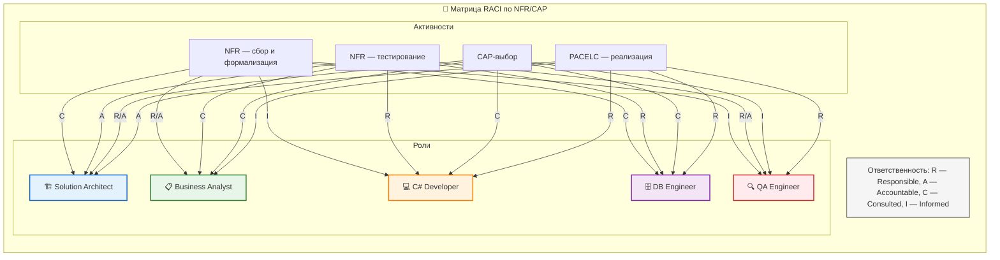

### 3.2. Что делает каждая роль — детально

#### Solution Architect (SA)

**NFR-профиль системы**: Составляет NFR-matrix для каждого бизнес-сценария:
- Метрика → SLO → CAP-класс
- Выбирает паттерн коммуникации микросервисов:
  - **Synchronous (HTTP/gRPC)** → CP (консистентность, но падение latency при сбоях)
  - **Async (Event Bus / Kafka)** → AP (доступность, eventual consistency)
- Определяет Saga-паттерн для распределённых транзакций

**Артефакт**: ADR (Architecture Decision Record) — см. раздел 5.2.

#### Business Analyst (BA)

**Шаблон описания NFR-требования:**
```
[As a] <роль>
[The system should] <NFR-характеристика>
[Measured by] <SLI-метрика>
[Target] <SLO-порог>
[Under condition] <условия нагрузки>
```

**Примеры для разных характеристик:**
- **Performance**: «As a клиент, система должна обрабатывать запрос баланса в течение 150ms при p95 и 500 RPS»
- **Reliability**: «As a операционист, система должна восстанавливаться после отказа AZ за < 15 мин (RTO) с потерей не более 60 сек данных (RPO)»
- **Security**: «As a комплаенс-офицер, система должна шифровать все PII-данные AES-256 с временем расшифровки < 50ms»

**Вопросы бизнесу для CAP-выбора:**
1. *«Что хуже: показать неверный баланс или не показать ничего?»* → AP vs CP
2. *«Сколько секунд мы готовы ждать, чтобы данные были точны во всех регионах?»* → Latency vs Consistency
3. *«Какой процент отказов вы готовы терпеть ради скорости ответа?»* → Availability vs Consistency
4. *«Что важнее: uptime 99.99% или гарантия, что каждая транзакция точна?»* → AP vs CP
5. *«Какую максимальную задержку готовы принять пользователи ради актуальности данных?»* → Latency vs Consistency

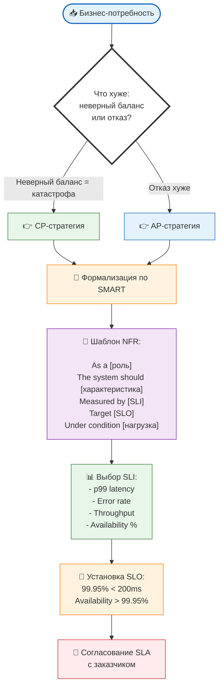

**Requirements Traceability Matrix (RTM) для NFR** — связь NFR → ФТ → Тесты:

| NFR ID | NFR Описание | Functional Req ID | Use Case | Test Case ID | Status |
|---|---|---|---|---|---|
| NFR-01 | Время перевода < 10с (p99) | FR-01 (Перевод) | UC-01 (Успешный перевод) | TC-NFR-01 (Latency) | Pass |
| NFR-02 | Дублей нет | FR-01 (Перевод) | UC-01 (Успешный перевод) | TC-NFR-02 (Idempotency) | Pass |
| NFR-03 | API доступность > 99.95% | FR-02 (Просмотр баланса) | UC-03 (Get Balance) | TC-NFR-03 (Availability) | In Progress |

#### C# Developer (C# Dev)

**Обязанности:**
- Реализует NFR в коде: circuit breaker, retry, caching, async
- Покрывает NFR-юнит-тестами + integration tests для согласованности данных
- Выбирает consistency level в клиенте БД, isolation level транзакций
- Реализует read/write quorum в коде

**Реализация retry + circuit breaker (Polly):**
```csharp
var retryPolicy = Policy
    .Handle<DatabaseTimeoutException>()
    .Or<ReplicaUnavailableException>()
    .WaitAndRetryAsync(3, retryAttempt => 
        TimeSpan.FromMilliseconds(100 * Math.Pow(2, retryAttempt)));

var circuitBreaker = Policy
    .Handle<DatabaseTimeoutException>()
    .CircuitBreakerAsync(5, TimeSpan.FromSeconds(30));
```

**CAP-aware retry strategies:**
- **CP**: retry с idempotency key + circuit breaker (при отказе primary — 503)
- **AP**: retry без idempotency key (если операция идемпотентна), fallback на eventual consistency

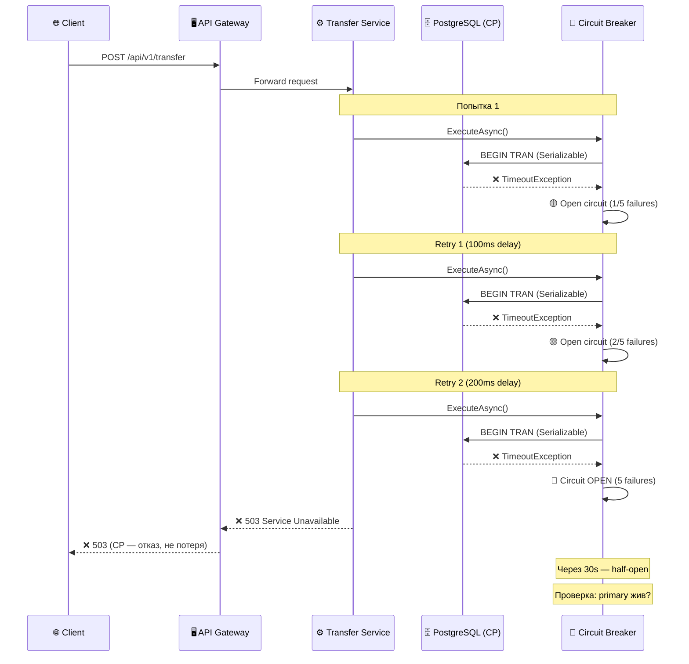

**Выбор consistency level в C# (на примере Cassandra driver):**
```csharp
// AP-стратегия: низкая latency, eventual consistency
var apQuery = new SimpleStatement("SELECT balance FROM accounts WHERE id=?")
    .SetConsistencyLevel(ConsistencyLevel.One);

// CP-стратегия: strong consistency, выше latency
var cpQuery = new SimpleStatement("SELECT balance FROM accounts WHERE id=?")
    .SetConsistencyLevel(ConsistencyLevel.Quorum);
```

> **⚠️ Важно**: QUORUM read гарантирует strong consistency **только при QUORUM write**. Для banking-сценария используйте QUORUM для обеих операций или Lightweight Transactions (CAS).

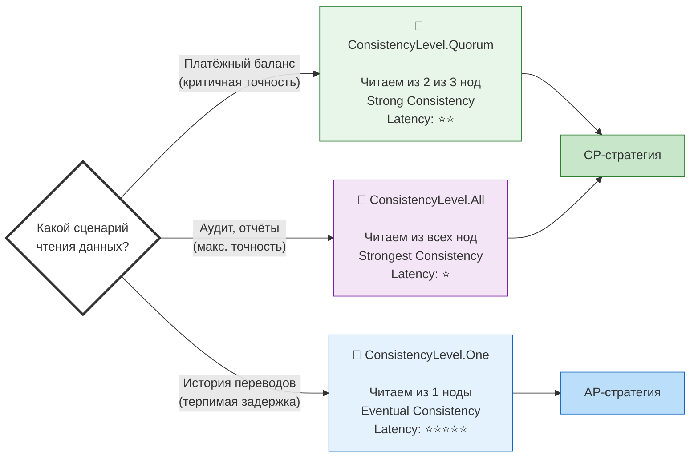

**Реализация idempotency key для платёжных операций (CP-подход):**
```csharp
public async Task<PaymentResult> ProcessPayment(Guid idempotencyKey, decimal amount)
{
    var existing = await db.QueryAsync<Payment>(
        "SELECT * FROM payments WHERE idempotency_key = @key", 
        new { key = idempotencyKey });
    if (existing.Any())
        return existing.First().Result;
    
    using var tx = await db.BeginTransactionAsync(IsolationLevel.Serializable);
    // ... debit, credit, commit
}
```

> **⚠️ Обсуждение IsolationLevel.Serializable**: В PostgreSQL Serializable — это оптимистичная блокировка (SSI). При конкурентных транзакциях на один счёт (high contention) будет много retry (serialization_failure).  
> **Рекомендация**: Для high-contention сценариев используйте RepeatableRead + SELECT FOR UPDATE (пессимистичная блокировка).

**Настройка Connection Pooling (Npgsql):**
```csharp
builder.Services.AddNpgsqlDataSource(connectionString, options =>
{
    options.PoolSize = 100;              // Max connections
    options.ConnectionLifetime = 300;    // Seconds
    options.Timeout = 15;                // Connection timeout (сек)
    options.CommandTimeout = 30;         // Command timeout (сек)
    options.MaxAutoPrepare = 20;         // Prepared statements
});
```

**Outbox Pattern — CP-гарантия для интеграции с Kafka:**
```csharp
// Outbox Pattern — CP-подход для Kafka
public async Task TransferWithOutbox(TransferRequest request)
{
    using var tx = await _db.BeginTransactionAsync(IsolationLevel.ReadCommitted);
    
    // 1. Основная операция
    await _db.ExecuteAsync("UPDATE accounts SET balance = balance - @Amount ...", tx);
    
    // 2. Пишем в outbox (таблица в той же БД)
    await _db.ExecuteAsync(
        @"INSERT INTO outbox (id, aggregate_type, aggregate_id, event_type, payload, created_at)
          VALUES (@Id, 'transfer', @TransferId, 'TransferCompleted', @Payload, @Now)",
        new { Id = Guid.NewGuid(), TransferId, Payload = JsonSerializer.Serialize(eventData), 
              Now = DateTime.UtcNow },
        tx);
    
    await tx.CommitAsync(); // Гарантия: либо всё, либо ничего
    
    // 3. Отдельный background worker читает outbox и публикует в Kafka
    // (Transactional outbox + Kafka producer)
}
```

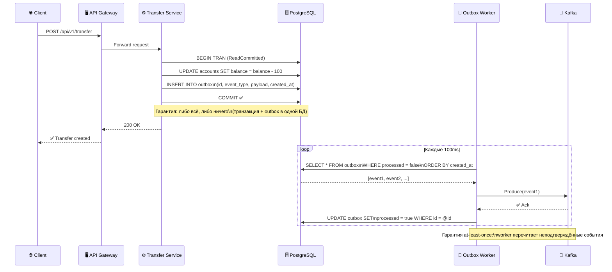

**Saga-паттерн для распределённых транзакций:**
```csharp
// Choreography Saga: каждый сервис публикует событие
await _kafka.ProduceAsync("account-debited", new { TransferId, Amount });

// Компенсирующая транзакция (если credit упал)
await _kafka.ProduceAsync("transfer-compensate", new { TransferId, Reason = "CreditFailed" });
```

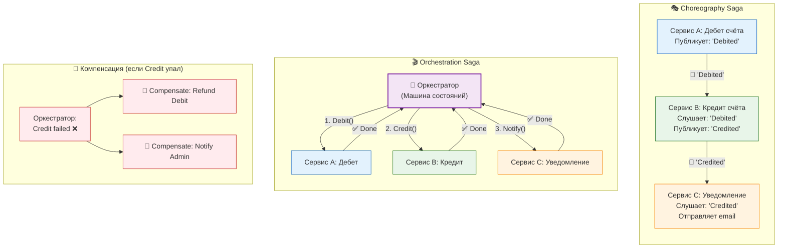

#### DB Engineer (Oracle/PostgreSQL)

**PostgreSQL — настройка CP-режима (синхронная репликация):**
```sql
-- CP-режим: транзакция подтверждается только после fsync на master + 1 standby
ALTER SYSTEM SET synchronous_standby_names = 'FIRST 1 (standby1, standby2)';
ALTER SYSTEM SET synchronous_commit = 'on';  -- 'on' — ждёт fsync на standby
```

> **Критическое различие**: 
> - `synchronous_commit = 'on'` — ждёт fsync на standby (**CP, строгая гарантия**)
> - `synchronous_commit = 'remote_write'` — ждёт только OS buffer на standby (данные могут быть потеряны при сбое standby)
> - `synchronous_commit = 'remote_apply'` — ждёт применения данных на standby (максимальная гарантия, но latency выше)

**Oracle Data Guard — синхронный режим (CP):**
```sql
ALTER SYSTEM SET log_archive_dest_2='SERVICE=standby SYNC AFFIRM';
```

**Cassandra — настройка для CP-сценария:**
```sql
-- Для banking: QUORUM для write и read
CONSISTENCY QUORUM;

-- Для AP-сценария: ONE
CONSISTENCY ONE;
```

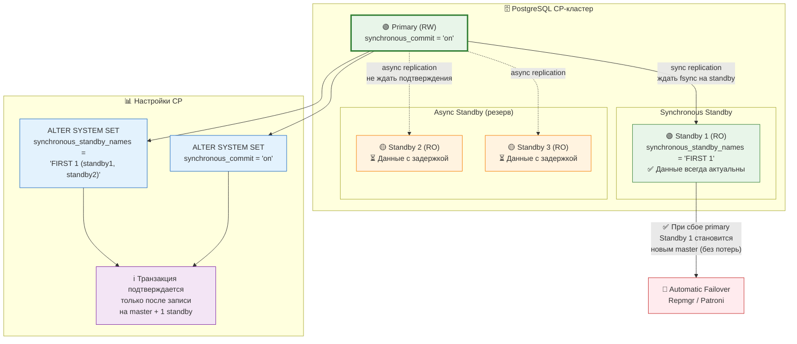

#### QA Engineer (QA)

**Обязанности:**
- Анализирует NFR на тестируемость
- Разрабатывает тесты: нагрузочные (k6, JMeter), хаос-тесты, надёжность
- Проверяет поведение при network partition (kill ноды, blip сети)
- Тестирует eventual consistency (read-your-writes, monotonic reads)

**Нагрузочное тестирование (k6):**
```yaml
thresholds:
  http_req_duration["p(95)"]: ["p(95)<200"]
  http_req_failed: ["rate<0.01"]
```

**Chaos Engineering — разрыв сети:**
```bash
iptables -A INPUT -s <replica_ip> -j DROP
# Проверяем: сервис отвечает? latency? ошибки?
# Для CP: ожидаем 503 при попытке записи
# Для AP: ожидаем 200 со stale data
```

**Тест на eventual consistency:**
```csharp
[Test]
public async Task WritePrimary_ReadReplica_EventuallyConsistent()
{
    var id = Guid.NewGuid();
    await primaryDb.ExecuteAsync("UPDATE accounts SET balance=100 WHERE id=@id", id);
    
    // Для синхронной репликации: задержка не требуется
    // Для асинхронной: polling до 5 секунд
    await Assert.That(async () =>
    {
        var balance = await replicaDb.QuerySingleAsync<int>(
            "SELECT balance FROM accounts WHERE id=@id", id);
        return balance;
    }, Is.EqualTo(100).After(5000, 100)); // After(timeout, interval)
}
```

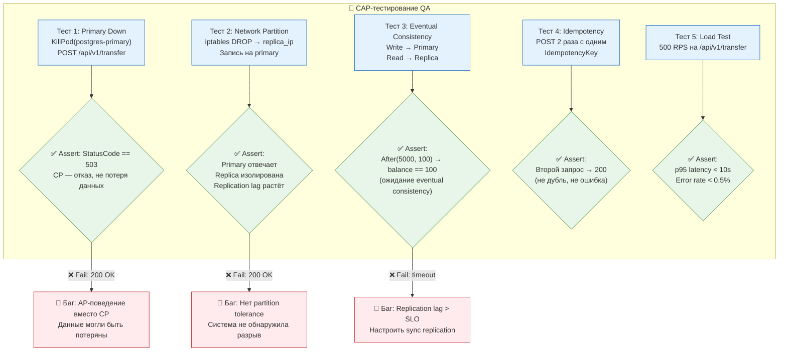

---

## 4. Практический кейс (12 мин)

### 4.1. Контекст: Fintech-сервис «Мгновенные переводы»

**Бизнес-требование**: перевод с карты Visa на Mastercard другого банка за < 10 секунд, 2000 tps peak.

**Команда**: 1 SA, 1 BA, 2 C# Dev, 1 DB Engineer (PostgreSQL), 1 QA  
**Стеки**: .NET 8, PostgreSQL 16, Kafka, Redis, Kubernetes

### 4.2. Шаг 1 — BA: Формализация NFR + RTM

**NFR-профиль:**

| ID | NFR | SLI | SLO | CAP | Приоритет (MoSCoW) | Риск | Mitigation |
|---|---|---|---|---|---|---|---|
| NFR-01 | Время перевода < 10 с | p99 latency end-to-end | 99.5% < 10 сек | **CP** | Must have | Нарушение SLO из-за blocking ops | Async processing, caching |
| NFR-02 | Дублей нет | Duplicate rate | = 0 | **CP** | Must have | Повторная отправка | Idempotency key на уровне API |
| NFR-03 | API доступность > 99.95% | Uptime SLI | 99.95% | **AP** (read) / **CP** (write) | Should have | Write-path недоступен при сбое | Разделение read/write путей |
| NFR-04 | RPO < 60 сек | Макс. потеря данных | < 60 сек | **CP** | Must have | Потеря данных при сбое | Sync replication |
| NFR-05 | RTO < 15 мин | Время восстановления | < 15 мин | Инфраструктура | Must have | Долгий failover | Patroni + K8s liveness |

**Cost of Failure для обоснования SLO:**
- Revenue: $10M/год → ~$1,141/час
- SLA-пеня: 5%/час → ~$41,667/час
- Репутационные потери: ~$10,000/час
- **Итого ~$52,808/час простоя**

### 4.3. Шаг 2 — SA: Архитектурный CAP-выбор

```
Сценарий "Перевод денег":
  - Выбор: CP — консистентность баланса критична
  - При Partition: возвращаем 503, не теряем данные

Сценарий "Просмотр истории":
  - AP (eventual consistency) — пользователь видит задержку 1-2 сек
```

**Выбор БД:**
- PostgreSQL (CP) — синхронная репликация для write-операций
- Redis (AP/CA) — кэш баланса для read-пути
- Kafka (AP) — брокер событий (at-least-once)

### 4.4. Шаг 3 — C# Dev: Реализация CP-транзакции

```csharp
[HttpPost("api/v1/transfer")]
public async Task<IActionResult> Transfer([FromBody] TransferRequest request)
{
    // 1. Idempotency check
    var existing = await _db.QueryAsync<Transfer>(
        "SELECT * FROM transfers WHERE idempotency_key = @Key",
        new { Key = request.IdempotencyKey });
    if (existing.Any())
        return Ok(existing.First());
    
    // 2. CP-транзакция: Serializable isolation
    using var tx = await _db.BeginTransactionAsync(IsolationLevel.Serializable);
    try
    {
        var senderBalance = await _db.QuerySingleAsync<decimal>(
            "SELECT balance FROM accounts WHERE id = @Id FOR UPDATE",
            new { Id = request.FromAccount }, tx);
        if (senderBalance < request.Amount)
            return BadRequest("Insufficient funds");
        
        await _db.ExecuteAsync(
            "UPDATE accounts SET balance = balance - @Amount WHERE id = @From", 
            new { Amount = request.Amount, From = request.FromAccount }, tx);
        await _db.ExecuteAsync(
            "UPDATE accounts SET balance = balance + @Amount WHERE id = @To", 
            new { Amount = request.Amount, To = request.ToAccount }, tx);
        
        var transferId = await _db.QuerySingleAsync<Guid>(
            @"INSERT INTO transfers (...) VALUES (...) RETURNING id", ...);
        await tx.CommitAsync();
        
        // 3. Kafka event (AP) после CP-транзакции
        await _kafka.ProduceAsync("transfer-completed", new TransferEvent { ... });
        return Ok(new { TransferId = transferId });
    }
    catch { await tx.RollbackAsync(); throw; }
}
```

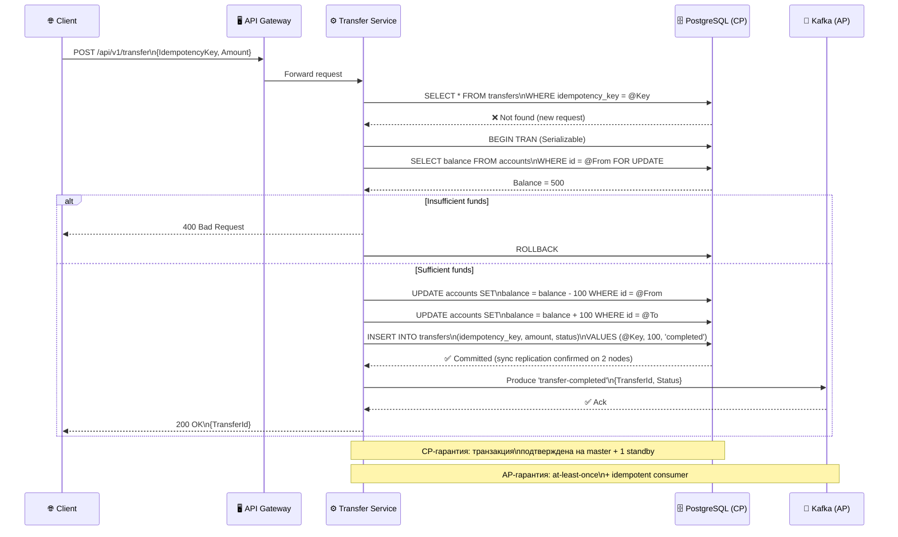

### 4.5. Шаг 4 — DB Engineer: Настройка replication

```sql
-- CP-режим: транзакция подтверждается после fsync на master + 1 standby
ALTER SYSTEM SET synchronous_standby_names = 'FIRST 1 (standby1, standby2)';
ALTER SYSTEM SET synchronous_commit = 'on';
```

### 4.6. Шаг 5 — QA: Тестирование CAP-поведения

```csharp
[Test]
public async Task WhenPrimaryDown_SystemBehavesAsCP_Returns503()
{
    await Chaos.KillPodAsync("postgres-primary");
    var response = await _client.PostAsJsonAsync("/api/v1/transfer", ...);
    // CP: при отказе primary — 503 Service Unavailable (не 500)
    Assert.That(response.StatusCode, Is.EqualTo(503));
}

[Test]
public async Task ReadYourWrites_EventuallyConsistent()
{
    var writeResponse = await _client.PostAsync("/api/v1/transfer", ...);
    var transferId = await writeResponse.Content.ReadFromJsonAsync<Guid>();
    
    // Для sync replication — 0ms; для async — до 5s
    await Assert.That(async () =>
    {
        var transfer = await _client.GetFromJsonAsync<Transfer>(
            $"/api/v1/transfers/{transferId}");
        return transfer?.Status;
    }, Is.EqualTo("completed").After(2000, 200));
}
```

### 4.7. Шаг 6 — SA: Мониторинг и Health Checks

**Health Checks для CAP-стратегии:**
```csharp
// Health check для CP-системы: проверяем, что primary доступен
app.MapHealthChecks("/health/cp", new HealthCheckOptions
{
    Predicate = check => check.Tags.Contains("cp"),
    ResponseWriter = async (context, report) =>
    {
        // CP: если primary недоступен — 503
        if (report.Status == HealthStatus.Unhealthy)
        {
            context.Response.StatusCode = 503;
            await context.Response.WriteAsync("CP-path unavailable");
        }
    }
});

// Health check для AP-системы: проверяем, что хотя бы одна реплика жива
app.MapHealthChecks("/health/ap", new HealthCheckOptions
{
    Predicate = check => check.Tags.Contains("ap"),
    // AP: если хотя бы одна нода жива — 200
});
```

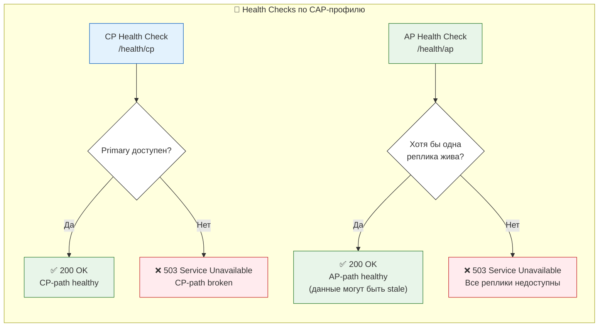

### 4.8. Итоговая архитектура кейса (C4 Model — Container Level)

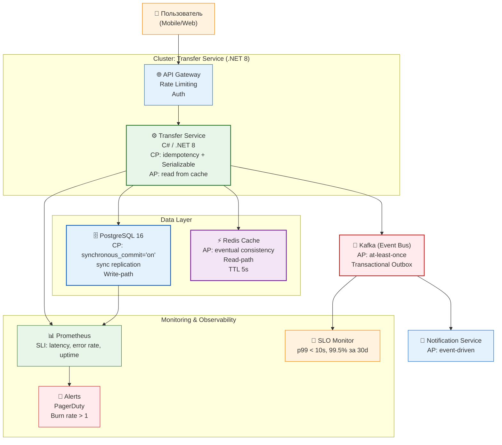

---

## 5. Интеграция в процессы (6 мин)

### 5.1. Где NFR и CAP живут в SDLC

| Этап | Действие | Артефакт | Ответственный | Вход/Выход |
|---|---|---|---|---|
| **Discovery** | BA собирает NFR от бизнеса, проводит BIA | NFR Checklist, BIA, SLI/SLO draft | BA | Бизнес-потребности → NFR-список |
| **Architecture Decision** | SA выбирает CAP-профиль, Trade-off анализ | ADR, Trade-off Matrix | SA | NFR-список → ADR |
| **Requirements Review** | BA + SA + QA верифицируют NFR | RTM (Requirements Traceability Matrix) | BA, SA, QA | ADR → RTM |
| **Design / Dev** | C# Dev реализует паттерны, DB Eng настраивает БД | Code, DB Config Doc | C# Dev, DB Engineer | ADR → Code |
| **Code Review** | Проверка NFR-секции | CR Checklist с NFR-пунктами | Dev + SA | Code → Approved Code |
| **Testing** | QA пишет нагрузочные/chaos-тесты | Test Plan with NFR, Chaos Scenarios | QA | RTM → Test Results |
| **Release** | SA проверяет SLO-мониторинг, Health Checks | Dashboard, Alerts, SLO Monitor | SA + DevOps | Test Results → Release |
| **Operation** | Мониторинг SLI/SLO, burn rate | Runbook с CAP-сценариями | Dev + SRE | Release → Incidents → Lessons |

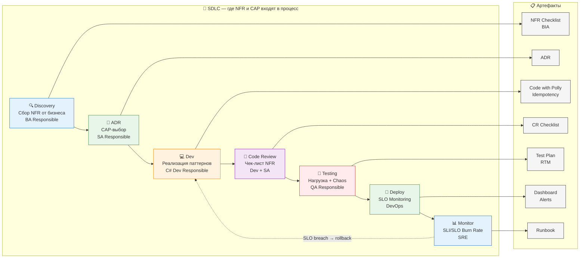

### 5.2. Шаблон ADR для CAP-решения

```markdown
# ADR-001: Выбор CP-стратегии для платежного шлюза

**Статус**: Approved  
**Дата**: 2024-01-15  
**Дата следующего ревью**: 2024-07-15  
**Автор**: Ivan Ivanov (SA)  
**Утверждено**: Petrov (Architecture Board)

**Контекст**: 
Транзакции перевода требуют строгой консистентности.
При network partition — отказ (503), но не потеря данных.
BIA: стоимость простоя ~$52,808/час.

**Решение**:
- Write-path: CP (synchronous_commit = 'on', quorum reads)
- Read-path: eventual consistency через Redis (TTL 5s)

**Последствия**:
+ Сильная гарантия консистентности
+ Idempotency key защищает от дублей
− Latency write-path на 10-30% выше
− При отказе primary — write недоступен
− Serializable isolation может давать retry при high contention

**Альтернативы**:
- AP (Cassandra): not acceptable — нет строгой консистентности
- CA (Single MySQL): not acceptable — partition tolerance в k8s неизбежен

**Assumptions**:
- Network partition — редкое событие (< 1% времени)
- Пользователи готовы принять 503 при сбое, но не потерю данных
```

### 5.3. Чек-лист для Code Review (NFR-секция)

- [ ] Все внешние вызовы обёрнуты в retry + circuit breaker
- [ ] Idempotency key проверяется на уровне API
- [ ] Isolation level соответствует CAP-профилю (CP → Serializable/RepeatableRead)
- [ ] Read-запросы к репликам не требуют строгой консистентности
- [ ] Timeout настроен (не блокируем поток бесконечно)
- [ ] Kafka/Event Bus — at-least-once + enable.idempotence=true + acks=all
- [ ] Нет distributed transactions через 2PC (используем Saga/Outbox)
- [ ] Connection Pooling настроен (pool size, lifetime, timeout)

### 5.4. Шаблон NFR Specification Document

```markdown
# NFR Specification: Мгновенные переводы
## 1. Методанные
- ID: NFR-SPEC-001
- Версия: 1.0
- Автор: [BA Name]
- Утверждено: [SA Name], [PO Name]

## 2. Бизнес-контекст
- Цель: перевод с карты Visa на Mastercard за < 10 сек
- Stakeholders: Product Owner, Compliance, Operations
- BIA: стоимость простоя ~$52,808/час

## 3. NFR List
| ID | Характеристика | SLI | SLO | SLA | Приоритет | CAP | Риск | Mitigation |
|---|---|---|---|---|---|---|---|---|
| NFR-01 | Performance | p99 latency end-to-end | 99.5% < 10 сек | 99.0% < 15 сек | M | CP | Нарушение SLO | Auto-scaling, caching |
| NFR-02 | Reliability | Duplicate rate | = 0 | < 0.001% | M | CP | Дубли | Idempotency key |
| NFR-03 | Availability | Uptime | 99.95% | 99.9% | S | AP/CP | Write-path блокировка | Разделение путей |

## 4. Trade-off Matrix
[См. раздел 2.6]

## 5. RTM (Requirements Traceability)
| NFR ID | Functional Req | Test Case | Status |
|---|---|---|---|
| NFR-01 | FR-01 | TC-NFR-01 | Pass |
```

---

## 6. Заключение и ключевые выводы (3 мин)

### 6.1. 5 выводов

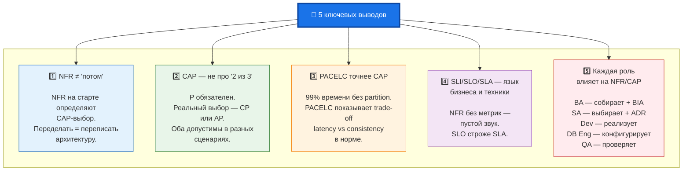

### 6.2. Вопросы для самопроверки

**Для BA:**
1. Какие 5 вопросов зададите бизнесу для определения CAP-профиля?
2. Как вы документируете NFR? Есть ли шаблон NFR Specification?
3. Как рассчитать стоимость downtime для обоснования SLO?
4. Как приоритизировать NFR с помощью MoSCoW?
5. Как вести Requirements Traceability Matrix для NFR?

**Для SA:**
1. Какой ADR для сценария «каталог товаров e-commerce» (высокая нагрузка, терпимая консистентность)?
2. Как выбрать между Choreography и Orchestration Saga?
3. Как настроить Health Checks для CP и AP путей?

**Для C# Dev:**
1. Как реализовать idempotency key в вашем текущем проекте?
2. Какой isolation level выбрать для banking-сценария при high contention?
3. Как настроить Connection Pooling для Npgsql?

**Для DB Engineer:**
1. Какой consistency level для Cassandra в banking-сценарии?
2. В чём разница между synchronous_commit = 'on', 'remote_write' и 'remote_apply'?
3. Как настроить синхронную репликацию в PostgreSQL?

**Для QA:**
1. Как написать тест на eventual consistency для read-replica?
2. Как провести chaos-тест network partition?
3. Как отличить CP-поведение (503) от AP-поведения (200 со stale data)?

### 6.3. Recommended reading

- *Brewer E. "CAP Twelve Years Later: How the Rules Have Changed"* (IEEE Computer, 2012)
- *Abadi D. "PACELC: Consistency Tradeoffs in Modern Distributed Systems"* (2010)
- *Kleppmann M. "Designing Data-Intensive Applications"* (O'Reilly, 2017) — Главы 5, 7, 9
- ISO/IEC 25010:2023 — Systems and software Quality Requirements and Evaluation (SQuaRE)
- *Google SRE Book* — Chapter 4: Service Level Objectives
- BABOK v3 — Глава 10.15: Non-Functional Requirements
- *Nygard M. "Documenting Architecture Decisions"* — ADR-шаблон

---

## 7. Приложения

### A. Сводная таблица всех терминов

| Термин | Расшифровка | Раздел |
|---|---|---|
| NFR | Non-Functional Requirements | 2.1 |
| SLI | Service Level Indicator | 2.1 |
| SLO | Service Level Objective (обычно строже SLA) | 2.1 |
| SLA | Service Level Agreement (юридический, обычно мягче SLO) | 2.1 |
| CAP | Consistency, Availability, Partition Tolerance | 2.4 |
| PACELC | Partition, Availability, Consistency, Else, Latency, Consistency | 2.5 |
| RTO | Recovery Time Objective | 2.1 |
| RPO | Recovery Point Objective | 2.1 |
| BIA | Business Impact Analysis | 2.2 |
| RTM | Requirements Traceability Matrix | 3.2 |
| ADR | Architecture Decision Record | 5.2 |
| SSI | Serializable Snapshot Isolation (PostgreSQL) | 4.4 |

### B. Цветовая кодировка диаграмм

- 🔵 **CP-стратегия**: Синий — консистентность, строгость
- 🟢 **AP-стратегия**: Зелёный — доступность, гибкость
- 🟠 **Компромисс/Trade-off**: Оранжевый — внимание, выбор
- 🟣 **Артефакты/Документы**: Фиолетовый
- 🔴 **Ошибки/Риски**: Красный — опасность
- ⚪ **Нейтральные**: Серый/Белый — фон

---

*Это учебное занятие составлено в рамках курса по архитектуре распределённых систем. Все примеры кода являются иллюстративными и требуют адаптации под конкретный проект. Для BA рекомендуется фокус на разделы 2.1–2.3, 3.2 (BA), 5.2, 5.4. Для Dev — разделы 3.2 (C# Dev, DB Eng), 4.4–4.6, 5.3.*
