# DDD, CQS/CQRS, TDD/BDD, API First: Как применять каждый принцип и когда?

> **Учебный курс для команды:** System Architect, Business Analyst, C# Developer, Data Engineer (Oracle/Postgres), QA Engineer  
> **Уровень:** Middle+  
> **Формат:** Теория + RACI + Сквозной кейс + Чеклист + Шаблоны  
> **Версия:** 2.0 (финальная, после рецензий аналитика и разработчика)

---

## Оглавление

1. [Введение: 4 боли команды](#1-введение-4-боли-команды)
2. [Теоретическая база: 4 принципа](#2-теоретическая-база-4-принципа)
   - 2.1. DDD — Domain-Driven Design
   - 2.2. CQS / CQRS — Command-Query Separation / Responsibility Segregation
   - 2.3. TDD / BDD — Test-Driven Development / Behavior-Driven Development
   - 2.4. API First
   - 2.5. Сводная таблица 4 принципов
3. [Матрица ответственности RACI](#3-матрица-ответственности-raci)
   - 3.1. RACI-матрица по артефактам
   - 3.2. Что каждая роль должна знать и уметь
4. [Практический кейс: Интернет-магазин](#4-практический-кейс-интернет-магазин)
   - 4.1. AS IS — как есть (монолит, 450 мс)
   - 4.2. TO BE — как стало (3 Bounded Context, CQRS, 12 мс)
   - 4.3. Пошаговое применение 4 принципов
5. [Интеграция в процессы и компромиссы](#5-интеграция-в-процессы-и-компромиссы)
   - 5.1. Чеклист старта нового модуля (5 шагов)
   - 5.2. Таблица компромиссов (Trade-offs)
   - 5.3. CI/CD Pipeline с проверкой принципов
   - 5.4. Roadmap внедрения на 2 месяца
   - 5.5. Безопасность при внедрении
6. [Заключение и выводы](#6-заключение-и-выводы)
   - 6.1. 4 правила для команды
   - 6.2. Метрики «хорошо» для каждой роли
   - 6.3. Ресурсы и шаблоны

---

## 1. Введение: 4 боли команды

> **Проблема:** Команда растёт, а код — нет. BA пишет ТЗ в Word, Dev маппит магические строки, Data Eng оптимизирует то, что не надо оптимизировать, QA 2 дня гоняет регрессию вручную. Знакомо?

### Пирамида 4 принципов

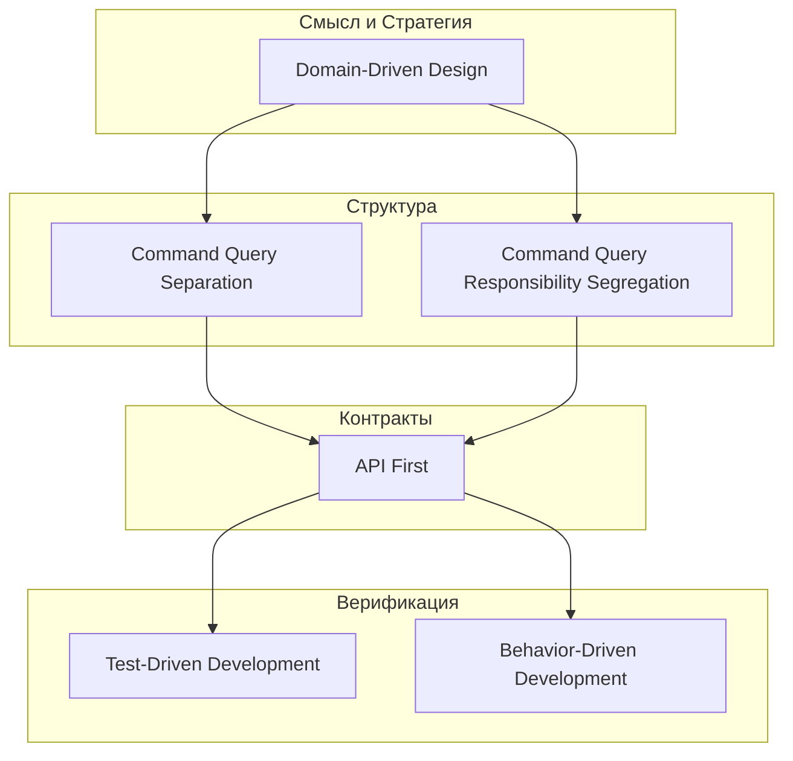

### 4 боли с привязкой к ролям

| # | Боль | Кого бьёт | Симптомы | Какой принцип лечит |
|---|---|---|---|---|
| 1 | **CRUD-монолит: модель = таблица** | Data Eng (Oracle/Postgres) | Одна БД на весь домен, 25 полей в таблице, 3 JOIN для одного экрана, хранимые процедуры с бизнес-логикой | **DDD**: Bounded Context → своя БД на контекст, Aggregate, Value Object |
| 2 | **«Магические строки» — нарушение CQS** | C# Dev | Метод `GetOrder()` сохраняет лог, шлёт email и возвращает `Order`. Query с сайд-эффектами. | **CQS**: Query — только возвращает, Command — только меняет. **CQRS**: если R/W ratio > 100:1 |
| 3 | **Спецификация не равна реализации** | SA, BA | OpenAPI spec — в Confluence, код — в гите, тесты — в Jira. Интеграция валится из-за несовпадения полей. | **API First**: spec → contract → implementation. OpenAPI — единственный источник правды. |
| 4 | **Тесты не защищают бизнес** | QA, BA | 30 ручных тестов, регрессия 2 дня, после каждого бага — дыра в требованиях. | **TDD/BDD**: Red-Green-Refactor + Given-When-Then на бизнес-языке. |

### Когда читать дальше?

- Если вы **хотя бы раз** видели одну из этих болей в своей команде — этот курс для вас.
- Если все 4 — тем более.

---

## 2. Теоретическая база: 4 принципа

---

### 2.1. DDD — Domain-Driven Design

**Автор:** Eric Evans (2003), «Domain-Driven Design: Tackling Complexity in the Heart of Software»

#### Суть за 30 секунд

DDD — это не про технологию, а про **язык**. Если BA говорит «Клиент», Dev — «Customer», БД — «CUSTOMER_TBL», а Support — «Пользователь» — у вас нет единого языка. DDD заставляет команду договориться о терминах и отразить их в коде.

#### 3 ключевых понятия

| Понятие | Определение | Пример |
|---|---|---|
| **Ubiquitous Language** | Единый язык команды (BA, Dev, QA, заказчик) | Везде: «Заказ», не «Order» или «CUSTOMER_ORDER» |
| **Bounded Context** | Граница, внутри которой термин имеет одно значение | В контексте Pricing «Цена» = стоимость товара. В контексте Delivery «Цена» = стоимость доставки |
| **Aggregate** | Кластер сущностей и Value Object-ов, которые обрабатываются как единое целое | Order + OrderItems + ShippingAddress — сохраняются одной транзакцией |
| **Entity** | Объект с идентификатором (Id) | Order, Customer |
| **Value Object** | Объект без идентификатора, определяется значениями полей | Money(Amount, Currency), Address |

#### Метрика входа (когда внедрять DDD)

- BA тратит **>30% времени** на согласование терминов → пора вводить Bounded Contexts
- **>5 бизнес-правил** на одну сущность → модель не CRUD, а DDD
- **3+ разработчика** не могут ответить на вопрос «что такое статус заказа?» → нужен Ubiquitous Language

#### Пример: CRUD vs DDD

**CRUD-подход (больно):**
```csharp
// CRUD: модель = таблица
public class Order
{
    public int Id { get; set; }
    public string Status { get; set; }         // магические строки: "New", "Paid", "Shipped"
    public decimal TotalAmount { get; set; }    // кто считает? магия?
    public string CustomerId { get; set; }      // что за Customer? ссылка? имя?
}
```

**DDD-подход (правильно):**
```csharp
// DDD: модель = бизнес-правила
public class Order : AggregateRoot
{
    private readonly List<OrderItem> _items = new();
    public OrderId Id { get; private set; }
    public OrderStatus Status { get; private set; }
    public Money TotalAmount { get; private set; }
    public CustomerId CustomerId { get; private set; }

    public void AddItem(ProductId productId, Money price, int quantity)
    {
        if (Status != OrderStatus.Draft)
            throw new DomainException("Cannot modify non-draft order");
        
        var item = new OrderItem(productId, price, quantity);
        _items.Add(item);
        RecalculateTotal();
    }

    public void Confirm()
    {
        if (_items.Count == 0)
            throw new DomainException("Cannot confirm empty order");
        Status = OrderStatus.Confirmed;
    }

    private void RecalculateTotal()
    {
        TotalAmount = _items.Aggregate(Money.Zero, (sum, item) => sum + item.Price * item.Quantity);
    }
}

// Value Object
public record Money(decimal Amount, string Currency);
```

> **Для BA (ознакомительно):** В DDD-модели нет публичных сеттеров. Данные меняются через бизнес-методы (`AddItem`, `Confirm`). Это гарантирует, что бизнес-правила не нарушены. Код становится **читаемым для аналитика**: `order.Confirm()` — понятно без комментариев.

#### Контекстная карта (Context Map) для интернет-магазина

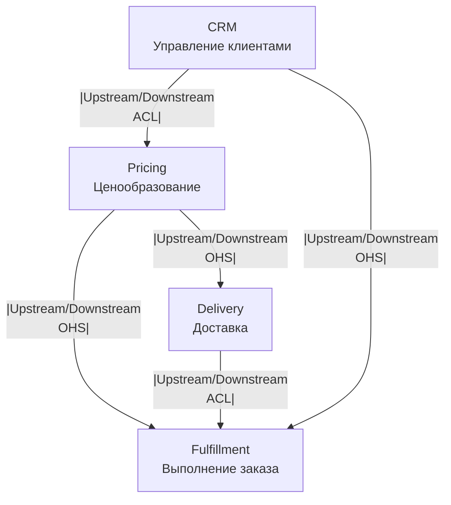

#### Диаграмма состояний заказа (Order State Machine)

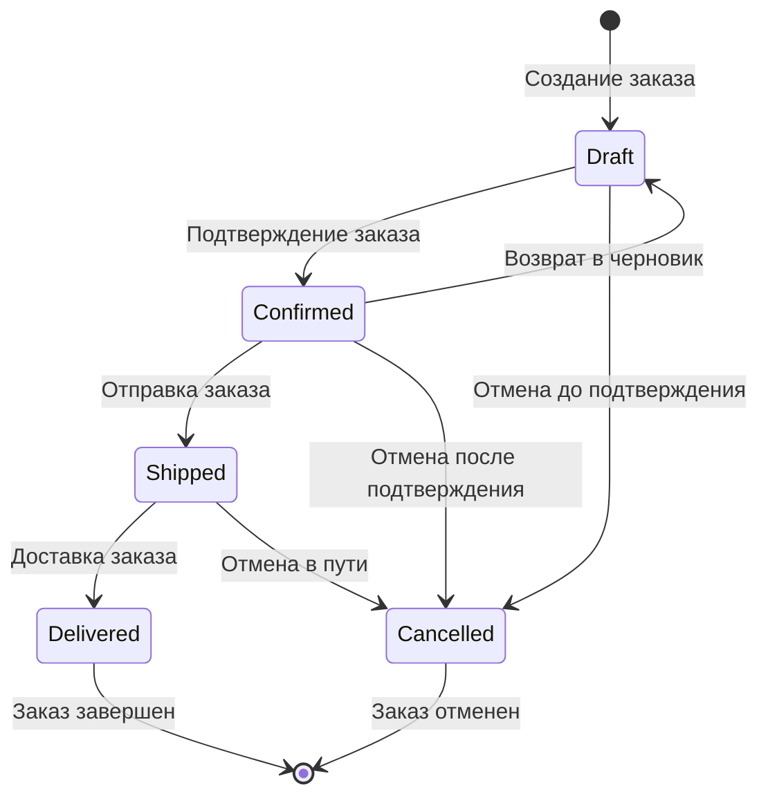

#### Цена отказа от DDD

- Код не отражает домен: каждое изменение требует переписывания половины сервиса
- BA и Dev говорят на разных языках: баги из-за неверной интерпретации требований
- **Data Engineer:** схема БД меняется каждый спринт, потому что «мы не знали, что Status бывает ещё и Returned»

#### Антипаттерн: Anemic Domain Model

```csharp
// ❌ Anemic Domain Model (антипаттерн по Martin Fowler)
public class Order
{
    public int Id { get; set; }
    public string Status { get; set; }    // публичный сеттер — нарушение DDD
    public List<OrderItem> Items { get; set; } // кто угодно может изменить
}

public class OrderService
{
    public void ConfirmOrder(int orderId)
    {
        var order = _repo.GetById(orderId);
        if (order.Items.Count == 0) throw ...;
        order.Status = "Confirmed"; // ❌ логика в сервисе, а не в модели
    }
}
```

**Как избежать:** вся бизнес-логика — внутри сущности/агрегата. Сервисы — только для координации (репозиторий, отправка email и т.д.).

---

### 2.2. CQS / CQRS — Command-Query Separation / Responsibility Segregation

#### Суть за 30 секунд

**CQS (методный уровень):** Каждый метод либо меняет состояние (Command), либо возвращает данные (Query), но не одновременно.

**CQRS (архитектурный уровень):** Разделение моделей на read (Query) и write (Command). Разные БД, разные схемы, разная производительность.

> CQS — **всегда** (это дисциплина кода).
> CQRS — **по метрике** (это архитектурное решение, его надо обосновать).

#### CQS: три правила для C# Dev

1. **Query** — возвращает данные, не меняет состояние
2. **Command** — меняет состояние, возвращает void (или Id созданного объекта)
3. Нарушение CQS — **запах кода**, но есть легитимные исключения

**Пример CQS:**
```csharp
// ✅ Query — только чтение
public async Task<OrderDto> GetOrderByIdAsync(OrderId id, CancellationToken ct)
{
    return await _dbContext.Orders
        .Where(o => o.Id == id)
        .Select(o => new OrderDto(o.Id, o.TotalAmount, o.Status))
        .FirstOrDefaultAsync(ct);
}

// ✅ Command — только запись
public async Task<OrderId> CreateOrderAsync(CreateOrderCommand command, CancellationToken ct)
{
    var order = Order.Create(command.CustomerId, command.Items);
    _dbContext.Orders.Add(order);
    await _dbContext.SaveChangesAsync(ct);
    return order.Id;
}
```

**Легитимные исключения из CQS в C#:**
```csharp
// Try-pattern — идиоматичный .NET, нарушает CQS
bool success = int.TryParse("123", out int result); // меняет result + возвращает bool

// ConcurrentDictionary — потокобезопасность важнее CQS
bool added = cache.TryAdd(key, value);

// Dispose — меняет состояние, не является Command
await using var conn = new NpgsqlConnection(connString);
```

> **Важно:** Бизнес-логика должна следовать CQS строго. Инфраструктурный код (Try-pattern, Dispose) может отступать.

#### CQRS: когда и зачем

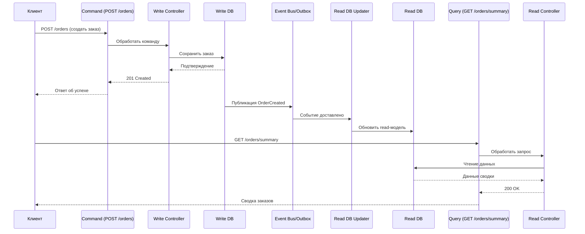

#### Метрика входа для CQRS

- **Read/Write ratio > 100:1** (читают в 100 раз чаще, чем пишут)
- **3+ разных read-модели** для одной сущности
- **SLA на чтение < 50 мс**, а write-side не может обеспечить
- **Разные требования к масштабированию** read и write

#### Как измерить R/W ratio

| Стек | Инструмент | Запрос |
|---|---|---|
| **Postgres** | `pg_stat_statements` | `SELECT ... FROM pg_stat_statements WHERE query NOT LIKE '%pg_%'` |
| **Oracle** | `V$SQL` | `SELECT ... FROM v$sql WHERE command_type IN (2,3,6,7)` |
| **.NET / App Insights** | Kusto | `requests | summarize by operation_Name` |

**Postgres:**
```sql
-- Измерение R/W ratio через pg_stat_statements
SELECT 
    ROUND(100.0 * SUM(CASE WHEN query ILIKE 'SELECT%' THEN calls ELSE 0 END) / NULLIF(SUM(calls), 0), 2) AS read_pct,
    ROUND(100.0 * SUM(CASE WHEN query ILIKE ANY (ARRAY['INSERT%', 'UPDATE%', 'DELETE%']) THEN calls ELSE 0 END) / NULLIF(SUM(calls), 0), 2) AS write_pct
FROM pg_stat_statements
WHERE query NOT LIKE '%pg_%';
```

**Oracle:**
```sql
-- Измерение R/W ratio через V$SQL
SELECT 
    ROUND(SUM(DECODE(command_type, 2, executions, 0)) / NULLIF(SUM(executions), 0) * 100, 2) AS read_pct,
    ROUND(SUM(DECODE(command_type, 2, 0, executions)) / NULLIF(SUM(executions), 0) * 100, 2) AS write_pct
FROM v$sql
WHERE command_type IN (2, 3, 6, 7)
  AND executions > 0;
```

#### Пример: CQRS для модуля Delivery

**Write-модель (нормализованная):**
```sql
-- Write-side: нормализованная модель
CREATE TABLE delivery_rates (
    id SERIAL PRIMARY KEY,
    zone_id INT NOT NULL REFERENCES tariff_zones(id),
    weight_class VARCHAR(50) NOT NULL,
    base_cost DECIMAL(10,2) NOT NULL,
    valid_from DATE NOT NULL,
    valid_to DATE NOT NULL
);

CREATE TABLE tariff_zones (
    id SERIAL PRIMARY KEY,
    zone_name VARCHAR(100) NOT NULL,
    region VARCHAR(100) NOT NULL
);
```

**Read-модель (Materialized View):**
```sql
-- Postgres: Materialized View для read-модели
CREATE MATERIALIZED VIEW mv_delivery_cost_summary AS
SELECT 
    o.id AS order_id,
    o.total_amount,
    tz.zone_name,
    dr.base_cost,
    CASE 
        WHEN c.min_amount_for_free IS NOT NULL AND o.total_amount >= c.min_amount_for_free 
        THEN 0 
        ELSE dr.base_cost 
    END AS final_cost
FROM orders o
JOIN delivery_rates dr ON dr.zone_id = o.zone_id
    AND o.created_at BETWEEN dr.valid_from AND dr.valid_to
JOIN tariff_zones tz ON tz.id = dr.zone_id
LEFT JOIN campaigns c ON c.id = dr.campaign_id;

-- Индекс для быстрых запросов
CREATE UNIQUE INDEX idx_mv_delivery_cost_order ON mv_delivery_cost_summary(order_id);

-- Refresh каждые 5 минут
SELECT cron.schedule('refresh-delivery-cost', '*/5 * * * *', 
    'REFRESH MATERIALIZED VIEW CONCURRENTLY mv_delivery_cost_summary');
```

**Oracle:**
```sql
-- Oracle: Materialized View с REFRESH FAST ON COMMIT
CREATE MATERIALIZED VIEW LOG ON orders 
WITH ROWID, PRIMARY KEY (status, total_amount) 
INCLUDING NEW VALUES;

CREATE MATERIALIZED VIEW mv_order_summary
REFRESH FAST ON COMMIT
AS 
SELECT status, COUNT(*) AS cnt, SUM(total_amount) AS total 
FROM orders 
GROUP BY status;
```

#### Transactional Outbox — ключевой паттерн для CQRS

Без Outbox: событие может быть опубликовано, а запись в БД — нет (или наоборот).

```csharp
// Transactional Outbox — гарантия доставки событий
public class OrderService
{
    private readonly OrderDbContext _dbContext;

    public async Task<OrderId> CreateOrderAsync(CreateOrderCommand command, CancellationToken ct)
    {
        // 1. Начинаем транзакцию
        await using var transaction = await _dbContext.Database.BeginTransactionAsync(ct);
        
        try
        {
            // 2. Создаём агрегат
            var order = Order.Create(command.CustomerId, command.Items);
            _dbContext.Orders.Add(order);
            
            // 3. Сохраняем событие в Outbox (та же транзакция!)
            _dbContext.OutboxMessages.Add(new OutboxMessage
            {
                Id = Guid.NewGuid(),
                Type = "OrderCreated",
                Payload = JsonSerializer.Serialize(new OrderCreatedEvent(order.Id.Value)),
                CreatedAt = DateTime.UtcNow,
                Processed = false
            });
            
            // 4. Коммит — гарантия: или всё, или ничего
            await _dbContext.SaveChangesAsync(ct);
            await transaction.CommitAsync(ct);
            
            return order.Id;
        }
        catch
        {
            await transaction.RollbackAsync(ct);
            throw;
        }
    }
}

// Background Service для публикации событий
public class OutboxPublisher : BackgroundService
{
    protected override async Task ExecuteAsync(CancellationToken stoppingToken)
    {
        while (!stoppingToken.IsCancellationRequested)
        {
            var messages = await _dbContext.OutboxMessages
                .Where(m => !m.Processed)
                .OrderBy(m => m.CreatedAt)
                .Take(100)
                .ToListAsync(stoppingToken);

            foreach (var message in messages)
            {
                await _eventBus.PublishAsync(message.Type, message.Payload, stoppingToken);
                message.Processed = true;
            }

            await _dbContext.SaveChangesAsync(stoppingToken);
            await Task.Delay(TimeSpan.FromSeconds(5), stoppingToken); // poll every 5 sec
        }
    }
}
```

> **Важно:** CQRS **не всегда** означает eventual consistency. При использовании синхронного обновления read-модели (триггер, CDC, `REFRESH FAST ON COMMIT` в Oracle) задержка может быть < 1 мс. Выбор между strong и eventual consistency — отдельное архитектурное решение.

#### ER-диаграмма Bounded Context Delivery

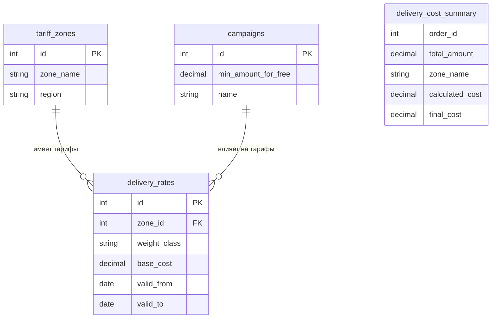

#### Алгоритм принятия решения: нужен ли CQRS?

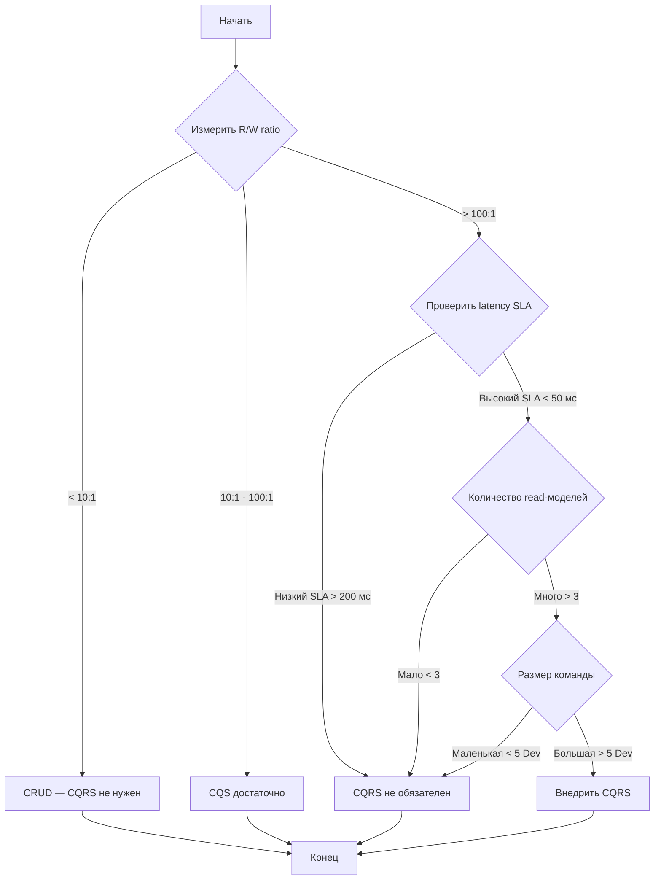

#### Цена отказа от CQRS

- R/W ratio > 100:1 — read-модель тормозит write-модель
- **Data Engineer:** одна БД не может быть одновременно нормализованной (write) и денормализованной (read)

---

### 2.3. TDD / BDD — Test-Driven Development / Behavior-Driven Development

#### Суть за 30 секунд

**TDD (Test-Driven Development):** Сначала — тест (который падает), потом — код (который проходит тест), потом — рефакторинг.

**BDD (Behavior-Driven Development):** Те же тесты, но на бизнес-языке. Пишет BA + QA + Dev вместе. Формат: Given-When-Then.

> TDD — для разработчика (корректность кода).
> BDD — для всей команды (поведение системы).

#### Цикл TDD: Red-Green-Refactor

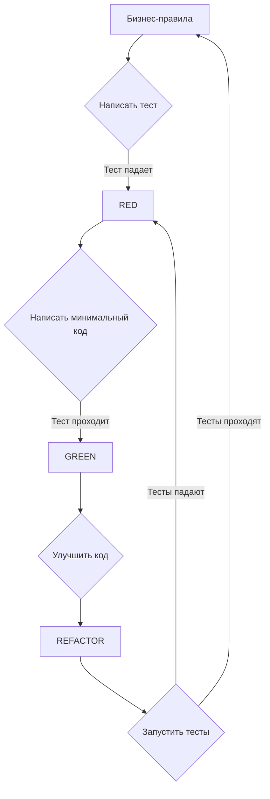

#### Пример TDD для Value Object `Money`

**Шаг 1. RED — пишем тест:**
```csharp
public class MoneyTests
{
    [Fact]
    public void Add_two_money_with_same_currency_returns_sum()
    {
        var a = new Money(100, "USD");
        var b = new Money(50, "USD");
        
        var result = a + b;
        
        Assert.Equal(new Money(150, "USD"), result);
    }
}
// → тест НЕ компилируется — Money ещё не реализован. RED.
```

**Шаг 2. GREEN — минимальная реализация:**
```csharp
public record Money(decimal Amount, string Currency)
{
    public static Money operator +(Money a, Money b)
    {
        if (a.Currency != b.Currency)
            throw new ArgumentException("Currency mismatch");
        return new Money(a.Amount + b.Amount, a.Currency);
    }
}
// → тест проходит. GREEN.
```

**Шаг 3. REFACTOR — улучшаем (добавляем явное поведение):**
```csharp
public record Money(decimal Amount, string Currency)
{
    public Money Add(Money other)
    {
        if (Currency != other.Currency)
            throw new InvalidOperationException($"Cannot add {other.Currency} to {Currency}");
        return new Money(Amount + other.Amount, Currency);
    }
}
```

#### Когда TDD обязателен

> TDD обязателен для **любой нетривиальной бизнес-логики**: расчёты, правила валидации, алгоритмы принятия решений. Guard clauses (`if (value == null) return null`) и тривиальные маппинги могут быть написаны без TDD.

#### Пример BDD-сценария на Gherkin (для BA + QA)

```gherkin
@regression @delivery
Feature: Расчет стоимости доставки

  Background:
    Given товар "Стул деревянный" стоит 5000 руб
    And тариф доставки по Москве — 300 руб
    And кампания "Бесплатная доставка от 3000 руб" активна

  Scenario: Успешный расчет стоимости с бесплатной доставкой
    When покупатель добавляет товар "Стул деревянный" в корзину
    And покупатель указывает адрес в Москве
    Then стоимость доставки должна быть 0 руб
    And общая стоимость заказа должна быть 5000 руб

  Scenario: Расчет стоимости без бесплатной доставки
    Given товар "Кружка" стоит 500 руб
    When покупатель добавляет товар "Кружка" в корзину
    And покупатель указывает адрес в Москве
    Then стоимость доставки должна быть 300 руб
    And общая стоимость заказа должна быть 800 руб

  Scenario: Ошибка при недоступном регионе
    When покупатель указывает адрес в "Магадан"
    Then должна быть ошибка "Доставка в данный регион недоступна"
```

> **Для BA:** BDD-сценарии — это **документация**, которая всегда актуальна. Если тест проходит — документация верна.

#### Пример интеграционного BDD-теста с Testcontainers

```csharp
// Требуется: Testcontainers для PostgreSQL
public class DeliveryCostSteps
{
    private static readonly PostgreSqlContainer _pg = new PostgreSqlBuilder()
        .WithImage("postgres:16")
        .Build();
    
    private IDbConnection _connection;
    private decimal _deliveryCost;

    [BeforeScenario]
    public async Task Init()
    {
        await _pg.StartAsync();
        _connection = new NpgsqlConnection(_pg.GetConnectionString());
        await _connection.OpenAsync();
        // Загружаем схему
        await _connection.ExecuteAsync(File.ReadAllText("schema.sql"));
    }

    [Given(@"тариф доставки по Москве — (\d+) руб")]
    public async Task GivenTariff(int cost)
    {
        await _connection.ExecuteAsync(
            "INSERT INTO tariff_zones (id, zone_name, region) VALUES (1, 'Москва', 'Центр')");
        await _connection.ExecuteAsync(
            "INSERT INTO delivery_rates (zone_id, weight_class, base_cost, valid_from, valid_to) VALUES (1, 'standard', @Cost, '2024-01-01', '2025-12-31')",
            new { Cost = cost });
    }

    [Then(@"стоимость доставки должна быть (\d+) руб")]
    public void ThenDeliveryCostShouldBe(decimal expectedCost)
    {
        Assert.Equal(expectedCost, _deliveryCost);
    }
}
```

#### Цена отказа от TDD/BDD

- **Для C# Dev:** бизнес-логика без тестов — регрессия каждые 2 спринта
- **Для QA:** ручная регрессия 2 дня → 1 баг из 3 уходит в прод
- **Для BA:** требования не проверяемы: «как есть — так и поймёшь»

---

### 2.4. API First

#### Суть за 30 секунд

**Три правила API First** (Lars Trieloff):

1. **Spec-first**: сначала OpenAPI-спецификация, потом код
2. **Contract-first**: спецификация — контракт между командами (Backend, Frontend, Mobile)
3. **Consumer-first**: спецификация пишется под потребителя, а не под реализацию

#### API First vs Code-First: выбор подхода

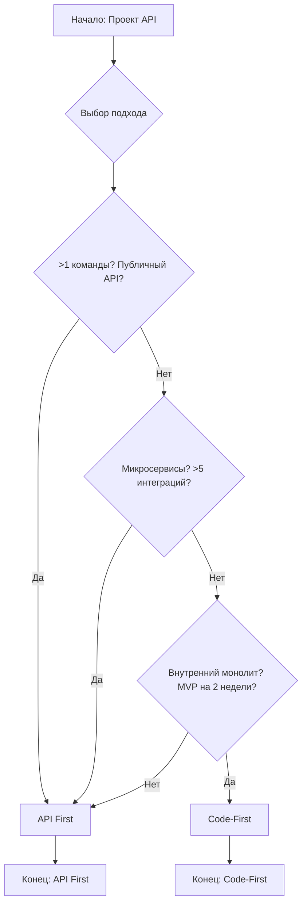

#### Пример OpenAPI-спецификации (API First)

```yaml
openapi: 3.0.3
info:
  title: Delivery API
  version: 1.0.0
  description: API для расчёта стоимости доставки (Bounded Context Delivery)

paths:
  /api/v1/delivery/cost:
    post:
      summary: Рассчитать стоимость доставки
      operationId: calculateDeliveryCost
      security:
        - apiKey: []
      requestBody:
        required: true
        content:
          application/json:
            schema:
              type: object
              required:
                - orderId
                - address
              properties:
                orderId:
                  type: string
                  format: uuid
                  example: "123e4567-e89b-12d3-a456-426614174000"
                address:
                  $ref: '#/components/schemas/Address'
      responses:
        '200':
          description: Успешный расчёт стоимости доставки
          content:
            application/json:
              schema:
                $ref: '#/components/schemas/DeliveryCostResponse'
        '400':
          description: Ошибка валидации (недоступный регион)
        '401':
          description: Неверный API-ключ

components:
  securitySchemes:
    apiKey:
      type: apiKey
      in: header
      name: X-API-Key

  schemas:
    Address:
      type: object
      required:
        - city
        - street
      properties:
        city:
          type: string
          example: "Москва"
        street:
          type: string
          example: "Тверская, 1"
        postalCode:
          type: string
          example: "125009"

    DeliveryCostResponse:
      type: object
      required:
        - cost
        - currency
        - estimatedDays
      properties:
        cost:
          type: number
          format: decimal
          example: 300.00
        currency:
          type: string
          example: "RUB"
        estimatedDays:
          type: integer
          example: 3
```

> **Для BA (3 вопроса для проверки OpenAPI-спецификации):**
> 1. Все ли бизнес-сценарии покрыты эндпоинтами? (проверьте по BDD-сценариям)
> 2. Нет ли лишних полей, которые не нужны потребителю?
> 3. Верно ли названы эндпоинты? (глаголы — бизнес-операции, а не CRUD)

#### Цена отказа от API First

- Интеграционные конфликты: «я думал, поле называется deliveryCost, а у тебя — shipping_charge»
- **Для Data Engineer:** спецификация не совпадает с типом поля в БД (Decimal в БД → string в API)
- **Для QA:** тесты пишутся под spec, которая не соответствует коду

---

### 2.5. Сводная таблица 4 принципов

| Принцип | Уровень | Кто инициирует | Метрика входа (когда?) | Метрика выхода (когда хватит?) | Цена отказа |
|---|---|---|---|---|---|
| **DDD** | Стратегический | SA, BA | >5 бизнес-правил на сущность; BA тратит >30% времени на термины | Команда использует Ubiquitous Language; BA ≠ Dev ≠ DB говорят одинаково | Код не отражает домен; BA и Dev на разных языках |
| **CQS** | Тактический (метод) | C# Dev | Любой метод с бизнес-логикой | Roslyn-анализатор не находит нарушений | Сайд-эффекты в Query; падающие тесты |
| **CQRS** | Архитектурный | SA, Data Eng | R/W ratio > 100:1 или 3+ read-модели | Read latency < 50 мс при R/W > 500:1 | Избыточная сложность; eventually consistency |
| **TDD/BDD** | Процессный | QA, C# Dev, BA | Любое нетривиальное бизнес-правило | Регрессия < 30 мин; >80% coverage бизнес-логики | Дырявая бизнес-логика; ручная регрессия |
| **API First** | Контрактный | SA, C# Dev, FE | >1 команда или публичный API | 0 breaking changes без нового major-версии | Интеграционные конфликты; «угадай поле» |

---

## 3. Матрица ответственности RACI

### 3.1. RACI-матрица по артефактам

> **RACI:** R — Responsible (исполнитель), A — Accountable (отвечающий), C — Consulted (консультирует), I — Informed (информирован)

| Артефакт / Решение | BA | SA | C# Dev | Data Eng | QA |
|---|---|---|---|---|---|
| **Описание Bounded Contexts** | **A** | **R** | I | C | I |
| **Формирование Ubiquitous Language** | **A** | C | C | C | I |
| **Глоссарий терминов** | **R** | I | I | I | C |
| **Модель Aggregate + Value Objects** | C | **A** | **R** | I | I |
| **CQS-дисциплина (анализатор кода)** | I | C | **A** | I | **R** |
| **Решение о CQRS (read-модель)** | C | **A** | C | **R** | I |
| **OpenAPI-спецификация (API First)** | R | **A** | **R** | C | R |
| **Unit-тесты (TDD)** | I | I | **R** | C | **A** |
| **BDD-сценарии (Gherkin)** | **A** | C | C | I | **R** |
| **Приоритизация BDD-сценариев** | **A** | C | I | I | R |

#### Пояснение ключевых изменений (относительно стандартного RACI):

- **BA — Accountable за Ubiquitous Language и BDD-сценарии.** BA — носитель бизнес-языка, не SA. SA — консультант по техническим ограничениям.
- **SA — Accountable за архитектурные границы (Bounded Contexts, CQRS).** SA определяет, где проходят границы и нужен ли CQRS.
- **BA — Responsible за OpenAPI spec совместно с Dev.** BA проверяет, что спецификация покрывает бизнес-сценарии. Dev пишет YAML.

### 3.2. Что каждая роль должна знать и уметь

#### BA (Business Analyst)
- ✅ Писать сценарии в **Gherkin** (Given-When-Then)
- ✅ Вести **глоссарий Ubiquitous Language** (шаблон ниже)
- ✅ Участвовать в **Event Storming** (фасилитация)
- ✅ Проверять OpenAPI-спецификацию (3 вопроса из раздела 2.4)
- ✅ Знать **RACI**: за что отвечает, за что — нет
- ❌ **НЕ писать OpenAPI YAML** вручную (только проверять)
- ❌ **НЕ проектировать БД** (это Data Eng)

#### SA (System Architect)
- ✅ Чертить **Context Map** и определять Bounded Contexts
- ✅ Принимать решение по **CQRS** на основе R/W ratio
- ✅ Проектировать **Aggregate** и границы транзакций
- ✅ Фиксировать решения в **ADR** (Architecture Decision Record)
- ❌ **НЕ писать бизнес-сценарии** (это BA)

#### C# Developer
- ✅ Следовать **CQS** на методном уровне (Roslyn-анализатор)
- ✅ Реализовывать **DDD-агрегаты** (богатую модель)
- ✅ Писать **TDD-тесты** для бизнес-логики
- ✅ Реализовывать **Transactional Outbox**
- ❌ **НЕ менять OpenAPI-спецификацию** без согласования с командой

#### Data Engineer (Oracle / Postgres)
- ✅ Создавать **Materialized View** для read-модели CQRS
- ✅ Измерять **R/W ratio** через системные представления
- ✅ Реализовывать **CDC** (Change Data Capture) для синхронизации
- ✅ Писать **SQL-тесты** для проверки консистентности данных
- ❌ **НЕ хранить бизнес-логику** в хранимых процедурах

#### QA Engineer
- ✅ Автоматизировать **BDD-сценарии** (SpecFlow / Cucumber)
- ✅ Использовать **Postman Collection** из OpenAPI
- ✅ Писать **негативные тесты** на граничные условия
- ✅ Настраивать **CI/CD** с проверкой контрактов

---

## 4. Практический кейс: Интернет-магазин

### 4.1. AS IS — как есть (проблемная архитектура)

**Контекст:** Интернет-магазин. Один монолит, одна БД (Postgres), одна модель `Order` на 25 полей. Команда — 8 человек.

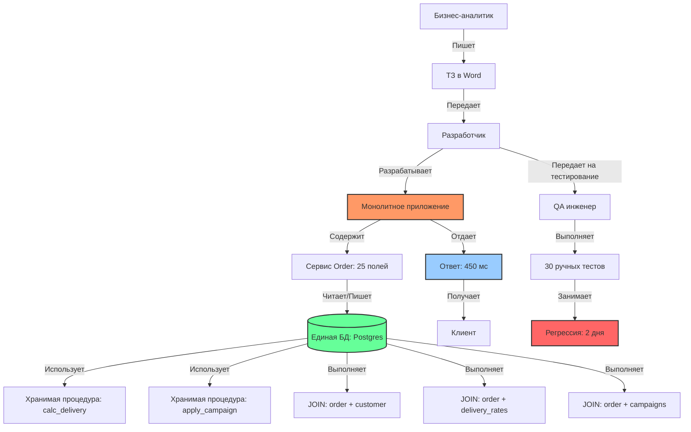

**Проблемы (с цифрами):**

| Метрика | Значение | Критично? |
|---|---|---|
| Время ответа эндпоинта `/api/delivery/cost` | **450 мс** | Да (SLA был 200 мс) |
| JOIN-ов на один запрос | **3** | Да (падает при росте данных) |
| Количество полей в Order | **25** | Да (половина не нужна для чтения) |
| Время регрессии | **2 дня** | Да (каждый релиз — боль) |
| Конфликты интеграции за спринт | **3-4** | Да (переделываем поля) |
| Хранимые процедуры с бизнес-логикой | **2** | Да (не тестируются) |

### 4.2. TO BE — как стало (целевая архитектура)

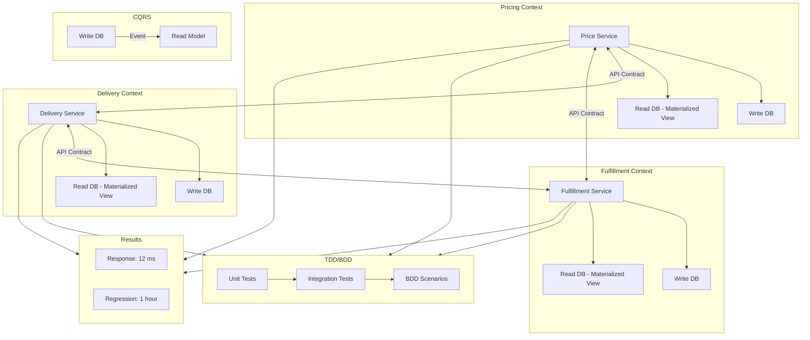

**Результаты (сравнение):**

| Метрика | AS IS (было) | TO BE (стало) | Улучшение | За счёт чего |
|---|---|---|---|---|
| Время ответа `/api/delivery/cost` | 450 мс | **12 мс** | ×37 | Read Model (Materialized View) — CQRS |
| Время регрессии | 2 дня | **1 час** | ×16 | BDD-автоматизация |
| Конфликты интеграции за спринт | 3-4 | **0** | ∞ | Contract-first + моки — API First |
| Онбординг нового Dev | 2 недели | **3 дня** | ×4 | Ubiquitous Language + Bounded Contexts — DDD |
| Инциденты с логикой доставки | 2-3/квартал | **0** | ∞ | TDD + DDD (модель = бизнес) |

### 4.3. Пошаговое применение 4 принципов

#### Шаг 1. DDD — Event Storming и Bounded Contexts

**Формат:** Воркшоп, 3 часа, BA + SA + 2 Dev + Domain Expert.

**Результат Event Storming-сессии:**
- Оранжевые стикеры (события): `OrderCreated`, `DeliveryCostCalculated`, `DeliveryAddressChanged`
- Синие стикеры (команды): `CalculateDeliveryCost`, `ApplyCampaign`, `ChangeAddress`
- Жёлтые стикеры (агрегаты): `Order`, `Delivery`, `Campaign`
- Границы: **3 Bounded Context** — Pricing, Delivery, Fulfillment

**Шаблон для проведения Event Storming:**

| Этап | Длительность | Участники | Что делаем |
|---|---|---|---|
| 1. Контекст | 15 мин | BA | BA объясняет домен: кто клиент, что такое заказ, какие сценарии |
| 2. События | 30 мин | Все | Клеим оранжевые стикеры: что происходит в домене? |
| 3. Команды | 20 мин | Все | Клеим синие: какие действия вызывают события? |
| 4. Агрегаты | 20 мин | SA+Dev | Группируем события+команды в жёлтые агрегаты |
| 5. Границы | 20 мин | SA+BA | Рисуем границы Bounded Context-ов |
| 6. Глоссарий | 15 мин | BA | Фиксируем первые 10 терминов |

#### Шаг 2. DDD — Ubiquitous Language и глоссарий

**Шаблон глоссария:**

| Термин | Bounded Context | Определение | Синонимы (запрещённые) | Связанные термины |
|---|---|---|---|---|
| Клиент | CRM | Физ. лицо, заключившее договор | Покупатель, Контрагент | Договор, Адрес |
| Клиент | Биллинг | Плательщик по счёту | Плательщик | Счёт, Платёж |
| Заказ | Order | Агрегат, содержащий товары и стоимость доставки | — | Товар, Доставка |
| Цена | Pricing | Стоимость товара без доставки | Стоимость | Товар, Скидка |
| Цена | Delivery | Стоимость доставки | — | Тариф, Зона |
| Статус | Fulfillment | Готовность к отправке | Статус заказа | Склад, Отгрузка |

#### Шаг 3. API First — OpenAPI-спецификация

BA + Dev пишут OpenAPI spec для `/api/v1/delivery/cost`. Спецификация — в git, commit **без кода**. Только spec.

**Порядок:**
1. BA описывает сценарии (3-4 Gherkin-сценария)
2. Dev пишет OpenAPI YAML под эти сценарии
3. BA проверяет: все ли сценарии покрыты? Нет ли лишних полей?
4. SA утверждает spec
5. QA генерирует Postman Collection из spec
6. **Только после этого** Dev начинает писать код

#### Шаг 4. CQRS — решение и реализация

SA измеряет R/W ratio через `pg_stat_statements`:
- Read: 15 000 запросов/мин
- Write: 100 запросов/мин
- **R/W ratio = 150:1 → CQRS оправдан**

**Решение (фиксируется в ADR):**
```
ADR-001: Выбор CQRS для модуля Delivery

Контекст: Read/Write ratio = 150:1, SLA на чтение < 50 мс.
Решение: Внедрить CQRS с раздельными моделями.
Компромисс: Eventually consistency до 5 минут (согласовано с заказчиком 20.03.2025).
Последствия:
  - Data Engineer создаёт Materialized View с REFRESH CONCURRENTLY
  - BA документирует задержку в NFR
  - QA тестирует сценарии с учётом задержки
Статус: Approved
```

**Data Engineer создаёт read-модель:**
```sql
-- Postgres: Materialized View для быстрого чтения
CREATE MATERIALIZED VIEW mv_delivery_cost_summary AS
SELECT 
    o.id AS order_id,
    o.total_amount,
    tz.zone_name,
    dr.base_cost,
    CASE 
        WHEN c.min_amount_for_free IS NOT NULL AND o.total_amount >= c.min_amount_for_free 
        THEN 0 
        ELSE dr.base_cost 
    END AS final_cost
FROM orders o
JOIN delivery_rates dr ON dr.zone_id = o.zone_id
    AND o.created_at BETWEEN dr.valid_from AND dr.valid_to
JOIN tariff_zones tz ON tz.id = dr.zone_id
LEFT JOIN campaigns c ON c.id = dr.campaign_id;

-- Oracle: аналогично через REFRESH FAST ON COMMIT
CREATE MATERIALIZED VIEW LOG ON orders WITH ROWID, PRIMARY KEY (status, total_amount) INCLUDING NEW VALUES;
CREATE MATERIALIZED VIEW mv_delivery_cost_summary
REFRESH FAST ON COMMIT
AS SELECT ...;
```

#### Шаг 5. TDD + BDD — тесты

**C# Dev пишет TDD-тесты для расчёта стоимости:**
```csharp
public class DeliveryCostCalculatorTests
{
    [Fact]
    public void CalculateCost_with_free_delivery_campaign_returns_zero()
    {
        var calculator = new DeliveryCostCalculator();
        var order = OrderBuilder.Create()
            .WithTotalAmount(5000)
            .WithZone("Москва")
            .Build();
        var campaign = new Campaign("Бесплатно от 3000", minAmount: 3000);
        
        var cost = calculator.Calculate(order, campaign);
        
        Assert.Equal(Money.Zero, cost);
    }
}
```

**QA + BA пишут BDD-сценарии:**
```gherkin
@regression @delivery
Feature: Расчет стоимости доставки

  Background:
    Given тариф доставки по Москве — 300 руб
    And кампания "Бесплатная доставка от 3000 руб" активна

  Scenario: Успешный расчет с бесплатной доставкой
    When покупатель добавляет товар "Стул" за 5000 руб в корзину
    And указывает адрес в Москве
    Then стоимость доставки должна быть 0 руб

  Scenario: Ошибка при недоступном регионе
    When покупатель указывает адрес в "Магадан"
    Then должна быть ошибка "Доставка в данный регион недоступна"

  Scenario: Граничное значение бесплатной доставки
    When покупатель добавляет товар за 3000 руб
    And указывает адрес в Москве
    Then стоимость доставки должна быть 0 руб

  Scenario: Чуть ниже границы бесплатной доставки
    When покупатель добавляет товар за 2999.99 руб
    And указывает адрес в Москве
    Then стоимость доставки должна быть 300 руб
```

---

## 5. Интеграция в процессы и компромиссы

### 5.1. Чеклист старта нового модуля (5 шагов)

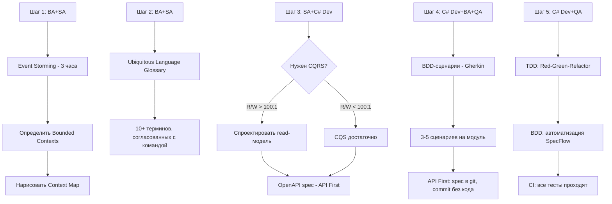

### 5.2. Таблица компромиссов (Trade-offs)

> **Главное правило:** Компромиссы — это осознанные решения, а не «забыли сделать». Каждый компромисс фиксируется в ADR.

| Ситуация | Что режем | Что НЕ режем | Почему |
|---|---|---|---|
| **Спринт 2 недели** | CQRS (оставляем CQS) | DDD (без него не понять домен) | DDD даёт язык и границы; CQRS — опция производительности |
| **MVP на 1 месяц** | TDD (только BDD на критические сценарии) | OpenAPI spec (хоть 3 эндпоинта, но контракт) | Контракт важнее, чем 100% coverage |
| **Легаси-монолит (Oracle 11g)** | DDD (только Strangler Fig для новых модулей) | CQS (чистка методов — быстро и безопасно) | CQS — дисциплина кода, внедряется без переписывания |
| **Команда из 3 человек** | BDD (достаточно TDD + ручного теста BA) | API First (контракт в голове — риск) | Без контракта интеграция сломается при росте |

#### Пример NFR-компромисса (для согласования с заказчиком)

| Параметр | Без CQRS | С CQRS (eventual consistency) |
|---|---|---|
| SLA на чтение | ≤ 200 мс | ≤ 10 мс |
| SLA на запись | ≤ 200 мс | ≤ 200 мс |
| Консистентность | Strong (100%) | Eventual (задержка ≤ 5 мин) |
| AP (доступность) | 99.9% | 99.99% (read-side масштабируется) |
| Сложность разработки | 1x | 2x |

### 5.3. CI/CD Pipeline с проверкой принципов

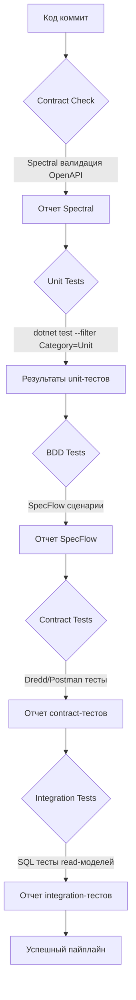

**SQL-тест для Data Engineer (проверка read-модели):**
```sql
-- SQL-тест: проверка консистентности данных между write и read моделями
-- Запускается в CI после деплоя миграций

DO $$
DECLARE
    write_count INT;
    read_count INT;
    mismatch_count INT;
BEGIN
    -- 1. Проверка количества записей
    SELECT COUNT(*) INTO write_count FROM orders WHERE status = 'Confirmed';
    SELECT COUNT(*) INTO read_count FROM mv_delivery_cost_summary;
    
    IF write_count != read_count THEN
        RAISE EXCEPTION 'Data mismatch: write has %, read has %', write_count, read_count;
    END IF;

    -- 2. Проверка консистентности данных (выборочно)
    SELECT COUNT(*) INTO mismatch_count
    FROM orders o
    JOIN mv_delivery_cost_summary mv ON mv.order_id = o.id
    WHERE o.status = 'Confirmed' 
      AND mv.total_amount != o.total_amount;

    IF mismatch_count > 0 THEN
        RAISE EXCEPTION 'Found % inconsistent records', mismatch_count;
    END IF;

    -- 3. Проверка производительности read-модели
    DECLARE
        start_ts TIMESTAMP;
        end_ts TIMESTAMP;
        query_time_ms INT;
    BEGIN
        start_ts := clock_timestamp();
        PERFORM * FROM mv_delivery_cost_summary WHERE order_id = 1;
        end_ts := clock_timestamp();
        query_time_ms := EXTRACT(MILLISECOND FROM (end_ts - start_ts));
        
        IF query_time_ms > 50 THEN
            RAISE WARNING 'Read model query is slow: % ms', query_time_ms;
        END IF;
    END;

    RAISE NOTICE 'All consistency checks passed';
END $$;
```

### 5.4. Roadmap внедрения на 2 месяца

```mermaid
gantt
    title Roadmap внедрения 4 принципов
    dateFormat  YYYY-MM-DD
    axisFormat  %U

    section Этап 1: DDD
    Event Storming (3 часа)           :crit, done, 2024-01-01, 1d
    Bounded Contexts + Context Map    :active, 2024-01-02, 5d
    Ubiquitous Language + глоссарий   :2024-01-09, 10d

    section Этап 2: API First
    API First для нового модуля       :2024-01-23, 5d
    OpenAPI spec + ревью             :2024-01-30, 3d

    section Этап 3: TDD
    TDD для критичной логики          :2024-02-02, 10d
    Code review + CQS анализатор      :2024-02-16, 3d

    section Этап 4: CQRS
    CQRS для модуля с R/W > 100:1     :2024-02-21, 10d
    Materialized View + тесты         :2024-03-06, 5d
```

### 5.5. Безопасность при внедрении

#### Безопасность при CQRS

- **Read-модель** может иметь менее строгие права (read-only), чем write-модель
- **OpenAPI:** обязательно указывать `securitySchemes` в спецификации
- **Materialized Views:** не включать PII (персональные данные) в read-модель без необходимости
- **Аудит:** write-side должен логировать все изменения (для compliance)

#### Безопасность при API First

```yaml
# OpenAPI: секция безопасности
components:
  securitySchemes:
    apiKey:
      type: apiKey
      in: header
      name: X-API-Key
    oauth2:
      type: oauth2
      flows:
        clientCredentials:
          tokenUrl: https://auth.example.com/token
          scopes:
            delivery:read: Чтение данных доставки
            delivery:write: Запись данных доставки

security:
  - apiKey: []
  - oauth2:
    - delivery:read
    - delivery:write
```

#### Безопасность при CQS

- **Query-методы** не должны логировать PII в URL (GET /api/user?email=...)
- **Command-методы** должны проверять права доступа (authorization)
- **SQL Injection:** Materialized Views не должны строиться из динамического SQL

---

## 6. Заключение и выводы

### 6.1. 4 правила для команды

1. **DDD — это язык, а не технология.** Договоритесь о терминах до того, как писать код. Глоссарий — первый артефакт.
2. **CQS — всегда. CQRS — по метрике.** CQS — дисциплина (бесплатно). CQRS — архитектура (дорого, обосновывайте).
3. **API First — контракт, а не спецификация.** OpenAPI — единственный источник правды. Нарушил spec → сломал билд.
4. **TDD + BDD = страховка бизнеса.** TDD ловит баги в коде. BDD ловит баги в понимании бизнеса. Оба — в CI.

### 6.2. Метрики «хорошо» для каждой роли

| Роль | Цель на следующий спринт | Как измерить |
|---|---|---|
| **BA** | Написать 5 Gherkin-сценариев для нового функционала | PR с feature-файлами |
| **SA** | Начертить Context Map текущего модуля и найти 2+ скрытых Bounded Context | ADR с Context Map |
| **C# Dev** | Завести в проекте StyleCop / Roslyn анализатор на CQS (запрет void-методов с возвратом) | Качество кода: 0 нарушений CQS |
| **Data Eng (Postgres)** | Для самого частого read-запроса создать Materialized View и измерить разницу в скорости | Read latency < 50 мс |
| **Data Eng (Oracle)** | Настроить Materialized View с REFRESH FAST ON COMMIT | Read latency < 50 мс |
| **QA** | Взять OpenAPI spec → сгенерировать Postman Collection → добавить в CI | 100% эндпоинтов покрыты тестами |
| **Team Lead** | Провести 1 Event Storming-сессию (3 часа) | Зафиксированы Bounded Contexts и глоссарий |

### 6.3. Ресурсы и шаблоны

#### Шаблон глоссария Ubiquitous Language

```markdown
| Термин | Bounded Context | Определение | Синонимы (запрещённые) | Связанные термины |
|---|---|---|---|---|
|         |                 |             |                        |                   |
```

#### Шаблон ADR (Architecture Decision Record)

```markdown
# ADR-NNN: [Название решения]

**Контекст:** [Проблема, метрики, ограничения]
**Решение:** [Что выбрали]
**Компромисс:** [Что потеряли, с кем согласовано]
**Последствия:** 
- [Кто что делает]
**Статус:** Proposed / Approved / Deprecated
```

#### Рекомендуемая литература

| Тема | Книга / Ресурс | Для кого |
|---|---|---|
| **DDD** | Eric Evans — «Domain-Driven Design» (Blue Book) | SA, Dev |
| **DDD (быстрый старт)** | Vaughn Vernon — «Domain-Driven Design Distilled» | Все роли |
| **CQRS** | Martin Fowler — bliki «CQRS» | SA, Dev |
| **TDD** | Kent Beck — «Test-Driven Development by Example» | Dev |
| **BDD** | Gojko Adzic — «Specification by Example» | BA, QA |
| **API First** | Lars Trieloff — «API First Transformation» | SA, Dev |
| **Архитектура** | SWEBOK (Guide to the Software Engineering Body of Knowledge) | SA |
| **Требования** | BABOK (Business Analysis Body of Knowledge) | BA |
| **Oracle для CQRS** | Oracle Docs — «Materialized Views» | Data Eng |

---

> **Автор курса:** Solution Architect / Педагогический дизайнер  
> **Дата финальной версии:** 20.03.2025  
> **Статус:** Готов к публикации  
> **Лицензия:** Свободное использование в корпоративных целях
