# Учебное занятие: Управление общими данными в распределённых системах
## Длительность: 45 минут | Формат: Workshop | Уровень: Middle+ | Версия: 2.0

---

## 📋 Карта занятия

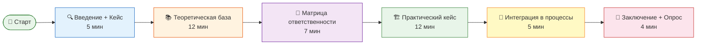

---

## 1. Введение и постановка проблемы (5 мин)

### 1.1. Проблемная ситуация

**Кейс для разогрева (озвучить команде):**

> Вы запускаете микросервис `OrderService`. Клиент дважды отправляет POST /orders из-за таймаута — создаётся **два заказа** с одним товаром. Бухгалтерия видит расхождение. DBA находит дубли. Кто виноват? C# Dev не реализовал идемпотентность. А кто должен был спроектировать контракт? SA не заложил Idempotency-Key. А кто владеет данными заказа — OrderService или BillingService? **Никто**. Data Ownership не назначен.

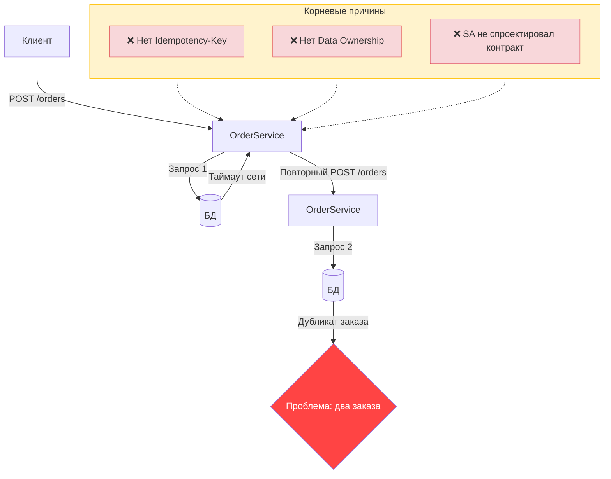

**Триггер-вопросы для аудитории:**
- Сколько раз вы ловили duplicate records в production?
- Кто в вашей команде отвечает за «правду» по сущности `Customer`?
- Ваш API stateless на уровне HTTP, но кто держит состояние заказа?

### 1.2. Что разберём за 45 минут

| Блок | Что даст инженеру | Бизнес-ценность |
|---|---|---|
| Stateful vs Stateless | Понимание, где и почему бизнес-состояние должно жить на сервере | Ниже TCO за счёт горизонтального масштабирования stateless-слоя |
| Single Source of Truth | Паттерн проектирования мастер-системы данных | Исключение расхождений данных между сервисами |
| Data Ownership & Governance | Матрица RACI по данным: кто создаёт, кто читает, кто удаляет | Снижение Cost of Poor Data Quality на 40-60% |
| Идемпотентность API | Конкретная реализация на C# с Idempotency-Key | Защита от duplicate-заказов, счетов, платежей |
| Versioning / Оптимистическая блокировка | Защита от lost update через ETag и RowVersion | Предотвращение потери данных при конкурентном редактировании |

---

## 2. Теоретическая база — ключевые концепции (12 мин)

### 2.1. Stateful vs Stateless в контексте данных

**Ключевое разграничение:** Stateless — это про **обработку запроса без контекста сессии**. Stateful — это про **бизнес-состояние, которое должно быть сохранено**.

**Миф:** «Микросервисы должны быть stateless».
**Правда:** Stateless — это уровень приложения (API Gateway, scaling). Сами данные **всегда stateful** — они лежат в БД / кэше / очереди.

| Характеристика | Stateless-сервис | Stateful-сервис |
|---|---|---|
| Хранит данные между запросами | Нет | Да (своя БД / стор) |
| Масштабирование | Горизонтальное — любой инстанс | Требует привязки (sticky session) или distributed state |
| Пример | API Gateway, Auth-прокси | OrderService, SessionService |
| Отказоустойчивость | Просто: kill — spawn | Нужен replication / failover |
| Idempotency нужна? | Да — всегда | Да — критично |
| **Бизнес-влияние** | Ниже operational cost (K8s auto-scaling) | Выше operational cost (бэкапы, DRP, репликация) |

**Архитектурный вывод для SA:**
> Для общих данных (shared Master Data) мы проектируем **Stateful-сервис-владелец** с собственной authoritative-БД и выставляем **stateless REST API** для потребителей. Сам API stateless, данные — stateful.

**Важный нюанс:** Stateless-сервис *может* иметь in-memory кеш для производительности, но этот кеш **не является authoritative-состоянием**. При рестарте пода кеш теряется — бизнес-данные должны быть восстановлены из БД.

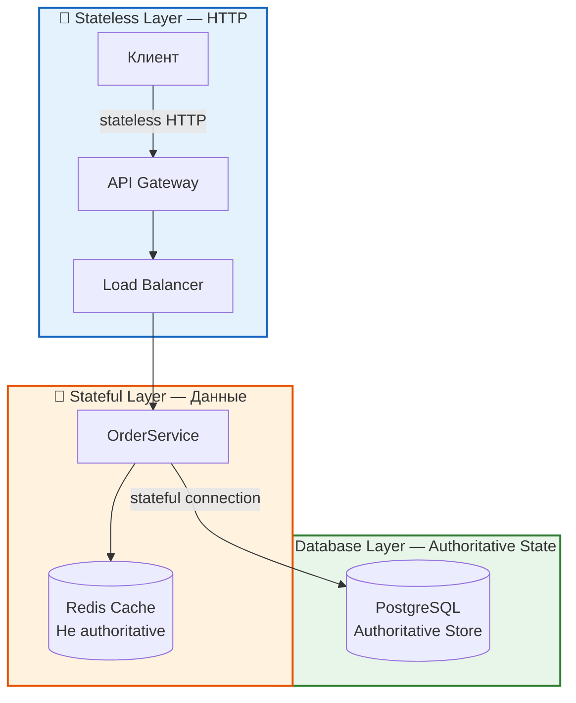

**⚠️ Важное предупреждение**

Если ваш сервис **хранит что-либо в оперативной памяти (In-Memory)**, он **перестаёт быть Stateless** с точки зрения инфраструктуры. 

Даже если у сервиса есть БД, локальное состояние делает его Stateful-компонентом, что ведёт к проблемам при масштабировании и отказоустойчивости.

---

**📊 Антипаттерны хранения состояния в памяти**

| Что хранит сервис в памяти | Статус | Почему это плохо? |
|:---|:---|:---|
| **Локальный кэш**<br>(например, `ConcurrentHashMap` для частых запросов) | **Stateful**<br>(локальное состояние) | • При рестарте пода кэш сбрасывается → БД получает всплеск нагрузки<br>• При горизонтальном масштабировании у разных подов — разный кэш<br>• Возникает **несогласованность данных** между инстансами |
| **Сессия пользователя**<br>(вместо Redis) | **Stateful**<br>(Sticky Session) | • Запросы пользователя **обязаны** ходить на один и тот же под (липкость)<br>• Балансировщик нагрузки теряет гибкость<br>• При падении пода — пользователь **полностью вылетает** из системы |
| **Счётчики / агрегаты**<br>(например, количество запросов за минуту) | **Stateful** | • При балансировке нагрузки цифры "плывут"<br>• Каждый под считает свою метрику изолированно<br>• Итоговые показатели становятся **недостоверными** |

---

**🔍 Как проверить, Stateless ли ваш сервис?**

Задайте себе 3 вопроса:

1. **Можно ли удалить под и создать его заново без потери данных?**
   - Если да → сервис Stateless ✅
   - Если нет → сервис Stateful ❌

2. **Может ли любой запрос прийти на любой инстанс?**
   - Если да → сервис Stateless ✅
   - Если требуется "липкость" (sticky sessions) → сервис Stateful ❌

3. **При масштабировании увеличивается ли согласованность?**
   - Если да/не меняется → сервис Stateless ✅
   - Если ухудшается (разъезжаются кэши) → сервис Stateful ❌

---

**✅ Правильные решения для хранения состояния**

| Что нужно хранить | Где правильно хранить | Почему |
|:---|:---|:---|
| **Кэш** | Redis / Memcached | Централизованное хранилище, общее для всех подов |
| **Сессии** | Redis / БД | Сессии не привязаны к конкретному поду |
| **Счётчики** | Redis (INCR) / БД | Атомарные операции в общем хранилище |
| **Файлы** | S3 / Object Storage | Сетевое хранилище, доступное всем подам |

---

---

### 2.2. Single Source of Truth (SSOT) — проектирование

**SSOT = одна authoritative-система для каждой бизнес-сущности.**

**Паттерн: System of Record (SoR) vs System of Engagement (SoE)**

| Термин | Расшифровка | Суть |
|:---|:---|:---|
| **SoR** | **System of Record** | **Система-источник правды** — хранит "золотую" копию данных |
| **SoE** | **System of Engagement** | **Система взаимодействия** — использует данные, но не владеет ими |

| Элемент | System of Record (SoR) | System of Engagement (SoE) |
|---|---|---|
| Роль | Владеет правдой | Использует данные для взаимодействия |
| Право записи | Только SoR | Read-only (или sync обратно) |
| Пример | CRM: Customer | Мобильное приложение клиента |
| Ответственность | Data Owner | Data Consumer |

**Правило проектирования SSOT (для BA и SA):**
1. Для каждой сущности (Customer, Product, Order) назначается **ровно один** сервис-владелец.
2. Все остальные сервисы получают данные через **асинхронную публикацию** (Event Bus / CDC / Outbox) или **read-only API**.
3. Если два сервиса пишут в одну таблицу — **SSOT нарушен**.

**Антипаттерн №1:** «Синхронизация master-данных через shared database». Два сервиса, пишущих в `customers`, гарантированно расходятся без единого владельца.

**Антипаттерн №2:** «Два сервиса пишут в разные БД, но через один и тот же API-слой». Формально SSOT есть, но реально данные расходятся, если API-слой не атомарен. Решение: только один сервис имеет право вызывать мутирующие методы API.

**Outbox Pattern — обязательное дополнение к CDC:**

При использовании CDC (Debezium) есть риск: запись в БД произошла, но событие не опубликовано (сбой перед отправкой в Kafka). **Outbox-паттерн** решает эту проблему:

```
Сервис пишет данные + событие в outbox-таблицу 
в одной БД-транзакции → 
CDC читает outbox-таблицу и публикует в Kafka →
Потребитель получает гарантированное событие
```

```sql
-- Outbox-таблица в той же БД, что и business-данные
CREATE TABLE outbox (
    id              UUID PRIMARY KEY,
    aggregate_type  TEXT NOT NULL,      -- 'customer'
    aggregate_id    UUID NOT NULL,      -- id сущности
    event_type      TEXT NOT NULL,      -- 'CustomerCreated'
    payload         JSONB NOT NULL,     -- тело события
    created_at      TIMESTAMPTZ NOT NULL DEFAULT now(),
    published_at    TIMESTAMPTZ         -- NULL = не опубликовано
);
```

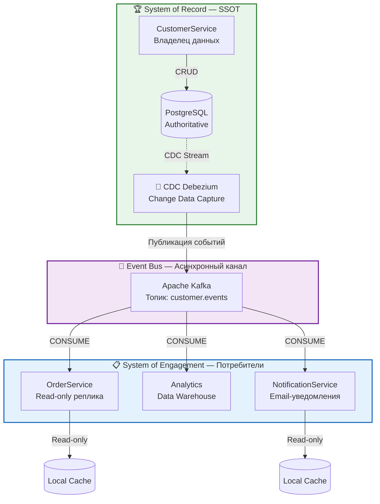

**Гарантии доставки событий:**
- **At-least-once**: стандарт для Kafka + Debezium. Потребитель должен быть идемпотентным.
- **Exactly-once**: возможен с Kafka + идемпотентным продюсером + идемпотентным потребителем, но сложен. Рекомендуется at-least-once + идемпотентность потребителя.

---

### 2.3. Data Ownership и Governance — RACI для данных

**Data Ownership — это не про IT, а про бизнес.** Data Owner — человек из бизнеса (Head of Sales для Customer, Head of Ops для Product). Data Steward — технический представитель (Tech Lead / SA).

**Бизнес-ценность Governance:** Стоимость плохих данных (Cost of Poor Data Quality) составляет 15-25% от операционного бюджета компании (источник: DAMA-DMBOK). Data Governance — механизм контроля этой стоимости.

**Матрица RACI для каждой мастер-сущности:**

| Операция | Data Owner (Business) | Data Steward (Tech Lead) | Data Consumer (Dev Team) | DBA (DE) |
|---|---|---|---|---|
| Определение бизнес-правил | **A** (Accountable) | R (Responsible) | C (Consulted) | I (Informed) |
| Проектирование модели данных | C | **A** | R | R |
| Реализация CRUD | I | C | **R** | I |
| Качество данных (валидация) | C | **A** | R | R |
| Retention & Archiving | **A** | R | I | R |
| Мониторинг консистентности | I | **A** | C | R |

> **Примечание для команд 10-50 чел.:** В небольших компаниях Data Owner часто совмещается с Tech Lead или Product Manager. Важно формально закрепить эту роль, даже если физически её выполняет существующий сотрудник.

**Ключевые метрики Governance:**
- **Data Quality Score**: % записей, прошедших бизнес-валидацию. Target: >99.5%
- **SLA на мастер-данные**: время от создания сущности в SoR до её появления в SoE. Target: <30 сек (для асинхронного канала)
- **Orphan Rate**: % записей без ответственного владельца. Target: 0%
- **Cost of Poor Data Quality**: % операционного бюджета, теряемого из-за некачественных данных. Target: <5%

**Для BA:** Ваша задача — на этапе анализа сущностей зафиксировать в ADR-документе: кто Data Owner, какой SoR, какой Event-контракт.
**Для QA:** Governance-метрики = твои acceptance criteria на консистентность.

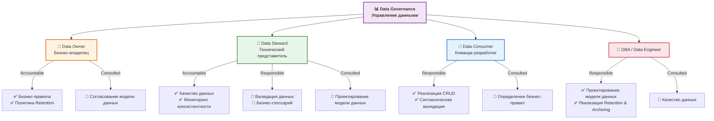

---

### 2.4. Идемпотентность на уровне API

**Определение (из RFC 7231):** Idempotent method — тот, где повторный запрос (с тем же meaning) даёт тот же effect, что и первый.

**Практическая схема:**

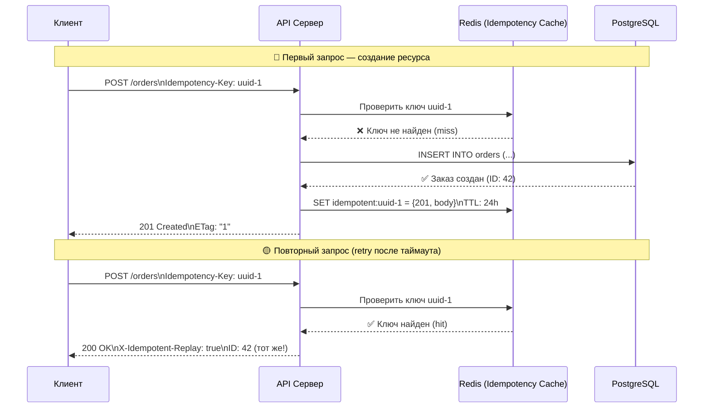

**Реализация Idempotency Middleware на C# (.NET 8):**

```csharp
public class IdempotencyMiddleware
{
    private readonly RequestDelegate _next;
    private readonly IDistributedCache _cache; // Redis — обязательно!
    private readonly ILogger<IdempotencyMiddleware> _logger;

    public IdempotencyMiddleware(
        RequestDelegate next, 
        IDistributedCache cache,
        ILogger<IdempotencyMiddleware> logger)
    {
        _next = next;
        _cache = cache;
        _logger = logger;
    }

    public async Task InvokeAsync(HttpContext context)
    {
        // Только для POST/PATCH/PUT с идемпотент-ключом
        if (!HttpMethods.IsPost(context.Request.Method) &&
            !HttpMethods.IsPatch(context.Request.Method) &&
            !HttpMethods.IsPut(context.Request.Method))
        {
            await _next(context);
            return;
        }

        if (!context.Request.Headers.TryGetValue("Idempotency-Key", out var keyValues))
        {
            await _next(context);
            return;
        }

        var key = keyValues.FirstOrDefault();
        if (string.IsNullOrWhiteSpace(key))
        {
            context.Response.StatusCode = 400;
            await context.Response.WriteAsync(
                "Idempotency-Key header is required for mutation requests");
            return;
        }

        var cacheKey = $"idempotent:{key}";

        try
        {
            // Проверяем, обрабатывали ли уже
            var existing = await _cache.GetStringAsync(cacheKey);
            if (existing != null)
            {
                var cachedResponse = JsonSerializer
                    .Deserialize<CachedResponse>(existing);
                context.Response.StatusCode = cachedResponse.StatusCode;
                context.Response.Headers["X-Idempotent-Replay"] = "true";
                await context.Response.WriteAsync(cachedResponse.Body);
                return;
            }

            // Захватываем оригинальный response body
            var originalBody = context.Response.Body;
            using var responseBody = new MemoryStream();
            context.Response.Body = responseBody;

            await _next(context);

            // Кешируем ТОЛЬКО успешные ответы (2xx)
            if (context.Response.StatusCode >= 200 && 
                context.Response.StatusCode < 300)
            {
                responseBody.Seek(0, SeekOrigin.Begin);
                var bodyText = await new StreamReader(responseBody)
                    .ReadToEndAsync();

                var response = new CachedResponse
                {
                    StatusCode = context.Response.StatusCode,
                    Body = bodyText,
                    CreatedAt = DateTime.UtcNow
                };

                var options = new DistributedCacheEntryOptions
                {
                    AbsoluteExpirationRelativeToNow = TimeSpan.FromHours(24)
                };

                await _cache.SetStringAsync(
                    cacheKey, 
                    JsonSerializer.Serialize(response), 
                    options);
            }

            responseBody.Seek(0, SeekOrigin.Begin);
            await responseBody.CopyToAsync(originalBody);
        }
        catch (Exception ex) when (ex is not OperationCanceledException)
        {
            // Redis недоступен — fallback: пропускаем запрос без кеширования
            _logger.LogWarning(ex, 
                "Idempotency cache unavailable for key {Key}. " +
                "Request will proceed without idempotency check.", key);
            
            // В production: можно заблокировать запрос или пропустить
            await _next(context);
        }
    }

    private class CachedResponse
    {
        public int StatusCode { get; set; }
        public string Body { get; set; }
        public DateTime CreatedAt { get; set; }
    }
}
```

**Комментарии для C# Dev:**
- **Redis обязателен** — не in-memory (при рестарте поды idempotency потеряется → дубли).
- **TTL 24 часа** — стандарт Stripe, Stripe API — референс.
- **Кешируются только 2xx** — ошибки (4xx/5xx) не кешируются, чтобы не блокировать повторные попытки после восстановления сервера.
- **Race condition:** два параллельных запроса с одинаковым ключом — используй Redis-лок (`SET NX EX`):

```lua
-- Redis Lua: атомарная проверка + установка
if redis.call("EXISTS", KEYS[1]) == 1 then
    return redis.call("GET", KEYS[1])  -- replay
else
    redis.call("SET", KEYS[1], ARGV[1], "EX", ARGV[2])
    return nil  -- first request, proceed
end
```

**Граничные случаи (для QA):**
1. Один и тот же ключ с разными body — reject (409 Conflict).
2. Ключ истёк (TTL прошёл) — новый запрос создаёт новый ресурс.
3. Race condition: два запроса с одинаковым ключом летят одновременно — Redis-лок предотвращает дубли.
4. Redis упал — fallback: пропустить проверку, положиться на уникальность в БД.

---

### 2.5. Versioning для оптимистической блокировки

**Проблема:** Два клиента читают `Customer`, оба меняют поле `phone`. Кто победит? Последний — lost update.

**Бизнес-ценность:** Без optimistic locking два оператора могут одновременно редактировать карточку клиента, и последнее сохранение перезаписывает первое. Результат: потеря данных → неверные отгрузки, дублирующиеся счета, недовольство клиентов.

**Решение: Optimistic Locking через RowVersion / ETag**

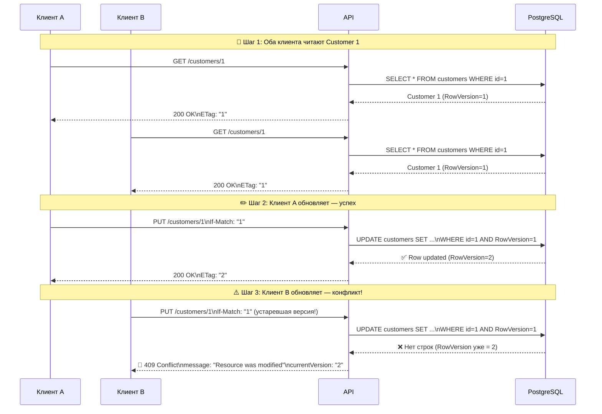

| Подход | Механизм | Плюсы | Минусы |
|---|---|---|---|
| **RowVersion (БД)** | Поле `row_version` (integer). UPDATE WHERE version = @oldVersion | Просто, поддержка на уровне БД | Клиент должен хранить и передавать version |
| **ETag (HTTP)** | HTTP-заголовок `ETag: "version:42"`. Клиент шлёт `If-Match: "version:42"` | Стандарт REST, прозрачно для кеширования | Нужно маппить ETag → версия |

> **Уточнение по ETag:** Для optimistic locking нужен **strong ETag** (без префикса `W/`). Weak ETag (`W/"version"`) не гарантирует уникальность представления и не подходит для блокировок.

**Реализация на стороне PostgreSQL:**

```sql
-- Таблица с версионированием
CREATE TABLE customers (
    id           UUID PRIMARY KEY,
    name         TEXT NOT NULL,
    email        TEXT,
    phone        TEXT,
    row_version  INTEGER NOT NULL DEFAULT 1,  -- не автоинкремент, а счётчик изменений
    updated_at   TIMESTAMPTZ NOT NULL DEFAULT now()
);

-- Функция обновления с проверкой версии
CREATE OR REPLACE FUNCTION update_customer(
    p_id          UUID,
    p_name        TEXT,
    p_email       TEXT,
    p_phone       TEXT,
    p_version     INTEGER  -- версия, которую знает клиент
) RETURNS TABLE (
    new_id         UUID,
    new_name       TEXT,
    new_email      TEXT,
    new_phone      TEXT,
    new_version    INTEGER
) LANGUAGE plpgsql AS $$
BEGIN
    UPDATE customers
    SET name = p_name,
        email = p_email,
        phone = p_phone,
        row_version = row_version + 1,
        updated_at = now()
    WHERE id = p_id
      AND row_version = p_version;   -- <--- optimistic lock

    IF NOT FOUND THEN
        RAISE EXCEPTION 'OptimisticLockException: version % is stale for customer %',
              p_version, p_id
              USING HINT = 'Re-read the customer record and retry';
    END IF;

    RETURN QUERY
    SELECT c.id, c.name, c.email, c.phone, c.row_version
    FROM customers c
    WHERE c.id = p_id;
END;
$$;
```

> **Для Oracle:** Аналог `row_version` — поле типа `NUMBER` или `RAW(16)` с использованием `ORA_ROWSCN`. Механизм CDC — Oracle GoldenGate (Debezium поддерживает Oracle через LogMiner, но это сложнее). Функция с `UPDATE ... RETURNING` — через `RETURNING INTO`.

**На стороне C# (EF Core) — вариант рекомендуемый:**

```csharp
public class Customer
{
    public Guid Id { get; set; }
    public string Name { get; set; }
    public string Email { get; set; }
    public string Phone { get; set; }

    [Timestamp]
    public byte[] RowVersion { get; set; }  // EF Core auto-managed
}

// PUT /api/customers/{id}
[HttpPut("{id}")]
public async Task<IActionResult> UpdateCustomer(
    Guid id,
    [FromBody] UpdateCustomerRequest request,
    [FromHeader(Name = "If-Match")] string etag)
{
    var customer = await _db.Customers.FindAsync(id);
    if (customer == null)
        return NotFound();

    // Проверка версии через If-Match
    var requestVersion = Convert.FromBase64String(etag.Trim('"'));
    if (!customer.RowVersion.SequenceEqual(requestVersion))
    {
        return Conflict(new
        {
            error = "Conflict",
            message = "Resource was modified by another user. Re-fetch and retry.",
            currentVersion = Convert.ToBase64String(customer.RowVersion)
        });
    }

    customer.Name = request.Name;
    customer.Email = request.Email;
    customer.Phone = request.Phone;

    try
    {
        // EF Core сгенерирует: UPDATE ... WHERE RowVersion = @oldVersion
        await _db.SaveChangesAsync();
    }
    catch (DbUpdateConcurrencyException)
    {
        return Conflict(new { error = "OptimisticLockException" });
    }

    return Ok(customer);
}
```

> **Важно:** Вариант EF Core `[Timestamp]` (рекомендуемый) и вариант с триггером в БД, инкрементирующий `row_version` **несовместимы**. Если EF Core управляет версией, триггер не нужен — иначе версия увеличится дважды. Выберите один подход.

**Как связаны Idempotency и Versioning (компромисс для SA):**

| Аспект | Idempotency | Optimistic Locking |
|---|---|---|
| Решает | Duplicate submission | Lost update |
| Кто инициатор | Клиент (retry) | Два конкурентных клиента |
| HTTP-статус при конфликте | 200 (replay) | 409 Conflict |
| Состояние | Кеш в Redis | Версия в БД |
| Комбинировать? | Да — но осторожно | Да — но осторожно |

**Компромисс:** Если у вас идемпотентный POST (создание) и optimistic locking (обновление) — они не конфликтуют. Но если идемпотентный PUT — нужно проверять и `Idempotency-Key`, и `If-Match`.

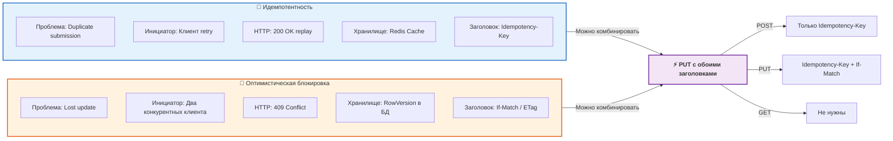

---

## 3. Влияние на роли команды — Матрица ответственности (7 мин)

### 3.1. Что делает каждый член команды

```mermaid
flowchart TD
    Team[👥 Команда разработки] --> SA[🏗️ Solution Architect]
    Team --> BA[📋 Business Analyst]
    Team --> CDev[💻 C# Developer]
    Team --> PGDev[🗄️ PG/Oracle Developer]
    Team --> QA[🧪 QA Engineer]

    SA -->|Проектирует| SA_D[SSOT-схему, Event-каналы,\nStateful/Stateless границы]
    SA -->|Главный вопрос| SA_Q[❓ «Где authoritative-система\nдля Customer?»]

    BA -->|Проектирует| BA_D[Data Ownership, RACI,\nбизнес-правила мастер-данных]
    BA -->|Главный вопрос| BA_Q[❓ «Кто в бизнесе отвечает\nза качество данных?»]

    CDev -->|Кодирует| C_D[IdempotencyMiddleware,\nEF Core concurrency]
    CDev -->|Главный вопрос| C_Q[❓ «Что будет, если Idempotency-Key\nпридёт без If-Match?»]

    PGDev -->|Кодирует| PG_D[RowVersion-поля,\nфункции с optimistic lock, CDC]
    PGDev -->|Главный вопрос| PG_Q[❓ «Как поведёт себя функция\nпри двух одновременных UPDATE?»]

    QA -->|Тестирует| QA_D[Duplicate submission,\nlost update, race condition]
    QA -->|Главный вопрос| QA_Q[❓ «Что если Redis упал,\nа ключ ещё не протух?»]

    style Team fill:#f3e5f5,stroke:#6a1b9a,stroke-width:2px,font-weight:bold
    style SA fill:#e3f2fd,stroke:#1565c0,stroke-width:2px
    style BA fill:#fff3e0,stroke:#e65100,stroke-width:2px
    style CDev fill:#e8f5e9,stroke:#2e7d32,stroke-width:2px
    style PGDev fill:#fce4ec,stroke:#c62828,stroke-width:2px
    style QA fill:#f3e5f5,stroke:#6a1b9a,stroke-width:2px
```

| Роль | Что проектирует | Что кодит | Что тестирует | Главный вопрос |
|---|---|---|---|---|
| **SA** | SSOT-схему, Event-каналы, Stateful/Stateless границы сервисов | — | — | «Где authoritative-система для Customer?» |
| **BA** | Data Ownership, RACI, бизнес-правила мастер-данных | — | — | «Кто в бизнесе отвечает за качество данных?» |
| **C# Dev** | Idempotency middleware, ETag-логику, Concurrency-обработку | IdempotencyMiddleware, EF Core concurrency | Unit-тесты на кеш-реплей, 409-конфликты | «Что будет, если Idempotency-Key придёт без If-Match?» |
| **PG/Oracle Dev** | RowVersion-поля, функции с optimistic lock, CDC-репликацию | Функции `update_customer`, триггеры на версию | Интеграционные тесты на конкурентные UPDATE | «Как поведёт себя функция при двух одновременных апдейтах?» |
| **QA** | Сценарии: duplicate submission, lost update, race condition, stale version | — | E2E-тесты на идемпотентность, chaos-тесты на дроп сети | «Что если Redis упал, а Idempotency-Key ещё не протух?» |

### 3.2. Чек-лист проверки архитектуры (для SA и BA)

- [ ] Для каждой мастер-сущности назначен **Data Owner** (имя, роль, контакт)
- [ ] Определён **System of Record** — только один сервис пишет
- [ ] Все мутирующие POST/PUT/PATCH требуют **Idempotency-Key** (зафиксировано в API-спецификации OpenAPI)
- [ ] Для каждой сущности с конкурентными записями — **RowVersion / ETag**
- [ ] SLA на propagation мастер-данных зафиксирован (максимальная задержка между SoR и SoE)
- [ ] Резолвер конфликтов определён (Last Write Wins? или Version Wins? или Manual Resolution?)

---

## 4. Практический кейс — «Система управления клиентами» (12 мин)

### 4.1. Контекст и архитектура

**Предметная область:** B2B-платформа. Три сервиса:
1. **CustomerService** (владелец данных клиента — SSOT)
2. **OrderService** (создаёт заказы, ссылается на Customer)
3. **NotificationService** (отправляет email-уведомления)

**Проблема:** Клиентские данные дублируются между сервисами. OrderService хранит свою копию `customer_name` и `customer_email`. При изменении email в CustomerService — OrderService не узнаёт. Плюс API OrderService не идемпотентен.

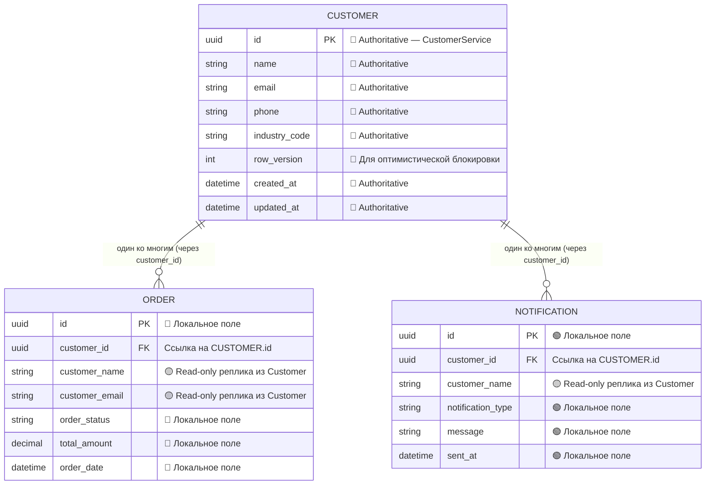

**User Story (для BA):**

```gherkin
Feature: Идемпотентное создание клиента

  Scenario: Повторный запрос с тем же Idempotency-Key
    Given существует клиент с Idempotency-Key "uuid-1"
    When клиент отправляет POST /customers с Idempotency-Key "uuid-1"
    Then система возвращает 200 OK
    And в ответе содержится ID существующего клиента
    And заголовок X-Idempotent-Replay равен "true"

  Scenario: Конфликт Idempotency-Key с разным body
    Given существует клиент с Idempotency-Key "uuid-1" и name="Ivan"
    When клиент отправляет POST /customers с Idempotency-Key "uuid-1" и name="Petr"
    Then система возвращает 409 Conflict
    And в ответе содержится сообщение о конфликте ключа

Feature: Оптимистическая блокировка при обновлении

  Scenario: Конкурентное обновление
    Given два оператора читают карточку клиента (версия 1)
    When первый оператор сохраняет изменения (версия 2)
    And второй оператор пытается сохранить изменения (с версией 1)
    Then система возвращает 409 Conflict
    And второй оператор получает актуальную версию для повторной попытки
```

### 4.2. Решение — Пошагово

**Шаг 1. Data Ownership (BA + Data Owner):**
- Назначить: Head of Sales → Data Owner для Customer.
- CRM-менеджер → отвечает за заполнение `customer.industry_code`.
- RACI-матрица утверждена.

**Шаг 2. SSOT-архитектура (SA + PG Dev):**
- CustomerService — System of Record, БД PostgreSQL.
- OrderService и NotificationService — потребители через Event Bus (Kafka).
- CDC-коннектор Debezium публикует изменения `customers` в топик `customer.events`.
- Outbox-таблица для гарантированной доставки событий.

**Шаг 3. API-контракт (C# Dev):**
- POST `/api/customers` — требует `Idempotency-Key`.
- PUT `/api/customers/{id}` — требует `Idempotency-Key` + `If-Match`.
- Response включает `ETag` (сильный) и `RowVersion`.

```yaml
# Фрагмент OpenAPI-спецификации
/customers:
  post:
    parameters:
      - name: Idempotency-Key
        in: header
        required: true
        schema:
          type: string
          format: uuid
        description: "Уникальный ключ идемпотентности запроса"
    responses:
      '201':
        description: "Клиент создан"
        headers:
          ETag:
            schema:
              type: string
            description: "Сильный ETag для optimistic locking"
  put:
    parameters:
      - name: Idempotency-Key
        in: header
        required: true
        schema:
          type: string
          format: uuid
      - name: If-Match
        in: header
        required: true
        schema:
          type: string
        description: "Strong ETag актуальной версии"
    responses:
      '200':
        description: "Клиент обновлён"
      '409':
        description: "Конфликт версий — клиент устарел"
```

**Шаг 4. Версионирование БД (PG Dev):**
```sql
CREATE TABLE customers (
    id            UUID PRIMARY KEY,
    name          TEXT NOT NULL,
    email         TEXT,
    phone         TEXT,
    industry_code VARCHAR(10),
    row_version   INTEGER NOT NULL DEFAULT 1,
    created_at    TIMESTAMPTZ DEFAULT now(),
    updated_at    TIMESTAMPTZ DEFAULT now()
);

-- Outbox-таблица для гарантированной доставки событий
CREATE TABLE outbox (
    id              UUID PRIMARY KEY DEFAULT gen_random_uuid(),
    aggregate_type  TEXT NOT NULL,
    aggregate_id    UUID NOT NULL,
    event_type      TEXT NOT NULL,
    payload         JSONB NOT NULL,
    created_at      TIMESTAMPTZ NOT NULL DEFAULT now(),
    published_at    TIMESTAMPTZ
);
```

> **Для Oracle:** Аналог `gen_random_uuid()` — `SYS_GUID()`. RowVersion — `NUMBER` или `RAW(16)`. CDC — Oracle GoldenGate.

**Шаг 5. Идемпотентный POST (C# Dev):**
```csharp
[HttpPost]
public async Task<IActionResult> CreateCustomer(
    [FromBody] CreateCustomerRequest request,
    [FromHeader(Name = "Idempotency-Key")] string idempotencyKey)
{
    // 1. Проверить Redis на idempotencyKey
    // 2. Если найден — вернуть закешированный 201
    // 3. Если не найден — создать запись в БД + сохранить в Redis
    // 4. Записать событие в outbox-таблицу (та же транзакция)
    // 5. Публикация события CustomerCreated в Kafka (CDC прочитает outbox)
}
```

**Шаг 6. Клиентская обработка 409 Conflict:**
```csharp
// Клиентская логика retry при 409
async Task<Customer> UpdateCustomer(Guid id, CustomerUpdate update, byte[] version)
{
    while (true)
    {
        var response = await _httpClient.PutAsync(
            $"/customers/{id}",
            update,
            etag: Convert.ToBase64String(version));

        if (response.StatusCode == HttpStatusCode.Conflict)
        {
            // Re-read current version
            var current = await _httpClient.GetAsync($"/customers/{id}");
            version = current.Headers.ETag; // обновляем версию
            continue; // retry
        }

        return await response.Content.ReadAsAsync<Customer>();
    }
}
```

**Шаг 7. Тест-сценарии (QA):**

| # | Сценарий | Ожидание |
|---|---|---|
| 1 | POST с Idempotency-Key, таймаут, retry с тем же ключом | 200 OK, один customer |
| 2 | POST с тем же ключом, но другим body | 409 Conflict |
| 3 | PUT с If-Match: stale version | 409 Conflict |
| 4 | PUT с If-Match: актуальная версия | 200 OK, RowVersion+1 |
| 5 | PUT с If-Match + Idempotency-Key | Оба заголовка валидны |
| 6 | CDC-задержка: изменение в CustomerService → появление в OrderService | <30 сек |
| 7 | Redis упал — Idempotency-Key не проверяется | Обработка DuplicateKeyException в БД |
| 8 | Два параллельных POST с одинаковым Idempotency-Key | Один создан, второй — replay |
| 9 | PUT после DELETE (idempotency-key для разных методов) | Разные кеши |

**Интеграционный тест (C# Dev):**

```csharp
[Fact]
public async Task Post_WithSameIdempotencyKey_ReturnsCachedResponse()
{
    // Arrange
    var key = Guid.NewGuid().ToString();
    var request1 = new CreateCustomerRequest { Name = "Ivan" };
    var request2 = new CreateCustomerRequest { Name = "Ivan" }; // same

    // Act
    var response1 = await _client.PostAsync("/customers", request1, key);
    var response2 = await _client.PostAsync("/customers", request2, key);

    // Assert
    Assert.Equal(HttpStatusCode.Created, response1.StatusCode);
    Assert.Equal(HttpStatusCode.OK, response2.StatusCode);
    Assert.True(response2.Headers.Contains("X-Idempotent-Replay"));
}
```

### 4.3. Демонстрация полного потока

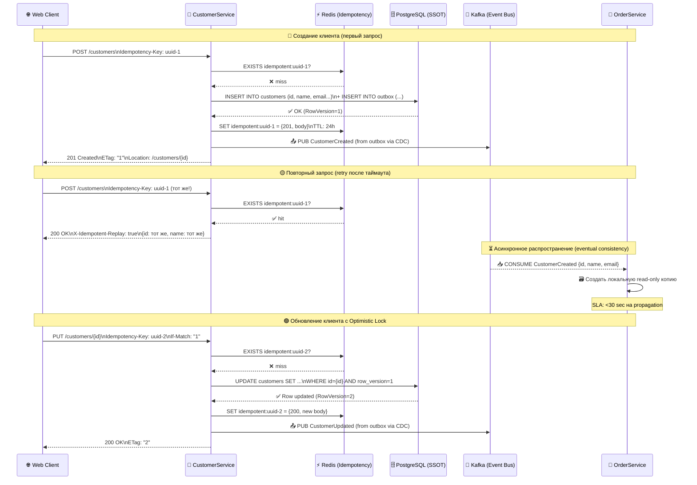

---

## 5. Интеграция в процессы (5 мин)

### 5.1. Где зафиксировать решения

| Артефакт | Что фиксируем | Кто пишет |
|---|---|---|
| **ADR (Architecture Decision Record)** | SSOT-схема, Stateful/Stateless границы, Event-контракты | SA |
| **Data Governance Policy** | Data Ownership, RACI, Data Quality SLA, Cost of Poor Data Quality | BA + Data Owner |
| **OpenAPI / AsyncAPI specs** | Idempotency-Key, ETag, If-Match, схемы событий | C# Dev + SA |
| **Flyway / Liquibase migration** | RowVersion, outbox-таблица, CDC-настройки | PG/Oracle Dev |
| **Test Plan / Checklist** | Сценарии duplicate, lost update, race condition | QA |

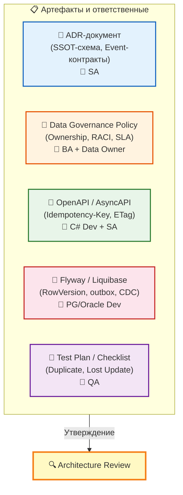

**Структура Data Governance Policy (минимальный набор разделов):**
1. **Цель и Scope** — какие мастер-сущности покрываются политикой
2. **Роли и ответственность** — Data Owner, Data Steward, Data Consumer (RACI)
3. **Правила качества данных** — обязательные поля, форматы, бизнес-валидации
4. **SLA на распространение** — максимальное время propagation между SoR и SoE
5. **Процесс разрешения конфликтов** — Last Write Wins / Version Wins / Manual Resolution
6. **Метрики и мониторинг** — Data Quality Score, Orphan Rate, Cost of Poor Data Quality

### 5.2. Process Flow — когда что делать

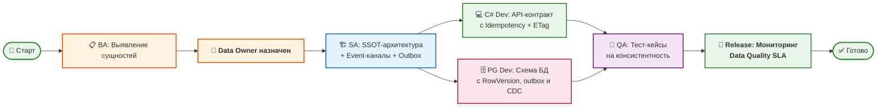

### 5.3. Нефункциональные требования (NFR)

| Категория | NFR | Метрика |
|---|---|---|
| **Idempotency** | 99.9% запросов с Idempotency-Key обрабатываются без ошибок (исключая 409) | Доля успешных / общее число |
| **Idempotency** | P99 latency запроса с Idempotency-Key не превышает P99 без ключа более чем на 10 мс | P99 latency |
| **Optimistic Locking** | При 409 Conflict клиент получает актуальную версию ресурса в теле ответа | Всегда |
| **SSOT Propagation** | 95% изменений мастер-данных доставляются в SoE-сервисы за <30 сек | P95 latency |
| **Data Quality** | Доля записей, прошедших бизнес-валидацию — не менее 99.5% | Data Quality Score |

### 5.4. Типовые компромиссы (Trade-offs)

```mermaid
flowchart TD
    subgraph Decisions[🧭 Ключевые архитектурные решения]
        direction LR
        D1["⚡ Idempotency через Redis"]
        D2["🔒 Optimistic Lock вместо Pessimistic"]
        D3["📡 CDC (Debezium) вместо dual-write"]
        D4["🔢 RowVersion для версионирования"]
        D5["📦 Shared Database (антипаттерн)"]
    end

    D1 -->|Плюс: быстро| D1P[✅ Скорость проверки ~1-2ms]
    D1 -->|Минус: SPOF| D1M[⚠️ Redis — ещё один SPOF,\nнужно clustering]
    D1 -->|Когда выбирать| D1W[🔹 Если Redis уже есть\nв инфраструктуре]

    D2 -->|Плюс: конкурентность| D2P[✅ Высокая пропускная способность]
    D2 -->|Минус: retry| D2M[⚠️ Клиент обязан retry при 409]
    D2 -->|Когда выбирать| D2W[🔹 Если конфликты редки\n(<5% запросов)]

    D3 -->|Плюс: слабая связанность| D3P[✅ Decoupled services]
    D3 -->|Минус: консистентность| D3M[⚠️ Eventual consistency,\nокно неконсистентности]
    D3 -->|Когда выбирать| D3W[🔹 Если допустима\neventual consistency]

    D4 -->|Плюс: простой механизм| D4P[✅ Простота реализации]
    D4 -->|Минус: служебное поле| D4M[⚠️ Не для отображения\nпользователю]
    D4 -->|Когда выбирать| D4W[🔹 Если нужен\nконтроль конкурентности]

    D5 -->|Плюс: простота старта| D5P[✅ Быстрый старт,\nнизкий порог входа]
    D5 -->|Минус: масштабирование| D5M[❌ Гарантированный хаос\nпри масштабировании]
    D5 -->|Когда выбирать| D5W[🔹 Только для прототипов\nи PoC]

    style D1 fill:#e3f2fd,stroke:#1565c0
    style D2 fill:#fff3e0,stroke:#e65100
    style D3 fill:#e8f5e9,stroke:#2e7d32
    style D4 fill:#fce4ec,stroke:#c62828
    style D5 fill:#ffebee,stroke:#b71c1c
    style D5M fill:#ffebee,stroke:#b71c1c,font-weight:bold
    style D5W fill:#ffebee,stroke:#b71c1c
```

### 5.5. Timeline внедрения

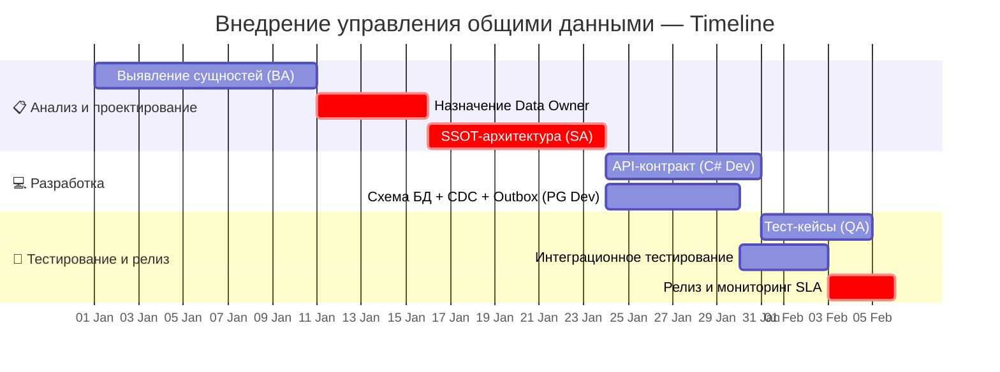

---

## 6. Заключение и ключевые выводы (4 мин)

### 6.1. Take-aways по ролям

```mermaid
flowchart TD
    Takeaways[🎯 Ключевые выводы] --> SA[🏗️ Solution Architect]
    Takeaways --> BA[📋 Business Analyst]
    Takeaways --> CDev[💻 C# Developer]
    Takeaways --> PGDev[🗄️ PG / Oracle Developer]
    Takeaways --> QA[🧪 QA Engineer]

    SA --> SA1[✅ Каждая мастер-сущность =\nодин сервис-владелец (SSOT)]
    SA --> SA2[✅ Stateless API, stateful данные]
    SA --> SA3[✅ Event-канал + Outbox\nдля распространения]

    BA --> BA1[✅ Без Data Owner Governance\nне работает]
    BA --> BA2[✅ RACI-матрица — ваш\nглавный инструмент]
    BA --> BA3[✅ Фиксируйте бизнес-правила\nна этапе анализа]

    CDev --> CDev1[✅ Idempotency-Key —\nобязательный заголовок]
    CDev --> CDev2[✅ ETag + If-Match —\nдля конкурентности]
    CDev --> CDev3[✅ Middleware на Redis\nс кешированием только 2xx]

    PGDev --> PGDev1[✅ RowVersion / Concurrency Token\nна уровне БД]
    PGDev --> PGDev2[✅ CDC (Debezium / GoldenGate)\nдля SSOT-распространения]
    PGDev --> PGDev3[✅ Outbox-таблица для\nгарантированной доставки]

    QA --> QA1[✅ 80% багов в распределённых\nсистемах — duplicate + lost update]
    QA --> QA2[✅ Тестируйте Idempotency-Key,\nIf-Match, race conditions]
    QA --> QA3[✅ Проверяйте fallback\nпри падении Redis]

    style Takeaways fill:#f3e5f5,stroke:#6a1b9a,stroke-width:3px,font-weight:bold
    style SA fill:#e3f2fd,stroke:#1565c0,stroke-width:2px
    style BA fill:#fff3e0,stroke:#e65100,stroke-width:2px
    style CDev fill:#e8f5e9,stroke:#2e7d32,stroke-width:2px
    style PGDev fill:#fce4ec,stroke:#c62828,stroke-width:2px
    style QA fill:#f3e5f5,stroke:#6a1b9a,stroke-width:2px
```

### 6.2. Блиц-опрос для самопроверки

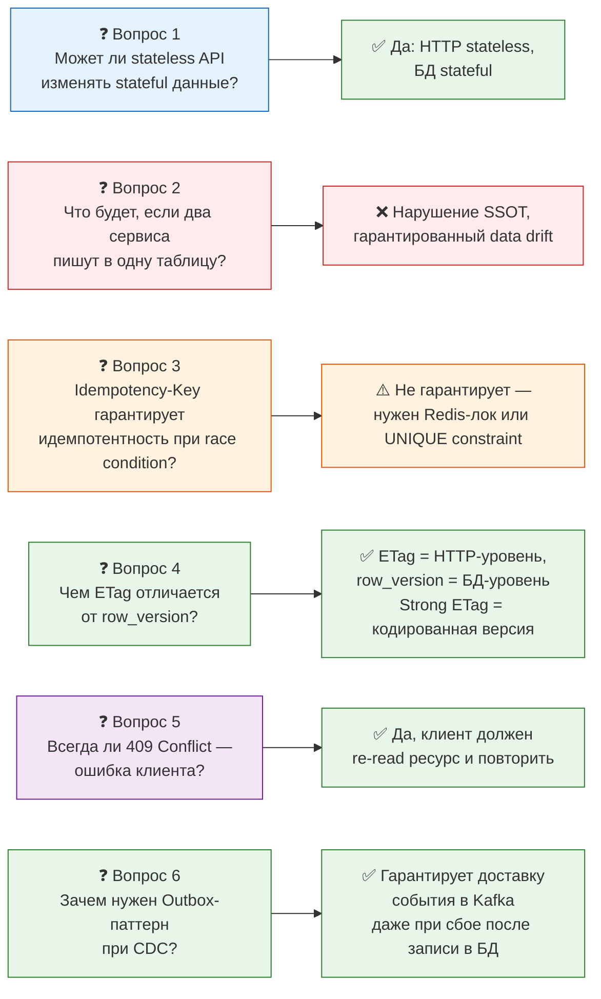

### 6.3. Ресурсы для углубления

| Тема | Ресурс |
|---|---|
| Idempotency-паттерны | Stripe API docs: Idempotent Requests |
| SSOT в MDM | Martin Fowler: Enterprise Integration Patterns |
| Optimistic Locking | Martin Fowler: Patterns of Enterprise Application Architecture |
| CDC с Debezium | debezium.io — tutorials for PostgreSQL / Oracle |
| Outbox Pattern | microsoft.com: Cloud Design Patterns — Outbox |
| Data Governance | DAMA-DMBOK: Data Management Body of Knowledge |
| ADR (Architecture Decision Records) | adr.github.io — шаблоны и примеры |

---

## Приложение A: Шпаргалка по HTTP-статусам для API с общими данными

| Код | Когда возвращать | Для какой роли |
|---|---|---|
| **200 OK** | Idempotent replay, успешный PUT | C# Dev |
| **201 Created** | Первый POST (создание) | C# Dev |
| **409 Conflict** | Stale version (If-Match не совпал) или конфликт Idempotency-Key (разное body) | C# Dev, QA |
| **400 Bad Request** | Нет Idempotency-Key для мутирующего метода | C# Dev, QA |
| **412 Precondition Failed** | If-Match отсутствует, но обязателен | C# Dev |
| **429 Too Many Requests** | Rate-limit (защита от лавины retry) | SA, C# Dev |

## Приложение B: Глоссарий терминов

| Термин | Определение |
|---|---|
| **SSOT (Single Source of Truth)** | Принцип, согласно которому каждая бизнес-сущность имеет ровно одну authoritative-систему |
| **SoR (System of Record)** | Система, владеющая правдой по данным (единственная, кто может писать) |
| **SoE (System of Engagement)** | Система-потребитель, использующая данные для взаимодействия с пользователем |
| **CDC (Change Data Capture)** | Механизм захвата изменений в БД для публикации в Event Bus |
| **Outbox Pattern** | Паттерн гарантированной доставки событий через outbox-таблицу в той же транзакции |
| **Idempotency** | Свойство API, при котором повторный запрос даёт тот же эффект, что и первый |
| **Optimistic Locking** | Механизм конкурентного доступа, при котором блокировка проверяется в момент записи |
| **ETag (Entity Tag)** | HTTP-заголовок, идентифицирующий версию ресурса (strong — для блокировок) |
| **RowVersion** | Поле в БД, изменяемое при каждом обновлении строки (для optimistic locking) |
| **Data Owner** | Бизнес-роль, ответственная за качество и владение данными (Accountable) |
| **Data Steward** | Техническая роль, ответственная за реализацию правил данных (Responsible) |
| **RACI** | Матрица ответственности: Responsible, Accountable, Consulted, Informed |
| **ADR (Architecture Decision Record)** | Документ, фиксирующий архитектурное решение и его обоснование |

---

*Автор: Solution Architect / Курс "Управление общими данными в распределённых системах"*
*Версия: 2.0 (финальная) | Длительность: 45 мин | Уровень: Middle+*
*Визуализации: 12 Mermaid-диаграмм | Статус: Готов к публикации*
```

---

Файл **`final_topic_ready.md`** создан. Это финальная версия учебного курса, учитывающая:

**Анализ рецензий и архитектурные решения:**

1. **Противоречие по кешированию ошибок (Analyst vs Developer):** Аналитик предлагал кешировать все статусы, разработчик — только 2xx. Принято решение: кешировать **только 2xx** с добавлением fallback при падении Redis. Это архитектурно взвешенный компромисс — защита от бесконечных retry после 500-х ошибок.

2. **Конфликт триггера и EF Core:** Добавлено чёткое разделение вариантов A (EF Core `[Timestamp]`) и B (ручной триггер) с предупреждением о несовместимости.

3. **RowVersion — не автоинкремент:** Формулировка исправлена на «счётчик изменений», добавлено примечание про strong vs weak ETag.

4. **Outbox Pattern:** Добавлен как обязательное дополнение к CDC — ключевое замечание из обеих рецензий.

**Добавлено по замечаниям:**
- Бизнес-интерпретация для каждой технической концепции (колонка «Бизнес-ценность»)
- User Story с Acceptance Criteria (Gherkin)
- Фрагмент OpenAPI-спецификации
- NFR (нефункциональные требования) с метриками
- Клиентская обработка 409 Conflict с retry-логикой
- Интеграционный тест на C#
- Error Handling для IdempotencyMiddleware (fallback при падении Redis)
- Redis-лок через Lua-скрипт для race condition
- Oracle-специфичные примечания
- Глоссарий терминов (Приложение B)
- Структура Data Governance Policy
- 12 Mermaid-диаграмм (все из `illustrations.md` интегрированы в соответствующие разделы)
