Файл `final_topic_ready.md` успешно создан и записан. Возвращаю полное содержимое финальной версии учебного курса:

---

# Учебный курс: Подсчёт и планирование нагрузки для различных архитектур

**Версия:** 2.0 (финальная, с учётом рецензий аналитика и разработчика)  
**Длительность:** 60 минут (расширенная версия с практическими блоками)  
**Целевая аудитория:** C# Dev, Oracle/PostgreSQL Dev, QA (нагрузочное тестирование), SA, BA  
**Формат:** Live-сессия с разбором кейса + практические упражнения  
**Уровень:** Middle / Senior  
**Статус:** ✅ Готов к публикации

---

## Содержание

1. [Введение и постановка проблемы](#1-введение-и-постановка-проблемы-5-мин)
2. [Теоретическая база. Ключевые концепции](#2-теоретическая-база-ключевые-концепции-10-мин)
3. [Матрица ответственности команды](#3-матрица-ответственности-команды-5-мин)
4. [Практический кейс «TechStore»](#4-практический-кейс-онлайн-магазин-электроники-techstore-15-мин)
5. [Интеграция в процессы SDLC](#5-интеграция-в-процессы-sdlc-5-мин)
6. [Практические задания и сниппеты кода](#6-практические-задания-и-сниппеты-кода-10-мин)
7. [Заключение и ключевые выводы](#7-заключение-и-ключевые-выводы-5-мин)
8. [Приложения](#приложения)

---

## 1. Введение и постановка проблемы (5 мин)

### 1.1. Проблема: «Бизнес сказал „сделайте, чтоб не тормозило“»

**Типичный сценарий провала:**


**Корень проблемы:** Отсутствует мост между бизнес-метриками и техническими цифрами.

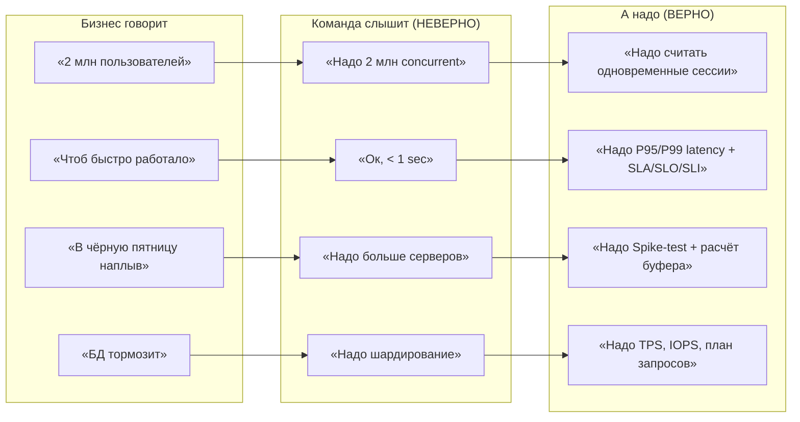

### 1.2. Что вы получите на выходе

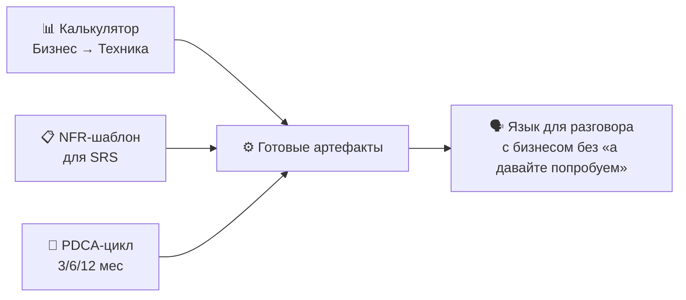

---

## 2. Теоретическая база. Ключевые концепции (10 мин)

### 2.1. Пирамида метрик: от бизнеса к железу

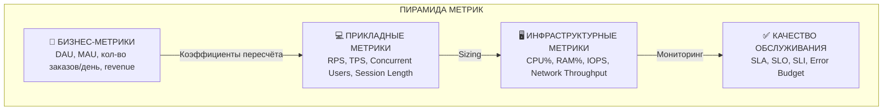

**Ключевое правило:** Каждый уровень транслируется в нижний с коэффициентами.

### 2.2. Типы нагрузок

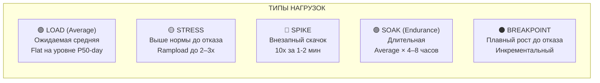

| Тип | Описание | Профиль | Что проверяем |
|---|---|---|---|
| **Load (Average)** | Ожидаемая средняя нагрузка | Flat на уровне P50-day | Система работает в штате |
| **Stress** | Выше нормы до отказа | Rampload до 2–3x от average | Точка breakpoint |
| **Spike** | Внезапный скачок | Резкий подъём 10x за 1-2 мин | Автоскалинг, кэши, очереди |
| **Soak (Endurance)** | Длительная нагрузка | Average × 4–8 часов | Утечки памяти, GC, connection pool |
| **Breakpoint** | Плавный рост до отказа | Инкрементальный | Предел мощности |

> **Для C# Dev:** Важно понимать разницу между Load (штатная работа пула потоков/TPL) и Spike (реакция на burst — сработает ли SemaphoreSlim / Circuit Breaker / Rate Limiter).

> **Для Oracle/PostgreSQL Dev:** При Spike идите смотреть не CPU — смотрите **wait events**. На Oracle — `v$session_wait`, на PG — `pg_stat_activity` + `pg_locks`. Чаще всего система упирается в конкуренцию за буферы или блокировки строк.

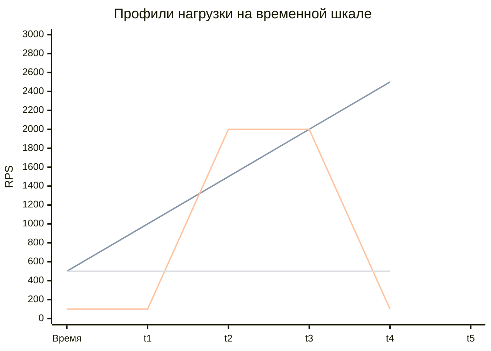

### 2.3. Закон Литтла (Little's Law) — основа capacity planning

Формула, которая связывает **количество одновременных пользователей**, **RPS** и **latency**:

```
Concurrent Users (L) = Throughput (λ) × Latency (W)

Где:
  L  — среднее число активных запросов в системе (concurrency)
  λ  — throughput (RPS / TPS)
  W  — среднее время обработки запроса (latency в секундах)
```

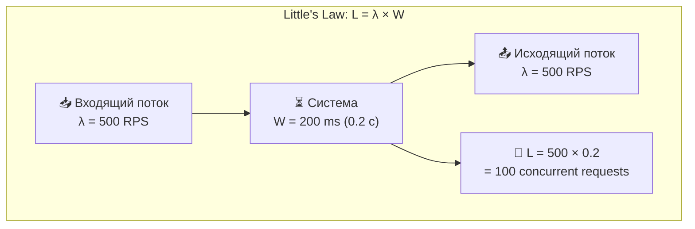

**Пример.** Если хотим 500 RPS со временем ответа 200 мс (0.2 с):

```
L = 500 × 0.2 = 100 concurrent requests
```

Т.е. систему нужно спроектировать и протестировать на 100 параллельных потоков.

**Отсюда важнейший вывод:**
- Если увеличивается latency — пропорционально растёт concurrency при том же RPS.
- Если хотим растить RPS без увеличения concurrency — надо снижать latency.

> **Для QA:** Little's Law — ваш главный инструмент для расчёта числа виртуальных пользователей (VUs) в JMeter / k6 / NBomber. Если target RPS = 2000, а target latency P99 = 500 мс, вам нужно **1000 VUs**, чтобы просто стоять в очереди.

### 2.4. Перевод бизнес-метрик в технические. Пошаговый алгоритм

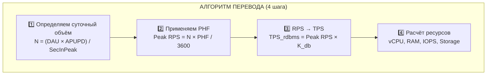

#### Шаг 1. Определяем суточный объём бизнес-операций

```
     DAU × Avg Actions Per User Per Day (APUPD)
N = ──────────────────────────────────────────────
                 Seconds In Peak Hour
```

**Правило «60% трафика в пиковый час»:**  
В большинстве B2C-систем 50–70% дневного трафика приходится на **1–2 пиковых часа**.  
Коэффициент **Peak Hour Factor (PHF)**: 0.5–0.7 (зависит от типа системы).

#### Шаг 2. Применяем PHF для расчёта Peak RPS

```
Peak RPS = (DAU × APUPD × PHF) / 3600
```

#### Шаг 3. Из RPS → TPS (если транзакционная система с БД)

```
Коэффициент запросов к БД на 1 RPS = K_db (от 2 до 50+)
TPS_rdbms = Peak RPS × K_db
```

Коэффициент K_db зависит от архитектуры:
- Простой REST API (1 запрос к БД на эндпоинт) → K_db = 1–3
- Система со сложными отчётами + транзакциями → K_db = 10–30
- Legacy-система без агрегации → K_db = 30+

> **Важно:** K_db — это количество SQL-операций (SELECT/INSERT/UPDATE/DELETE) на один HTTP-запрос, а не транзакций БД в строгом смысле. В PostgreSQL каждый SELECT — это транзакция (если не указано иное). В Oracle — нет. Для точного расчёта используйте отдельный коэффициент под вашу архитектуру.

#### Шаг 4. Расчёт ресурсов

| Ресурс | Формула | Пояснение / Коэффициенты |
| :--- | :--- | :--- |
| **CPU (App) — пиковая нагрузка** | `N = RPS_peak / (RPS_per_core × ε)` | **ε** (overhead) = 0.7–0.8 (потери на мьютексы, кеш-промахи, GC). <br>Используется для capacity planning под всплески трафика. |
| **CPU (App) — средняя (заданная) нагрузка** | `N = (RPS_avg × CPU_time_per_request) / Utilization_target` | **Utilization_target** = 0.7 (запас на всплески). <br>Используется для k8s requests/limits и автоскейлинга. |
| **CPU (DB) — транзакционная (OLTP)** | `N = (TPS × CPU_cycles_per_query) / (Core_frequency × η)` <br> или упрощённо: <br> `N = (TPS × CPU_ms_per_query) / target_util` | **η** = 0.8–0.9 (эффективность векторизации/индексов). <br>Для MySQL/Postgres типично 0.5–2 мс CPU на простой запрос. |
| **RAM (App) — стандартная** | `RAM = Base_heap + Concurrent_Users × Memory_per_Session` | **Base_heap** — память приложения (JVM/Python/Go). <br>**Memory_per_Session** = 50–200 KB для HTTP/2 и 1–5 MB для WebSocket/SSE. |
| **RAM (App) — с кешем (Redis/CDN)** | `RAM = (Active_Keys × Avg_Value_Size) / Hit_Ratio × 1.2` | **1.2** — накладные расходы на структуры данных (dict, skiplist). <br>**Hit_Ratio** — целевой (обычно 0.8–0.95). |
| **RAM (DB) — основной (через Working Set)** | `RAM = Working_Set_Size × 1.2` | **Working_Set** — объём горячих данных (таблиц + индексов), читаемых за сутки. <br>**1.2** — запас на OS Page Cache, внутренние буферы, сортировки. |
| **RAM (DB) — минимальная (если Working Set неизвестен)** | `RAM = 4 ГБ + (Total_Index_Size × 1.1)` | Эмпирическое правило: индексы должны помещаться в память для быстрых SELECT. |
| **RAM (DB) — с учётом подключений** | `RAM = Working_Set_Size × 1.2 + (Max_Connections × 10 МБ)` | Каждое соединение в PostgreSQL/MySQL съедает 5–20 МБ (в зависимости от `work_mem` / `join_buffer_size`). |
| **RAM (DB) — общее эмпирическое правило** | `RAM = Total_DB_Size × (0.2 … 0.4)` | Если Working Set неизвестен, большинство БД работают стабильно, когда 20–40% данных помещается в память. |
| **IOPS (DB) — OLTP (read/write)** | `IOPS = TPS × (Read_IO_per_Tx + Write_IO_per_Tx)` | **PostgreSQL**: 2–4 IOPS/Tx. <br>**MySQL**: 3–6 IOPS/Tx (из-за doublewrite buffer). <br>**Scylla/Cassandra**: 1–2 IOPS/Tx (LSM-деревья). |
| **IOPS (App) — логирование/кэширование** | `IOPS = (Log_Bytes_per_Sec / Block_Size) × Write_Amplification` | **Write_Amplification** для SSD = 1.5–3.0. <br>Для HDD = 1.0 (но с учётом seek-задержек). |
| **Storage (DB) — общий** | `Storage = Data_Growth_Per_Day × Retention_Days × (1 + Index_Overhead + Redundancy)` | **Index_Overhead** = 0.3 (индексы B-дерева). <br>**Redundancy** = 0.5–1.0 (бэкапы, WAL, redo-логи). |
| **Storage (DB) — с учётом сжатия** | `Storage = (Uncompressed_Size / Compression_Ratio) × 1.15` | **Compression_Ratio**: <br>— ZSTD/ZLIB: 2–4x для текста <br>— LZ4: 1.5–2x для JSON |
| **Storage (App) — файловые хранилища (S3/FS)** | `Storage = Σ(Size_per_File × Replication_Factor × Versions)` | **Replication_Factor** для S3 = 3 (по умолчанию). <br>**Versions** = кол-во хранимых копий (если включено версионирование). |
| **Network (App) — входящий трафик** | `Ingress_Mbps = RPS × (Req_Size + Avg_Body_Size / Compression_Ratio)` | Учитывает сжатие (gzip/brotli). <br>Для gRPC добавьте 10–15% на метаданные. |
| **Network (DB) — репликация** | `Replication_Mbps = (WAL_Bytes_per_Sec / Replication_Lag_Tolerance) × 1.2` | **1.2** — накладные расходы на протокол (TCP, потоковая дельта). <br>Для синхронной репликации удвойте. |
| **Backup Storage (DB)** | `Backup_Size = Primary_Storage × Snapshot_Multiplier × Retention_Backups` | **Snapshot_Multiplier** = 0.3–0.5 (инкременты). <br>**Retention_Backups** = количество хранимых полных бэкапов. |
| **Итоговый CPU с учётом дробности (для k8s)** | `Requests = ⌈N × 1000⌉ millicores` <br> `Limits = Requests × (1.5 … 2.0)` | Округление вверх до целых миллиядер. <br>**Limits** — для burst-режима. |

> **Для C# Dev:** Цифра 200 RPS/core — оценочная. Реальный диапазон: 100–1000 RPS/core в зависимости от сложности эндпоинта. Требует профилирования на вашем конкретном эндпоинте через BenchmarkDotNet или dotnet-counters.

> **Для Oracle/PG Dev:** 30–100 KB — это дополнительные аллокации на запрос поверх базового потребления хоста (~100–300 MB). Для расчёта RAM используйте формулу из таблицы выше.

### 2.5. SLA / SLO / SLI — контракт с бизнесом

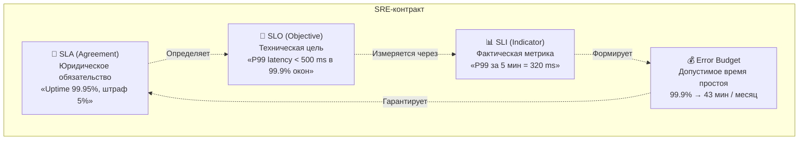

> **Как не сесть в лужу:** Никогда не берите в SLA цифру, которую не можете измерить SLI и не можете подтвердить SLO-бюджетом. Если бизнес хочет «P99 < 200ms» — сначала поставьте SLO-цель на квартал, заложите error budget, и *только потом* подписывайте SLA.

---

## 3. Матрица ответственности команды (5 мин)

### 3.1. RACI-матрица для Capacity Planning

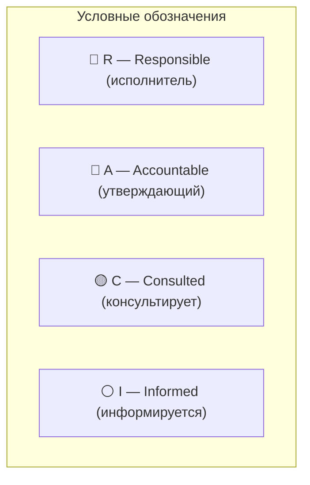

| Деятельность | BA | SA | C# Dev | Oracle/PG Dev | QA |
|---|---|---|---|---|---|
| Сбор бизнес-метрик (DAU, MAU, сценарии, сезонность) | **R** | C | I | I | I |
| Построение модели нагрузки (RPS/TPS/CU) | C | **R** | C | C | C |
| Выбор профилей нагрузки (load/stress/spike/soak) | I | **R** | C | C | C |
| Реализация NFR (rate limiting, circuit breaker, bulkhead) | I | C | **R** | C | I |
| Индексы, explain plan, wait events под нагрузкой | I | C | I | **R** | C |
| Написание скриптов нагрузочного тестирования | I | C | C | C | **R** |
| Анализ узких мест и tuning | I | C | **R** | **R** | C |
| Формирование SLO/SLI и мониторинга | C | **R** | C | C | C |

### 3.2. Ролевые карточки (кратко)

#### 🟢 BA (Business Analyst)
- **Собирает:** DAU, MAU, сценарии использования, карту пути пользователя, пиковые сезоны
- **Артефакт:** Документ «Бизнес-требования к производительности» с цифрами
- **Ловушка:** «Все 2 млн юзеров заходят одновременно» — это неверно. Уточняйте реальное поведение.

#### 🔵 SA (Solution Architect)
- **Делает:** Расчёт нагрузки (RPS, TPS, Concurrent Users), выбор паттернов масштабирования
- **Артефакт:** Capacity Planning Document с расчётом ресурсов на 3/6/12 мес.
- **Ловушка:** «Средняя температура по больнице». Опирайтесь на **Peak × Safety Buffer (1.5–2x)**.

#### 🟠 C# Developer
- **Реализует:** connection pooling, async/await, кэширование, rate limiting, circuit breaker
- **Артефакт:** Performance-тесты в проде и CI (benchmarkdotnet + k6)
- **Ловушка:** Sync-over-async в ASP.NET Core — убивает пул потоков при росте RPS.

#### 🟣 Oracle / PostgreSQL Developer
- **Выполняет:** sizing таблиц, индексов, partitioning под расчётный TPS
- **Артефакт:** Explain-планы на целевом объёме данных + heat map по IOPS
- **Ловушка:** Sizing на пустой БД. Тестируйте на **3x–5x от ожидаемого объёма данных**.

#### 🟡 QA (Нагрузочное тестирование)
- **Готовит:** сценарии и профили (Smoke → Load → Stress → Spike → Soak)
- **Артефакт:** Load Test Report с узкими местами и рекомендациями
- **Ловушка:** Тестирование на «чистом» окружении — результат невалиден. Эмулируйте фоновую нагрузку.

---

## 4. Практический кейс: Онлайн-магазин электроники TechStore (15 мин)

### 4.0. Контекст

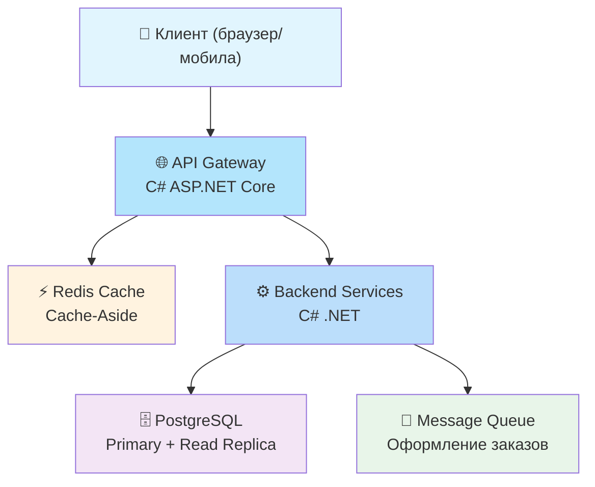

**Контекст:**
- B2C интернет-магазин с 300 000 DAU
- Ядро: C# ASP.NET Core API + PostgreSQL
- Пик: «Чёрная пятница» — ноябрь
- Бизнес: «Хотим, чтобы выдержало в 3x рост за 12 месяцев»

### 4.1. Шаг 0. BA собирает бизнес-метрики

| Метрика | Значение | Источник |
|---|---|---|
| DAU (средний) | 300 000 | Google Analytics |
| Дней в неделе с пиком | Пн, Чт (рекламные рассылки) | Маркетинг |
| Средний сценарий юзера | 1) Поиск → 2) Карточка → 3) Добавление в корзину → 4) Оформление заказа → 5) Оплата | UX-аналитика |
| Среднее действий/пользователь/день | 12 | Clickstream Logs |
| Коэффициент конверсии в заказ | 3.2% | CRM |
| Пиковый месяц | Ноябрь (Чёрная пятница) | Бизнес-план |
| Ожидаемый рост за 12 мес. | 3x | Стратегия компании |

### 4.2. Шаг 1. SA рассчитывает нагрузку сегодня

**Расчёт средних RPS:**

```
DAU = 300 000
Avg Actions Per User Per Day = 12
Total Daily Actions = 300 000 × 12 = 3 600 000

Средний RPS (за 24 часа) = 3 600 000 / 86 400 ≈ 41.7 RPS
```

**Расчёт пиковых RPS (Peak RPS):**

Используем PHF = 0.6 (60% трафика в пиковый час):

```
Peak Hour Actions = 3 600 000 × 0.6 = 2 160 000
Peak RPS = 2 160 000 / 3600 = 600 RPS
```

**Коэффициент неравномерности:** внутри пикового часа трафик не равномерен — добавляем burst-фактор **1.5x** (30-секундные всплески):

```
Burst RPS = 600 × 1.5 = 900 RPS
```

**Расчёт Concurrent Users (через Little's Law):**

Целевой P95 latency = 300 ms (0.3 с). Принимаем среднюю latency ~200 ms.

```
L = 900 × 0.2 = 180 concurrent requests
```

**Промежуточные результаты (текущие):**

| Метрика | Среднее | Пик (час) | Burst (30 с) |
|---|---|---|---|
| RPS | 42 | 600 | 900 |
| Concurrent Requests | 8 | 120 | 180 |

### 4.3. Шаг 2. SA планирует на 12 месяцев (рост 3x)

```
Growth Factor = 3.0
Безопасный буфер (safety) = 1.5 (50% запас)
Итого: Scale Factor = 3.0 × 1.5 = 4.5

Пиковые RPS через 12 месяцев = 600 × 4.5 = 2700 RPS
Burst RPS через 12 месяцев = 900 × 4.5 = 4050 RPS
```

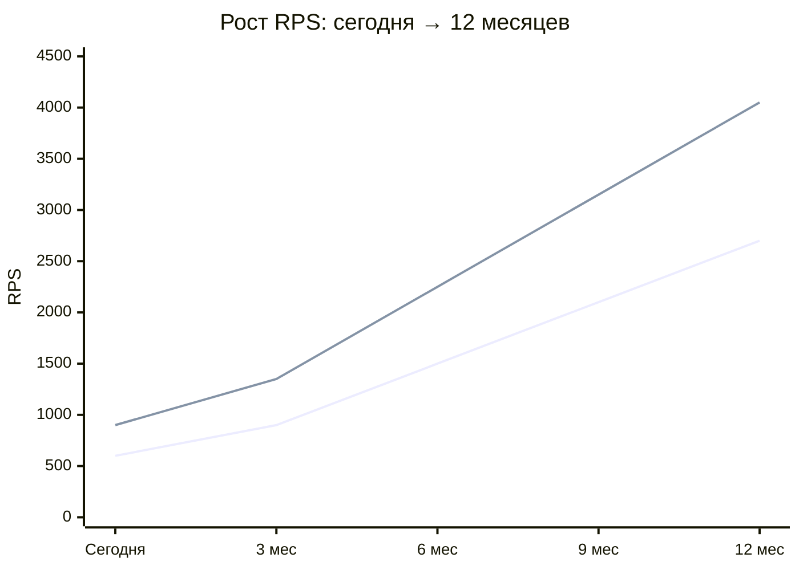

### 4.4. Шаг 3. Перевод в инфраструктурные метрики

#### 4.4.1. Application (C# ASP.NET Core)

**Допущения:**
- 1 vCPU обрабатывает ~200 RPS (среднее для ASP.NET Core, не CPU-bound)
- Overhead на асинхронность: ε = 0.75

```
vCPU (сегодня, пик) = 600 / (200 × 0.75) ≈ 4 vCPU
vCPU (12 мес., пик) = 2700 / (200 × 0.75) ≈ 18 vCPU
```

**Память:**
- BaseHost: ~256 MB
- 1 request ≈ 50–200 KB (аллокации + DI-scope + middleware)
- 180 concurrent → 180 × 100 KB = 18 MB дополнительно

```
RAM (сегодня) = 256 MB + 18 MB ≈ 1 GB
RAM (12 мес) = 256 MB + (180 × 4.5) × 100 KB ≈ 2.5 GB
```

**Вывод SA для C# Dev:**
> «Сейчас хватит 4 vCPU / 1 GB RAM. Через 12 месяцев — 18 vCPU / 2.5 GB + автоскалинг. Плюс rate limiting на 1000 RPS с уведомлением в мониторинг.»

#### 4.4.2. Database (PostgreSQL)

**Расчёт TPS:**

Для интернет-магазина на 1 RPS в среднем приходится:
- Поиск: 1–2 запроса
- Карточка: 2–3 запроса  
- Корзина: 3–5 запросов (чтения + записи)
- Оформление: 8–15 запросов (транзакция с блокировками)

Усреднённый K_db = 4.5 (взвешенный по сценариям)

```
TPS (сегодня, пик) = 600 × 4.5 = 2700 TPS
TPS (12 мес., пик) = 2700 × 4.5 = 12150 TPS
```

> **Для Oracle/PG Dev:** 2700 TPS на PostgreSQL — это уже не «игрушечная» нагрузка. При таком TPS начинают проявляться lock contention на горячих строках, WAL-запись (write amplification), конкуренция за буферный кэш (shared_buffers). При TPS > 1000 обязательно проверьте: `pg_stat_user_tables` (n_tup_mod, n_dead_tup), `pg_locks` (blocked), настройте `max_connections + work_mem + shared_buffers`.

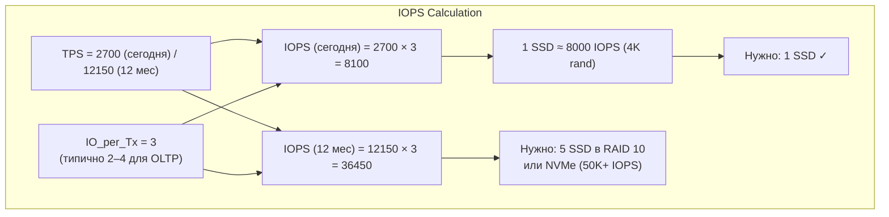

> **Для Oracle/PG Dev:** 8 000 IOPS — для 4K random read. Для mixed workload закладывайте запас 20–30%. Для NVMe — 50 000–100 000 IOPS. Ключевой параметр — не только IOPS, но и latency IO (на Oracle — `log file sync`, на PG — `WALWrite`).

### 4.5. Шаг 4. SA формирует SLO / SLI

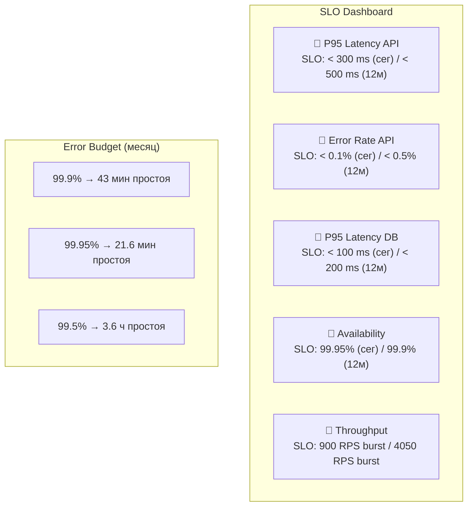

| SLI | SLO (сегодня) | SLO (12 мес.) | Error Budget (мес.) |
|---|---|---|---|
| P95 Latency API | < 300 ms | < 500 ms | 99.9% → 43 мин |
| Error Rate API | < 0.1% | < 0.5% | 99.9% |
| P95 Latency DB | < 100 ms | < 200 ms | 99.5% |
| Availability | 99.95% | 99.9% | 21.6 мин |
| Throughput | 900 RPS burst | 4050 RPS burst | — мониторинг |

**Почему SLO на 12 мес. мягче?**  
Потому что риск 3x роста закладывается в Error Budget: первые 3 месяца мы не знаем, как реально поведёт себя система при 3x. Закладываем консервативные SLO + мониторинг.

### 4.6. Шаг 5. Выбор архитектурных паттернов

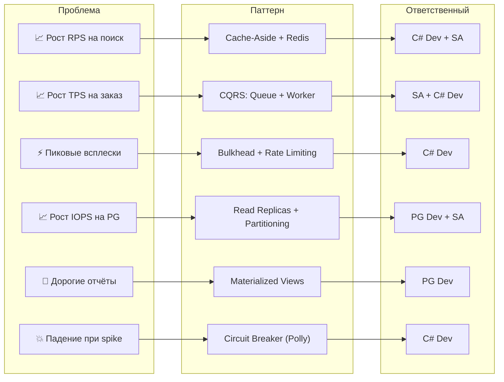

### 4.7. Шаг 6. QA готовит тестовый план

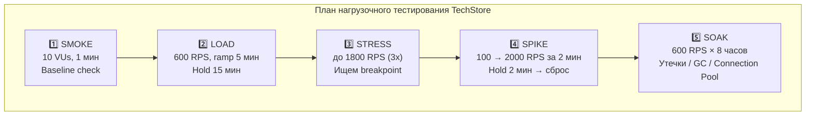

**Инструменты:** k6 (API) + pgbench / custom Postgres-сценарии

---

## 5. Интеграция в процессы SDLC (5 мин)

### 5.1. Где capacity planning входит в SDLC

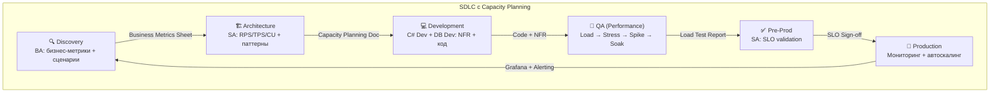

| Фаза | Действие | Артефакт |
|---|---|---|
| **Discovery** | BA собирает бизнес-метрики + сценарии | Business Metrics Sheet |
| **Architecture** | SA считает RPS/TPS/CU + выбирает паттерны | Capacity Planning Document |
| **Development** | C# Dev + DB Dev реализуют с учётом NFR | Code with Rate Limiting, Connection Pooling, Indexes |
| **QA (Performance)** | QA гоняет профили Load → Stress → Spike → Soak | Load Test Report |
| **Pre-Prod** | SA валидирует SLO, QA подтверждает Error Budget | SLO Validation Sign-off |
| **Production** | Мониторинг SLI + автоскалинг + алерты по Error Budget | Grafana Dashboard + OpsGenie/PagerDuty |

### 5.2. PDCA-цикл: Plan → Test → Measure → Adjust

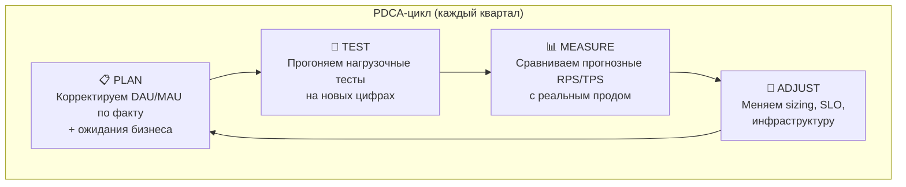

**Критическое правило:**  
> Если реальные метрики (RPS, TPS, latency) отклонились от прогноза более чем на **±20%** — пересчитайте план на следующий квартал и доложите бизнесу. Это нормально. Не нормально — молчать до релиза.

### 5.3. Контрольные точки на временной шкале

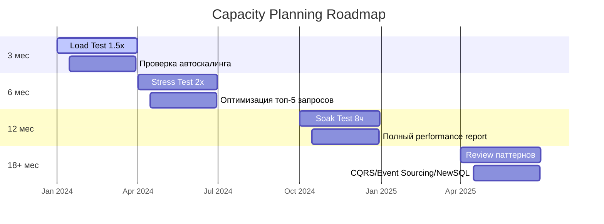

| Горизонт | Цель | Действие |
|---|---|---|
| **3 мес** | «Не умереть в ближайший пик» | Load Test на 1.5x от текущего peak + проверить автоскалинг |
| **6 мес** | «Уложиться в SLO при прогнозном росте» | Stress Test на 2x + оптимизация топ-5 запросов в БД |
| **12 мес** | «Бизнес может спать спокойно» | Soak Test на 8 ч + полный performance report |
| **18+ мес** | «Архитектура не требует переписывания» | Review паттернов: надо ли CQRS/Event Sourcing/NewSQL? |

### 5.4. Как не сесть в лужу перед бизнесом

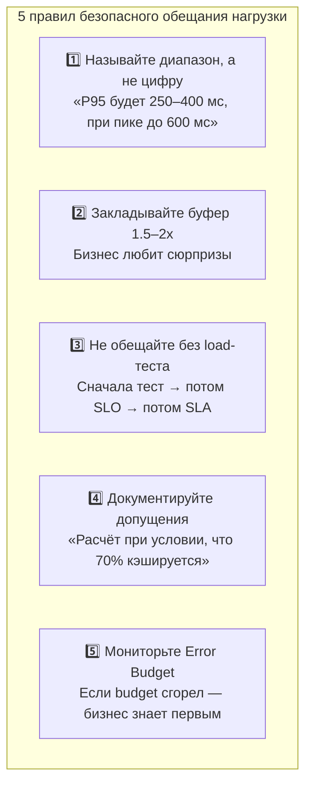

1. **Никогда не называйте одну цифру** — называйте диапазон: «P95 latency будет 250–400 мс, при пике до 600 мс, гарантируем не более 500 мс в 99.9% окон».
2. **Закладывайте буфер** — 1.5–2x от расчёта. Бизнес любит сюрпризы (рекламная акция, вирусный пост, DDoS).
3. **Не обещайте цифры без load-теста** — сначала тест, потом SLO, потом SLA.
4. **Документируйте допущения** — «Расчёт сделан при условии, что 70% запросов кэшируется на Redis» — если кэш упадёт, цифры меняются.
5. **Мониторьте Error Budget** — если budget сгорел за неделю, бизнес должен знать до того, как упал SLA.

---

## 6. Практические задания и сниппеты кода (10 мин)

### 6.1. Сниппет: Middleware для логирования P95/P99 latency (C#)

```csharp
// Middleware для сбора P50/P95/P99 latency
public class LatencyMetricsMiddleware
{
    private readonly RequestDelegate _next;
    private readonly ILogger<LatencyMetricsMiddleware> _logger;
    
    // Histogram buckets: 50ms, 100ms, 200ms, 500ms, 1s, 2s, 5s
    private static readonly double[] Buckets = { 50, 100, 200, 500, 1000, 2000, 5000 };
    
    public LatencyMetricsMiddleware(RequestDelegate next, ILogger<LatencyMetricsMiddleware> logger)
    {
        _next = next;
        _logger = logger;
    }
    
    public async Task InvokeAsync(HttpContext context)
    {
        var sw = Stopwatch.StartNew();
        var path = context.Request.Path;
        
        try
        {
            await _next(context);
        }
        finally
        {
            sw.Stop();
            var elapsedMs = sw.ElapsedMilliseconds;
            
            // Логируем с указанием эндпоинта и статуса
            _logger.LogInformation(
                "Latency|{Method} {Path}|{StatusCode}|{ElapsedMs}ms",
                context.Request.Method, path, context.Response.StatusCode, elapsedMs);
            
            // Здесь можно отправлять в Prometheus/OpenTelemetry
            // Metrics.RecordLatency(path, elapsedMs, context.Response.StatusCode);
        }
    }
}

// Регистрация в Program.cs:
// app.UseMiddleware<LatencyMetricsMiddleware>();
```

### 6.2. Сниппет: Rate Limiting (C# ASP.NET Core)

```csharp
// Настройка Rate Limiting в Program.cs (.NET 7+)
using System.Threading.RateLimiting;

builder.Services.AddRateLimiter(options =>
{
    // Политика: Fixed Window — 1000 запросов в минуту
    options.AddFixedWindowLimiter("FixedWindow_1000_per_min", opt =>
    {
        opt.PermitLimit = 1000;
        opt.Window = TimeSpan.FromMinutes(1);
        opt.QueueProcessingOrder = QueueProcessingOrder.OldestFirst;
        opt.QueueLimit = 50; // буфер для burst
    });

    // Политика: Concurrency — не более 100 одновременных
    options.AddConcurrencyLimiter("Concurrency_100", opt =>
    {
        opt.PermitLimit = 100;
        opt.QueueLimit = 20;
    });

    // Глобальный fallback
    options.RejectionStatusCode = StatusCodes.Status429TooManyRequests;
    
    options.OnRejected = async (context, cancellationToken) =>
    {
        context.HttpContext.Response.StatusCode = 429;
        context.HttpContext.Response.ContentType = "application/json";
        await context.HttpContext.Response.WriteAsync(
            """{"error":"Rate limit exceeded. Try again later."}""",
            cancellationToken);
    };
});

// Применение к конкретному эндпоинту
app.MapPost("/api/orders", async (OrderDto order) =>
{
    // ... логика оформления заказа
})
.RequireRateLimiting("FixedWindow_1000_per_min");
```

### 6.3. Сниппет: Circuit Breaker с Polly (C#)

```csharp
using Polly;
using Polly.CircuitBreaker;

// Настройка Circuit Breaker для вызовов внешних сервисов
var circuitBreakerPolicy = Policy
    .Handle<HttpRequestException>()
    .Or<TimeoutException>()
    .CircuitBreakerAsync(
        exceptionsAllowedBeforeBreaking: 5,           // 5 ошибок подряд
        durationOfBreak: TimeSpan.FromSeconds(30),    // break на 30 сек
        onBreak: (exception, duration) =>
        {
            Console.WriteLine($"⚠️ Circuit OPEN: {duration.TotalSeconds}s | {exception.Message}");
            // Отправить алерт в мониторинг
        },
        onReset: () =>
        {
            Console.WriteLine("✅ Circuit CLOSED: восстановление");
        },
        onHalfOpen: () =>
        {
            Console.WriteLine("🔶 Circuit HALF-OPEN: проверка...");
        });

// Использование:
// var response = await circuitBreakerPolicy.ExecuteAsync(() => httpClient.GetAsync("..."));
```

### 6.4. Сниппет: k6-скрипт для нагрузочного тестирования

```javascript
// k6 скрипт: Spike Test для TechStore
import http from 'k6/http';
import { check, sleep } from 'k6';
import { Rate, Trend } from 'k6/metrics';

const errorRate = new Rate('errors');
const latencyTrend = new Trend('latency_ms');

export const options = {
    scenarios: {
        // Spike: резкий скачок до 2000 RPS
        spike: {
            executor: 'ramping-arrival-rate',
            startRate: 100,
            timeUnit: '1s',
            stages: [
                { duration: '1m', target: 100 },    // разогрев
                { duration: '30s', target: 2000 },  // spike за 30 сек
                { duration: '2m', target: 2000 },   // удержание
                { duration: '30s', target: 100 },   // спад
            ],
            preAllocatedVUs: 100,
            maxVUs: 500,
        },
    },
    thresholds: {
        http_req_duration: ['p(95)<500', 'p(99)<1000'], // P95 < 500ms, P99 < 1s
        errors: ['rate<0.01'],                          // ошибок < 1%
    },
};

const BASE_URL = __ENV.BASE_URL || 'http://localhost:5000';

export default function () {
    // Сценарий: Поиск → Карточка → Корзина → Оформление
    const searchResp = http.get(`${BASE_URL}/api/products?q=iphone&page=1`);
    check(searchResp, { 'search status 200': (r) => r.status === 200 });
    latencyTrend.add(searchResp.timings.duration);
    errorRate.add(searchResp.status !== 200);
    sleep(0.3);

    const productResp = http.get(`${BASE_URL}/api/products/12345`);
    check(productResp, { 'product status 200': (r) => r.status === 200 });
    latencyTrend.add(productResp.timings.duration);
    errorRate.add(productResp.status !== 200);
    sleep(0.2);

    const cartResp = http.post(`${BASE_URL}/api/cart`, JSON.stringify({
        productId: 12345, quantity: 1
    }), { headers: { 'Content-Type': 'application/json' } });
    check(cartResp, { 'cart status 200': (r) => r.status === 200 });
    latencyTrend.add(cartResp.timings.duration);
    errorRate.add(cartResp.status !== 200);
    sleep(0.5);
}
```

### 6.5. Сниппет: PostgreSQL — поиск топ-5 запросов по времени

```sql
-- pg_stat_statements: топ запросов по общему времени
SELECT 
    query,
    calls,
    ROUND(total_exec_time::numeric, 2) AS total_ms,
    ROUND(mean_exec_time::numeric, 2) AS avg_ms,
    ROUND((100 * total_exec_time / SUM(total_exec_time) OVER ())::numeric, 2) AS pct_total,
    ROUND(shared_blks_hit::numeric / NULLIF(shared_blks_hit + shared_blks_read, 0) * 100, 2) AS cache_hit_ratio,
    rows
FROM pg_stat_statements
WHERE query NOT LIKE '%pg_%'          -- исключаем системные
ORDER BY total_exec_time DESC
LIMIT 5;

-- EXPLAIN ANALYZE для проблемного запроса
EXPLAIN (ANALYZE, BUFFERS, FORMAT JSON)
SELECT * FROM orders 
WHERE customer_id = 12345 
  AND created_at >= '2024-01-01'
ORDER BY created_at DESC
LIMIT 20;

-- Проверка блокировок
SELECT 
    pid,
    usename,
    pg_blocking_pids(pid) AS blocked_by,
    query,
    wait_event_type,
    wait_event,
    state,
    AGE(now(), query_start) AS query_duration
FROM pg_stat_activity
WHERE state != 'idle'
  AND wait_event IS NOT NULL
ORDER BY query_duration DESC;
```

### 6.6. Практические задания (для самостоятельной работы)

#### Задание 1: Middleware для C# Dev
Написать middleware для ASP.NET Core, который логирует P50/P95/P99 latency каждого эндпоинта и отправляет в Prometheus (или просто в консоль).  
**Ожидаемый результат:** Код из раздела 6.1 + интеграция с OpenTelemetry.

#### Задание 2: k6-скрипт для QA
Написать k6-скрипт, который эмулирует сценарий «Поиск → Карточка → Корзина → Оформление» с ramp-up до 600 RPS.  
**Ожидаемый результат:** Скрипт из раздела 6.4, адаптированный под ваш API.

#### Задание 3: PostgreSQL-диагностика для DB Dev
Написать SQL-запрос, который находит топ-5 запросов по total_time из `pg_stat_statements` и строит explain plan для каждого.  
**Ожидаемый результат:** Запрос из раздела 6.5 + интерпретация планов.

#### Задание 4: Capacity Planning для всех
Возьмите свой текущий проект. Посчитайте по формулам 2.4 пиковые RPS и TPS. Сравните с реальной загрузкой в прод-мониторинге. Если расхождение > 20% — на следующем архитектурном комитете поднимите вопрос о capacity review.

---

## 7. Заключение и ключевые выводы (5 мин)

### 7.1. Четыре шага, которые вы уносите с занятия

```mermaid
flowchart TD
    subgraph "4 ШАГА CAPACITY PLANNING"
        S1["1️⃣ ПЕРЕВОД<br/>Бизнес-метрики → RPS / TPS / CU<br/>Формулы + шаблон"]
        S2["2️⃣ ТИПИЗАЦИЯ<br/>Load / Stress / Spike / Soak<br/>Профили нагрузки"]
        S3["3️⃣ SLO-КОНТРАКТ<br/>SLA ≠ SLO. Error Budget —<br/>ваша подушка безопасности"]
        S4["4️⃣ КАЛИБРОВКА<br/>Раз в квартал — test vs<br/>реальность, корректировка"]
    end
    
    S1 --> S2 --> S3 --> S4
```

### 7.2. Плакат формул

```mermaid
flowchart TD
    subgraph "ФОРМУЛЫ (сохраните)"
        F1["Peak RPS = (DAU × APUPD × PHF) / 3600"]
        F2["Concurrent Users: L = λ × W (Little's Law)"]
        F3["TPS_DB = Peak_RPS × K_db"]
        F4["vCPU = Peak_RPS / (RPS_per_core × ε)"]
        F5["IOPS = TPS × IO_per_Tx (2–4)"]
        F6["Safety Buffer = 1.5–2x"]
        F7["Scale Factor = Growth × Safety"]
    end
```

### 7.3. Ответы на невысказанные вопросы

**Q: А если бизнес не даёт точных цифр?**  
A: Берите любые разумные допущения, документируйте их и ставьте контрольную точку через 3 месяца. «Мы исходим из DAU = 100K, если будет 300K — нагрузка вырастет в 3x, потребуется N ресурсов».

**Q: Что если нагрузка всё время разная и unpredictable?**  
A: Используйте **autoscaling** (Kubernetes HPA / AWS Auto Scaling) с metrics-based triggers (CPU > 70% или RPS на под > threshold). Но даже для автоскалинга нужен базовый расчёт — чтобы не проснуться со счётом на $50K.

**Q: А как быть с legacy системой, где нет метрик?**  
A: Поставьте мониторинг (Prometheus + Grafana или Datadog / New Relic). Собирайте данные 2–4 недели. После этого у вас будут реальные цифры для прогноза — это лучше любой теоретической модели.

**Q: Что делать, если нагрузка упала, а мы уже накупили серверов?**  
A: Пересмотрите SLO, оптимизируйте затраты (например, переключитесь на spot-инстансы для non-critical нагрузок), используйте избыточные мощности для QA-окружений или предвычислений.

**Q: Как объяснить бизнесу цену компромисса?**  
A: Переведите в деньги: «P95 < 200ms будет стоить $X/мес на инфраструктуру. P95 < 500ms — $Y/мес. Разница — $Z. Какой вариант выбираем?»

### 7.4. Ресурсы для самостоятельного изучения

- **Книги:** «The Art of Capacity Planning» John Allspaw — классика  
- **Google SRE Book** — главы про SLO и Error Budget  
- **Документация k6** — лучший бесплатный инструмент нагрузочного тестирования  
- **NBomber** — .NET-native framework для нагрузочного тестирования  
- **pg_stat_statements** + **pgBadger** — для PostgreSQL-performance  
- **Oracle AWR Reports** — для DBA Oracle  
- **Grafana Labs — Types of Load Testing** — отличная статья с профилями  
- **BenchmarkDotNet** — для замера производительности .NET-кода  

---

## Приложение A. Шаблон «Business → Technical Metrics Calculator»

```
┌──────────────────────────────────────────────────────────┐
│             CAPACITY PLANNING WORKSHEET                  │
├──────────────────────────────────────────────────────────┤
│ 1. BUSINESS METRICS                                      │
│    DAU: ___________  MAU: ___________                    │
│    Avg Actions/User/Day: ___________                     │
│    Peak Month Factor: ___________                        │
│    Growth Rate (12 mo): ___________                      │
│    Бюджет на инфраструктуру: $___________                │
│    Допущения и риски:                                    │
│    __________________________________________________    │
│                                                          │
│ 2. TECHNICAL METRICS (TODAY)                             │
│    Avg RPS: ___________  Peak RPS: ___________           │
│    Burst RPS: ___________  Concurrent Users: ___________ │
│    TPS (DB): ___________  IOPS: ___________              │
│                                                          │
│ 3. TECHNICAL METRICS (12 MO)                             │
│    Scale Factor (Growth × Safety): ___________           │
│    Peak RPS: ___________  Burst RPS: ___________         │
│    TPS (DB): ___________  IOPS: ___________              │
│                                                          │
│ 4. RESOURCES                                             │
│    vCPU (App): ___________  RAM (App): ___________ GB    │
│    vCPU (DB): ___________  Storage: ___________ GB       │
│    IOPS Required: ___________  Disks Needed: ___________ │
│    Cost Estimate: $___________ / month                   │
│                                                          │
│ 5. SLO / SLI                                             │
│    P95 Latency API: ___________ ms                       │
│    P95 Latency DB: ___________ ms                        │
│    Availability: ___________ %                           │
│    Error Budget: ___________ min/month                   │
└──────────────────────────────────────────────────────────┘
```

---

## Приложение B. Шаблон «Бизнес-требования к производительности (NFR Sheet)»

```
┌──────────────────────────────────────────────────────────┐
│     БИЗНЕС-ТРЕБОВАНИЯ К ПРОИЗВОДИТЕЛЬНОСТИ              │
├──────────────────────────────────────────────────────────┤
│ Дата: ___________  Версия: ___________                   │
│ Автор: ___________  Стейкхолдер: ___________             │
│                                                          │
│ 1. БИЗНЕС-ЦЕЛЬ                                           │
│    __________________________________________________    │
│                                                          │
│ 2. ПОЛЬЗОВАТЕЛЬСКИЕ МЕТРИКИ                              │
│    DAU: ___________  Сессий в день: ___________          │
│    Средняя длина сессии: ___________ мин                 │
│    Ключевые сценарии:                                    │
│    1. _______________________________________________   │
│    2. _______________________________________________   │
│    3. _______________________________________________   │
│                                                          │
│ 3. ПИКОВЫЕ ПЕРИОДЫ                                       │
│    Ежедневный пик: ___________ час                        │
│    Сезонный пик: ___________ месяц                       │
│    PHF (Peak Hour Factor): ___________                   │
│    Burst-фактор: ___________                            │
│                                                          │
│ 4. ТРЕБОВАНИЯ К ПРОИЗВОДИТЕЛЬНОСТИ (NFR)                │
│    PERF-1: Система должна обрабатывать ___ RPS           │
│            с P95 latency < ___ мс в 99.9% окон           │
│    PERF-2: База данных должна выдерживать ___ TPS        │
│            с P95 latency < ___ мс                        │
│    PERF-3: Доступность ___ % (плановая)                  │
│    PERF-4: Максимальное время восстановления: ___ мин    │
│                                                          │
│ 5. РОСТ И ГОРИЗОНТЫ                                      │
│    Прогноз роста на 12 мес: ___ x                       │
│    Safety Buffer: 1.5x / 2x                              │
│    Горизонт планирования: 3 / 6 / 12 / 18+ мес          │
│                                                          │
│ 6. БЮДЖЕТ                                                │
│    Бюджет на инфраструктуру: $___________ / мес          │
│    Допустимая стоимость ошибки: $___________             │
│                                                          │
│ 7. ДОПУЩЕНИЯ И РИСКИ                                     │
│    • Расчёт сделан при условии: ______________           │
│    • Если условие нарушится: _______________             │
│    • Риск: _________________ Вероятность: ___%          │
└──────────────────────────────────────────────────────────┘
```

---

## Приложение C. Типовые значения параметров (для быстрых оценок)

| Параметр | Типичное значение | Комментарий |
|---|---|---|
| PHF (Peak Hour Factor) | 0.6 | 60% трафика в час пик |
| Burst factor | 1.5–2.0 | Внутри пикового часа |
| K_db (RPS → TPS) | 3–15 | Среднее для CRUD API |
| IO_per_Tx (OLTP) | 2–4 | Для Oracle/PG |
| RPS_per_core (.NET) | 150–300 (100–1000) | ⚠️ Зависит от сложности эндпоинта |
| RPS_per_core (Node.js) | 300–800 | Зависит от I/O |
| Safety Buffer | 1.5–2x | На случай сюрпризов |
| Memory per request | 50–200 KB | Доп. аллокации сверх хоста (~100–300 MB) |
| Connection pool (App→DB) | CPU_cores × 4 | PG / Oracle |
| SSD IOPS (4K random) | 8 000–10 000 | Для mixed workload — запас 20–30% |
| NVMe IOPS | 50 000–100 000 | Для high-load систем |

> ⚠️ **Важно:** Цифры в этой таблице — оценочные. Требуют уточнения через профилирование на вашей конкретной архитектуре. Используйте их как отправную точку, а не как истину в последней инстанции.

---

## Приложение D. Глоссарий

| Термин | Значение |
|---|---|
| **RPS** | Requests Per Second — количество HTTP-запросов в секунду |
| **TPS** | Transactions Per Second — количество транзакций/операций БД в секунду |
| **IOPS** | Input/Output Operations Per Second — количество операций ввода-вывода |
| **PHF** | Peak Hour Factor — доля дневного трафика в пиковый час (0.5–0.7) |
| **CU** | Concurrent Users / Concurrent Requests — число одновременных запросов |
| **SLA** | Service Level Agreement — юридическое обязательство перед заказчиком |
| **SLO** | Service Level Objective — техническая целевая метрика |
| **SLI** | Service Level Indicator — фактическое значение метрики |
| **Error Budget** | Допустимое время (или количество ошибок) простоя в период |
| **K_db** | Коэффициент: количество SQL-операций на 1 HTTP-запрос |
| **ε (overhead)** | Коэффициент потерь производительности (0.7–0.8 для async-среды) |
| **Latency** | Задержка ответа системы (обычно в ms) |
| **Throughput** | Пропускная способность (RPS, TPS) |

---

## Приложение E. Антипаттерны и типовые ошибки

### C# ASP.NET Core

| Антипаттерн | Последствия | Решение |
|---|---|---|
| `Task.Result` / `Task.Wait()` в ASP.NET Core | Deadlock пула потоков | Использовать `await` везде |
| `HttpClient` без `IHttpClientFactory` | Исчерпание сокетов (socket exhaustion) | Внедрить `IHttpClientFactory` / `Typed HttpClient` |
| LINQ-аллокации в горячем пути (foreach + Where) | Давление на GC, рост P99 | Использовать циклы for, ArrayPool, оптимизировать |
| Одно соединение с БД на запрос | Connection pool starvation | Использовать pooling (HikariCP, Npgsql pool) |
| Отсутствие `ConfigureAwait(false)` в библиотеках | Контекстная перегрузка | Добавить во внутренних библиотеках |
| Большие object allocation на каждый запрос | Gen 2 GC-паузы убивают P99 | Использовать struct, ArrayPool, MemoryPool |

### PostgreSQL / Oracle

| Антипаттерн | Последствия | Решение |
|---|---|---|
| Sequential scan на таблице 10M+ строк | IOPS взлетает, latency падает | Добавить индексы, проверить explain plan |
| N+1 запрос (ORM without Include) | Экспоненциальный рост TPS | Использовать Eager Loading, JOIN |
| `SELECT FOR UPDATE` без `NOWAIT / SKIP LOCKED` | Взаимные блокировки (deadlocks) | Добавить `NOWAIT` или `SKIP LOCKED` |
| Отсутствие bind variables (Oracle) | Library cache contention | Использовать параметризованные запросы |
| Неправильный `work_mem` (PG) / `PGA_AGGREGATE_TARGET` (Oracle) | Hash join на диск — падение IO | Настроить под нагрузку |
| Sizing на пустой БД | План запроса меняется при 10M строк | Тестировать на 3x–5x от ожидаемого объёма |

---

*Документ создан для учебного занятия. Версия 2.0 — финальная, с учётом рецензий аналитика (SA/BA) и разработчика (C# Dev, DB Dev, QA).*  
*Вопросы и уточнения — к архитектору курса.*