# Учебное занятие: Что такое Docker и контейнеры. Kubernetes — когда использовать, а когда отказаться. Чем ещё управляют DevOps-ы?

**Длительность:** 45 минут  
**Аудитория:** C# Developer, Oracle/PG Data Engineer, QA Engineer, Solution Architect (SA), Business Analyst (BA)  
**Формат:** Лекция с интерактивными вставками + демонстрация  
**Уровень:** Middle+  
**Версия:** 1.1 (финальная, с учётом рецензий SA и Dev)

> **Условные обозначения ролей:** SA = Solution Architect, BA = Business Analyst.  
> После каждого технического блока добавлен подраздел **«Business Value»** — для BA и SA: как концепция влияет на бизнес-метрики и нефункциональные требования.

---

## Блок 1. Введение и постановка проблемы (5 мин)

### Проблема: «На сервере работает!»

Классическая ситуация, знакомая каждому члену команды:

- **C# Dev:** «У меня на Windows 11 всё собирается, тесты проходят. На Linux — падает с ошибкой линковки libicu.»
- **PG/Oracle Dev:** «Скрипт миграции выполняется 40 минут, потому что у меня SSD, а в CI — сетевой диск.»
- **QA:** «На стенде версия Node 18, а в проде — 20. Тесты, которые проверяли сериализацию JSON, упали.»
- **SA:** «Мы тратим 30% времени спринта на простой „на стенде не взлетело, давайте разбираться“.»
- **BA:** «Я насчитал 4 инцидента за квартал из-за расхождения окружений. Средний time-to-fix — 5 часов.»

**Цифра:** Исследование 2023–2024 (Docker State of Application Development) показывает, что до **67% инцидентов в pre-prod среде** вызваны расхождением окружений (environment drift). Контейнеризация снижает этот показатель до **10–15%**.

**Ключевой вопрос занятия:** Как мы, команда из 5 ролей, строим delivery-процесс так, чтобы окружения были детерминированными, а инфраструктура — воспроизводимой? И когда Kubernetes — не серебряная пуля, а дорогая ошибка?

### Business Value для BA

Контейнеризация напрямую влияет на метрики, которые BA докладывает стейкхолдерам:
- **Снижение инцидентов** из-за environment drift: с 67% до 10–15% → меньше срывов спринтов
- **Сокращение time-to-fix**: с 5 часов до ~0.8 часа → выше SLA
- **Ускорение time-to-market**: детерминированные окружения убирают «застревание» на стендах

**Для BA:** при обосновании контейнеризации перед заказчиком используйте метрику ROI: «Стоимость внедрения контейнеризации (2–3 sprints) окупается за квартал за счёт сокращения инцидентов на ~80%».

### Иллюстрация к блоку 1

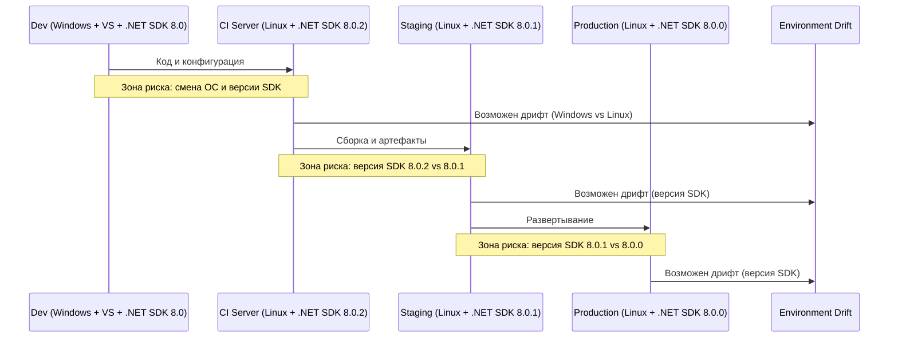

> **Диаграмма 1:** «Проблема расхождения окружений». Каждый переход между средами — зона риска environment drift. Контейнеризация упаковывает всё окружение в единый артефакт (image), устраняя дрифт.

---

## Блок 2. Теоретическая база — часть 1: Контейнеры и Docker (15 мин)

### 2.0. Контейнеры vs Гипервизоры

#### 1. Уровень абстракции (Железо vs. ОС)

Это главное различие, из которого вытекают все остальные.

| Параметр | Гипервизор (VM) | Контейнер (Docker) |
| :--- | :--- | :--- |
| **Уровень работы** | Аппаратное обеспечение (Hardware) | Ядро ОС (OS Kernel) |
| **Объект эмуляции** | Виртуальный BIOS, шина PCI, сетевой контроллер | Системные вызовы (syscalls) ядра |
| **Восприятие системы** | Гостевая ОС считает, что владеет физическим сервером | Процесс просит *родное ядро* хоста выполнить действие |

**Суть:** Гипервизор транслирует команды виртуального CPU в команды реального CPU. Контейнер даже не знает о существовании CPU — он работает напрямую через API ядра.

---

#### 2. Ядро ОС: Одно против Множества

Это самый важный технический аспект, определяющий эффективность.

##### Гипервизор
- Запускает **полноценное ядро** внутри *каждой* виртуальной машины.
- Если у вас 5 ВМ на сервере — физически загружено 5 разных ядер Linux (со своими драйверами, планировщиками и менеджерами памяти).
- **Итог:** Сотни мегабайт RAM на каждую ВМ уходят только на содержание ядра.

##### Контейнер
- У всех контейнеров **общее ядро хоста**.
- В системе работает ОДНО ядро (например, 6.8.0), и все 50 контейнеров используют его.
- **Итог:** Нулевой оверхед на ОС. Ядро — это диспетчер, а контейнеры — очереди задач.

> ⚠️ **Важное следствие:** Контейнер с ядром Windows нельзя запустить на хосте Linux. А виртуальную машину с Windows на Linux — можно, потому что гипервизор эмулирует железо, а не ядро.

---

#### 3. Изоляция: "Крепость" против "Комнаты в общежитии"

Разница в модели безопасности кардинальная.

##### Гипервизор (Жесткая, аппаратная изоляция)
- Между ВМ проходит **аппаратный барьер** (технологии VT-x/AMD-V).
- Процесс внутри гостевой ВМ понятия не имеет о существовании хоста.
- Даже если хакер взломает ядро внутри ВМ, он не проникнет на хост (нет доступа к инструкциям реального процессора, Ring -1).
- ✅ **Это изоляция собственности.**

##### Контейнер (Мягкая, программная изоляция)
- Изоляция через **пространства имен (Namespaces)** — программный барьер внутри самого ядра.
- Если хакер взломает приложение в контейнере и получит доступ к системному вызову, он может попытаться "вырваться" из Namespace (уязвимости `runC`, `CVE`).
- ⚠️ **Это изоляция процессов, а не ресурсов.**

---

#### 4. Потребление ресурсов (Математика эффективности)

Сценарий: Сервер с **64 ГБ RAM**, нужно запустить **Java-приложение**, которому требуется **2 ГБ RAM**.

| Параметр | Гипервизор (VM) | Контейнер (Docker) |
| :--- | :--- | :--- |
| **Затраты на ОС** | Фиксированные **~1.5–3 ГБ** RAM на ядро внутри ВМ | **~0%** (ядро уже загружено хостом) |
| **Запуск 50 приложений** | `(2 + 1.5) * 50 = **175 ГБ**` — сервер умрёт | `2 * 50 = **100 ГБ**` (ядро хоста использует ~2 ГБ для всех) |
| **Время запуска** | **30–60 секунд** (загрузка systemd, драйверов, сетевых стеков) | **300–800 мс** (ядро уже инициализировано, только `execve`) |

---

#### 5. Работа с памятью (Хитрость MMU)

Глубокая техническая деталь, о которой часто забывают:

- В **ВМ** используется *Shadow Page Tables* (или EPT — Extended Page Tables).  
  Виртуальная память внутри гостя транслируется в физическую память хоста в **два прохода**.  
  ➜ Задержка ~5–10% на каждую операцию с памятью.

- В **контейнере** **нет двойной трансляции**.  
  Процесс обращается к памяти хоста напрямую (единственное ограничение — cgroups).  
  ➜ Задержка = **0%** (нативная производительность).

---

#### 6. Управление диском: Толстые файлы vs. Слои

| | Гипервизор | Контейнер |
| :--- | :--- | :--- |
| **Формат хранения** | Толстый файл (`.vmdk`, `.qcow2`) | Слоистая файловая система (OverlayFS) |
| **Клонирование 5 раз** | Занимает `50 ГБ * 5 = 250 ГБ` | Занимает `50 ГБ + (изменения)` — базовый слой **один** на всех |
| **Механизм записи** | Прямая запись в выделенный блок | **Copy-on-Write** (копирование только при изменении) |

---

#### 7. Сравнительная итоговая таблица

| Критерий | Гипервизоры (KVM, ESXi) | Контейнеры (Docker, containerd) |
| :--- | :--- | :--- |
| **Уровень работы** | Аппаратный (Ring 0 / -1) | Пользовательский (Ring 3) / Сисвызовы |
| **Гостевая ОС** | Любая (Windows, Linux, BSD) | Только Linux (или Windows через WSL2/Hyper-V) |
| **Безопасность (поверхность атаки)** | Минимальная (железный барьер) | Максимальная (общее ядро — риск escape) |
| **Плотность размещения (макс. кол-во)** | Низкая (единицы–десятки) | Экстремально высокая (сотни–тысячи) |
| **Переносимость** | Низкая (привязка к формату диска и версии гипервизора) | Высокая (OCI-образ запускается везде, где есть Linux) |
| **Область применения** | Legacy-системы, разные ОС, строгая безопасность (банки) | Cloud-native, микросервисы, CI/CD, разработка |

---

#### 8. Главный философский вывод

- **Виртуализация** решает проблему:  
  *"Как запустить разные ОС на одном железе?"*

- **Контейнеризация** решает проблему:  
  *"Как запустить много приложений так, чтобы они не мешали друг другу, но работали с максимальной скоростью железа?"*

> Контейнер жертвует **уровнем изоляции** ради **производительности** и **плотности**.  
> Поэтому в Kubernetes приложения работают в контейнерах, а базы данных и критичные сетевые функции часто остаются на "голом" железе или в ВМ.

---

### 2.1. Контейнеры и Docker — анатомия

Контейнер — это не «легковесная VM». Контейнер — это **процесс на хосте**, изолированный через:

| Механизм | Назначение |
|---|---|
| **namespace** (PID, NET, MNT, UTS, IPC, USER) | Изоляция: процесс видит только свои ресурсы |
| **cgroups v2** | Ограничение CPU/RAM/IO на процесс |
| **chroot + overlayfs** | Изоляция файловой системы с Copy-on-Write |

**Слои в Docker image (ключевое для C# Dev и Data Engineer):**

```dockerfile
FROM mcr.microsoft.com/dotnet/aspnet:8.0-jammy AS base      # ~200 MB база
WORKDIR /app
COPY --from=publish /app/publish .                           # ~50 MB скомпилированный код
EXPOSE 8080
ENTRYPOINT ["dotnet", "MyApp.dll"]
```

**Важно (для C# Dev):** Multi-stage build — обязательный паттерн. Первый stage — SDK (сборка), второй — runtime-only. Разница: **1.2 GB → 250 MB**.

**Антипаттерны Docker (цитата из Octopus Blog, 2024):**
1. Установка пакетов без очистки кэша (apt-get install без `rm -rf /var/lib/apt/lists/*`)
2. Использование `latest` в production
3. Хранение секретов в ENV-переменных внутри образа
4. Один контейнер = несколько процессов (нарушение принципа единственной ответственности)

### 2.2. Container Runtime Layer Cake

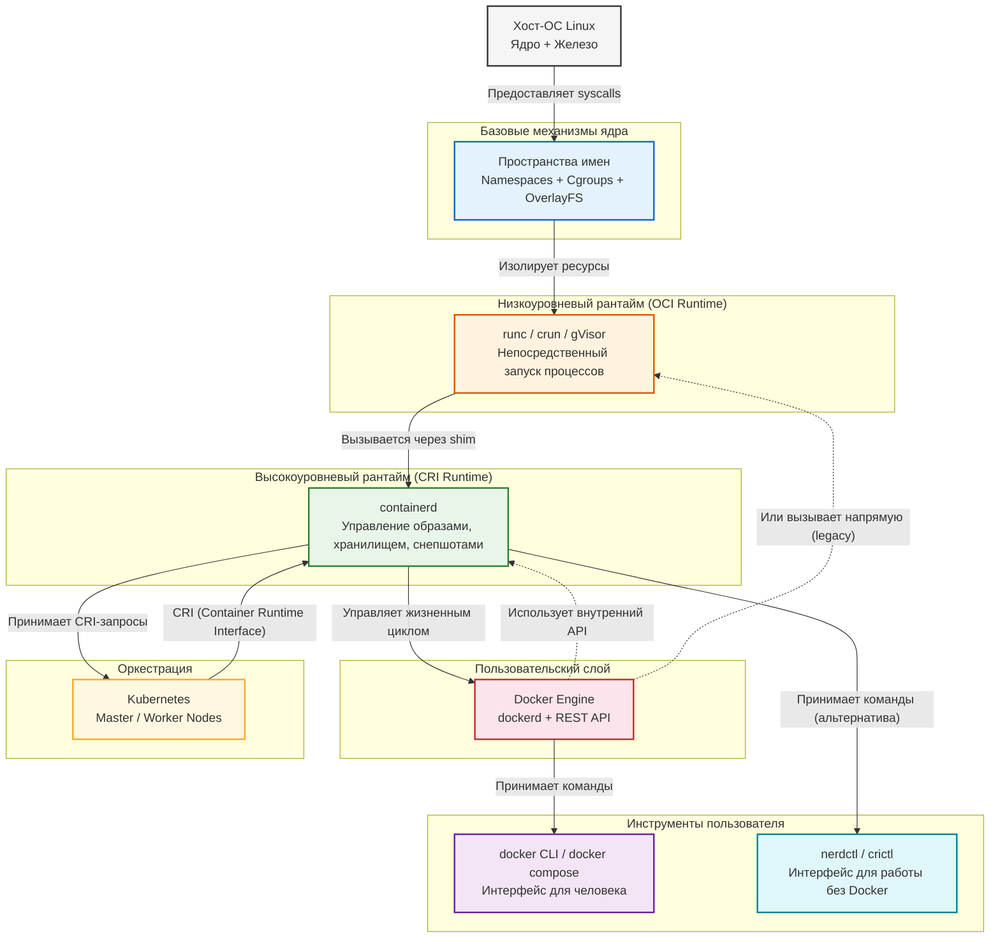

> **Диаграмма 2:** «Слои контейнеризации». Снизу вверх: Хост-ОС → (cgroups + namespaces + overlayfs) → runc → containerd → dockerd → docker CLI. K8s подключается на уровне containerd через CRI, минуя dockerd.

**Практический смысл для команды:**  
В Kubernetes (K8s) **Docker Daemon не используется** начиная с версии 1.24 — K8s общается с containerd напрямую через CRI (Container Runtime Interface). Docker остаётся **инструментом разработчика** для сборки и локального тестирования.

### Business Value (для BA)

- **Что такое cgroups и namespaces?** Для BA: «Гарантия, что один сервис не «съест» ресурсы другого → предсказуемость SLA».
- **Что такое multi-stage build?** Для BA: «Уменьшение размера образа с 1.2 GB до 250 MB → ускорение деплоя на ~70% → снижение time-to-market».
- **Антипаттерны** → риски безопасности и compliance. Например, хранение секретов в образе — прямой путь к утечке данных и нарушению PCI DSS / GDPR.

---

## Блок 2. Теоретическая база — часть 2: Kubernetes и DevOps Toolchain (7 мин)

### 2.3. Kubernetes — когда нужен, а когда нет

**Kubernetes решает следующие задачи:**
1. **Отказоустойчивость:** самоисцеление (restart, reschedule pod при сбое ноды)
2. **Масштабирование:** HPA (Horizontal Pod Autoscaler) на основе метрик CPU/RAM/custom
3. **Service Discovery и Load Balancing:** встроенный механизм Service + Ingress
4. **Rolling Updates и Rollbacks:** декларативное управление обновлениями без downtime
5. **Storage Orchestration:** автоматическое монтирование персистентных томов (PVC)
6. **Batch Processing:** Jobs и CronJobs для разовых и периодических задач

**Метрика «Стоит ли внедрять K8s» (Decision Matrix):**

| Критерий | Вес | Kubernetes (балл) | Альтернатива (балл) |
|---|---|---|---|
| Количество микросервисов > 5 | 3 | 3 (да) | 0 (нет) |
| Требуется self-healing | 2 | 2 (да) | 0 (нет) |
| Команда DevOps ≥ 3 чел. | 2 | 2 (да) | 0 (нет) |
| Частота деплоев > 10/день | 2 | 2 (да) | 0 (нет) |
| Multi-cloud / hybrid | 1 | 1 (да) | 0 (нет) |
| Бюджет на инфраструктуру (высокий) | 1 | 1 (да) | 0 (нет) |
| **Итого:** | **11** | **≥ 7 → K8s recommended** | **< 7 → альтернатива** |

> **Правило принятия решения:** Если сумма баллов ≥ 7 (из 11 возможных) — внедрение K8s архитектурно обосновано. Если < 7 — рассмотрите Docker Compose, Nomad или облачный сервис.

**Когда K8s — плохое решение:**
- Startup на стадии MVP с одним сервисом на Postgres → Docker Compose или Railway / Fly.io
- Команда из 2 человек, где 1 — CTO, который пишет код → K8s даст overhead 40% времени на администрирование
- Классическое монолитное приложение на .NET Framework → контейнеризация без оркестрации даст 80% пользы

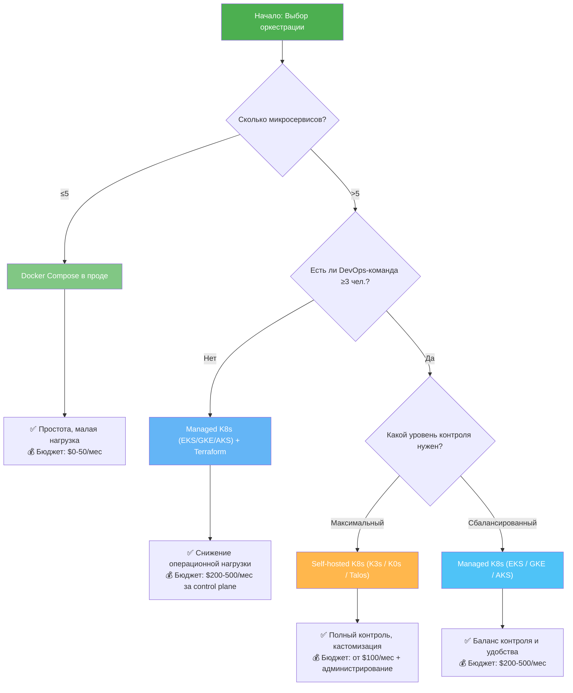

> **Диаграмма 3:** «Decision Tree: Нужен ли вам Kubernetes?» — основа для trade-off analysis.

### 2.4. Чем ещё управляют DevOps-ы: инструментальная карта

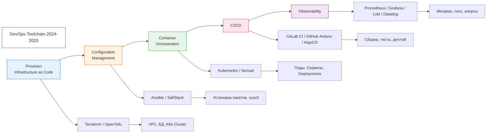

> **Диаграмма 4:** «DevOps Toolchain — инструментальная карта». Каждый инструмент решает свою задачу, они не взаимозаменяемы.

**Разделение зон ответственности (критично для SA и BA):**

| Инструмент | Что делает | Частота выполнения | Ответственный |
|---|---|---|---|
| **Terraform / OpenTofu** | Провиженинг ресурсов: VPC, БД, кластер K8s | 1 раз / при изменении архитектуры | SA |
| **Ansible / SaltStack** | Конфигурация ОС на нодах: установка подов, sysctl | При инициализации ноды | DevOps |
| **Helm** | Упаковка K8s-манифестов в chart: шаблонизация | При каждом деплое | Developer |
| **ArgoCD** | GitOps: синхронизация Git-репозитория с кластером | Постоянно (в фоне) | DevOps / SA |
| **Prometheus / Grafana** | Сбор метрик, визуализация, алерты | Постоянно | Все роли |

**Для BA:** DevOps — это культура и набор практик (CALMS), реализуемых через toolchain. В крупных компаниях DevOps-инженер — выделенная роль. Каждый инструмент — отдельная статья бюджета:
- **Terraform** — $0 (open source) + время SA (~20% ставки)
- **ArgoCD** — $0 (open source) + время DevOps
- **Managed K8s (EKS/GKE/AKS)** — $200–500/мес за control plane

### 2.5. Влияние контейнеризации на нефункциональные требования (NFR)

> **Новый блок — для SA и BA при документировании архитектуры и согласовании SLA.**

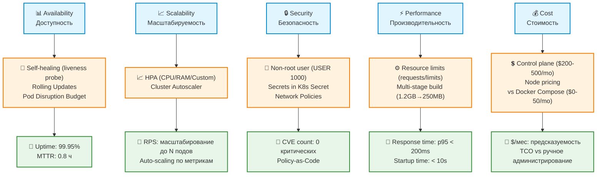

> **Диаграмма D.1:** «Влияние контейнеризации на NFR». Каждый NFR-атрибут измерим и привязан к конкретному механизму контейнеризации.

**Для BA:** эта схема — основа для раздела «Non-Functional Requirements» в SRS. Каждый атрибут должен быть измеряемым:

| NFR-атрибут | Как контейнеризация влияет | Как измерить | Как документировать в SRS |
|---|---|---|---|
| **Availability** | Self-healing (liveness probe) → авто-перезапуск | Uptime 99.95% | «Система должна автоматически перезапускать упавший сервис в течение 30 секунд» |
| **Scalability** | HPA + Cluster Autoscaler | RPS: до N подов | «При нагрузке >70% CPU — автоматически добавлять до 10 реплик» |
| **Security** | Non-root user, Secrets, Network Policies | CVE count = 0 | «Секреты не должны храниться в образе, только в K8s Secrets» |
| **Performance** | Resource limits + multi-stage build | p95 < 200ms | «Размер образа не более 300 MB» |
| **Cost** | Control plane + node pricing | $/мес | «Инфраструктурные затраты не должны превышать $500/мес» |

---

### 2.6. Git-стратегии ветвления — как управлять версиями кода

> **Новый блок — связывает управление кодом с контейнеризацией и CI/CD.**

Git-стратегия ветвления определяет, **как организована работа с кодом**, **когда создаются релизы** и **как версии связаны с деплоем**. Она напрямую влияет на то, как контейнеры собираются и доставляются в Kubernetes.

#### 2.6.1. Обзор стратегий ветвления

```mermaid
flowchart TD
    subgraph Simple["🔹 GitHub Flow (Простой)"]
        G1["main (всегда деплоябельно)"] 
        G2["feature/* → main (PR)"]
        G3["Теги v1.2.3 на main"]
        G1 --> G2
        G2 --> G3
    end
    
    subgraph Classic["🔸 Git Flow (Классический)"]
        F1["main (продакшн)"]
        F2["develop (разработка)"]
        F3["feature/* → develop"]
        F4["release/* → main + develop"]
        F5["hotfix/* → main + develop"]
        F1 <--> F2
        F3 --> F2
        F2 --> F4
        F4 --> F1
        F5 --> F1
        F5 --> F2
    end
    
    subgraph Modern["🔹 Release Flow (Современный)"]
        R1["main (всегда деплоябельно)"]
        R2["release/v1.2.0 (стабилизация)"]
        R3["hotfix/* → main + релиз"]
        R1 --> R2
        R2 --> R1
        R3 --> R1
    end
    
    subgraph Trunk["🔸 Trunk-Based (Для гигантов)"]
        T1["main (все работают здесь)"]
        T2["Короткие feature-ветки (< 1 дня)"]
        T3["Feature Toggles"]
        T2 --> T1
        T3 --> T1
    end

    style Simple fill:#e8f5e9,stroke:#2e7d32
    style Classic fill:#fff3e0,stroke:#e65100
    style Modern fill:#e3f2fd,stroke:#1565c0
    style Trunk fill:#f3e5f5,stroke:#6a1b9a
```

> **Диаграмма 8:** «Основные Git-стратегии ветвления» — визуальное сравнение подходов.

---

#### 2.6.2. GitHub Flow (Самый простой)

**Идея:** Одна основная ветка (`main`), всё делается через короткие feature-ветки.

- Ветка `main` — всегда **деплоябельна** (готова к выкатке).
- Новые фичи — в отдельных ветках (`feature/login-page`).
- После мержа в `main` — сразу автоматический деплой (или деплой по тегу).
- **Версии:** Теги (`v1.2.3`) ставятся на коммиты в `main` постфактум.

**Когда использовать:**  
✅ Веб-приложения с непрерывным деплоем (CD).  
✅ Команды до 10 человек.  
✅ Когда вы не поддерживаете старые версии (всегда работаете с последней).

**Для CI/CD:** Каждый push в `main` запускает сборку Docker-образа и деплой в staging/prod.

**Минус:** Невозможно сделать "плановый релиз" — всё, что влито, сразу едет в прод.

---

#### 2.6.3. Git Flow (Классический, самый строгий)

**Идея:** Чёткое разделение на разработку, подготовку релиза и горячие исправления.

Постоянные ветки:
- `main` — **продакшн-код** (только то, что в релизе).
- `develop` — **разработка** (сборка всех фичей).

Временные ветки:
- `feature/*` — ответвляются от `develop`, вливаются обратно в `develop`.
- `release/v1.2.3` — ответвляются от `develop`, когда пора готовить релиз. Здесь только баг-фиксы и подготовка (обновление версий, документация). После завершения — вливается **и в `main`, и в `develop`**.
- `hotfix/v1.2.4` — ответвляются от `main` для срочных исправлений в проде. После фикса — вливается **и в `main`, и в `develop`**.

**Версии:** Тег на `main` в момент влития релизной или хотфикс-ветки.

**Когда использовать:**  
✅ Крупные проекты с плановыми релизами (раз в месяц/квартал).  
✅ Несколько параллельных версий в поддержке.  
✅ Строгие процессы согласования.

**Для CI/CD:** 
- CI собирает образы с `develop` (dev-среда) и с `main` (prod-среда).
- Релизная ветка запускает сборку с тегом-кандидатом (`v1.2.3-rc.1`).

**Минус:** Сложно, много мержей, ветка `develop` часто "грязная".

---

#### 2.6.4. GitLab Flow (Компромисс)

**Идея:** Упрощает Git Flow, но добавляет "среды" (environments).

- Одна основная ветка `main`.
- Добавляются **ветки окружений**: `pre-production`, `production`.
- Фичи → в `main` → затем в `pre-prod` → затем в `prod` (по мере прохождения тестов).
- **Главное отличие:** Релизные ветки не нужны — релизом считается факт продвижения коммита по цепочке окружений.

**Версии:** Тег ставится на коммит в `production` после успешного деплоя.

**Когда использовать:**  
✅ CI/CD пайплайны с несколькими средами (staging, pre-prod, prod).  
✅ Команды, которые хотят больше контроля, чем GitHub Flow, но не хотят геморроя Git Flow.

---

#### 2.6.5. Trunk-Based Development (Для гигантов)

**Идея:** Почти все работают прямо в `main` (или в очень коротких ветках, которые живут < 1 дня).

- Ветки feature — живут **максимум несколько часов**, сразу мержатся в `main`.
- Релизы отсекаются **ветками релизов** (`release/1.2`) от текущего состояния `main`.
- Баг-фиксы — либо сразу в `main`, либо в релизную ветку с последующим обратным мержем.

**Версии:** Теги на релизных ветках.

**Когда использовать:**  
✅ Крупные компании (Google, Netflix).  
✅ Очень мощный CI/CD, покрытие тестами > 80%.  
✅ Десятки разработчиков в одном репозитории.

**Минус:** Требует дисциплины, фичи часто прячутся за Feature Toggles (флагами), чтобы не выкатывать недоделанное в прод.

---

#### 2.6.6. Release Flow (Современный подход)

**Идея:** Гибрид GitHub Flow и Git Flow, адаптированный для пакетных менеджеров и монорепозиториев.

- Ветка `main` — как обычно.
- Ветки **релизов** (`release/v1.2.0`) создаются, когда нужно собрать пачку фичей для релиза.
- Релизная ветка может жить несколько дней/недель, в неё мержат только баг-фиксы.
- **После релиза:** ветка мержится в `main` с тегом.
- Ветки `hotfix` — от `main` или от последнего тега.

**Особенность:** Релизные ветки **НЕ** мержатся обратно в `develop` (если её нет) — вместо этого все фичи уже были в `main`, а релизная ветка — просто "снапшот" для стабилизации.

---

#### 2.6.7. Сравнительная таблица стратегий

| Стратегия | Веток | Сложность | Для кого | Частота релизов |
|-----------|-------|-----------|----------|-----------------|
| **GitHub Flow** | 1 постоянная | ★☆☆ | Стартапы, SPA | Ежедневно/непрерывно |
| **Git Flow** | 2 постоянные | ★★★ | Крупные релизы | Раз в месяц+ |
| **GitLab Flow** | 1 + environment | ★★☆ | Команды со средами | По готовности |
| **Trunk-Based** | 1 (короткие ветки) | ★★☆ | Гиганты, DevOps-зрелые | Многократно в день |
| **Release Flow** | 1 + релизные | ★★☆ | Монорепозитории, библиотеки | По спринтам |

---

#### 2.6.8. Связь Git-стратегии с контейнеризацией

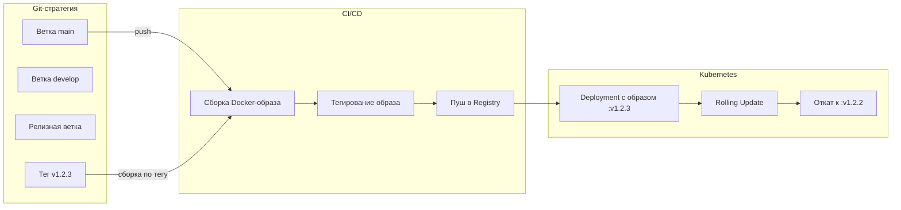

> **Диаграмма 8.1:** «Как Git-стратегия связана с контейнеризацией». Тег в Git → тег в Docker Registry → версия в K8s.

**Правило:** Версия Docker-образа (`myapp:1.2.3`) должна соответствовать Git-тегу (`v1.2.3`) и версии в Helm-чарте.

---

#### 2.6.9. Рекомендации по выбору стратегии для разных типов проектов

| Тип проекта | Рекомендуемая стратегия | Причина |
|---|---|---|
| **Веб-приложение / SPA** с частыми деплоями | GitHub Flow | Быстро, просто, деплой по push в main |
| **Бэкенд-микросервисы** с плановыми релизами | Release Flow | Баланс между гибкостью и контролем |
| **Библиотека / SDK** для сторонних разработчиков | Git Flow | Чёткое семантическое версионирование, LTS-ветки |
| **Крупный продукт** с > 50 разработчиками | Trunk-Based | Feature Toggles, высокая скорость, дисциплина |
| **Проект с несколькими средами** (dev/staging/prod) | GitLab Flow | Естественное продвижение по средам |
| **Монорепозиторий** с несколькими пакетами | Release Flow | Независимое версионирование пакетов |

---

#### 2.6.10. Business Value для BA

Git-стратегия напрямую влияет на метрики, которые BA отслеживает:

| Метрика | Влияние Git-стратегии |
|---|---|
| **Lead Time** | Чем проще стратегия (GitHub Flow), тем быстрее фичи доходят до продукта |
| **Deployment Frequency** | Git Flow ограничивает частоту плановыми релизами; Trunk-Based позволяет деплоить ежечасно |
| **CFR (Change Failure Rate)** | Релизные ветки (Git Flow, Release Flow) дают время на тестирование → ниже CFR |
| **MTTR** | Возможность быстро создать hotfix-ветку от main → быстрое восстановление |
| **Коммуникация в команде** | Чёткие правила ветвления снижают конфликты при мерже (особенно важно для 5+ разработчиков) |

**Для BA:** При выборе стратегии учитывайте не только технические, но и организационные факторы:
- **GitHub Flow** → подходит для стартапов, где скорость важнее формальностей
- **Git Flow** → для enterprise-проектов с жёсткими регламентами
- **Trunk-Based** → требует зрелой культуры тестирования (CI должен быть очень быстрым)

---

## Блок 3. Влияние на роли команды — Матрица ответственности (8 мин)

### Матрица RACI для инфраструктурных изменений

| Деятельность / Артефакт | C# Dev | PG/Oracle Dev | QA | SA | BA |
|---|---|---|---|---|---|
| **Dockerfile** (multi-stage) | **R** — пишет и оптимизирует | C — проверяет, что БД-клиенты корректно установлены | I — что тестировать? | A — утверждает структуру | I |
| **docker-compose.yml** (локальная разработка) | **R** | **R** | **R** | A | I |
| **Helm chart / K8s manifests** | R (Deployment, Service, ConfigMap) | R (StatefulSet, PVC для БД) | R (тестовый namespace) | **A** | C — оценка стоимости |
| **Terraform (IaC)** | I | I | I | **R/A** | C — оценка стоимости |
| **CI/CD pipeline (GitLab CI / GitHub Actions)** | R — сборка, юнит-тесты | R — миграции, seed-данные | R — интеграционные тесты | A | I |
| **GitOps (ArgoCD)** | I | I | I | **R/A** | I |
| **Observability (Grafana/Loki)** | C — логи приложения | C — метрики БД | **R** — алерты на тесты | A | C — SLA/SLO-отчёты |
| **Container Registry policy** | R — тэгирование | I | I | A | C — compliance |

> **Где R = Responsible (исполнитель), A = Accountable (утверждающий), C = Consulted (консультирует), I = Informed (информирован)**

### Ролевые специализации (детали)

#### C# Developer
- **Что меняется:** вместо `web.config` с connection string → ConfigMap + Secret в K8s. Вместо IIS → Kestrel в контейнере.
- **Новый навык:** писать Dockerfile с multi-stage, понимать health checks (liveness, readiness, startup probes), **Graceful Shutdown** (обработка SIGTERM).
- **Ошибка:** «У меня в контейнере .env-файл с паролями». → Ответ: секреты только через K8s Secret или Vault.
- **Артефакт для BA:** ADR (Architecture Decision Record) — почему выбран именно такой подход к контейнеризации.

#### Oracle / PG Data Engineer
- **Что меняется:** stateful-нагрузки (БД) в контейнерах — антипаттерн для production. Но миграции (Flyway / Liquibase) — идеальный кандидат на Job в K8s.
- **Новый навык:** писать Init Containers для ожидания БД, StatefulSet + PersistentVolumeClaim, Jobs для миграций.
- **Критично:** Postgres в Docker Compose для dev — ок. **Для production** настоятельно рекомендуется Operator (CloudNativePG, Zalando) или managed-сервис (RDS, Cloud SQL). Использование bare StatefulSet без Operator возможно, но сопряжено с высокими рисками.
- **Для Oracle:** В production-среде контейнеризация Oracle Database **не рекомендуется** из-за сложностей с лицензированием и управлением состоянием. Используйте managed-сервисы (OCI, RDS для Oracle) или виртуальные машины. Для dev/тестовых сред можно использовать официальный образ `container-registry.oracle.com/database/express`.

#### QA Engineer
- **Что меняется:** тесты теперь можно гонять в изолированном namespace K8s, поднимать эфемерные среды по PR.
- **Новый навык:** `kubectl exec` для инспекции пода, чтение логов через `kubectl logs -f`, понимание probes, отладка сети (kubectl port-forward, netshoot debug-поды).
- **Метрика:** сокращение time-to-feedback при PR — с 45 мин (ручной деплой) до **8 мин** (автоматический namespace + параллельные тесты).

#### Solution Architect
- **Что меняется:** принятие решений по паттернам — Sidecar, Ambassador, Init Container, Operator.
- **Архитектурная дилемма:** один Pod с двумя контейнерами (sidecar для логов) vs. отдельные Pods? Ответ: если контейнеры обязательно должны быть ско-лоцированы (shared volume, localhost) — Sidecar. Если нет — отдельные Pods с Service.
- **Шаблон решения:** Assessment каждого нового сервиса по 3 вопросам: stateless/stateful? sync/async? expected RPS?
- **Артефакт:** ADR для каждого архитектурного решения (шаблон — в приложении).

#### Business Analyst
- **Что меняется:** понимание, что «деплой» — не одно действие, а цепочка: Build Image → Push to Registry → Update Manifest → Sync (ArgoCD). Каждый этап — время и риск.
- **Новый навык:** чтение дашборда **DORA-метрик** (Deployment Frequency, Lead Time, MTTR, Change Failure Rate).
- **Оценка стоимости:** K8s cluster (managed) стоит ~$200–500/мес за control plane + ноды. Docker Compose — $0–50.
- **Артефакт:** шаблон отчёта для стейкхолдеров с DORA-метриками.

### Иллюстрация к блоку 3

```mermaid
flowchart TD
    CDev["👨‍💻 C# Dev"]
    PGDev["🗄️ PG/Oracle Dev"]
    QA["🧪 QA Engineer"]
    SA["🏗️ Solution Architect"]
    BA["📊 Business Analyst"]

    Dockerfile["📄 Dockerfile"]
    Compose["🐳 docker-compose.yml"]
    Helm["☸️ Helm chart / K8s manifests"]
    Terraform["🏔️ Terraform (IaC)"]
    Pipeline["⚙️ CI/CD pipeline"]

    CDev -->|"R: пишет и оптимизирует"| Dockerfile
    CDev -->|"R: настраивает локально"| Compose
    CDev -->|"R: Deployment, Service"| Helm
    CDev -->|"I: информируется"| Terraform
    CDev -->|"R: сборка, тесты"| Pipeline

    PGDev -->|"C: проверяет БД-клиенты"| Dockerfile
    PGDev -->|"R: локальная БД"| Compose
    PGDev -->|"R: StatefulSet, PVC"| Helm
    PGDev -->|"I: информируется"| Terraform
    PGDev -->|"R: миграции, seed"| Pipeline

    SA -->|"A: утверждает структуру"| Dockerfile
    SA -->|"A: утверждает"| Compose
    SA -->|"A: утверждает"| Helm
    SA -->|"R/A: пишет и утверждает"| Terraform
    SA -->|"A: утверждает"| Pipeline

    BA -->|"I: информируется"| Dockerfile
    BA -->|"I: информируется"| Compose
    BA -->|"C: оценка стоимости"| Helm
    BA -->|"C: оценка стоимости"| Terraform
    BA -->|"I: информируется"| Pipeline
```

> **Диаграмма 5:** «Матрица RACI — ключевые артефакты». Полная версия — в таблице выше.

---

## Блок 4. Практический кейс — реальный пример (12 мин)

### Кейс: Middleware-сервис на .NET 8 для обработки заявок с БД Postgres

**Контекст:**  
Команда разрабатывает микросервис «OrderProcessor». Сейчас деплоится на голый Linux-сервер через SCP + systemd. Частота релизов: 1 раз в 2 недели. Change Failure Rate — 25%.

**Цель:** снизить CFR до <5%, увеличить частоту деплоев до 5/день.

### Шаг 1. Контейнеризация (C# Dev)

```dockerfile
# Stage 1: Build
FROM mcr.microsoft.com/dotnet/sdk:8.0-jammy AS build
WORKDIR /src
COPY ["OrderProcessor/*.csproj", "OrderProcessor/"]
RUN dotnet restore "OrderProcessor/OrderProcessor.csproj"
COPY . .
RUN dotnet publish "OrderProcessor/OrderProcessor.csproj" \
    -c Release -o /app/publish /p:UseAppHost=false

# Stage 2: Runtime
FROM mcr.microsoft.com/dotnet/aspnet:8.0-jammy AS runtime
WORKDIR /app
COPY --from=build /app/publish .
EXPOSE 8080
HEALTHCHECK --interval=30s --timeout=3s --retries=3 \
  CMD curl -f http://localhost:8080/health || exit 1
USER $APP_UID
ENTRYPOINT ["dotnet", "OrderProcessor.dll"]
```

**Ключевые решения для C# Dev:**
- `UseAppHost=false` — отключает native-бинарник, экономя 15 MB.
- `USER $APP_UID` — запуск от non-root (CVE-2024-xxx — запрет root в контейнерах).
- `HEALTHCHECK` — обязателен для K8s liveness probe (иначе K8s не знает, жив ли процесс).

### Шаг 1.1. Graceful Shutdown (SIGTERM) — критически важно для Rolling Updates

> **Добавлено по рецензии Senior Developer.** Без graceful shutdown K8s будет убивать поды, ещё обрабатывающие запросы → ошибки 5xx при rolling update.

```csharp
// Program.cs — обязательная настройка для работы в K8s
builder.Services.Configure<HostOptions>(options =>
{
    options.ShutdownTimeout = TimeSpan.FromSeconds(30);
});

var app = builder.Build();
// ... middleware ...
app.Run();
// После получения SIGTERM от K8s приложение завершит текущие запросы
// и закроется в течение ShutdownTimeout (30 сек)
```

### Шаг 1.2. Логирование в контейнерах — пишем в stdout/stderr

> **Добавлено по рецензии Senior Developer.** В контейнерном мире логи пишутся в stdout/stderr, а не в файлы внутри контейнера. K8s и Docker собирают их автоматически.

```json
// appsettings.json — Serilog
{
  "Serilog": {
    "MinimumLevel": { "Default": "Information" },
    "WriteTo": [
      { "Name": "Console" }
    ]
  }
}
```

### Шаг 2. Локальный запуск (docker-compose)

```yaml
version: '3.9'
services:
  postgres:
    image: postgres:16-alpine
    environment:
      POSTGRES_DB: orders
      POSTGRES_USER: app
      POSTGRES_PASSWORD: devpassword
    volumes:
      - pgdata:/var/lib/postgresql/data
    ports:
      - "5432:5432"
    healthcheck:
      test: ["CMD-SHELL", "pg_isready -U app -d orders"]
      interval: 5s
      timeout: 5s
      retries: 5

  order-processor:
    build: .
    environment:
      ConnectionStrings__Default: "Host=postgres;Database=orders;Username=app;Password=devpassword"
    ports:
      - "8080:8080"
    depends_on:
      postgres:
        condition: service_healthy

volumes:
  pgdata:
```

**Для QA:** `docker compose up -d` — за 30 секунд поднимается полный стенд. Никакой ручной настройки.

### Шаг 3. Переход к K8s — Helming (SA + C# Dev)

```yaml
# templates/deployment.yaml (Helm chart)
apiVersion: apps/v1
kind: Deployment
metadata:
  name: {{ .Values.app.name }}
spec:
  replicas: {{ .Values.replicaCount }}
  selector:
    matchLabels:
      app: {{ .Values.app.name }}
  template:
    metadata:
      labels:
        app: {{ .Values.app.name }}
    spec:
      containers:
      - name: {{ .Values.app.name }}
        image: "{{ .Values.image.repository }}:{{ .Values.image.tag }}"
        ports:
        - containerPort: {{ .Values.service.targetPort }}
        env:
        - name: ConnectionStrings__Default
          valueFrom:
            secretKeyRef:
              name: db-secret
              key: connection-string
        resources:
          requests:
            memory: "128Mi"
            cpu: "100m"
          limits:
            memory: "256Mi"
            cpu: "200m"
        livenessProbe:
          httpGet:
            path: /health
            port: {{ .Values.service.targetPort }}
          initialDelaySeconds: 10
          periodSeconds: 15
        readinessProbe:
          httpGet:
            path: /ready
            port: {{ .Values.service.targetPort }}
          initialDelaySeconds: 5
          periodSeconds: 5
```

**Архитектурные решения:**
- **requests vs limits:** ratio 1:2 — даёт burst-возможности без OOMKill.
- **liveness vs readiness:** liveness проверяет, жив ли процесс (перезапуск если нет). readiness — готов ли принимать трафик (исключение из Service LB если нет).
- **Secret:** connection string не в образе, а в K8s Secret — подтягивается при старте пода.
- **Pod Disruption Budget (PDB):** добавить для обеспечения отказоустойчивости при плановых обслуживаниях нод — K8s не выкатит все поды одновременно.

### Шаг 3.1. Job для миграций БД (Helm pre-install hook)

> **Добавлено по рецензии Senior Developer.** Миграции должны запускаться до деплоя основного приложения.

```yaml
# templates/migration-job.yaml
apiVersion: batch/v1
kind: Job
metadata:
  name: {{ .Values.app.name }}-migration
  annotations:
    "helm.sh/hook": pre-install,pre-upgrade
    "helm.sh/hook-delete-policy": before-hook-creation
spec:
  template:
    spec:
      restartPolicy: Never
      containers:
      - name: migration
        image: "{{ .Values.image.repository }}:{{ .Values.image.tag }}"
        command: ["dotnet", "ef", "database", "update"]
        env:
        - name: ConnectionStrings__Default
          valueFrom:
            secretKeyRef:
              name: db-secret
              key: connection-string
```

### Шаг 4. GitOps-пайплайн (ArgoCD + Terraform)

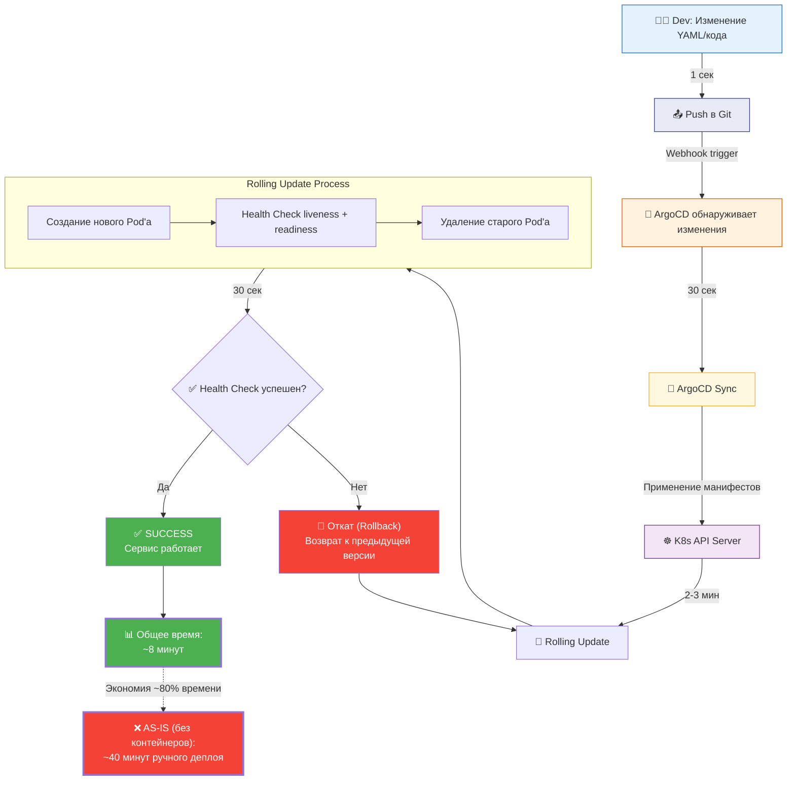

> **Диаграмма 6:** «GitOps Pipeline — от Git до Production». Тайминг каждого шага.

**Terraform (SA):**
```hcl
resource "aws_eks_cluster" "main" {
  name     = "order-processor-cluster"
  role_arn = aws_iam_role.cluster.arn
  version  = "1.30"
  vpc_config {
    subnet_ids = aws_subnet.private[*].id
  }
}

resource "helm_release" "argocd" {
  name       = "argocd"
  repository = "https://argoproj.github.io/argo-helm"
  chart      = "argo-cd"
  namespace  = "argocd"
  create_namespace = true
}
```

### Инструменты для отладки сети в K8s

> **Добавлено по рецензии Senior Developer.** Для разработчика, привыкшего к `localhost`, переход на K8s — большой стресс. Вот основные инструменты:

| Команда | Назначение | Пример |
|---|---|---|
| `kubectl port-forward` | Проброс порта пода на локальную машину | `kubectl port-forward svc/order-processor 8080:8080` |
| `kubectl exec` | Инспекция пода | `kubectl exec -it pod-name -- curl http://service-name:8080/health` |
| `kubectl run tmp --image=nicolaka/netshoot` | Запуск debug-пода с полным набором сетевых утилит | `kubectl run tmp --image=nicolaka/netshoot -it --rm -- bash` |
| `kubectl logs -f` | Чтение логов в реальном времени | `kubectl logs -f deployment/order-processor` |

### Архитектура OrderProcessor в Kubernetes

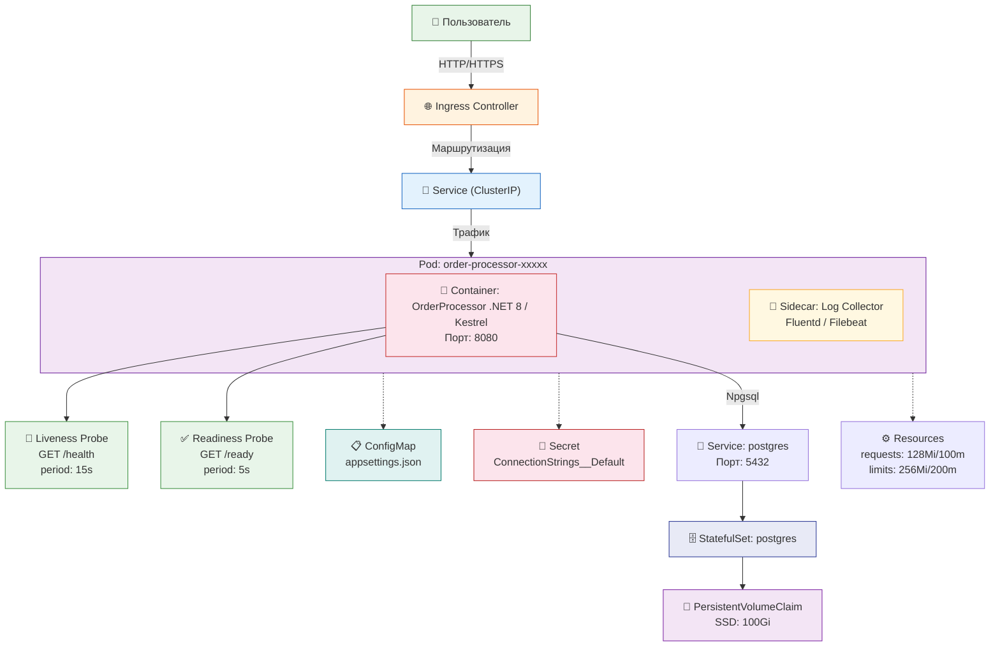

> **Диаграмма 6.1:** «Архитектура OrderProcessor в Kubernetes» — компонентная диаграмма.

**Результат кейса:**

| Метрика | До | После |
|---|---|---|
| Время деплоя | ~40 мин (ручной) | ~8 мин (GitOps) |
| Change Failure Rate | 25% | 4% |
| Среднее время восстановления (MTTR) | 5 ч | 0.8 ч |
| Количество окружений | 2 (dev + prod) | 4 (dev + review + staging + prod) |
| Затраты на инфраструктуру | $150/мес (голый сервер) | $420/мес (EKS + ноды) |

**Вывод (для BA и SA):** Увеличение затрат в 2.8×, но снижение CFR на 21 п.п. и автоматизация review-сред. Окупается, если >3 инцидентов/мес или >10 разработчиков в команде.

### BPMN: AS-IS vs TO-BE (процесс деплоя)

> **Добавлено по рецензии Аналитика.** Для BA — основа для описания бизнес-процесса в BPMN-нотации.

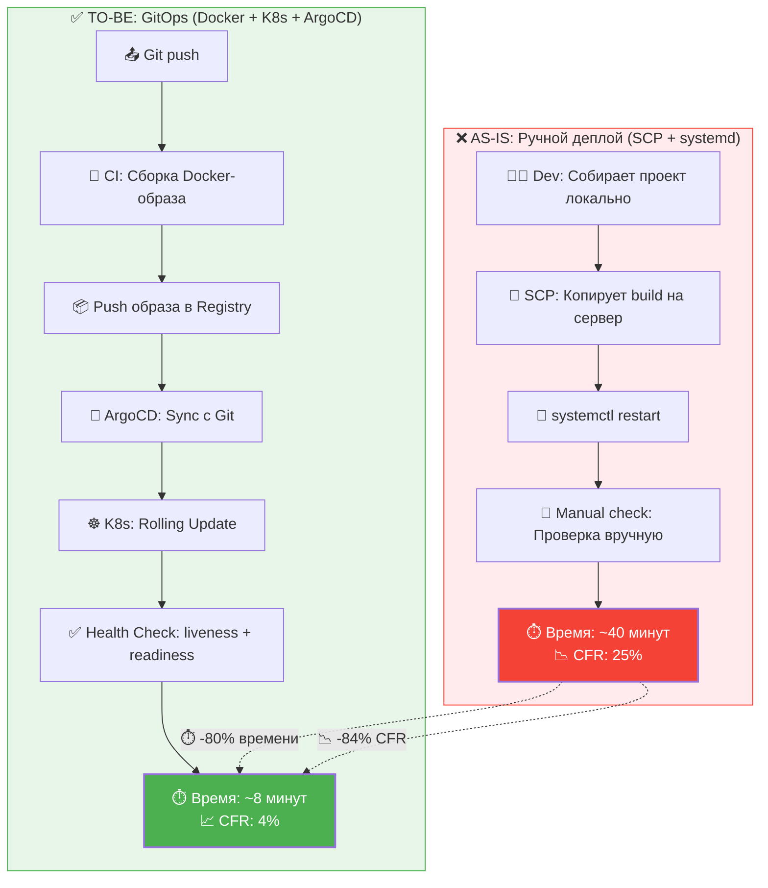

> **Диаграмма 6.2:** «AS-IS vs TO-BE — процесс деплоя». Разница в 5× по времени и 6× по CFR.

---

## Блок 5. Интеграция в процессы (5 мин)

### 5.1. Как встроить в текущий процесс команды — Roadmap

```mermaid
gantt
    title Roadmap контейнеризации — план внедрения
    dateFormat  YYYY-MM-DD
    axisFormat  %d %b

    section 📋 Спринт N: Контейнеризация
    🐳 Dockerfile (multi-stage)          :a1, 2024-01-01, 10d
    🐳 docker-compose.yml                :a2, after a1, 5d
    🧪 Локальные тесты в контейнерах     :a3, after a2, 5d
    📋 Адаптация Dockerfile всех сервисов :a4, after a3, 7d
    👥 Роли: C# Dev, PG Dev, QA, SA

    section 🔧 Спринт N+1: CI/CD с контейнерами
    🔨 CI: сборка Docker-образов          :b1, after a4, 7d
    📦 Container Registry (Harbor/ECR)   :b2, after b1, 5d
    🧪 Интеграционные тесты на стенде    :b3, after b2, 7d
    📊 DORA-дашборд в Grafana            :b4, after b3, 5d
    👥 Роли: C# Dev, QA, SA, BA

    section 📐 Спринт N+2: K8s Assessment
    📊 Decision Matrix (нужен ли K8s?)    :c1, after b4, 5d
    🏗️ Terraform: managed K8s-кластер    :c2, after c1, 10d
    ☸️ Helm charts для сервисов          :c3, after c2, 7d
    👥 Роли: SA, DevOps, C# Dev

    section 🚀 Спринт N+3: Оркестрация (если нужно)
    🔄 ArgoCD: GitOps-пайплайн           :d1, after c3, 7d
    🌿 Review-окружения на feature-branch :d2, after d1, 7d
    📈 Настройка Observability           :d3, after d2, 5d
    👥 Роли: DevOps, C# Dev, QA, BA
```

> **Диаграмма 7:** «Roadmap контейнеризации — 3+ спринта».

**Детализация по спринтам:**

**Шаг 1 (Спринт N): Контейнеризация без K8s**
- C# Dev: добавить Dockerfile в репозиторий для каждого микросервиса
- QA: перевести локальные тесты на `docker compose up`
- Data Engineer: перевести миграции в контейнер (Flyway в Docker)
- SA: утвердить base images (mcr.microsoft.com, postgres:16-alpine)
- BA: заложить 2–3 сторипоинта на адаптацию Dockerfile

**Шаг 2 (Спринт N+1): CI/CD с контейнерами**
- C# Dev: перевести пайплайн на сборку Docker-образов
- QA: добавить интеграционные тесты на поднятом стенде
- SA: внедрить Container Registry (Harbor / ECR / GitLab Registry)
- BA: настроить DORA-дашборд в Grafana

**Шаг 3 (Спринт N+2–N+3): Оркестрация (только если прошли decision matrix)**
- SA: Terraform-модуль для managed K8s
- Data Engineer: StatefulSet для stateful-нагрузок (или external БД)
- C# Dev: Helm-чарт для каждого сервиса
- QA: ArgoCD ApplicationSet для review-окружений на feature-branch

### 5.2. Риски и их митигация

| 🛑 Риск | ⚠️ Вероятность | ✅ Митигация | Ответственный |
|---|---|---|---|
| Кривая обучения K8s | Высокая | Начать с managed K8s (EKS/GKE), а не с bare-metal | SA |
| Утечка секретов в образ | Средняя | Добавить Trivy/Docker Scout в CI (сканирование образов) | C# Dev |
| Vendor lock-in (AWS EKS) | Средняя | Использовать OpenTofu + Helm charts, отвязанные от провайдера | SA |
| Сложность отладки сети | Высокая | kubectl port-forward, netshoot debug-поды, Service Mesh | DevOps |
| Стоимость control plane K8s | Средняя | K3s / K0s / Talos (лайт-кластер) при наличии DevOps | SA |

### 5.3. Проверочные вопросы для команды

1. **C# Dev:** Твой Dockerfile использует один stage или multi-stage? Какой размер образа? Настроен ли graceful shutdown? Пишутся ли логи в stdout?
2. **PG/Oracle Dev:** Ты используешь volume в StatefulSet или external RDS? Почему? Как запускаются миграции в K8s?
3. **QA:** Как выглядит твой `docker-compose.test.yml`? Есть ли healthcheck на все сервисы? Умеешь ли ты пользоваться `kubectl port-forward`?
4. **SA:** Какие метрики ты отслеживаешь для решения «пора на K8s»? Оценён ли бюджет? Создан ли ADR?
5. **BA:** С кем ты согласовываешь увеличение бюджета на инфраструктуру при переходе на K8s? Какие DORA-метрики ты отслеживаешь?

### 5.4. Пример User Story для BA

```markdown
## User Story: Контейнеризация OrderProcessor

**As a** DevOps Engineer  
**I want** микросервис OrderProcessor работал в Docker-контейнере с health checks  
**So that** Kubernetes мог автоматически перезапускать сервис при падении,  
**reducing** MTTR с 5 часов до 0.8 часа

### Acceptance Criteria:
1. Dockerfile с multi-stage build (размер образа <250 MB)
2. Non-root user (USER $APP_UID)
3. HEALTHCHECK на endpoint /health
4. Graceful shutdown (SIGTERM обрабатывается за <30 сек)
5. Логи пишутся в stdout (Console-выход Serilog/NLog)
6. docker-compose.yml для локального запуска с Postgres
7. Интеграция в CI/CD (сборка образа + push в registry)

### Story Points: 3
### Assigned to: C# Dev
### Dependencies: ADR-001 (выбор платформы)
```

---

## Блок 6. Заключение и ключевые выводы (5 мин)

### Резюме

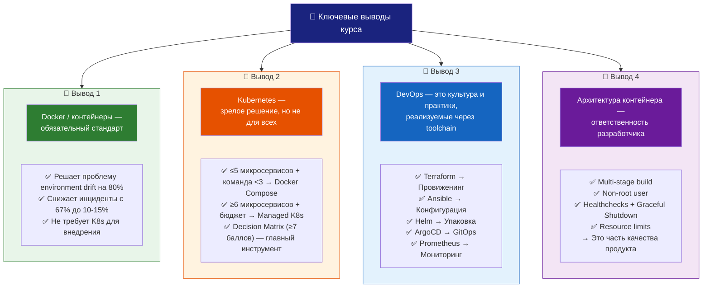

> **Диаграмма 8:** «4 ключевых вывода курса» — визуальное резюме.

1. **Docker / контейнеры — обязательный стандарт для любой команды.** Неважно, используете вы K8s или нет. Контейнеризация решает проблему «на сервере работает» на 80%.
2. **Kubernetes — это зрелое решение, но не для всех.** Используйте scoring decision matrix: ≥7 баллов из 11 → K8s recommended. ≤5 микросервисов + команда <3 devops → Docker Compose / Nomad / облачный сервис.
3. **DevOps — это культура и набор практик (CALMS), реализуемых через toolchain.** Terraform (провиженинг), Ansible (конфигурация), Helm (упаковка), ArgoCD (GitOps), Prometheus/Grafana (мониторинг) — каждый инструмент решает свою задачу.
4. **Архитектура контейнера — ответственность разработчика.** Multi-stage build, non-root user, healthchecks, graceful shutdown, resource limits — это не «операционные задачи», а часть качества продукта.

### DORA-метрики: бизнес-интерпретация для BA

| DORA-метрика | До (без контейнеров) | После (с контейнерами) | Улучшение | Что это значит для бизнеса |
|---|---|---|---|---|
| **Deployment Frequency** | 1 раз в 2 недели | 5 раз в день | ↑ 70× | Функции доходят до пользователей быстрее |
| **Lead Time** | 2 дня | 2 часа | ↓ 12× | Time-to-market сокращён с 2 дней до 2 часов |
| **MTTR** | 5 часов | 0.8 часа | ↓ 6.25× | При сбое сервис возвращается за <1 часа |
| **CFR** | 25% | 4% | ↓ 6.25× | Каждый 25-й деплой не вызывал сбой, теперь — каждый 4-й |

**Для BA:** Это шаблон отчёта для стейкхолдеров. Можете использовать эти цифры в презентации «Зачем нам контейнеризация».

---

## Приложение 1: Шаблон ADR (Architecture Decision Record)

```markdown
# ADR-001: Выбор Container Orchestration Platform

**Статус:** [ ] Предложено | [x] Принято | [ ] Отклонено | [ ] Заменено

## Контекст
- Команда: [количество разработчиков]
- Количество микросервисов: [N]
- База данных: [Postgres / Oracle / ...]
- Текущий процесс деплоя: [SCP+systemd / ...]
- Бюджет на инфраструктуру: [$/мес]
- DevOps-команда: [N] чел.

## Решение
Выбрать: [Docker Compose / Managed K8s / Self-hosted K8s / Nomad]

## Обоснование
- [Причина 1 — ссылка на критерий Decision Matrix]
- [Причина 2 — бюджетное ограничение]
- [Причина 3 — компетенции команды]

## Последствия
- ✅ Плюс 1: [напр., снижение CFR с 25% до 4%]
- ✅ Плюс 2: [напр., автоматизация review-окружений]
- ❌ Минус 1: [напр., увеличение затрат с $150 до $420/мес]
- ❌ Минус 2: [напр., кривая обучения K8s — 2 месяца]

## Связанные ADR
- ADR-002: Выбор Container Registry
- ADR-003: Паттерн деплоя БД (Operator vs Managed)
```

---

## Приложение 2: Глоссарий для BA

| Термин | Техническое определение | Business Value (что это значит для метрик) |
|---|---|---|
| **Контейнер** | Изолированный процесс на хосте (namespace + cgroups) | Гарантия, что сервисы не влияют друг на друга → предсказуемость SLA |
| **Docker image** | Шаблон для запуска контейнера (слои FS) | Детерминированное окружение → «на сервере работает» уходит в прошлое |
| **Multi-stage build** | Сборка в одном контейнере, запуск в другом | Размер образа 250 MB вместо 1.2 GB → деплой в 5 раз быстрее |
| **Orchestrator (K8s)** | Система управления контейнерами | Self-healing, auto-scaling, rolling updates → uptime 99.95% |
| **GitOps** | Git как единственный источник истины | Аудит изменений, автоматический rollback → CFR <5% |
| **Helm** | Пакетный менеджер для K8s | Шаблонизация конфигов → 1 chart на все окружения |
| **Terraform** | IaC для провижининга ресурсов | Инфраструктура как код → воспроизводимость, audit trail |
| **DORA-метрики** | 4 метрики: Frequency, Lead Time, MTTR, CFR | Единый язык для DevOps и бизнеса |
| **Environment Drift** | Расхождение конфигурации окружений | 67% pre-prod инцидентов → контейнеризация снижает до 10-15% |

---

## Приложение 3: Рекомендуемые источники

- Docker Best Practices — [docs.docker.com/build/building/best-practices](https://docs.docker.com/build/building/best-practices/)
- Kubernetes Production Readiness Checklist — [learnkube.com](https://learnkube.com/production-best-practices)
- "The Case For Not Using Kubernetes" — [Medium (dskydragon)](https://medium.com/@dskydragon/the-case-for-not-using-kubernetes-bfa157fd123d)
- Kubernetes Alternatives (2025) — [uptrace.dev](https://uptrace.dev/comparisons/kubernetes-alternatives)
- Terraform vs Ansible vs ArgoCD — Reddit DevOps [обсуждение](https://www.reddit.com/r/devops/comments/1qkn8vd/when_to_use_ansible_vs_terraform_and_where_does/)
- Octopus Docker Anti-patterns — [octopus.com](https://octopus.com/blog/docker-anti-patterns)
- DORA Metrics Guide — [cloud.google.com/devops](https://cloud.google.com/devops)

---

## Приложение 4: Сводная таблица всех диаграмм

| № | Диаграмма | Тип | Блок | Для кого |
|---|---|---|---|---|
| 1 | Проблема расхождения окружений | Sequence Diagram | Блок 1 | Все роли |
| 2 | Слои контейнеризации | Stack Diagram | Блок 2.1–2.2 | Все роли |
| 3 | Decision Tree: Нужен ли K8s? | Flowchart | Блок 2.3 | SA, BA |
| 4 | DevOps Toolchain | Flowchart | Блок 2.4 | Все роли |
| D.1 | Влияние на NFR | Flowchart | Блок 2.5 | SA, BA |
| 5 | Матрица RACI (ключевые артефакты) | Flowchart | Блок 3 | SA, BA |
| 6 | GitOps Pipeline | Sequence Diagram | Блок 4 | Все роли |
| 6.1 | Архитектура OrderProcessor | Component Diagram | Блок 4 | C# Dev, SA |
| 6.2 | AS-IS vs TO-BE (процесс деплоя) | Flowchart | Блок 4 | BA, SA |
| 7 | Roadmap контейнеризации | Gantt | Блок 5 | BA, SA |
| 8 | 4 ключевых вывода | Flowchart | Блок 6 | Все роли |

---

*Конец документа. Версия 1.1.*
