# Учебный курс: Обучение и повторение IT-команды архитектурным решениям и новым трендам

> **Финальная версия** | Готово к публикации в корпоративном портале / Wiki
>
> **Целевая аудитория:** Middle/Senior разработчики (Java, .NET, Python), Team Lead'ы, Архитекторы
>
> **Общее время прохождения:** ~4 часа (теория) + ~4 часа (практика/проект)

---

## Содержание

### Часть I. Архитектура реализации

| N | Модуль | Время |
|---|--------|-------|
| 0 | Принципы проектирования: SOLID, DRY, KISS, YAGNI, CRP, REP, LoD, ADP, SDP, SoC | 20 мин |
| 1 | Стили архитектуры: Монолит - Модульный монолит - Микросервисы. Layered vs Hexagonal | 20 мин |
| 2 | Паттерны взаимодействия: синхрон, асинхрон, транзакции, Saga, Outbox | 20 мин |
| 3 | Многопоточность: race condition, deadlock, примитивы синхронизации | 15 мин |
| 4 | Нефункциональные требования: CAP, метрики, проработка с заказчиком | 15 мин |
| 5 | DDD, CQS/CQRS, TDD/BDD, API First | 20 мин |
| 6 | Управление общими данными: SSOT, идемпотентность, версионирование | 15 мин |

### Часть II. Архитектура решений

| N | Модуль | Время |
|---|--------|-------|
| 0 | Подсчёт и планирование нагрузки, capacity planning | 10 мин |
| 1 | Трейдоффы: треугольник "Быстро - Дёшево - Надёжно" | 10 мин |
| 2 | НФТ с точки зрения архитектуры приложения: Circuit Breaker, SLA | 15 мин |
| 3 | Стратегии интеграции: синхрон, асинхрон, файлы | 10 мин |
| 4 | Bounded Context и C4-диаграммы (Level 1-4) | 15 мин |
| 5 | Эволюция: Strangler Fig, архитектурные метрики, миграция | 15 мин |
| 6 | ADR: шаблон Michael Nygard, Risks, NFR, Evolution Plan | 15 мин |

### Дополнительно

| Раздел | Описание |
|--------|----------|
| Итоговая аттестация | Проект: ADR + C4 + трейдофф-анализ + расчёт нагрузки |
| Глоссарий | Все аббревиатуры и термины курса |
| Рекомендуемая литература | 8 ключевых источников |
| Инструменты | Structurizr, adr-tools, jdeps, ArchUnit и др. |

---

# Часть I. Архитектура реализации

---

## Модуль I-0. Принципы проектирования: SOLID, DRY, KISS, YAGNI и другие

### Цели модуля

После изучения этого модуля вы сможете:
- Классифицировать 10+ принципов проектирования по группам
- Выявлять нарушения SRP, OCP, LSP, ISP, DIP в кодовой базе
- Применять метрики стабильности (Instability, Abstractness) для анализа зависимостей
- Использовать ADP и SDP для устранения циклических зависимостей
- Распознавать антипаттерны

### Теоретическая часть

#### Классификация принципов


```mermaid
flowchart TD
    classDef oop fill:#4A90D9,color:#fff,stroke:#2C5F8A
    classDef modular fill:#7B68EE,color:#fff,stroke:#5A4FCF
    classDef simplicity fill:#2ECC71,color:#fff,stroke:#1B8A4A
    classDef coupling fill:#E67E22,color:#fff,stroke:#B85C1A

    A[Принципы проектирования] --> B[Принципы ООП: SOLID]
    A --> C[Принципы модульности]
    A --> D[Принципы простоты]
    A --> E[Принципы связей]

    B --> B1[SRP: единственная ответственность]
    B --> B2[OCP: открытость/закрытость]
    B --> B3[LSP: подстановка Лисков]
    B --> B4[ISP: разделение интерфейсов]
    B --> B5[DIP: инверсия зависимостей]

    C --> C1[CRP: принцип повторного использования]
    C --> C2[REP: принцип эквивалентности релиза]
    C --> C3[ADP: принцип ацикличности зависимостей]
    C --> C4[SDP: принцип стабильности зависимостей]

    D --> D1[DRY: не повторяйся]
    D --> D2[KISS: будь проще]
    D --> D3[YAGNI: тебе это не понадобится]

    E --> E1[LoD: закон Деметры]
    E --> E2[SoC: разделение ответственности]

    class B,B1,B2,B3,B4,B5 oop
    class C,C1,C2,C3,C4 modular
    class D,D1,D2,D3 simplicity
    class E,E1,E2 coupling
```

#### Ключевые принципы: таблица

| Принцип | Полное название (SUT) | Суть | Антипаттерн | Пример нарушения |
|---------|------------------------|------|-------------|------------------|
| **SRP** | Single Responsibility Principle *(Принцип единственной ответственности)* | Класс должен иметь **только одну причину для изменения** — то есть отвечать за одну логическую обязанность. | **God Class** *(Бог-класс)* | Класс `OrderService`, который: валидирует данные, сохраняет в БД, формирует и отправляет email-уведомление. |
| **OCP** | Open/Closed Principle *(Принцип открытости/закрытости)* | Программные сущности должны быть **открыты для расширения**, но **закрыты для модификации**. | **Модификация существующего кода** *(вместо расширения)* | Использование `if (type == "email") { ... } else if (type == "sms") { ... }` вместо полиморфной стратегии. |
| **LSP** | Liskov Substitution Principle *(Принцип подстановки Барбары Лисков)* | Объекты в программе должны быть заменимы на экземпляры их подтипов без изменения правильности выполнения программы. | **Нарушение контракта** *(изменение поведения в подтипе)* | `class Square extends Rectangle`: при изменении ширины `setWidth()` высота тоже меняется — нарушает ожидаемое поведение родителя. |
| **ISP** | Interface Segregation Principle *(Принцип разделения интерфейса)* | Клиенты не должны зависеть от методов, которые они не используют. Лучше несколько специализированных интерфейсов, чем один универсальный. | **Fat Interface** *(Толстый интерфейс)* | Интерфейс `Worker` с методами `code()`, `eat()`, `sleep()` — робот не ест и не спит, но «вынужден» реализовывать. |
| **DIP** | Dependency Inversion Principle *(Принцип инверсии зависимостей)* | Модули верхних уровней не должны зависеть от модулей нижних уровней. Оба типа модулей должны зависеть от **абстракций**. | **Жёсткая связность** *(зависимость от конкретной реализации)* | `new MySqlRepository()` внутри сервиса вместо инъекции интерфейса `Repository`. |
| **DRY** | Don’t Repeat Yourself *(Не повторяйся)* | Любое знание/логика должны иметь **единственное, однозначное, авторитетное представление** в системе. | **Копипаста** *(дублирование логики)* | Один и тот же SQL-запрос `SELECT * FROM users WHERE active = 1` скопирован в 5 разных репозиториях. |
| **KISS** | Keep It Simple, Stupid *(Постарайся оставаться простым)* | Следует стремиться к **простоте**: сложные решения чаще ломаются, тяжелее поддерживать. | **Overengineering** *(избыточное усложнение)* | Внедрение фабрики фабрик для создания всего двух объектов `User` и `Role`. |
| **YAGNI** | You Ain’t Gonna Need It *(Тебе это не понадобится)* | Не добавляй функциональность, пока она **не требуется в данный момент**. | **Предварительное проектирование «на всякий случай»** | Добавление поддержки 10 языков локализации, хотя проект локализован только на один — русский. |
| **LoD** | Law of Demeter *(Закон Деметры)* | Объект должен общаться только с **непосредственными «друзьями»**, не «znать» внутреннюю структуру зависимостей. | **Train Wreck** *(Составная цепочка вызовов)* | `order.getCustomer().getAddress().getCity().getCountry().getCode()` — сильная связанность с внутренней структурой. |
| **SoC** | Separation of Concerns *(Разделение ответственности)* | Система должна быть разбита на части, каждая из которых отвечает за **свою область ответственности**. | **Смешение слоёв** *(blurred layers)* | В HTML-шаблоне прямо в JSP/Blade: `<?php $db->query("SELECT ...") ?>`. |

#### Метрики графа зависимостей (SDP)

Для каждого компонента/пакета можно вычислить:

- **Instability (I)** = Fan-out / (Fan-in + Fan-out) - мера нестабильности, где Fan-out - это количество внешних зависимостей класса/пакета, Fan-in - количество внутренних зависимостей класса/пакета (прочие зависят от него). В идеале = 0.5 - стабильный класс/пакет.
  - **Диапазон:** \(I in [0, 1]\)  
  - **\(I = 0\)** — *максимально стабилен* (все зависят от него, он ничего не вызывает)  
  - **\(I = 1\)** — *максимально нестабилен* (он много где используется, но сам много чего зависит)  
  - **\(I = 0.5\)** — *оптимальный баланс* для «серединного» компонента  
- **Abstractness (A)** = Na / (Na + Nc) - доля абстрактных классов/интерфейсов, где Na — количество абстрактных сущностей в пакете: интерфейсы + абстрактные классы, Nc — количество конкретных (неабстрактных) сущностей: конкретные классы.
  - **Диапазон:** \(A in [0, 1]\)  
  - **\(A = 0\)** — *все классы конкретные* (низкая гибкость, но простота)  
  - **\(A = 1\)** — *только абстракции* (высокая гибкость, но не всегда практично)  
- **Distance (D)** = |A + I - 1| - расстояние до главной последовательности
  - **Диапазон:** \(D in [0, 1]\)  
  - **\(D = 0\)** — *идеал* (компонент на главной последовательности)  
  - **\(D > 0.5\)** — *проблема* — см. зоны ниже  

> Главная последовательность: A + I = 1 - идеальное соотношение стабильности и абстрактности.

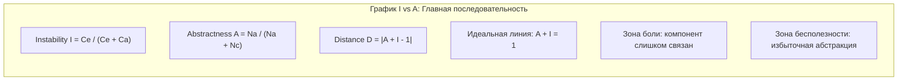
```mermaid
flowchart LR
    subgraph Legend["График I vs A: Главная последовательность"]
        direction TB
        L1["Instability I = Ce / (Ce + Ca)"]
        L2["Abstractness A = Na / (Na + Nc)"]
        L3["Distance D = |A + I - 1|"]
        L4["Идеальная линия: A + I = 1"]
        L5["Зона боли: компонент слишком связан"]
        L6["Зона бесполезности: избыточная абстракция"]
    end
```

#### Разрыв цикла зависимостей (ADP)

## 🚫 ADP: Acyclic Dependencies Principle  
*(Принцип отсутствия циклических зависимостей)*

> **Суть:**  
> **Компоненты системы не должны зависеть друг от друга циклически.**  
> Зависимости между пакетами/модулями должны образовывать **ациклический направленный граф (DAG)** — иначе сборка, тестирование и повторное использование становятся сложными или невозможными.

---

### 🔄 Почему циклы — это плохо?

| Проблема | Последствие |
|---------|-------------|
| 🔗 **Циклическая компиляция** | Не удастся скомпилировать компоненты по отдельности: компонент A требует B, B требует C, C требует A → замкнутый круг. |
| 🧩 **Сложность переиспользования** | Невозможно скопировать «часть системы» без тяги за собой циклических зависимостей. |
| 🧪 **Тестирование по частям** | Тестирование одного компонента требует сборки всей цепочки, даже если он логически автономен. |
| 🔄 **Порядок сборки неочевиден** | Даже Maven/Gradle могут упасть с `cycle in dependency graph`. |

---

### ✅ Как решать? — **Абстракция через интерфейсы**

> **Ключевая идея ADP:**  
> **Переверни зависимость в обратную сторону через интерфейс**, чтобы разорвать цикл.

#### 🔁 Пример: Циклическая зависимость → разорвана
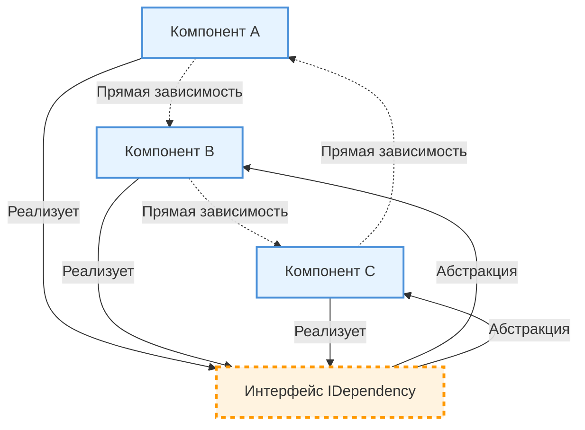
```mermaid
flowchart TD
    A[Компонент A]
    B[Компонент B]
    C[Компонент C]
    I[Интерфейс IDependency]

    A -.->|Прямая зависимость| B
    B -.->|Прямая зависимость| C
    C -.->|Прямая зависимость| A

    A -->|Реализует| I
    I -->|Абстракция| B
    B -->|Реализует| I
    I -->|Абстракция| C
    C -->|Реализует| I

    style A fill:#e6f3ff,stroke:#4a90d9,stroke-width:2px
    style B fill:#e6f3ff,stroke:#4a90d9,stroke-width:2px
    style C fill:#e6f3ff,stroke:#4a90d9,stroke-width:2px
    style I fill:#fff3e0,stroke:#ff9800,stroke-width:3px,stroke-dasharray: 5 5
```

**Как это работает:**
1. Вместо `A → B → C → A`, все три зависят от **абстракции** `IDependency`.
2. `A`, `B`, `C` *реализуют* интерфейс, но **не знают друг о друге**.
3. Зависимости теперь:  
   `A → IDependency`, `B → IDependency`, `C → IDependency`  
   → **ациклическая иерархия** (хотя и не линейная, но без циклов).

---

### 🛠 Практические техники реализации ADP

| Метод | Описание | Пример |
|-------|----------|--------|
| **Инверсия зависимостей** | Компонент зависит от интерфейса, а не от другого компонента | `PaymentService` использует `PaymentGateway`, но `StripeGateway implements PaymentGateway` |
| **Event-driven архитектура** | Разрыв через публикацию событий (`A` publishes → `B` listens) | Spring `ApplicationEvent`, Kafka-события |
| **Контейнеры внедрения** | DI-контейнер «вяжет» реализации во время рантайма | Spring `@Autowired`, Guice |
| **Слой абстракции (API-модуль)** | Выносите интерфейсы в отдельный `api/` или `core/` пакет | `user-api`, `user-service` — `user-service` зависит от `user-api`, но не наоборот |

### 💡 Ключевая мысль

> **Циклы — это не «неудобно», а **архитектурная ошибка**, ломающая модульность.**  
> Разрывай их **всегда**, когда встречаешь — это экономит время в будущем.

### Ингос-секция: Принципы в нашей системе

| Принцип | Что соблюдается | Что нарушается |
|---------|-----------------|----------------|
| SRP | Классы-сервисы имеют одну зону ответственности | Есть "божественные" контроллеры с 2000+ строк |
| DIP | Используем DI-контейнер (Spring) | Некоторые legacy-классы создают зависимости через new |
| LoD | API Gateway изолирует вызовы | Есть цепочки .getA().getB().getC() |
| DRY | Утилитарные классы вынесены в общие библиотеки | SQL-запросы дублируются между сервисами |

### Примеры кода

#### LoD: Правильно и неправильно

```java
// Нарушение LoD (Train Wreck)
String city = order.getCustomer().getAddress().getCity();

// Соблюдение LoD (инкапсуляция)
String city = order.getCustomerCity();

// В классе Order:
public String getCustomerCity() {
    return this.customer.getAddress().getCity();
}
```

#### DIP: Соблюдение принципа

```java
// Нарушение DIP
public class OrderService {
    private MySqlRepository repository = new MySqlRepository();
}

// Соблюдение DIP
public class OrderService {
    private final OrderRepository repository;
    
    public OrderService(OrderRepository repository) {
        this.repository = repository;
    }
}

public interface OrderRepository { /* ... */ }
public class JpaOrderRepository implements OrderRepository { /* ... */ }
```

### Практическая часть

#### Задание 1. Найдите нарушение SRP

Класс ниже нарушает SRP. Найдите все ответственности и предложите рефакторинг.

```java
public class UserService {
    public void register(String email, String password) {
        if (!email.contains("@")) throw new IllegalArgumentException();
        String hash = BCrypt.hashpw(password, BCrypt.gensalt());
        // INSERT INTO users ...
        // sendEmail(email, "Welcome!");
        // log.info("User registered: " + email);
    }
}
```

<details>
<summary>Ожидаемый ответ</summary>

Ответственности:
1. Валидация -> вынести в UserValidator
2. Хеширование -> вынести в PasswordHasher
3. Сохранение -> вынести в UserRepository
4. Отправка email -> вынести в NotificationService
5. Логирование -> AOP-аспект или middleware

После рефакторинга:

```java
@Service
public class UserService {
    private final UserValidator validator;
    private final PasswordHasher hasher;
    private final UserRepository repository;
    private final NotificationService notificationService;
    
    @Transactional
    public void register(String email, String password) {
        validator.validateEmail(email);
        String hash = hasher.hash(password);
        User user = repository.save(new User(email, hash));
        notificationService.sendWelcomeEmail(user);
    }
}
```

</details>

#### Задание 2. Проверьте граф зависимостей через jdeps

```bash
# Анализ зависимостей пакета
jdeps -package com.ingos.service.claims -summary target/classes/

# Поиск циклических зависимостей
jdeps -cp target/classes -recursive -filter:package .
```

#### Задание 3. Вычислите метрики

Для пакета com.ingos.service.policy:
- Na (абстрактных типов) = 3
- Nc (всего типов) = 10
- Fan-in (зависимости извне) = 5
- Fan-out (зависимости вовне) = 2

**Вопрос:** Чему равны I, A и D? Находится ли пакет на главной последовательности?

<details>
<summary>Ожидаемый ответ</summary>

- A = 3/10 = 0.3
- I = 2/(5+2) ~ 0.286
- D = |0.3 + 0.286 - 1| = |0.586 - 1| = 0.414

D > 0.3 - пакет далёк от главной последовательности. Рекомендуется увеличить абстрактность или снизить связанность.

</details>

### Контрольные вопросы

1. Чем отличается LSP от ISP? Приведите примеры нарушений каждого.
2. В чём разница между DRY и YAGNI? Могут ли они конфликтовать?
3. Почему LoD (Закон Деметры) важен для микросервисной архитектуры?
4. Как метрика Distance (D) помогает оценить качество модуля?
5. Что произойдёт с системой, если нарушить ADP?

---

## Модуль I-1. Стили архитектуры: Монолит - Модульный монолит - Микросервисы

### Цели модуля

После изучения вы сможете:
- Сравнивать монолитную, модульно-монолитную и микросервисную архитектуры
- Выбирать стиль под задачу
- Отличать Layered Architecture от Hexagonal Architecture

### Теоретическая часть

#### Эволюция архитектурных стилей

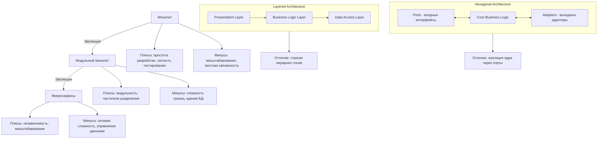
```mermaid
flowchart TD
    A[Монолит] -->|Эволюция| B[Модульный монолит]
    B -->|Эволюция| C[Микросервисы]

    A --> A_plus[Плюсы: простота разработки, легкость тестирования]
    A --> A_minus[Минусы: масштабирование, жесткая связанность]
    B --> B_plus[Плюсы: модульность, частичное разделение]
    B --> B_minus[Минусы: сложность границ, единая БД]
    C --> C_plus[Плюсы: независимость, масштабирование]
    C --> C_minus[Минусы: сетевая сложность, управление данными]

    subgraph Layered [Layered Architecture]
        L1[Presentation Layer]
        L2[Business Logic Layer]
        L3[Data Access Layer]
        L1 --> L2
        L2 --> L3
    end

    subgraph Hexagonal [Hexagonal Architecture]
        H1[Ports - входные интерфейсы]
        H2[Core Business Logic]
        H3[Adapters - выходные адаптеры]
        H1 <--> H2
        H2 <--> H3
    end

    Layered --> Diff1[Отличие: строгая иерархия слоев]
    Hexagonal --> Diff2[Отличие: изоляция ядра через порты]
```

#### Сравнительная таблица

| Критерий | Монолит | Модульный монолит | Микросервисы |
|----------|---------|-------------------|--------------|
| Простота разработки | Высокая | Средняя | Низкая |
| Скорость деплоя | Низкая | Средняя | Высокая |
| Независимость команд | Низкая | Средняя | Высокая |
| Тестирование | Простое | Простое | Сложное |
| Управление данными | Одна БД | Одна БД, схемы | Разные БД |
| Сетевая задержка | Нет | Нет | Есть |
| Отказоустойчивость | Низкая | Низкая | Высокая |

### Пример кода: Hexagonal Architecture

```java
// === Port (выходной порт) ===
public interface OrderRepository {
    Order save(Order order);
    Optional<Order> findById(Long id);
}

// === Core Business Logic ===
public class OrderService {
    private final OrderRepository repository;
    
    public OrderService(OrderRepository repository) {
        this.repository = repository;
    }
    
    public Order createOrder(OrderData data) {
        return repository.save(new Order(data));
    }
}

// === Adapter (адаптер к БД) ===
@Repository
public class JpaOrderRepository implements OrderRepository {
    private final SpringDataJpaRepository jpaRepo;
    
    @Override
    public Order save(Order order) {
        return jpaRepo.save(order);
    }
}
```

### Ингос-секция: Наш архитектурный выбор

- Ядро системы: Модульный монолит для core-доменов (расчёты, андеррайтинг)
- Периферия: Микросервисы для изолированных задач (уведомления, аналитика)
- Переход: Постепенная миграция с монолита на модульный монолит (Strangler Fig)

### Практика

Вы - архитектор стартапа по онлайн-калькулятору страховки. У вас 3 разработчика. Какую архитектуру вы выберете и почему?

### Контрольные вопросы

1. В каких случаях монолит лучше микросервисов?
2. Чем модульный монолит отличается от "просто монолита"?
3. Какая архитектура лучше подходит для быстрого прототипирования?

---

## Модуль I-2. Паттерны взаимодействия: Синхрон, Асинхрон, Транзакции

### Цели модуля

После изучения вы сможете:
- Выбирать между синхронным и асинхронным взаимодействием
- Проектировать Saga (Choreography и Orchestration)
- Реализовывать Outbox Pattern для гарантированной доставки

### Теоретическая часть

#### Sequence diagram: Каскадный отказ при синхронных вызовах

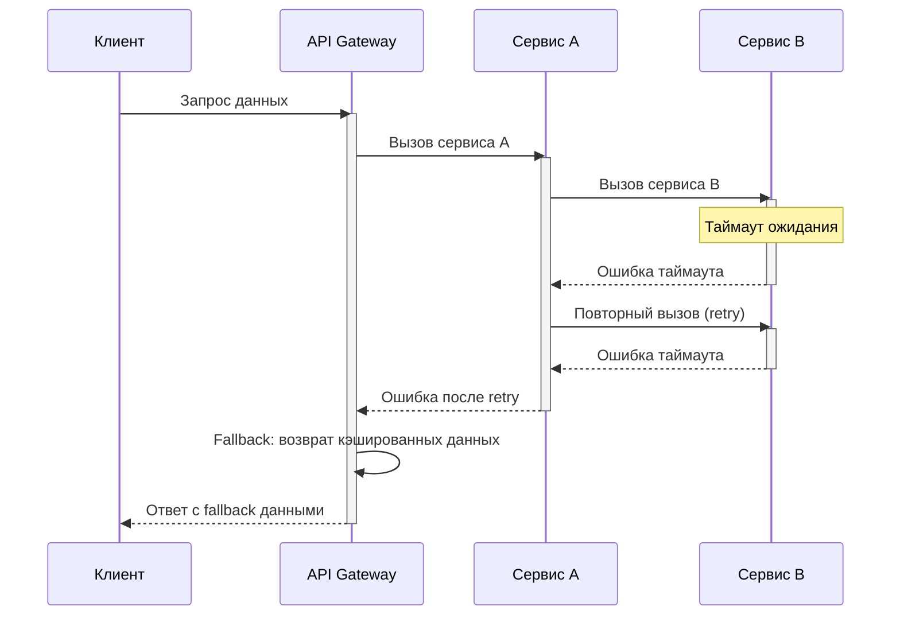
```mermaid
sequenceDiagram
    participant Client as Клиент
    participant APIGateway as API Gateway
    participant ServiceA as Сервис A
    participant ServiceB as Сервис B

    Client->>APIGateway: Запрос данных
    activate APIGateway
    APIGateway->>ServiceA: Вызов сервиса A
    activate ServiceA
    ServiceA->>ServiceB: Вызов сервиса B
    activate ServiceB
    Note over ServiceB: Таймаут ожидания
    ServiceB-->>ServiceA: Ошибка таймаута
    deactivate ServiceB
    ServiceA->>ServiceB: Повторный вызов (retry)
    activate ServiceB
    ServiceB-->>ServiceA: Ошибка таймаута
    deactivate ServiceB
    ServiceA-->>APIGateway: Ошибка после retry
    deactivate ServiceA
    APIGateway->>APIGateway: Fallback: возврат кэшированных данных
    APIGateway-->>Client: Ответ с fallback данными
    deactivate APIGateway
```

#### Saga Choreography

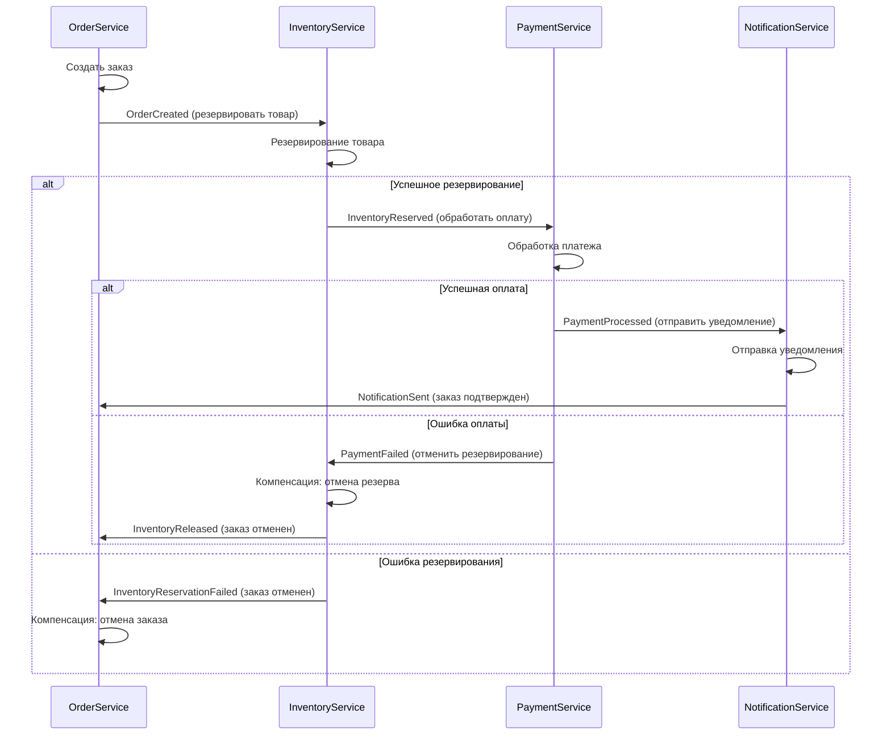
```mermaid
sequenceDiagram
    participant OrderService as OrderService
    participant InventoryService as InventoryService
    participant PaymentService as PaymentService
    participant NotificationService as NotificationService
    
    OrderService->>OrderService: Создать заказ
    OrderService->>InventoryService: OrderCreated (резервировать товар)
    InventoryService->>InventoryService: Резервирование товара
    alt Успешное резервирование
        InventoryService->>PaymentService: InventoryReserved (обработать оплату)
        PaymentService->>PaymentService: Обработка платежа
        alt Успешная оплата
            PaymentService->>NotificationService: PaymentProcessed (отправить уведомление)
            NotificationService->>NotificationService: Отправка уведомления
            NotificationService->>OrderService: NotificationSent (заказ подтвержден)
        else Ошибка оплаты
            PaymentService->>InventoryService: PaymentFailed (отменить резервирование)
            InventoryService->>InventoryService: Компенсация: отмена резерва
            InventoryService->>OrderService: InventoryReleased (заказ отменен)
        end
    else Ошибка резервирования
        InventoryService->>OrderService: InventoryReservationFailed (заказ отменен)
        OrderService->>OrderService: Компенсация: отмена заказа
    end
```

#### Saga Orchestration

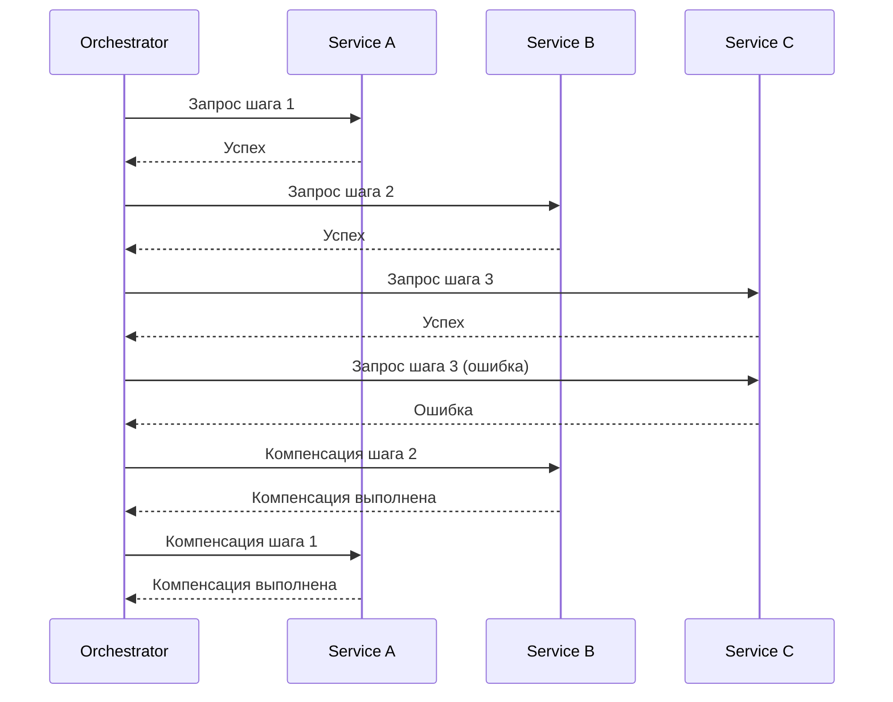
```mermaid
sequenceDiagram
    participant Orchestrator as Orchestrator
    participant ServiceA as Service A
    participant ServiceB as Service B
    participant ServiceC as Service C

    Orchestrator->>ServiceA: Запрос шага 1
    ServiceA-->>Orchestrator: Успех
    Orchestrator->>ServiceB: Запрос шага 2
    ServiceB-->>Orchestrator: Успех
    Orchestrator->>ServiceC: Запрос шага 3
    ServiceC-->>Orchestrator: Успех

    Orchestrator->>ServiceC: Запрос шага 3 (ошибка)
    ServiceC-->>Orchestrator: Ошибка
    Orchestrator->>ServiceB: Компенсация шага 2
    ServiceB-->>Orchestrator: Компенсация выполнена
    Orchestrator->>ServiceA: Компенсация шага 1
    ServiceA-->>Orchestrator: Компенсация выполнена
```

#### 2PC vs Saga

| Критерий | 2PC (2-Phase Commit) | Saga |
|----------|----------------------|------|
| Тип | Синхронная блокировка | Асинхронная |
| Консистентность | Сильная (Strong) | Конечная (Eventual) |
| Блокировка | Да (замки на время транзакции) | Нет (компенсация при ошибке) |
| Производительность | Низкая при большом числе участников | Высокая |
| Применимость в микросервисах | Крайне редка | Стандарт де-факто |

#### Outbox Pattern

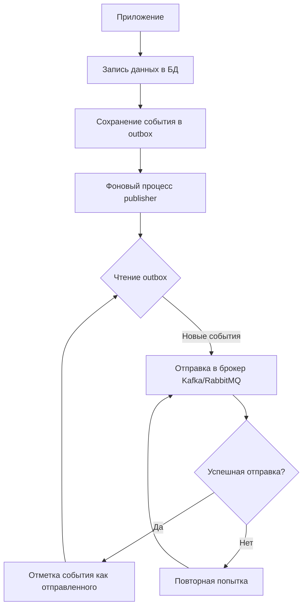
```mermaid
flowchart TD
    A[Приложение] --> B[Запись данных в БД]
    B --> C[Сохранение события в outbox]
    C --> D[Фоновый процесс publisher]
    D --> E{Чтение outbox}
    E -->|Новые события| F[Отправка в брокер Kafka/RabbitMQ]
    F --> G{Успешная отправка?}
    G -->|Да| H[Отметка события как отправленного]
    G -->|Нет| I[Повторная попытка]
    I --> F
    H --> E
```

### Пример: Saga Choreography на Spring/Kafka

```java
// === OrderService ===
@Service
public class OrderService {
    @EventListener
    public void onOrderCreated(OrderCreatedEvent event) {
        // Логика создания заказа
    }
    
    @EventListener
    public void onPaymentProcessed(PaymentProcessedEvent event) {
        // Заказ подтверждён
    }
    
    @EventListener
    public void onPaymentFailed(PaymentFailedEvent event) {
        // Компенсация: отмена заказа
    }
}

// === Событие (Kafka) ===
public record OrderCreatedEvent(Long orderId, Long productId, int quantity) {}
```

### Пример: Outbox Pattern на Spring + JDBC

```sql
-- Таблица outbox
CREATE TABLE outbox (
    id UUID PRIMARY KEY,
    aggregate_type VARCHAR(255) NOT NULL,
    aggregate_id VARCHAR(255) NOT NULL,
    event_type VARCHAR(255) NOT NULL,
    payload JSONB NOT NULL,
    created_at TIMESTAMP NOT NULL DEFAULT NOW(),
    sent_at TIMESTAMP NULL
);

CREATE INDEX idx_outbox_unsent ON outbox WHERE sent_at IS NULL;
```

```java
// === Outbox Service ===
@Service
@Transactional
public class OutboxService {
    private final JdbcTemplate jdbc;
    
    public void saveEvent(String aggregateType, String aggregateId, 
                          String eventType, Object payload) {
        jdbc.update(
            "INSERT INTO outbox (id, aggregate_type, aggregate_id, event_type, payload) VALUES (?, ?, ?, ?, ?::jsonb)",
            UUID.randomUUID(), aggregateType, aggregateId, eventType, toJson(payload)
        );
    }
}

// === Outbox Publisher ===
@Component
public class OutboxPublisher {
    @Scheduled(fixedDelay = 1000)
    @Transactional
    public void publishPendingEvents() {
        List<OutboxEvent> events = jdbc.query(
            "SELECT * FROM outbox WHERE sent_at IS NULL ORDER BY created_at LIMIT 100",
            eventRowMapper
        );
        for (OutboxEvent event : events) {
            try {
                kafkaTemplate.send(event.getEventType(), event.getPayload());
                jdbc.update("UPDATE outbox SET sent_at = NOW() WHERE id = ?", event.getId());
            } catch (Exception e) {
                log.error("Failed to send event: {}", event.getId(), e);
            }
        }
    }
}
```

### Ингос-секция: Паттерны в нашей системе

- Saga: Используем Choreography для процесса оформления полиса
- Outbox: Используется для гарантированной отправки событий в Kafka
- Риски: Синхронные вызовы между микросервисами приводят к каскадным таймаутам

### Практика

Спроектируйте Saga для процесса "Оформление страхового полиса":
1. Клиент отправляет заявку
2. Система проверяет данные (андеррайтинг)
3. Расчёт тарифа
4. Оплата
5. Выпуск полиса
6. Отправка уведомления

**Вопрос:** Какие компенсирующие действия нужны для каждого шага?

<details>
<summary>Ожидаемый ответ</summary>

| Шаг | Компенсирующее действие |
|-----|------------------------|
| 2. Андеррайтинг | Отменить проверку (если данные были заблокированы) |
| 3. Расчёт тарифа | Отменить расчёт (удалить кэш) |
| 4. Оплата | Возврат средств (refund) |
| 5. Выпуск полиса | Аннулировать полис |
| 6. Уведомление | Отправить уведомление об отмене |

</details>

### Контрольные вопросы

1. В чём разница между Saga (Choreography) и Saga (Orchestration)?
2. Как Outbox Pattern решает проблему dual-write?
3. Почему 2PC не рекомендуется в микросервисной архитектуре?
4. Какой паттерн выбрать, если нужна строгая консистентность?

---

## Модуль I-3. Многопоточность

### Цели модуля

После изучения вы сможете:
- Идентифицировать race condition и deadlock
- Применять примитивы синхронизации
- Рассчитывать размер пула потоков

### Теоретическая часть

#### Диаграмма состояний потока

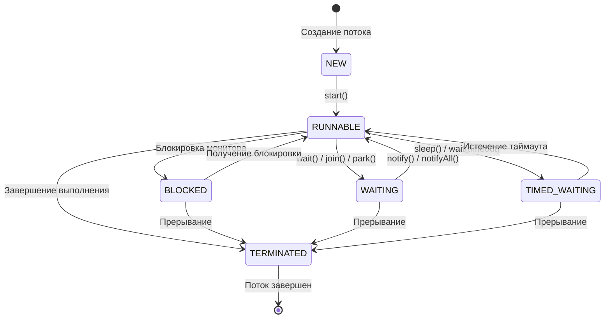
```mermaid
stateDiagram-v2
    [*] --> NEW : Создание потока
    NEW --> RUNNABLE : start()
    RUNNABLE --> BLOCKED : Блокировка монитора
    RUNNABLE --> WAITING : wait() / join() / park()
    RUNNABLE --> TIMED_WAITING : sleep() / wait(timeout)
    BLOCKED --> RUNNABLE : Получение блокировки
    WAITING --> RUNNABLE : notify() / notifyAll()
    TIMED_WAITING --> RUNNABLE : Истечение таймаута
    RUNNABLE --> TERMINATED : Завершение выполнения
    BLOCKED --> TERMINATED : Прерывание
    WAITING --> TERMINATED : Прерывание
    TIMED_WAITING --> TERMINATED : Прерывание
    TERMINATED --> [*] : Поток завершен
```

#### Deadlock: причины и решение

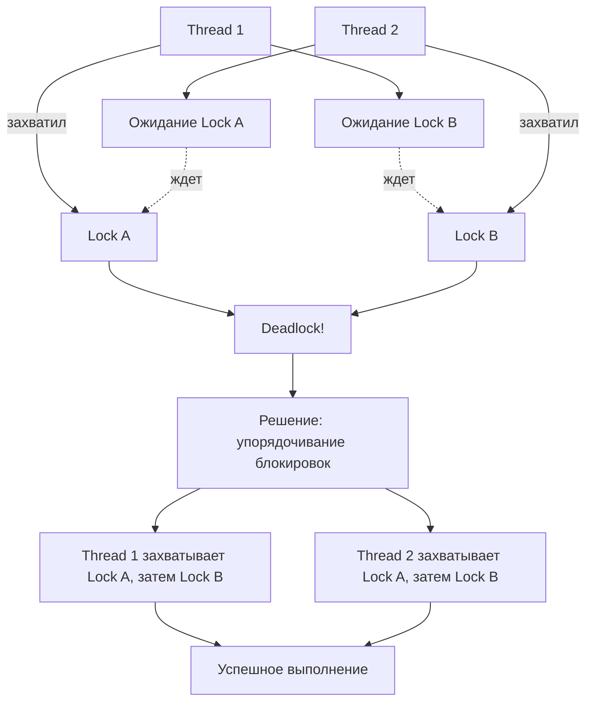
```mermaid
flowchart TD
    T1[Thread 1]
    T2[Thread 2]
    LA[Lock A]
    LB[Lock B]
    WAIT1[Ожидание Lock B]
    WAIT2[Ожидание Lock A]
    DEADLOCK[Deadlock!]
    SOL1[Решение: упорядочивание блокировок]
    T1_OK[Thread 1 захватывает Lock A, затем Lock B]
    T2_OK[Thread 2 захватывает Lock A, затем Lock B]
    SUCCESS[Успешное выполнение]

    T1 -->|захватил| LA
    T1 --> WAIT1
    WAIT1 -.->|ждет| LB
    T2 -->|захватил| LB
    T2 --> WAIT2
    WAIT2 -.->|ждет| LA
    LA --> DEADLOCK
    LB --> DEADLOCK

    DEADLOCK --> SOL1
    SOL1 --> T1_OK
    SOL1 --> T2_OK
    T1_OK --> SUCCESS
    T2_OK --> SUCCESS
```

#### Формула расчёта пула потоков

```
N_threads = N_cores * (1 + W / C)

где:
- N_cores - количество ядер процессора
- W (wait) - время ожидания (I/O, сеть)
- C (compute) - время вычислений
```

| Тип задачи | W/C | Пример N_threads (8 cores) |
|-----------|-----|---------------------------|
| CPU-bound | 0 | 8 |
| I/O-bound (БД) | ~10 | 88 |
| I/O-bound (сеть) | ~100 | 808 |
| Смешанный | ~3 | 32 |

### Примеры кода

#### Race Condition и её решение

```java
// Race Condition
public class Counter {
    private int count = 0;
    public void increment() { count++; } // НЕ атомарно!
}

// Решение 1: synchronized
public synchronized void increment() { count++; }

// Решение 2: AtomicInteger
private AtomicInteger count = new AtomicInteger(0);
public void increment() { count.incrementAndGet(); }

// Решение 3: ReentrantLock
private final ReentrantLock lock = new ReentrantLock();
public void increment() {
    lock.lock();
    try { count++; } finally { lock.unlock(); }
}
```

#### CompletableFuture для асинхронных задач

```java
private final ExecutorService executor = 
    Executors.newFixedThreadPool(10);

public CompletableFuture<Policy> calculatePrice(QuoteRequest request) {
    return CompletableFuture
        .supplyAsync(() -> validateQuote(request), executor)
        .thenApplyAsync(validated -> calculateTariff(validated), executor)
        .thenApplyAsync(tariff -> applyDiscounts(tariff), executor)
        .exceptionally(ex -> {
            log.error("Failed to calculate price", ex);
            return Policy.defaultFallback();
        });
}
```

#### Виртуальные потоки (Java 21+)

```java
// Virtual threads - каждая задача в своём виртуальном потоке
try (var executor = Executors.newVirtualThreadPerTaskExecutor()) {
    List<Future<Policy>> futures = requests.stream()
        .map(req -> executor.submit(() -> processQuote(req)))
        .toList();
    for (Future<Policy> future : futures) {
        policies.add(future.get());
    }
}
```

### Ингос-секция: Многопоточность у нас

- Расчётные задачи: Fixed thread pool (8 потоков для CPU-bound расчётов)
- I/O-задачи (запросы к внешним API): Cached thread pool
- Проблемы: Race condition при параллельном обновлении полиса
- Решение: Оптимистическая блокировка через version-поле

### Практика

У вас сервис расчёта страховых тарифов. Нагрузка: 1000 RPS, время вычисления на одном ядре - 50ms, время чтения из БД - 20ms. Сколько ядер CPU нужно для сервиса при utilisation target 80%?

**Формула:** CPU_cores_needed = RPS * CPU_time_per_request / utilization_target

<details>
<summary>Ожидаемый ответ</summary>

- RPS = 1000
- CPU_time_per_request = 50ms / 1000 = 0.05 сек (на одном ядре)
- utilisation_target = 0.8

CPU_cores_needed = 1000 * 0.05 / 0.8 = 62.5 ~ 64 cores

Для I/O-bound (50ms compute + 20ms wait): N = 64 * (1 + 20/50) ~ 90 потоков

</details>

### Контрольные вопросы

1. В чём разница между deadlock и livelock?
2. Когда использовать synchronized, а когда ReentrantLock?
3. Как виртуальные потоки (Java 21) меняют подход к пулам потоков?
4. Что такое false sharing и как его избежать?

---

## Модуль I-4. Нефункциональные требования (НФТ)

### Цели модуля

После изучения вы сможете:
- Формулировать НФТ совместно с заказчиком
- Использовать CAP-теорему для выбора БД
- Определять метрики производительности

### Теоретическая часть

#### CAP-треугольник

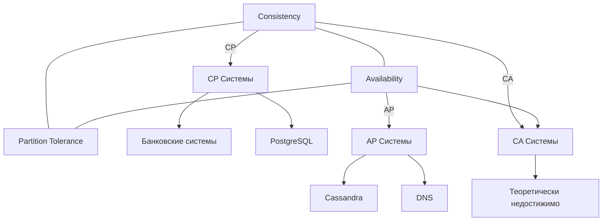
```mermaid
flowchart TD
    C[Consistency] --- A[Availability]
    C --- P[Partition Tolerance]
    A --- P

    C -->|CP| CP_Zone[CP Системы]
    CP_Zone --> Bank[Банковские системы]
    CP_Zone --> PostgreSQL[PostgreSQL]

    A -->|AP| AP_Zone[AP Системы]
    AP_Zone --> Cassandra[Cassandra]
    AP_Zone --> DNS[DNS]

    C -->|CA| CA_Zone[CA Системы]
    A --> CA_Zone
    CA_Zone --> Theoretical[Теоретически недостижимо]
```

#### CAP + PACELC

| Теорема | Суть |
|---------|------|
| CAP | В распределённой системе из 3 свойств (Consistency, Availability, Partition Tolerance) можно гарантировать только 2 |
| PACELC | Расширение CAP: если Partition - выбор (Availability или Consistency). Иначе (Else) - выбор (Latency или Consistency) |

#### Метрики производительности

| Метрика | Определение | Целевое значение |
|---------|------------|------------------|
| Latency | Время ответа сервиса | P99 < 500ms |
| Throughput | Количество запросов в секунду | 1000+ RPS |
| Availability | Процент времени, когда сервис доступен | 99.9% |
| Error Rate | Доля ошибочных ответов | < 0.1% |

#### Таблица времён простоя

| Availability | Допустимый downtime в год |
|-------------|--------------------------|
| 99% (две девятки) | 3.65 дня |
| 99.9% (три девятки) | 8.76 часа |
| 99.99% (четыре девятки) | 52.56 минуты |
| 99.999% (пять девяток) | 5.26 минуты |

### Ингос-секция: Какие НФТ мы используем

- SLA с бизнесом: 99.9% availability в рабочее время (8:00-20:00)
- Latency target: P99 < 1s для синхронных API
- Throughput: capacity planning на 2x от текущей нагрузки
- PACELC-выбор: Для core-данных (полисы) - CP; Для аналитики - AP

### Практика

Заказчик говорит: "Система должна быть отказоустойчивой". Как перевести это в измеримые НФТ?

<details>
<summary>Ожидаемый ответ</summary>

1. Определить SLA: 99.9% availability (8.76 ч/год downtime)
2. SLO: 99.95% uptime за месяц
3. SLI: доля успешных запросов за 5-минутное окно
4. RTO (Recovery Time Objective): < 15 минут
5. RPO (Recovery Point Objective): < 1 минута
6. Стратегия: active-active или active-passive

</details>

### Контрольные вопросы

1. Почему CA-комбинация в CAP-теореме недостижима на практике?
2. Какую из CAP выбрать для банковской транзакции? Для логов?
3. Чем отличается SLA от SLO?
4. Что такое PACELC и как он дополняет CAP?

---

## Модуль I-5. DDD, CQS/CQRS, TDD/BDD, API First

### Цели модуля

После изучения вы сможете:
- Применять стратегическое моделирование DDD (Bounded Context, Ubiquitous Language)
- Разделять команды и запросы (CQS/CQRS)
- Использовать TDD/BDD-цикл в разработке

### Теоретическая часть

#### Bounded Context Map (DDD)

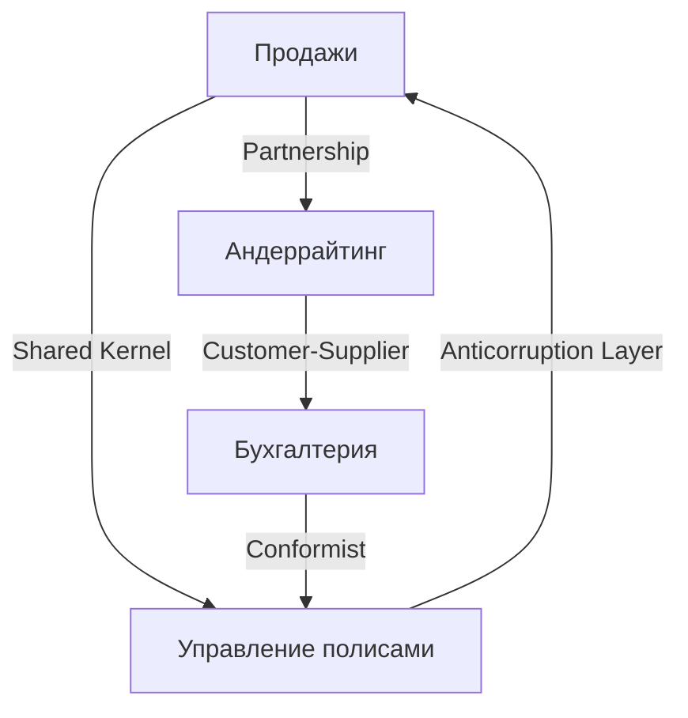
```mermaid
flowchart TD
    Sales[Продажи]
    Underwriting[Андеррайтинг]
    Accounting[Бухгалтерия]
    PolicyMgmt[Управление полисами]

    Sales -->|Partnership| Underwriting
    Sales -->|Shared Kernel| PolicyMgmt
    Underwriting -->|Customer-Supplier| Accounting
    Accounting -->|Conformist| PolicyMgmt
    PolicyMgmt -->|Anticorruption Layer| Sales
```

#### CQRS-поток

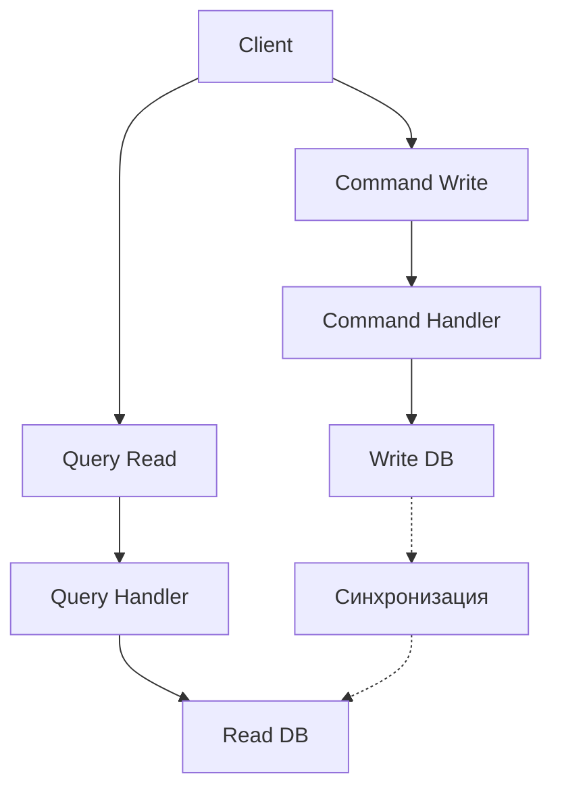
```mermaid
flowchart TD
    Client[Client] --> Command[Command Write]
    Command --> CommandHandler[Command Handler]
    CommandHandler --> WriteDB[Write DB]
    Client --> Query[Query Read]
    Query --> QueryHandler[Query Handler]
    QueryHandler --> ReadDB[Read DB]
    WriteDB -.-> Sync[Синхронизация]
    Sync -.-> ReadDB
```

#### TDD-цикл

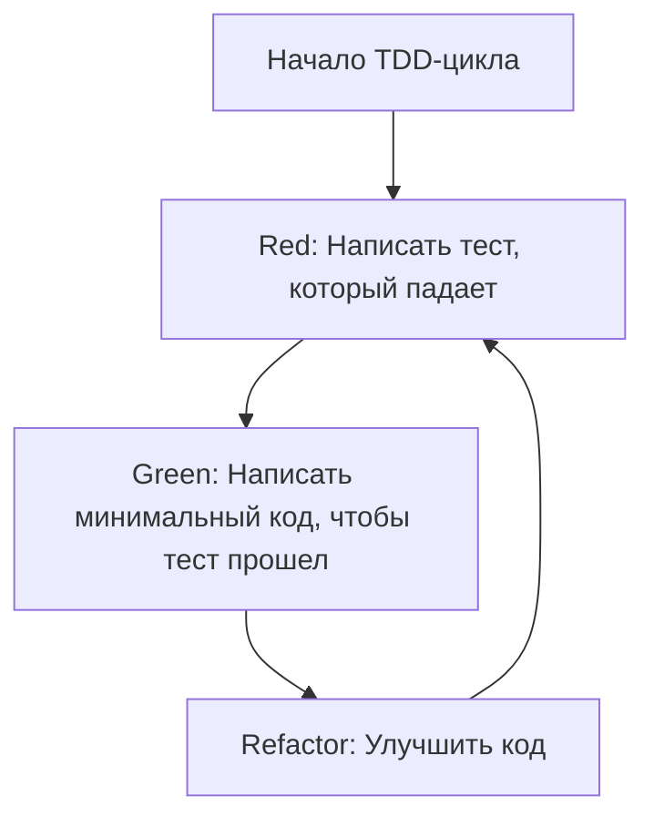
```mermaid
flowchart TD
    A[Начало TDD-цикла] --> B[Red: Написать тест, который падает]
    B --> C[Green: Написать минимальный код, чтобы тест прошел]
    C --> D[Refactor: Улучшить код]
    D --> B
```

### Пример кода: Value Object (DDD)

```java
// Value Object - иммутабельный, с behaviour
public record Money(BigDecimal amount, Currency currency) {
    public Money {
        if (amount.compareTo(BigDecimal.ZERO) < 0) {
            throw new IllegalArgumentException("Amount must be non-negative");
        }
        if (currency == null) {
            throw new IllegalArgumentException("Currency must not be null");
        }
    }
    
    public Money add(Money other) {
        if (!this.currency.equals(other.currency)) {
            throw new IllegalArgumentException("Currency mismatch");
        }
        return new Money(this.amount.add(other.amount), this.currency);
    }
}
```

### Ингос-секция: Методологии

- DDD: Используем Bounded Context для границ микросервисов
- CQRS: Только для read-heavy операций (дашборды, отчёты)
- TDD: Для core-доменов обязателен
- API First: OpenAPI спецификация для всех новых сервисов

### Практика

Создайте BDD-сценарий (Gherkin) для функции "Расчёт стоимости страховки водителя":

```gherkin
Feature: Расчёт стоимости страховки
  As a клиент
  I want получить стоимость страховки
  So that принять решение о покупке

  Scenario: Водитель младше 25 лет
    Given водитель возрастом 22 года
    And водитель со стажем 3 года
    When запрашивается стоимость полиса
    Then стоимость должна быть увеличена на коэффициент 1.5
```

### Контрольные вопросы

1. В чём разница между Entity и Value Object в DDD?
2. Когда CQRS оправдан, а когда - overengineering?
3. Как TDD влияет на дизайн API?
4. Что такое Ubiquitous Language и как её создать?

---

## Модуль I-6. Управление общими данными

### Цели модуля

После изучения вы сможете:
- Проектировать единый источник правды (SSOT)
- Реализовывать идемпотентность на уровне API
- Использовать versioning для оптимистической блокировки

### Теоретическая часть

#### SSOT - Единый источник правды

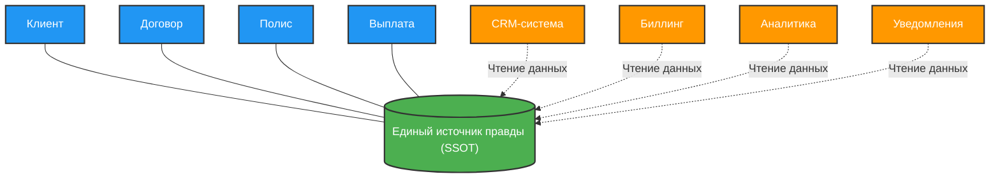
```mermaid
flowchart TD
    classDef ssot fill:#4CAF50,color:white,stroke:#333,stroke-width:2px
    classDef entity fill:#2196F3,color:white,stroke:#333,stroke-width:2px
    classDef service fill:#FF9800,color:white,stroke:#333,stroke-width:2px

    SSOT[("Единый источник правды (SSOT)")]:::ssot

    Client[Клиент]:::entity
    Contract[Договор]:::entity
    Policy[Полис]:::entity
    Payment[Выплата]:::entity

    CRM[CRM-система]:::service
    Billing[Биллинг]:::service
    Analytics[Аналитика]:::service
    Notifier[Уведомления]:::service

    Client --- SSOT
    Contract --- SSOT
    Policy --- SSOT
    Payment --- SSOT

    CRM -.->|Чтение данных| SSOT
    Billing -.->|Чтение данных| SSOT
    Analytics -.->|Чтение данных| SSOT
    Notifier -.->|Чтение данных| SSOT
```

#### State Machine жизненного цикла данных

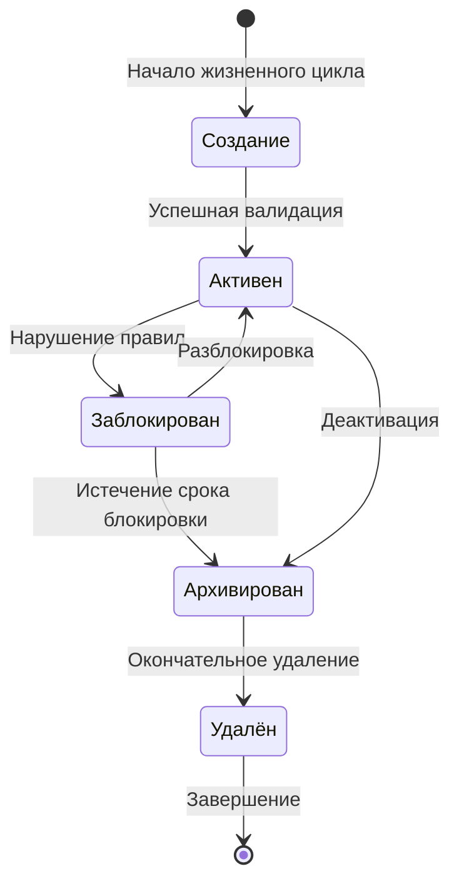
```mermaid
stateDiagram-v2
    [*] --> Создание : Начало жизненного цикла
    Создание --> Активен : Успешная валидация
    Активен --> Заблокирован : Нарушение правил
    Заблокирован --> Активен : Разблокировка
    Заблокирован --> Архивирован : Истечение срока блокировки
    Активен --> Архивирован : Деактивация
    Архивирован --> Удалён : Окончательное удаление
    Удалён --> [*] : Завершение
```

#### Optimistic Locking

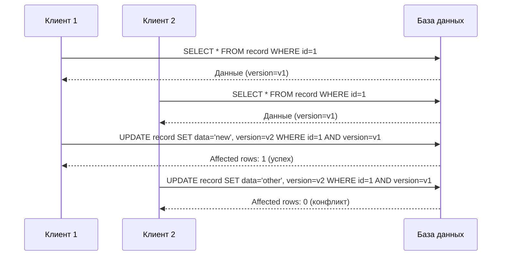
```mermaid
sequenceDiagram
    participant Client1 as Клиент 1
    participant Client2 as Клиент 2
    participant DB as База данных

    Client1->>DB: SELECT * FROM record WHERE id=1
    DB-->>Client1: Данные (version=v1)
    Client2->>DB: SELECT * FROM record WHERE id=1
    DB-->>Client2: Данные (version=v1)
    Client1->>DB: UPDATE record SET data='new', version=v2 WHERE id=1 AND version=v1
    DB-->>Client1: Affected rows: 1 (успех)
    Client2->>DB: UPDATE record SET data='other', version=v2 WHERE id=1 AND version=v1
    DB-->>Client2: Affected rows: 0 (конфликт)
```

### Примеры кода

#### Идемпотентный API

```java
@PostMapping("/orders")
public ResponseEntity<Order> createOrder(@RequestBody @Valid CreateOrderRequest request,
                                          @RequestHeader("Idempotency-Key") String idempotencyKey) {
    Optional<Order> existing = orderService.findByIdempotencyKey(idempotencyKey);
    if (existing.isPresent()) {
        return ResponseEntity.status(HttpStatus.CONFLICT).body(existing.get());
    }
    
    Order order = orderService.create(request, idempotencyKey);
    return ResponseEntity.status(HttpStatus.CREATED).body(order);
}
```

#### Оптимистическая блокировка (JPA)

```java
@Entity
@Table(name = "policies")
public class Policy {
    @Id
    private Long id;
    
    @Version  // Автоматически управляется JPA
    private Long version;
    
    private String data;
}
```

### Ингос-секция: Управление данными

- SSOT для договора: Один источник правды в PolicyService
- Идемпотентность: Все create-эндпоинты принимают Idempotency-Key
- Версионирование: Оптимистическая блокировка для всех core-сущностей
- Проблема: Некоторые сервисы дублируют данные договора (нарушение SSOT)

### Практика

Спроектируйте идемпотентный API для создания выплаты. Какой HTTP статус вернуть при повторном запросе с тем же idempotency key?

<details>
<summary>Ожидаемый ответ</summary>

При повторном запросе с тем же idempotency key:
- Если выплата уже создана -> 200 OK (с данными выплаты)
- Если запрос ещё в обработке -> 202 Accepted
- Если выплата завершена с ошибкой -> 422 Unprocessable Entity

</details>

### Контрольные вопросы

1. Чем SSOT отличается от децентрализованного хранения?
2. Как идемпотентность защищает от двойных платежей?
3. Что лучше: optimistic или pessimistic locking?
4. Какие проблемы возникают при нарушении SSOT?

---

# Часть II. Архитектура решений

---

## Модуль II-0. Подсчёт и планирование нагрузки

### Цели модуля

После изучения вы сможете:
- Рассчитывать необходимые ресурсы (CPU, RAM) под нагрузку
- Составлять capacity planning на 6-18 месяцев

### Теоретическая часть

#### Процесс Capacity Planning

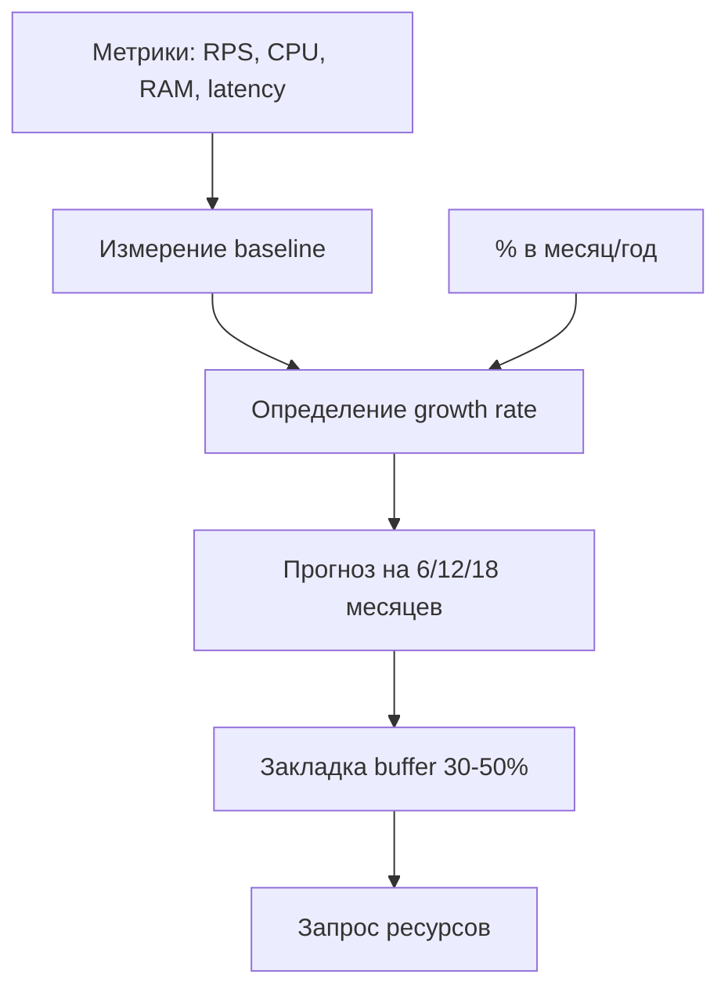
```mermaid
flowchart TD
    A[Измерение baseline] --> B[Определение growth rate]
    B --> C[Прогноз на 6/12/18 месяцев]
    C --> D[Закладка buffer 30-50%]
    D --> E[Запрос ресурсов]

    A1[Метрики: RPS, CPU, RAM, latency] --> A
    B1[% в месяц/год] --> B
```

#### Формулы расчёта

| Параметр | Формула | Пример |
|----------|---------|--------|
| CPU cores | RPS * CPU_time_per_request / utilization_target | 1000 * 0.05 / 0.8 = 62.5 ~ 64 cores |
| RAM | RPS * memory_per_request * avg_request_duration | 1000 * 10MB * 60s = 600GB |
| Thread pool | N_cores * (1 + wait_time / compute_time) | 64 * (1 + 20/50) ~ 90 threads |

### Ингос-секция: Наш capacity planning

- База: Текущая нагрузка +30% годовой рост
- CPU для расчётного сервиса: 32 cores (core: 16, buffer: 2x)
- RAM: 128 GB для in-memory кэша
- Практика: Раз в квартал пересмотр

### Практика

Рассчитайте CPU для сервиса с параметрами: RPS=500, CPU_time=100ms, utilization=85%.

<details>
<summary>Ожидаемый ответ</summary>

CPU_cores = 500 * 0.1 / 0.85 = 58.8 ~ 64 cores (с округлением и buffer)

</details>

### Контрольные вопросы

1. Какой buffer обычно закладывают в capacity planning?
2. Как часто нужно пересчитывать ресурсы?
3. Как учитывать сезонность в нагрузке?

---

## Модуль II-1. Трейдоффы: Быстро - Дёшево - Надёжно

### Цели модуля

После изучения вы сможете:
- Анализировать трейдоффы архитектурных решений
- Применять треугольник компромиссов
- Документировать принятые компромиссы

### Теоретическая часть

#### Треугольник компромиссов

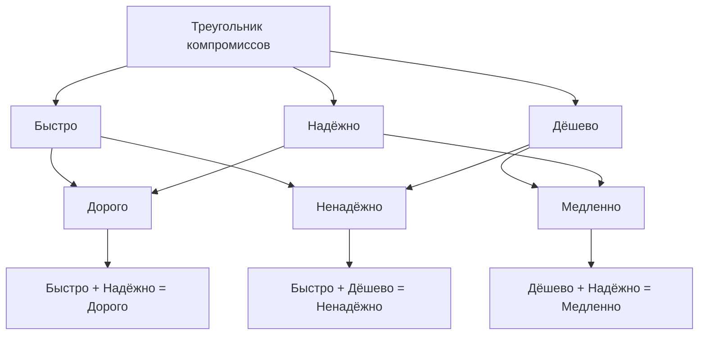
```mermaid
flowchart TD
    A[Треугольник компромиссов] --> B[Быстро]
    A --> C[Дёшево]
    A --> D[Надёжно]
    
    B & D --> E[Дорого]
    B & C --> F[Ненадёжно]
    C & D --> G[Медленно]
    
    E --> H[Быстро + Надёжно = Дорого]
    F --> I[Быстро + Дёшево = Ненадёжно]
    G --> J[Дёшево + Надёжно = Медленно]
```

#### Примеры трейдоффов

| Решение | Что получаем | Чем жертвуем |
|---------|-------------|--------------|
| Использовать managed БД (RDS) | Надёжность, быстрота запуска | Деньги |
| Написать свою библиотеку | Контроль | Время разработки |
| Eventual consistency | Производительность | Консистентность |
| Монолит | Простота | Масштабируемость |

### Ингос-секция: Ключевые трейдоффы

- Выбрали Kafka вместо RabbitMQ: Надёжность + масштабирование -> сложность
- Оставили монолит для core: Скорость разработки -> сложность масштабирования
- SSOT через API: Консистентность -> задержка

### Практика

Опишите трейдофф: "Замена монолитного сервиса расчётов на микросервис с REST API и кэшем Redis".

<details>
<summary>Ожидаемый ответ</summary>

| Что получаем | Чем жертвуем |
|-------------|--------------|
| Масштабирование расчётов независимо | Сетевая задержка (REST) |
| Изоляция сбоев | Сложность (Circuit Breaker, retry) |
| Быстрый кэш (Redis) | Конечная консистентность кэша |
| Возможность переиспользовать сервис | Дополнительная инфраструктура |

</details>

### Контрольные вопросы

1. Можно ли получить все три вершины треугольника одновременно?
2. Как документировать трейдоффы в проекте?
3. Какой трейдофф выбрать для MVP? Для enterprise-продукта?

---

## Модуль II-2. НФТ с точки зрения архитектуры приложения

### Цели модуля

После изучения вы сможете:
- Проектировать Circuit Breaker для отказоустойчивости
- Определять SLA/SLO/SLI для сервиса

### Теоретическая часть

#### Circuit Breaker State Machine

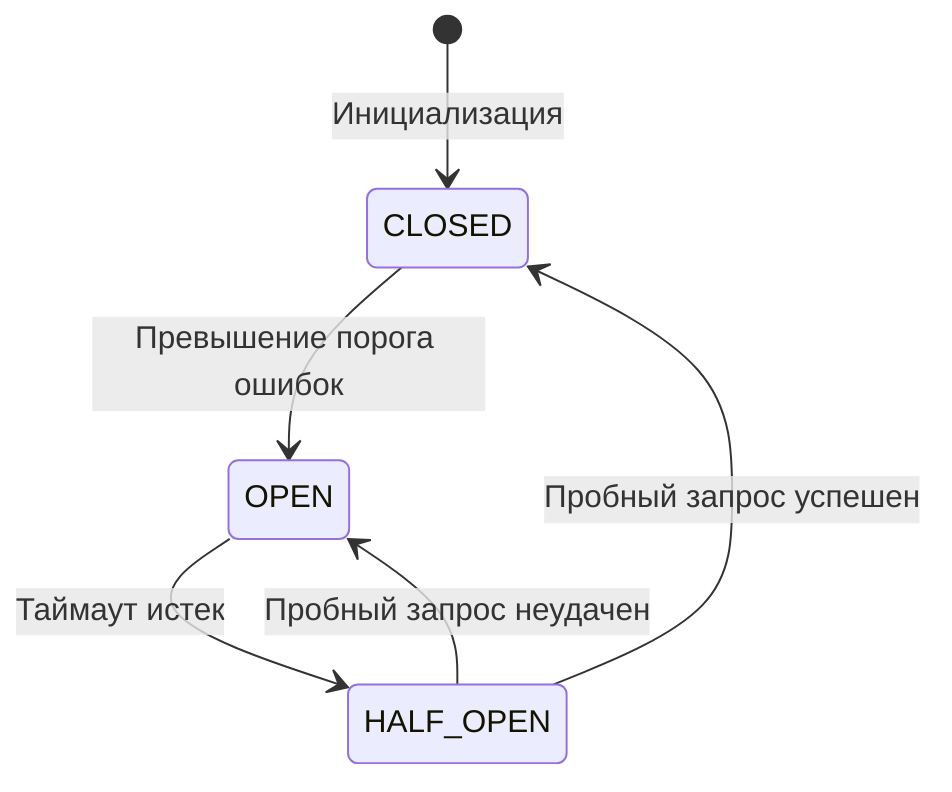
```mermaid
stateDiagram-v2
    [*] --> CLOSED : Инициализация
    CLOSED --> OPEN : Превышение порога ошибок
    OPEN --> HALF_OPEN : Таймаут истек
    HALF_OPEN --> CLOSED : Пробный запрос успешен
    HALF_OPEN --> OPEN : Пробный запрос неудачен
```

### Пример: Circuit Breaker с Resilience4j

```java
// pom.xml
<dependency>
    <groupId>io.github.resilience4j</groupId>
    <artifactId>resilience4j-spring-boot3</artifactId>
</dependency>

// application.yml
resilience4j.circuitbreaker:
  configs:
    default:
      slidingWindowSize: 10
      minimumNumberOfCalls: 5
      failureRateThreshold: 50
      waitDurationInOpenState: 10s
      permittedNumberOfCallsInHalfOpenState: 3

// Service
@Service
public class PaymentService {
    @CircuitBreaker(name = "paymentService", fallbackMethod = "fallback")
    public PaymentResult processPayment(PaymentRequest request) {
        return restTemplate.postForObject(paymentApiUrl, request, PaymentResult.class);
    }
    
    public PaymentResult fallback(PaymentRequest request, Throwable t) {
        log.warn("Payment service unavailable, returning default", t);
        return PaymentResult.retryLater(request.getOrderId());
    }
}
```

### Распределённый трейсинг (OpenTelemetry)

```java
// Добавление трейсинга в проект
// 1. Добавить зависимость opentelemetry-javaagent
// 2. Настроить экспорт в Jaeger/Zipkin

@Slf4j
@Service
public class PolicyService {
    public Policy createPolicy(CreatePolicyRequest request) {
        log.info("Creating policy for request: {}", request);
        // ... логика
    }
}
```

### Ингос-секция: Отказоустойчивость

- Circuit Breaker: Для всех внешних вызовов
- Retry: Для временных ошибок (до 3 попыток)
- Fallback: Возврат кэшированных данных при недоступности сервиса
- Трейсинг: Внедряем OpenTelemetry

### Практика

Настройте Circuit Breaker для сервиса с параметрами: 10 запросов в окне, порог ошибок 40%, время восстановления 30 секунд, 2 пробных запроса.

### Контрольные вопросы

1. Какие состояния есть у Circuit Breaker?
2. Как выбрать порог ошибок для Circuit Breaker?
3. Чем SLI отличается от SLO?

---

## Модуль II-3. Стратегии интеграции

### Цели модуля

После изучения вы сможете:
- Выбирать между синхронной, асинхронной и файловой интеграцией
- Понимать, когда использовать брокеры сообщений

### Теоретическая часть

#### Decision Tree выбора стратегии интеграции

```mermaid
flowchart TD
    A[Старт] --> B{Нужен немедленный ответ?}
    B -->|Да| C[Синхронная интеграция]
    B -->|Нет| D{Объём данных > 10MB?}
    D -->|Да| E[Интеграция через файлы]
    D -->|Нет| F{Скорость важнее консистентности?}
    F -->|Да| G[Асинхронная интеграция]
    F -->|Нет| C
```

### Пример: Kafka producer/consumer

```java
// Producer
@Service
public class PolicyEventProducer {
    private final KafkaTemplate<String, PolicyEvent> kafka;
    
    public void policyCreated(Policy policy) {
        kafka.send("policy-events", new PolicyEvent(policy.getId(), "CREATED", policy));
    }
}

// Consumer
@Component
public class PolicyEventListener {
    @KafkaListener(topics = "policy-events", groupId = "notification-group")
    public void handlePolicyCreated(PolicyEvent event) {
        if ("CREATED".equals(event.getType())) {
            notificationService.send(event.getPolicy().getOwnerEmail(), 
                "Your policy has been created!");
        }
    }
}

// application.yml
spring.kafka:
  consumer:
    group-id: payment-service
    auto-offset-reset: earliest
  producer:
    retries: 3
```

### Ингос-секция: Интеграции

- REST: Операции, требующие немедленного ответа (расчёт стоимости)
- Kafka: Долгие процессы (оформление полиса через Saga)
- Файлы: Выгрузка отчётов для внешних систем

### Контрольные вопросы

1. Когда синхронная интеграция опасна?
2. В каких случаях файловая интеграция - лучший выбор?
3. Как обработать poison pill в Kafka?

---

## Модуль II-4. Bounded Context и C4-диаграммы

### Цели модуля

После изучения вы сможете:
- Проектировать Bounded Context с помощью DDD
- Рисовать C4-диаграммы всех 4 уровней

### Теоретическая часть

#### C4 Model - все 4 уровня

```mermaid
flowchart TD
    subgraph Level1[Level 1: System Context]
        User[Пользователь] -->|HTTP| System[Система]
        System -->|API| ExternalSystem[Внешняя система]
    end

    subgraph Level2[Level 2: Container]
        WebApp[Веб-приложение] -->|REST| ApiGateway[API Gateway]
        ApiGateway -->|gRPC| ServiceA[Сервис A]
        ApiGateway -->|gRPC| ServiceB[Сервис B]
        ServiceA -->|SQL| Database[(База данных)]
        ServiceB -->|AMQP| Queue[Очередь сообщений]
    end

    subgraph Level3[Level 3: Component]
        Controller[Контроллер] -->|Вызов| Service[Сервисный слой]
        Service -->|Запрос| Repository[Репозиторий]
        Repository -->|ORM| Database2[(БД)]
        Service -->|Отправка| MessageBroker[Брокер сообщений]
    end

    subgraph Level4[Level 4: Code]
        UserClass[UserController] -->|dependency| UserService[UserService]
        UserService -->|implements| IUserService[IUserService]
        UserService -->|uses| UserRepository[UserRepository]
        UserRepository -->|extends| BaseRepository[BaseRepository]
    end

    System --> WebApp
    ApiGateway --> Controller
    ServiceA --> Service
    Database --> Database2
```

### Пример: Structurizr DSL для C4

```
workspace {
    model {
        user = person "Пользователь"
        system = softwareSystem "Система страхования"
        
        user -> system "Использует"
        system -> extSystem "Проверяет историю" "REST"
    }
    
    views {
        systemContext system "Контекст системы" {
            include *
            autoLayout
        }
    }
}
```

### Ингос-секция: C4 в проектах

- Level 1: Нарисована для всех 4 доменов
- Level 2: Для каждого нового микросервиса
- Level 3: Для core-сервисов
- Level 4: Для сложных/критичных классов

### Практика

Нарисуйте C4 Level 2 для сервиса "Управление полисами": Web App -> API Gateway -> Policy Service -> PostgreSQL + Kafka.

### Контрольные вопросы

1. Кто целевая аудитория Level 1? Level 4?
2. Какие отношения Bounded Context вы знаете?
3. Чем Structurizr отличается от ручного рисования диаграмм?

---

## Модуль II-5. Эволюция архитектуры

### Цели модуля

После изучения вы сможете:
- Применять Strangler Fig для миграции с монолита
- Анализировать архитектуру с помощью метрик

### Теоретическая часть

#### Strangler Fig Pattern

```mermaid
flowchart TD
    subgraph Этап1[Этап 1: Монолит]
        M1[Монолит] -->|100% функциональности| U1[Пользователи]
    end

    subgraph Этап2[Этап 2: Монолит + 1 микросервис]
        M2[Монолит] -->|80% функциональности| U2[Пользователи]
        MS1[Микросервис 1] -->|20% функциональности| U2
        M2 -.->|Замена 20%| MS1
    end

    subgraph Этап3[Этап 3: Монолит + 3 микросервиса]
        M3[Монолит] -->|40% функциональности| U3[Пользователи]
        MS2[Микросервис 1] -->|20% функциональности| U3
        MS3[Микросервис 2] -->|20% функциональности| U3
        MS4[Микросервис 3] -->|20% функциональности| U3
        M3 -.->|Замена 60%| MS2
        M3 -.->|Замена 60%| MS3
        M3 -.->|Замена 60%| MS4
    end

    subgraph Этап4[Этап 4: Все в микросервисах]
        MS5[Микросервис 1] -->|25% функциональности| U4[Пользователи]
        MS6[Микросервис 2] -->|25% функциональности| U4
        MS7[Микросервис 3] -->|25% функциональности| U4
        MS8[Микросервис 4] -->|25% функциональности| U4
        M4[Монолит] -.->|Отключен| X[Удален]
    end

    Этап1 -->|Поэтапная замена| Этап2
    Этап2 -->|Поэтапная замена| Этап3
    Этап3 -->|Полная замена| Этап4
```

#### Антипаттерны миграции

| Антипаттерн | Описание | Как избежать |
|-------------|----------|-------------|
| Big Bang | Одномоментное переключение с монолита | Strangler Fig |
| Distributed Monolith | Микросервисы с синхронными зависимостями | Event-driven |
| Shared Database | Несколько сервисов - одна БД | Каждому сервису - своя БД |
| Sync Over Async | Синхронные вызовы там, где нужна асинхронность | Брокеры сообщений |

### Ингос-секция: Миграция

- Цель: Переход от монолита к модульному монолиту
- Метод: Strangler Fig - вырезаем функциональность по частям
- Сейчас: Андеррайтинг вынесен в отдельный сервис
- Проблема: Временами получаем Distributed Monolith

### Практика

У вас есть монолит с функциональностью: Auth, Catalog, Orders, Payments, Notifications. Какую функциональность вы вынесете первой и почему?

<details>
<summary>Ожидаемый ответ</summary>

Приоритет:
1. Notifications - изолирован, минимум зависимостей
2. Auth - даёт независимую систему логина
3. Payments - если есть PCI DSS требования
4. Orders - core-домен, требует много тестов
5. Catalog - можно оставить последним

</details>

### Контрольные вопросы

1. Почему Big Bang - плохая стратегия миграции?
2. В чём опасность Distributed Monolith?
3. Как метрика Distance помогает во время миграции?

---

## Модуль II-6. ADR - Architecture Decision Records

### Цели модуля

После изучения вы сможете:
- Писать ADR по шаблону Michael Nygard
- Документировать риски и НФТ
- Проходить процесс ArchCom

### Теоретическая часть

#### ADR Lifecycle

```mermaid
flowchart TD
    A[ADR Proposed] --> B{ArchCom Review}
    B -->|Accepted| C[ADR Accepted]
    B -->|Rejected| D[ADR Rejected]
    C --> E[ADR Deprecated]
    E --> F[ADR Superseded]
```

#### Процесс ArchCom

```mermaid
flowchart TD
    A[Разработчик/аналитик] -->|Пишет ADR| B[ADR в markdown в репозитории]
    B -->|Публикует для обсуждения| C{RFC period 3-5 дней}
    C -->|Обсуждение завершено| D[ArchCom рассматривает]
    D -->|Ставит статус| E{Решение принято?}
    E -->|Да| F[Принятое решение фиксируется]
    E -->|Нет| G[Отклонено / требуется доработка]
    F --> H[Не пересматривается без нового ADR]
    G --> A
```

#### Шаблон ADR (Michael Nygard)

```markdown
# ADR-001: Использование Kafka для Saga-процессов

## Status
Proposed (| Accepted | Deprecated | Superseded)

## Context
(Проблема, предпосылки, ограничения)

## Options
1. **Kafka** - высокая пропускная способность, durability, replay
2. **RabbitMQ** - простота, низкая задержка
3. **SQS** - managed, дешево

## Decision
Выбрали **Kafka** по следующим причинам:
- Требуется replay (перечитывание событий)
- Высокая нагрузка (1000+ msg/s)
- Сохранение событий для аудита

## Consequences (Risks)
- Долговременное хранение событий
- Масштабирование consumer'ов
- Сложность настройки (partitions, replication)

## NFR
- Availability: 99.95%
- Durability: at-least-once delivery
- Throughput: 10000 msg/s

## Evolution Plan
- Этап 1: Kafka + 3 brokers
- Этап 2: Schema Registry
- Этап 3: Kafka Streams для агрегации
```

### Ингос-секция: ArchCom

- Храним ADR: В репозитории docs/adr/ каждого сервиса
- Процесс: RFC -> 3 дня на обсуждение -> ArchCom -> решение
- Соблюдение: Все архитектурные изменения должны быть ADR

### Практика

Напишите ADR для решения: "Переход с REST на gRPC для внутренних сервисов".

<details>
<summary>Пример ADR</summary>

```markdown
# ADR-004: gRPC для межсервисного взаимодействия

## Status
Proposed

## Context
Текущая архитектура использует REST для общения между сервисами.
С ростом числа вызовов возникли проблемы:
- Высокая задержка (сериализация JSON)
- Отсутствие строгих контрактов
- Сложно управлять версионированием API

## Options
1. REST + OpenAPI (текущий подход)
2. gRPC (protobuf, HTTP/2, стриминг)
3. GraphQL (гибкие запросы)

## Decision
gRPC:
- protobuf -> компактные сообщения, быстрее JSON
- HTTP/2 -> мультиплексирование, стриминг
- Code generation -> контракты всегда актуальны

## Consequences
- Скорость: в 5-7 раз быстрее REST/JSON
- Строгая типизация контрактов
- Нет в браузере (нужен grpc-web)
- Сложнее отладка (бинарный протокол)

## NFR
- Latency: P99 < 10ms (вместо 50ms REST)
- Throughput: 10000 RPS

## Evolution Plan
1. Пилот: сервис расчётов
2. Core: Policy и Underwriting
3. Все внутренние сервисы
4. Gateway: REST -> gRPC трансляция для внешних клиентов
```

</details>

### Контрольные вопросы

1. Зачем нужен RFC-период перед принятием ADR?
2. Что делать, если решение устарело?
3. Как часто нужно пересматривать ADR?

---

## Итоговая аттестация

### Проект: Архитектурное решение для сервиса

Спроектируйте архитектуру для нового сервиса **"Калькулятор страховки для имущества"**.

#### Структура проекта

```
property-calculator-adr/
├── README.md
├── adr-001-calculator-architecture.md
├── c4-level2.md
├── tradeoff-analysis.md
└── capacity-planning.md
```

#### 1. ADR

По шаблону Michael Nygard: Status, Context, Options, Decision, Risks, Consequences, NFR, Evolution Plan

#### 2. C4 Level 2

```mermaid
flowchart TD
    User[Пользователь] -->|HTTPS| WebApp[Web Application]
    WebApp -->|REST| API[API Gateway]
    API -->|gRPC| ServiceA[Calculator Service]
    ServiceA -->|SQL| Database[(PostgreSQL)]
    ServiceA -->|Kafka| EventBus[Event Bus]
    EventBus -->|Subscribe| ServiceB[Notification Service]
    ServiceA -->|REST| LegacySystem[Legacy System]
    LegacySystem -->|SFTP| FileStorage[(File Storage)]
```

#### 3. Трейдофф-анализ

| Решение | Плюсы | Минусы |
|---------|-------|--------|
| gRPC для внутренних вызовов | Скорость, контракты | Сложность отладки |
| PostgreSQL | Надёжность, JSONB | Нет шардирования |
| Kafka для событий | Durability, replay | Задержка |

#### 4. Оценка нагрузки

| Параметр | Значение |
|----------|----------|
| RPS (текущий) | 500 |
| RPS (год) | 1500 |
| CPU_time | 50ms |
| RAM per request | 5MB |
| CPU cores | 500 * 0.05 / 0.8 = 32 cores |
| RAM | 500 * 5MB * 60s = 150GB |

#### Критерии оценки

| Критерий | Баллы |
|----------|-------|
| ADR: полный шаблон | 30 |
| C4: все 4 уровня с описанием | 30 |
| Трейдофф-анализ: таблица с плюсами/минусами | 20 |
| Capacity planning: метрики, формулы, прогноз | 20 |
| Итого | 100 |

---

## Глоссарий

| Термин | Расшифровка | Краткое определение |
|--------|-------------|---------------------|
| ACL | Anticorruption Layer | Слой защиты от "чужой" модели данных |
| ADP | Acyclic Dependencies Principle | Принцип ацикличности зависимостей |
| ADR | Architecture Decision Record | Запись архитектурного решения |
| BDD | Behavior-Driven Development | Разработка через поведение |
| CAP | Consistency, Availability, Partition Tolerance | Теорема распределённых систем |
| CDC | Change Data Capture | Захват изменений данных |
| CQS | Command-Query Separation | Разделение команд и запросов |
| CQRS | Command Query Responsibility Segregation | Разделение моделей чтения и записи |
| DDD | Domain-Driven Design | Предметно-ориентированное проектирование |
| DIP | Dependency Inversion Principle | Принцип инверсии зависимостей |
| DRY | Don't Repeat Yourself | Не повторяйся |
| ISP | Interface Segregation Principle | Принцип разделения интерфейсов |
| KISS | Keep It Simple, Stupid | Будь проще |
| LoD | Law of Demeter | Закон Деметры |
| LSP | Liskov Substitution Principle | Принцип подстановки Лисков |
| NFR | Non-Functional Requirements | Нефункциональные требования |
| OCP | Open-Closed Principle | Принцип открытости/закрытости |
| RPO | Recovery Point Objective | Целевая точка восстановления |
| RTO | Recovery Time Objective | Целевое время восстановления |
| SDP | Stable Dependencies Principle | Принцип стабильности зависимостей |
| SLA | Service Level Agreement | Соглашение об уровне сервиса |
| SLI | Service Level Indicator | Индикатор уровня сервиса |
| SLO | Service Level Objective | Целевой уровень сервиса |
| SoC | Separation of Concerns | Разделение ответственности |
| SRP | Single Responsibility Principle | Принцип единственной ответственности |
| SSOT | Single Source of Truth | Единый источник правды |
| TDD | Test-Driven Development | Разработка через тестирование |
| YAGNI | You Ain't Gonna Need It | Вам это не понадобится |

---

## Рекомендуемая литература

| N | Книга / Статья | Автор | Зачем |
|---|---------------|-------|-------|
| 1 | Clean Architecture | Robert C. Martin | Основы архитектуры: принципы, границы, политики |
| 2 | Building Microservices | Sam Newman | Проектирование, интеграция, эволюция микросервисов |
| 3 | Domain-Driven Design | Eric Evans | DDD: Bounded Context, Ubiquitous Language |
| 4 | Implementing Domain-Driven Design | Vaughn Vernon | Практическое применение DDD |
| 5 | Software Architecture: The Hard Parts | N. Ford, M. Richards, P. Sadalage | Трейдоффы, компромиссы |
| 6 | Documenting Architecture Decisions (ADR) | Michael Nygard | Шаблон ADR, RFC-процесс |
| 7 | Designing Data-Intensive Applications | Martin Kleppmann | CAP, PACELC, распределённые системы |
| 8 | The C4 Model for Visualising Architecture | Simon Brown | C4-диаграммы, Structurizr |

---

## Инструменты для практики

| Инструмент | Назначение | Установка |
|------------|-----------|-----------|
| Structurizr | C4-диаграммы через DSL | brew install structurizr-cli |
| adr-tools | Управление ADR | brew install adr-tools |
| jdeps | Анализ зависимостей Java | Встроен в JDK (jdeps) |
| ArchUnit | Автоматические тесты архитектуры | testImplementation 'com.tngtech.archunit:archunit-junit5:1.0.1' |
| Resilience4j | Circuit Breaker, Retry | io.github.resilience4j:resilience4j-spring-boot3 |
| Mermaid Live | Визуализация диаграмм | https://mermaid.live |
| OpenTelemetry | Распределённый трейсинг | opentelemetry-javaagent.jar |

---

## Сводная таблица диаграмм курса

| N | Модуль | Тип Mermaid | Название |
|---|--------|-------------|----------|
| 1 | I-0 | flowchart | Классификация принципов проектирования |
| 2 | I-0 | flowchart | Разрыв цикла зависимостей (ADP) |
| 3 | I-0 | flowchart | График главной последовательности (SDP) |
| 4 | I-1 | flowchart | Эволюция архитектурных стилей |
| 5 | I-2 | sequence | Синхронный вызов с таймаутом и retry |
| 6 | I-2 | sequence | Saga Choreography |
| 7 | I-2 | sequence | Saga Orchestration |
| 8 | I-2 | flowchart | Outbox Pattern |
| 9 | I-3 | state | Диаграмма состояний потока |
| 10 | I-3 | flowchart | Deadlock |
| 11 | I-4 | flowchart | CAP-треугольник |
| 12 | I-5 | flowchart | Bounded Context Map (DDD) |
| 13 | I-5 | flowchart | CQRS-поток |
| 14 | I-5 | flowchart | TDD-цикл |
| 15 | I-6 | flowchart | SSOT |
| 16 | I-6 | state | State Machine данных |
| 17 | I-6 | sequence | Optimistic Locking |
| 18 | II-0 | flowchart | Capacity Planning |
| 19 | II-1 | flowchart | Треугольник компромиссов |
| 20 | II-2 | state | Circuit Breaker |
| 21 | II-3 | flowchart | Decision Tree интеграции |
| 22 | II-4 | flowchart | C4 Model |
| 23 | II-5 | flowchart | Strangler Fig |
| 24 | II-5 | flowchart | Архитектурные метрики |
| 25 | II-6 | flowchart | ADR Lifecycle |
| 26 | II-6 | flowchart | Процесс ArchCom |

---

> **Версия курса:** 2.0 (финальная, с учётом рецензий аналитика и разработчика)
>
> **Дата:** 2025
>
> **Лицензия:** Внутреннее использование
