# Учебный курс: Обучение и повторение IT-команды архитектурным решениям и новым трендам

> **Финальная версия** | Готово к публикации в корпоративном портале / Wiki
>
> **Целевая аудитория:** Middle/Senior разработчики (Java, .NET, Python), Team Lead'ы, Архитекторы
>
> **Общее время прохождения:** ~4 часа (теория) + ~4 часа (практика/проект)

---

## Содержание

### Часть I. Архитектура реализации

| N | Модуль | Время |
|---|--------|-------|
| 0 | Принципы проектирования: SOLID, DRY, KISS, YAGNI, CRP, REP, LoD, ADP, SDP, SoC | 20 мин |
| 1 | Стили архитектуры: Монолит - Модульный монолит - Микросервисы. Layered vs Hexagonal | 20 мин |
| 2 | Паттерны взаимодействия: синхрон, асинхрон, транзакции, Saga, Outbox | 20 мин |
| 3 | Многопоточность: race condition, deadlock, примитивы синхронизации | 15 мин |
| 4 | Нефункциональные требования: CAP, метрики, проработка с заказчиком | 15 мин |
| 5 | DDD, CQS/CQRS, TDD/BDD, API First | 20 мин |
| 6 | Управление общими данными: SSOT, идемпотентность, версионирование | 15 мин |

### Часть II. Архитектура решений

| N | Модуль | Время |
|---|--------|-------|
| 0 | Подсчёт и планирование нагрузки, capacity planning | 10 мин |
| 1 | Трейдоффы: треугольник "Быстро - Дёшево - Надёжно" | 10 мин |
| 2 | НФТ с точки зрения архитектуры приложения: Circuit Breaker, SLA | 15 мин |
| 3 | Стратегии интеграции: синхрон, асинхрон, файлы | 10 мин |
| 4 | Bounded Context и C4-диаграммы (Level 1-4) | 15 мин |
| 5 | Эволюция: Strangler Fig, архитектурные метрики, миграция | 15 мин |
| 6 | ADR: шаблон Michael Nygard, Risks, NFR, Evolution Plan | 15 мин |

### Дополнительно

| Раздел | Описание |
|--------|----------|
| Итоговая аттестация | Проект: ADR + C4 + трейдофф-анализ + расчёт нагрузки |
| Глоссарий | Все аббревиатуры и термины курса |
| Рекомендуемая литература | 8 ключевых источников |
| Инструменты | Structurizr, adr-tools, jdeps, ArchUnit и др. |

---

# Часть I. Архитектура реализации

---

## Модуль I-0. Принципы проектирования: SOLID, DRY, KISS, YAGNI и другие

### Цели модуля

После изучения этого модуля вы сможете:
- Классифицировать 10+ принципов проектирования по группам
- Выявлять нарушения SRP, OCP, LSP, ISP, DIP в кодовой базе
- Применять метрики стабильности (Instability, Abstractness) для анализа зависимостей
- Использовать ADP и SDP для устранения циклических зависимостей
- Распознавать антипаттерны

### Теоретическая часть

#### Классификация принципов


```mermaid
flowchart TD
    classDef oop fill:#4A90D9,color:#fff,stroke:#2C5F8A
    classDef modular fill:#7B68EE,color:#fff,stroke:#5A4FCF
    classDef simplicity fill:#2ECC71,color:#fff,stroke:#1B8A4A
    classDef coupling fill:#E67E22,color:#fff,stroke:#B85C1A

    A[Принципы проектирования] --> B[Принципы ООП: SOLID]
    A --> C[Принципы модульности]
    A --> D[Принципы простоты]
    A --> E[Принципы связей]

    B --> B1[SRP: единственная ответственность]
    B --> B2[OCP: открытость/закрытость]
    B --> B3[LSP: подстановка Лисков]
    B --> B4[ISP: разделение интерфейсов]
    B --> B5[DIP: инверсия зависимостей]

    C --> C1[CRP: принцип повторного использования]
    C --> C2[REP: принцип эквивалентности релиза]
    C --> C3[ADP: принцип ацикличности зависимостей]
    C --> C4[SDP: принцип стабильности зависимостей]

    D --> D1[DRY: не повторяйся]
    D --> D2[KISS: будь проще]
    D --> D3[YAGNI: тебе это не понадобится]

    E --> E1[LoD: закон Деметры]
    E --> E2[SoC: разделение ответственности]

    class B,B1,B2,B3,B4,B5 oop
    class C,C1,C2,C3,C4 modular
    class D,D1,D2,D3 simplicity
    class E,E1,E2 coupling
```

#### Ключевые принципы: таблица

| Принцип | Полное название (SUT) | Суть | Антипаттерн | Пример нарушения |
|---------|------------------------|------|-------------|------------------|
| **SRP** | Single Responsibility Principle *(Принцип единственной ответственности)* | Класс должен иметь **только одну причину для изменения** — то есть отвечать за одну логическую обязанность. | **God Class** *(Бог-класс)* | Класс `OrderService`, который: валидирует данные, сохраняет в БД, формирует и отправляет email-уведомление. |
| **OCP** | Open/Closed Principle *(Принцип открытости/закрытости)* | Программные сущности должны быть **открыты для расширения**, но **закрыты для модификации**. | **Модификация существующего кода** *(вместо расширения)* | Использование `if (type == "email") { ... } else if (type == "sms") { ... }` вместо полиморфной стратегии. |
| **LSP** | Liskov Substitution Principle *(Принцип подстановки Барбары Лисков)* | Объекты в программе должны быть заменимы на экземпляры их подтипов без изменения правильности выполнения программы. | **Нарушение контракта** *(изменение поведения в подтипе)* | `class Square extends Rectangle`: при изменении ширины `setWidth()` высота тоже меняется — нарушает ожидаемое поведение родителя. |
| **ISP** | Interface Segregation Principle *(Принцип разделения интерфейса)* | Клиенты не должны зависеть от методов, которые они не используют. Лучше несколько специализированных интерфейсов, чем один универсальный. | **Fat Interface** *(Толстый интерфейс)* | Интерфейс `Worker` с методами `code()`, `eat()`, `sleep()` — робот не ест и не спит, но «вынужден» реализовывать. |
| **DIP** | Dependency Inversion Principle *(Принцип инверсии зависимостей)* | Модули верхних уровней не должны зависеть от модулей нижних уровней. Оба типа модулей должны зависеть от **абстракций**. | **Жёсткая связность** *(зависимость от конкретной реализации)* | `new MySqlRepository()` внутри сервиса вместо инъекции интерфейса `Repository`. |
| **DRY** | Don’t Repeat Yourself *(Не повторяйся)* | Любое знание/логика должны иметь **единственное, однозначное, авторитетное представление** в системе. | **Копипаста** *(дублирование логики)* | Один и тот же SQL-запрос `SELECT * FROM users WHERE active = 1` скопирован в 5 разных репозиториях. |
| **KISS** | Keep It Simple, Stupid *(Постарайся оставаться простым)* | Следует стремиться к **простоте**: сложные решения чаще ломаются, тяжелее поддерживать. | **Overengineering** *(избыточное усложнение)* | Внедрение фабрики фабрик для создания всего двух объектов `User` и `Role`. |
| **YAGNI** | You Ain’t Gonna Need It *(Тебе это не понадобится)* | Не добавляй функциональность, пока она **не требуется в данный момент**. | **Предварительное проектирование «на всякий случай»** | Добавление поддержки 10 языков локализации, хотя проект локализован только на один — русский. |
| **LoD** | Law of Demeter *(Закон Деметры)* | Объект должен общаться только с **непосредственными «друзьями»**, не «знать» внутреннюю структуру зависимостей. «говори только с друзьями, не с незнакомцами». Однако это не обязательный принцип | **Train Wreck** *(Составная цепочка вызовов)* | `order.getCustomer().getAddress().getCity().getCountry().getCode()` — сильная связанность с внутренней структурой. |
| **SoC** | Separation of Concerns *(Разделение ответственности)* | Система должна быть разбита на части, каждая из которых отвечает за **свою область ответственности**. | **Смешение слоёв** *(blurred layers)* | В HTML-шаблоне прямо в JSP/Blade: `<?php $db->query("SELECT ...") ?>`. |

#### Метрики графа зависимостей (SDP)

Для каждого компонента/пакета можно вычислить:

- **Instability (I)** = Fan-out / (Fan-in + Fan-out) - мера нестабильности, где Fan-out - это количество внешних зависимостей класса/пакета, Fan-in - количество внутренних зависимостей класса/пакета (прочие зависят от него). В идеале = 0.5 - стабильный класс/пакет.
  - **Диапазон:** \(I in [0, 1]\)  
  - **\(I = 0\)** — *максимально стабилен* (все зависят от него, он ничего не вызывает)  
  - **\(I = 1\)** — *максимально нестабилен* (он много где используется, но сам много чего зависит)  
  - **\(I = 0.5\)** — *оптимальный баланс* для «серединного» компонента  
- **Abstractness (A)** = Na / (Na + Nc) - доля абстрактных классов/интерфейсов, где Na — количество абстрактных сущностей в пакете: интерфейсы + абстрактные классы, Nc — количество конкретных (неабстрактных) сущностей: конкретные классы.
  - **Диапазон:** \(A in [0, 1]\)  
  - **\(A = 0\)** — *все классы конкретные* (низкая гибкость, но простота)  
  - **\(A = 1\)** — *только абстракции* (высокая гибкость, но не всегда практично)  
- **Distance (D)** = |A + I - 1| - расстояние до главной последовательности
  - **Диапазон:** \(D in [0, 1]\)  
  - **\(D = 0\)** — *идеал* (компонент на главной последовательности)  
  - **\(D > 0.5\)** — *проблема* — см. зоны ниже  

> Главная последовательность: A + I = 1 - идеальное соотношение стабильности и абстрактности.

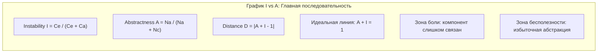
```mermaid
flowchart LR
    subgraph Legend["График I vs A: Главная последовательность"]
        direction TB
        L1["Instability I = Ce / (Ce + Ca)"]
        L2["Abstractness A = Na / (Na + Nc)"]
        L3["Distance D = |A + I - 1|"]
        L4["Идеальная линия: A + I = 1"]
        L5["Зона боли: компонент слишком связан"]
        L6["Зона бесполезности: избыточная абстракция"]
    end
```

### 🚫 Разрыв цикла зависимостей (ADP): Acyclic Dependencies Principle  
*(Принцип отсутствия циклических зависимостей)*

> **Суть:**  
> **Компоненты системы не должны зависеть друг от друга циклически.**  
> Зависимости между пакетами/модулями должны образовывать **ациклический направленный граф (DAG)** — иначе сборка, тестирование и повторное использование становятся сложными или невозможными.

---

#### 🔄 Почему циклы — это плохо?

| Проблема | Последствие |
|---------|-------------|
| 🔗 **Циклическая компиляция** | Не удастся скомпилировать компоненты по отдельности: компонент A требует B, B требует C, C требует A → замкнутый круг. |
| 🧩 **Сложность переиспользования** | Невозможно скопировать «часть системы» без тяги за собой циклических зависимостей. |
| 🧪 **Тестирование по частям** | Тестирование одного компонента требует сборки всей цепочки, даже если он логически автономен. |
| 🔄 **Порядок сборки неочевиден** | Даже Maven/Gradle могут упасть с `cycle in dependency graph`. |

---

#### ✅ Как решать? — **Абстракция через интерфейсы**

> **Ключевая идея ADP:**  
> **Переверни зависимость в обратную сторону через интерфейс**, чтобы разорвать цикл.

##### 🔁 Пример: Циклическая зависимость → разорвана
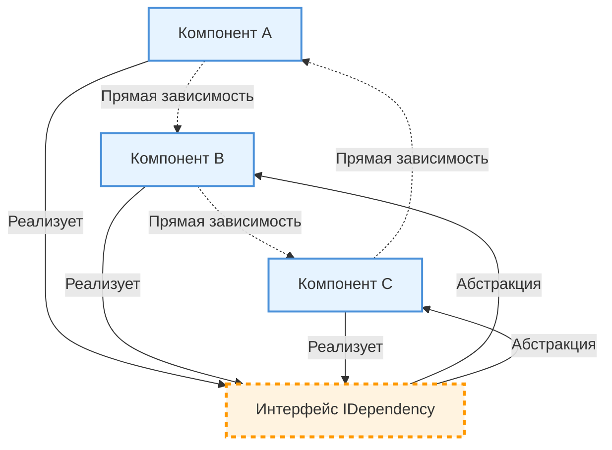
```mermaid
flowchart TD
    A[Компонент A]
    B[Компонент B]
    C[Компонент C]
    I[Интерфейс IDependency]

    A -.->|Прямая зависимость| B
    B -.->|Прямая зависимость| C
    C -.->|Прямая зависимость| A

    A -->|Реализует| I
    I -->|Абстракция| B
    B -->|Реализует| I
    I -->|Абстракция| C
    C -->|Реализует| I

    style A fill:#e6f3ff,stroke:#4a90d9,stroke-width:2px
    style B fill:#e6f3ff,stroke:#4a90d9,stroke-width:2px
    style C fill:#e6f3ff,stroke:#4a90d9,stroke-width:2px
    style I fill:#fff3e0,stroke:#ff9800,stroke-width:3px,stroke-dasharray: 5 5
```

**Как это работает:**
1. Вместо `A → B → C → A`, все три зависят от **абстракции** `IDependency`.
2. `A`, `B`, `C` *реализуют* интерфейс, но **не знают друг о друге**.
3. Зависимости теперь:  
   `A → IDependency`, `B → IDependency`, `C → IDependency`  
   → **ациклическая иерархия** (хотя и не линейная, но без циклов).

---

### 🛠 Практические техники реализации ADP

| Метод | Описание | Пример |
|-------|----------|--------|
| **Инверсия зависимостей** | Компонент зависит от интерфейса, а не от другого компонента | `PaymentService` использует `PaymentGateway`, но `StripeGateway implements PaymentGateway` |
| **Event-driven архитектура** | Разрыв через публикацию событий (`A` publishes → `B` listens) | Spring `ApplicationEvent`, Kafka-события |
| **Контейнеры внедрения** | DI-контейнер «вяжет» реализации во время рантайма | Spring `@Autowired`, Guice |
| **Слой абстракции (API-модуль)** | Выносите интерфейсы в отдельный `api/` или `core/` пакет | `user-api`, `user-service` — `user-service` зависит от `user-api`, но не наоборот |

#### 💡 Ключевая мысль

> **Циклы — это не «неудобно», а **архитектурная ошибка**, ломающая модульность.**  
> Разрывай их **всегда**, когда встречаешь — это экономит время в будущем.

### 🔍 Системный взгляд: от требований к принципам проектирования

> **Системный аналитик не спрашивает: «Какой принцип нарушается в классе?»  
> — он спрашивает: «Какое требование привело к нарушению и какие риски это создаёт для системы как целого?»**

| Тип требования | К какому принципу оно обычно сводится | Чем грозит нарушение | Как проверить на ранней стадии |
|----------------|----------------------------------------|----------------------|-------------------------------|
| **Быстрое изменение бизнес-правил** (например, «мы хотим менять логику расчёта комиссии еженедельно») | DRY, OCP, ISP | Если логика захардкожена — каждая правка = тестирование всего модуля; риск регрессии | — Формализуется ли правило отдельно? <br> — Есть ли версия логики? |
| **Интеграция с внешними системами** («нужно добавить поддержку API ВТБ») | DIP, ADP, SoC | Рост связности, циклические зависимости, «утечка» бизнес-логики в интеграционный слой | — Есть ли `PaymentGateway` или `VtbPaymentService extends PaymentService`? <br> — Выносится ли маппинг за пределы бизнес-логики? |
| **Требования к безопасности/аудиту** («нужно логировать все изменения статуса») | SRP, SoC | Логика аудита смешана с бизнес-логикой — риски: забытые log-строки, пропущенные audit-триггеры в API | — Кто отвечает за `AuditTrail`? Какой модуль? <br> — Изменяется ли `StatusChangeService` при добавлении нового канала? |
| **Масштабируемость** («нагрузка выросла в 10x, таймауты растут») | LoD, DIP, ADP | Цепочки `A → B → C → D` без кэширования/асинхронности → каскадные фейлы | — Видны ли в `jdeps`/`ArchUnit` глубокие цепочки (depth > 5)? <br> — Есть ли Circuit Breaker или Retry в критичных путях? |

> 💡 **Практика:**  
> На встрече с product owner’ом запрашивайте не «как это работает», а:  
> *«Если мы изменим это правило — какая часть системы сломается первой? Какой компонент попадёт под изменения чаще всего?»*  
> Это сразу подскажет, к какому принципу нужно применить «давление».

### 🧪 Диагностика «на ранних стадиях» — когда ещё нет кода

Методика: **анализ по требованиям (R-анализ)**  
Превращайте «нужно сделать X» в «где могут быть нарушения Y».

| Фраза из ТЗ | Вероятное нарушение | Что проверить на демо-архитектуре |
|-------------|---------------------|----------------------------------|
| *«Мы хотим менять логику расчёта без деплоя»* | OCP, DIP | — Есть ли `Strategy`-интерфейс? <br> — Меняется ли класс, реализующий расчёт, без изменения сервиса? |
| *«Нужно интегрироваться с X системами в параллель»* | ADP, SoC | — Видна ли развязка через `EventPublisher`? <br> — Есть ли `integration-context`? |
| *«Клиент хочет видеть историю всех изменений по заявке»* | SRP, DRY | — Кто отвечает за `AuditTrail`? — Общий сервис или `AuditAspect`? <br> — Используется ли `@Audited` или `@Loggable`? |
| *«Должна быть возможность отключить канал Y в одной стране, но оставить в другой»* | ISP, LoD | — Есть ли `ChannelConfiguration`? <br> — Принимается ли решение в `Gateway`, а не в `Service`? |

> ✅ **Упражнение:**  
> Дано ТЗ:  
> *«Система должна поддерживать 3 вида идентификации: биометрия, СКЗ, ЭЦП. Все типы должны работать независимо и меняться без остановки системы»*  
> **Задание:**  
> 1. Какие принципы здесь критичны?  
> 2. Какой паттерн вы предложите?  
> 3. Какие модули должны быть разделены?

### 🧭 Карта ответственности: от принципов к ролям

| Принцип | Ответственный в команде | Что проверять на ретроспективе |
|---------|--------------------------|-------------------------------|
| **SRP** | Системный аналитик + BA | — Достаточно ли чётко описано «одно дело» в user story? <br> — Есть ли «и» в acceptence criteria? |
| **ADP/SDP** | Аналитик + Архитектор | — Всегда ли диаграмма зависимостей (UML component) согласована перед спринтом? <br> — Есть ли в `jdeps` `cycle`? |
| **DRY** | DevOps + QA | — Как часто появляется одинаковый SQL в разных сервисах? (метрика: `sql_duplication_ratio`) |
| **LoD** | Tech Lead + BA | — Сколько методов `get...()` в DTO возвращают неявно вложенные объекты? |

> 💡 **Совет:** На спринт-планировке задавайте:  
> *«Какой принцип вы здесь используете как основной? SRP, DIP или что-то ещё? Где зафиксировано это решение?»*

---

### 🔐 Принцип ACID (Atomicity, Consistency, Isolation, Durability)

> **Что это?**  
> **ACID** — это набор свойств, обеспечивающих **надёжную обработку транзакций** в реляционных СУБД. Если транзакция обладает ACID-свойствами, система остаётся в согласованном состоянии даже при ошибках, сбоях или одновременных запросах.

> **Что это даёт?**  
> Понимание ACID позволяет **оценить, какие гарантии предоставляет система при сохранении данных**, и предупредить риски, связанные с потерей данных, дублированием или частичным применением изменений.

---

### ACID — таблица свойств

| Свойство | Название | Что гарантирует | Интерпретация | Пример из страхования |
|----------|----------|-----------------|----------------------------|-----------------------|
| **A** | **Atomicity** *(Атомарность)* | Транзакция **выполняется целиком или не выполняется вообще** — нет «частичного успеха». | *«Если одна часть операции падает — вся операция откатывается, как будто её и не было»*. | При оформлении полиса: если сохранение клиента прошло, а сохранение риска — нет, **никакие данные не попадают в БД**. |
| **C** | **Consistency** *(Согласованность)* | Результат транзакции должен переводить систему из **одного валидного состояния в другое** — соблюдая все бизнес-правила и ограничения (например, уникальность, проверки ссылочной целостности). | *«После транзакции не может быть «полу-данных», нарушающих правила»*. | При оформлении полиса: сумма премии по риску **не может быть < 0** и **должна совпадать с расчётом** по тарифу. Если расчёт дал `-500` — транзакция откатится. |
| **I** | **Isolation** *(Изоляция)* | Одновременные транзакции **не мешают друг другу** — каждая работает с «своей копией» данных, пока не зафиксирована. | *«Два пользователя оформляют полис по одной заявке — один не видит «полу-созданного» полиса другого»*. | Два агента одновременно добавляют нового водителя в один полис: система сохраняет оба действия **в порядке очереди**, без конфликтов или «перетирания» данных. |
| **D** | **Durability** *(Долговечность)* | **Зафиксированные изменения остаются в системе навсегда**, даже при сбое питания/СУБД (при условии, что данные записаны на диск). | *«После подтверждения «успешно» — данные не исчезнут при рестарте сервера»*. | После подтверждения оплаты — платеж **всегда появится в отчёте**, даже если сервер выключили через 5 секунд. |

---

### Критически важные нюансы

#### 1. **Не все системы обеспечивают полный ACID**
| Система | ACID? | Комментарий |
|---------|-------|---------------------------|
| PostgreSQL, Oracle, SQL Server | ✅ Полный | Подходит для критичных сценариев: страхование, финансы. |
| MySQL (InnoDB) | ✅ (с настройками) | ACID включён по умолчанию, но нужно проверять уровень изоляции. |
| MongoDB (с реплика-сетами) | ⚠️ *Частичный* | Атомарность только внутри одного документа. Глобальные транзакции появились в 4.0, но не во всех deployment-моделях. |
| Kafka + Event Sourcing | ❌ (BASE) | **Eventual Consistency** — данные могут быть «пока не согласованы». Подходит для аудита, но не для расчёта премий «в реальном времени». |

> 💡 **Вопрос:**  
> *«Если расчёт премии и сохранение полиса идут в разные СУБД (например, PostgreSQL + Redis для кэша) — как гарантировать, что оба действия либо успешны, либо откачены?»*  
> → Ответ: ** распределённые транзакции (2PC) — дорогие и рискованные. Лучше использовать Event Sourcing или Saga-паттерн.**

---

#### 2. **ACID ≠ «безопасность» — это только про данные**
> ✅ ACID гарантирует:  
> - данные не потеряются  
> - не будет частичных изменений  
> - правила валидации соблюдаются  
>  
> ❌ ACID **не гарантирует**:  
> - **безопасность от мошенничества** (доступ к данным)  
> - **корректность бизнес-логики** (если вы посчитали `premium = 0`, ACID это сохранит как валидное)  
> - **надёжность бизнес-процесса** (например, email не отправлен — транзакция сохранения полиса прошла, но пользователь не знает об этом)  

> 🔎 **Аналитическая проверка:**  
> *«Где лежит логика уведомления после сохранения полиса? В той же транзакции или отдельно? Что происходит, если email-сервис упал после коммита?»*

---

### Примеры 

| Сценарий | ACID в действии | Риск при отсутствии ACID |
|----------|----------------|-------------------------|
| **Переоформление полиса** (отмена старого → создание нового) | Обе операции в одной транзакции → если вторая упадёт, старый полис не удаляется. | Два активных полиса → двойная выплата по обеим. |
| **Внесение оплаты + привязка к полису** | Транзакция: `UPDATE premiums SET status = 'PAID'` + `INSERT payments (...)`. | Статус «оплачен», но платеж не recorded → аудиторы не найдут документы. |
| **Сброс премии после изменения риска** | `UPDATE risks SET coverage = newCoverage` + пересчёт премии в `UPDATE policies`. | Полис сохранён, но премия осталась старой → клиент доплатил, а система «забыла». |

---

### Выводы

| ACID-свойство | Ваша роль |
|---------------|-------------------------|
| **Atomicity** | Уточняйте: *«А что, если часть операции упадёт? Откатится ли вся транзакция?»* |
| **Consistency** | Формализуйте бизнес-правила как ограничения (`CHECK`, `UNIQUE`, `FOREIGN KEY`). Не оставляйте их «в коде». |
| **Isolation** | Запрашивайте: *«Могут ли одновременно обрабатывать одну заявку несколько пользователей? Какое состояние они увидят?»* |
| **Durability** | Уточняйте: *«Как долго мы храним транзакции? Есть ли бэкапы до и после коммита?»* |

> ✅ **Правило:**  
> **«Критичные операции (деньги, полисы, выплаты) должны работать в ACID-транзакциях. Прочие — смотрите, есть ли требования к eventual consistency».**

> 📌 **Источник:**  
>ACID был сформулирован в 1983 г. Грюнтером, Маодисоном и Селли. С тех пор стал стандартом для транзакционных БД.  
>  
> 💡 **Аналитический мем:**  
> *«Если ваша система не ACID-совместима — но работает с деньгами — вы просто ещё не наткнулись на ту багу.»*

---

### Ингос-секция: Принципы в нашей системе

| Принцип | Что соблюдается | Что нарушается |
|---------|-----------------|----------------|
| SRP | Классы-сервисы имеют одну зону ответственности | Есть "божественные" контроллеры с 2000+ строк |
| DIP | Используем DI-контейнер (Spring) | Некоторые legacy-классы создают зависимости через new |
| LoD | API Gateway изолирует вызовы | Есть цепочки .getA().getB().getC() |
| DRY | Утилитарные классы вынесены в общие библиотеки | SQL-запросы дублируются между сервисами |

### Примеры кода

#### LoD: Правильно и неправильно

```java
// Нарушение LoD (Train Wreck)
String city = order.getCustomer().getAddress().getCity();

// Соблюдение LoD (инкапсуляция)
String city = order.getCustomerCity();

// В классе Order:
public String getCustomerCity() {
    return this.customer.getAddress().getCity();
}
```

#### DIP: Соблюдение принципа

```java
// Нарушение DIP
public class OrderService {
    private MySqlRepository repository = new MySqlRepository();
}

// Соблюдение DIP
public class OrderService {
    private final OrderRepository repository;
    
    public OrderService(OrderRepository repository) {
        this.repository = repository;
    }
}

public interface OrderRepository { /* ... */ }
public class JpaOrderRepository implements OrderRepository { /* ... */ }
```

### Практическая часть

#### Задание 1. Найдите нарушение SRP

Класс ниже нарушает SRP. Найдите все ответственности и предложите рефакторинг.

```java
public class UserService {
    public void register(String email, String password) {
        if (!email.contains("@")) throw new IllegalArgumentException();
        String hash = BCrypt.hashpw(password, BCrypt.gensalt());
        // INSERT INTO users ...
        // sendEmail(email, "Welcome!");
        // log.info("User registered: " + email);
    }
}
```

<details>
<summary>Ожидаемый ответ</summary>

Ответственности:
1. Валидация -> вынести в UserValidator
2. Хеширование -> вынести в PasswordHasher
3. Сохранение -> вынести в UserRepository
4. Отправка email -> вынести в NotificationService
5. Логирование -> AOP-аспект или middleware

После рефакторинга:

```java
@Service
public class UserService {
    private final UserValidator validator;
    private final PasswordHasher hasher;
    private final UserRepository repository;
    private final NotificationService notificationService;
    
    @Transactional
    public void register(String email, String password) {
        validator.validateEmail(email);
        String hash = hasher.hash(password);
        User user = repository.save(new User(email, hash));
        notificationService.sendWelcomeEmail(user);
    }
}
```

</details>

#### Задание 2. Проверьте граф зависимостей через jdeps

```bash
# Анализ зависимостей пакета
jdeps -package com.ingos.service.claims -summary target/classes/

# Поиск циклических зависимостей
jdeps -cp target/classes -recursive -filter:package .
```

#### Задание 3. Вычислите метрики

Для пакета com.ingos.service.policy:
- Na (абстрактных типов) = 3
- Nc (всего типов) = 10
- Fan-in (зависимости извне) = 5
- Fan-out (зависимости вовне) = 2

**Вопрос:** Чему равны I, A и D? Находится ли пакет на главной последовательности?

<details>
<summary>Ожидаемый ответ</summary>

- A = 3/10 = 0.3
- I = 2/(5+2) ~ 0.286
- D = |0.3 + 0.286 - 1| = |0.586 - 1| = 0.414

D < 0.5 - пакет близок к главной последовательности. Близок к ядру

</details>

### Контрольные вопросы

1. Чем отличается LSP от ISP? Приведите примеры нарушений каждого.
2. В чём разница между DRY и YAGNI? Могут ли они конфликтовать?
3. Почему LoD (Закон Деметры) важен для микросервисной архитектуры?
4. Как метрика Distance (D) помогает оценить качество модуля?
5. Что произойдёт с системой, если нарушить ADP?

---

## Модуль I-1. Стили архитектуры: Монолит - Модульный монолит - Микросервисы

### Цели модуля

После изучения вы сможете:
- Сравнивать монолитную, модульно-монолитную и микросервисную архитектуры
- Выбирать стиль под задачу
- Отличать Layered Architecture от Hexagonal Architecture

### Теоретическая часть

#### Эволюция архитектурных стилей

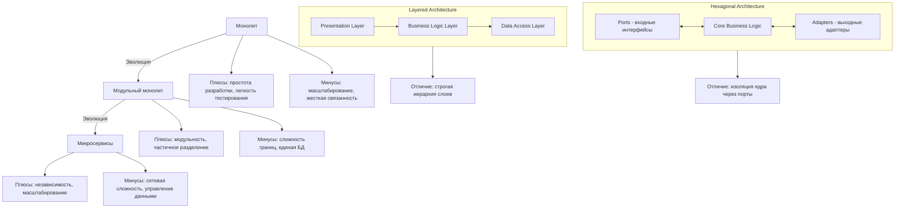
```mermaid
flowchart TD
    A[Монолит] -->|Эволюция| B[Модульный монолит]
    B -->|Эволюция| C[Микросервисы]

    A --> A_plus[Плюсы: простота разработки, легкость тестирования]
    A --> A_minus[Минусы: масштабирование, жесткая связанность]
    B --> B_plus[Плюсы: модульность, частичное разделение]
    B --> B_minus[Минусы: сложность границ, единая БД]
    C --> C_plus[Плюсы: независимость, масштабирование]
    C --> C_minus[Минусы: сетевая сложность, управление данными]

    subgraph Layered [Layered Architecture]
        L1[Presentation Layer]
        L2[Business Logic Layer]
        L3[Data Access Layer]
        L1 --> L2
        L2 --> L3
    end

    subgraph Hexagonal [Hexagonal Architecture]
        H1[Ports - входные интерфейсы]
        H2[Core Business Logic]
        H3[Adapters - выходные адаптеры]
        H1 <--> H2
        H2 <--> H3
    end

    Layered --> Diff1[Отличие: строгая иерархия слоев]
    Hexagonal --> Diff2[Отличие: изоляция ядра через порты]
```

#### 🔍 Контекст-матрица: что влияет на выбор архитектуры?  
*(ключевой инструмент системного аналитика)*

| Критерий | Монолит | Модульный монолит | Микросервисы | Как измерить? | Когда выбирать? |
|----------|---------|-------------------|--------------|--------------|----------------|
| **Команда** | 1–3 разработчика | 3–10 (но с чётными границами модулей) | 10+ (по 2–5 на сервис) | `Число команд × Частота коммитов / сервис` | Команда < 5 → **монолит**; >10 с независимыми доменами → **микросервисы** |
| **Рост нагрузки** | до ~100 TPS | до ~1K TPS (при оптимизации) | без предела | `Peak RPS / TPS по SLA` | SLA >1K TPS, прогноз роста 5x/год → **микросервисы** |
| **Частота изменений** | медленно (все в одной ветке) | умеренно (по модулям) | быстро (по сервисам) | `Кол-во изменений/день на домен` | >5 изменений/день в одном домене → **модуль/сервис** |
| **Согласованность данных** | строгая (ACID) | строгая (одна БД) | eventual (CAP) | `Кол-во кросс-доменных операций` | Требуется 2PC/XA → **монолит/мод. монолит**; допустимо eventual → **микросервисы** |
| **Регуляторика** | простая (одна схема) | сложнее (разделение схем) | максимально гибкая | `Нормативные требования: GDPR, 115-ФЗ, PCI-DSS` | Высокая регуляторная нагрузка → **модульный монолит** (контролируемый доступ к данным) |
| **Время вывода на рынок (MVP)** | ⏱️ быстро | ⏱️ среднее | ⏱️ медленно (настройка инфраструктуры) | `Дни от идеи до продакшена` | MVP < 3 мес → **монолит**; >6 мес → **мод. монолит** как запас прочности |

> 💡 **Системный принцип:**  
> *«Не выбирайте архитектуру под идеальный сценарий — выбирайте под **текущие ограничения** и **сценарий провала»**.*  
> Пример: Если срок MVP — 2 месяца, микросервисы создадут **технический долг** на следующие 6 месяцев.


### 🚧 Эволюция архитектур: не прямая, а ветвящаяся  

Миграция между стилями — это **стратегический выбор**, а не автоматическая эволюция.

| Сценарий | Правильный путь | Чего избегать |
|----------|----------------|---------------|
| Нужен MVP за 2–3 месяца | Монолит → постепенное разложение на модули при росте сложности | Микросервисы «на всякий случай» |
| Домен подвержен частым изменениям | Модульный монолит с чёткими границами + CI/CD для модулей | Делать микросервисы из-под палки без анализа |
| Требуется независимое масштабирование (например, аналитика + расчёты) | Выделить домен в отдельный модуль → при достижении критической массы → вынести в микросервис | Мигрировать сразу все домены без приоритизации |
| Высокие регуляторные требования (например, 115-ФЗ) | Модульный монолит с ACL по схемам, без распыления данных | Пытаться разнести ПДн по разным БД без валидации регуляторного соответствия |

### 🔑 Критические ошибки при эволюции  
1. **«Переписать с нуля» вместо Strangler Fig**  
   → Потеря 6–12 мес. + регрессия  
   → **Как избежать**: завести «стрangling-план» с конкретными API-контрактами и fallback-логикой.

2. **Миграция без тестов**  
   → 40%+ багов в первом релизе микросервисов  
   → **Как избежать**: добавить тестовую ветку с параллельным прогоном (canary) и контрактным тестированием.

3. **Вынос в микросервис *только* для «масштабирования»**  
   → Сетевая задержка > выигрыша от масштабирования  
   → **Как избежать**: сначала измерить `Время запроса = 2× сетевая задержка + DB query` — если не критично — оставить в мод. монолите.

---


### ⚖️ Внутренняя структура: Layered ≠ Hexagonal  
*(важно: это **не архитектурные стили**, а **паттерны проектирования внутри модуля**)*  

| Паттерн | Где использовать | Контекстный выбор системного аналитика |
|---------|-----------------|----------------------------------------|
| **Layered Architecture** | Внутри модуля, где доменная логика стабильна и не меняется часто (например, расчёт премии) | Высокая стабильность → Layered + DB view → простота тестирования и отладки. Не подходит для часто меняющихся внешних API. |
| **Hexagonal Architecture (Ports & Adapters)** | В модуле с активными внешними интеграциями (например, интеграция с госуслугами, банками) | Частые изменения внешних API → порты позволяют менять адаптеры без тронутого core. Критично для регуляторных изменений (например, ЦБ меняет формат API — меняется только адаптер). |
| **Event-Driven внутри модуля** | При оркестрации долгих процессов (например, андеррайтинг с участием 3-х сторон) | Требуется асинхронность без сетевых вызовов → `@Async` + `ApplicationEvent`. Не нужно тащить Kafka ради одного события. |

> ✅ **Правильное сравнение:**  
> — `Layered` и `Hexagonal` — **альтернативы внутри одного модуля**.  
> — `Монолит` и `Микросервисы` — **альтернативы для всей системы**.  
> *Вы можете иметь микросервисную систему, где каждый сервис реализован по Hexagonal.*

#### Пример кода: Hexagonal Architecture

```java
// === Port (выходной порт) ===
public interface OrderRepository {
    Order save(Order order);
    Optional<Order> findById(Long id);
}

// === Core Business Logic ===
public class OrderService {
    private final OrderRepository repository;
    
    public OrderService(OrderRepository repository) {
        this.repository = repository;
    }
    
    public Order createOrder(OrderData data) {
        return repository.save(new Order(data));
    }
}

// === Adapter (адаптер к БД) ===
@Repository
public class JpaOrderRepository implements OrderRepository {
    private final SpringDataJpaRepository jpaRepo;
    
    @Override
    public Order save(Order order) {
        return jpaRepo.save(order);
    }
}
```

---

### 📊 Практические сравнительные критерии  
*(вместо «высокая/низкая» — цифры и оценки)*

| Критерий | Монолит | Модульный монолит | Микросервисы | Источник измерения |
|----------|---------|-------------------|--------------|---------------------|
| **Стоимость деплоя (в человеко-часах)** | 1–2 ч (один бандл) | 3–6 ч (для одного модуля) | 10–30 ч (для 10+ сервисов) | `CI/CD pipeline time × cost/hour` |
| **Время сборки (на машине разработчика)** | <30 сек | 1–3 мин | 2–5 мин (на одном сервисе) | `./gradlew build` (реальное время) |
| **Время до продакшена (от коммита)** | 5–15 мин | 10–25 мин | 20–60 мин (в зависимости от инфраструктуры) | `Время от push до deploy` |
| **Сетевые задержки (на 1 вызов)** | 0 мс | 0 мс | 2–50 мс (в зависимости от toplogy и сетевой нагрузки) | `jfr profiler` + `zipkin` (на проде) |
| **Количество компонентов для теста** | 1 (все в JVM) | 1 (но модульные тесты с `@DataJpaTest`, `@ServiceTest`) | N (нужен контейнер с БД, Kafka, Redis, Zipkin) | `docker-compose.yml / k8s manifests` |
| **Критический путь при падении** | Весь сервис | Один модуль (если не кросс-модульные зависимости) | Зависит от оркестрации: retry, circuit-breaker, Saga/Outbox | `Chaos Engineering: failure injection` |
| **Управление версиями** | 1 версия | 1 версия (но с семантикой модулей, напр. `v2premium`) | M версий по количеству сервисов (`v1`, `v2` для API) | `Maven/Gradle versions` / `OpenAPI` |

> 📌 **Вывод:**  
> Микросервисы **не дают преимуществ** в:  
> • Малых командах (<5 человек)  
> • Критичных к согласованности доменах (без eventual acceptability)  
> • Проектах со сроком <6 мес  
> → Их нужно выбирать **только** если есть *измеримый рост нагрузки* **и** *независимость доменов*.

---

### Практика

Вы - архитектор стартапа по онлайн-калькулятору страховки. У вас 3 разработчика. Какую архитектуру вы выберете и почему?

### Контрольные вопросы

1. В каких случаях монолит лучше микросервисов?
2. Чем модульный монолит отличается от "просто монолита"?
3. Какая архитектура лучше подходит для быстрого прототипирования?

---

## Модуль I-2. Паттерны взаимодействия: Синхрон, Асинхрон, Транзакции

### Цели модуля

После изучения вы сможете:
- Выбирать между синхронным и асинхронным взаимодействием
- Проектировать Saga (Choreography и Orchestration)
- Реализовывать Outbox Pattern для гарантированной доставки

### Теоретическая часть

#### Sequence diagram: Каскадный отказ при синхронных вызовах

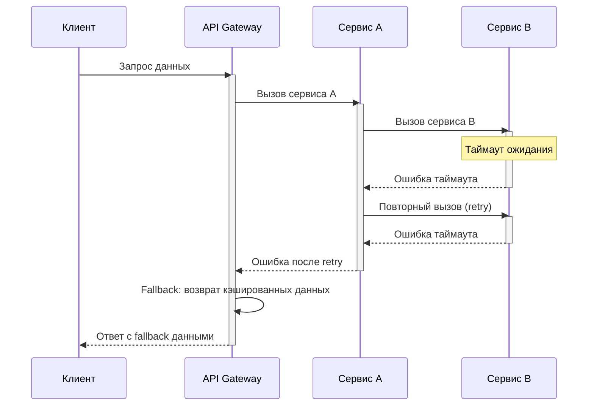
```mermaid
sequenceDiagram
    participant Client as Клиент
    participant APIGateway as API Gateway
    participant ServiceA as Сервис A
    participant ServiceB as Сервис B

    Client->>APIGateway: Запрос данных
    activate APIGateway
    APIGateway->>ServiceA: Вызов сервиса A
    activate ServiceA
    ServiceA->>ServiceB: Вызов сервиса B
    activate ServiceB
    Note over ServiceB: Таймаут ожидания
    ServiceB-->>ServiceA: Ошибка таймаута
    deactivate ServiceB
    ServiceA->>ServiceB: Повторный вызов (retry)
    activate ServiceB
    ServiceB-->>ServiceA: Ошибка таймаута
    deactivate ServiceB
    ServiceA-->>APIGateway: Ошибка после retry
    deactivate ServiceA
    APIGateway->>APIGateway: Fallback: возврат кэшированных данных
    APIGateway-->>Client: Ответ с fallback данными
    deactivate APIGateway
```

#### Sequence diagram: Асинхронный сценарий

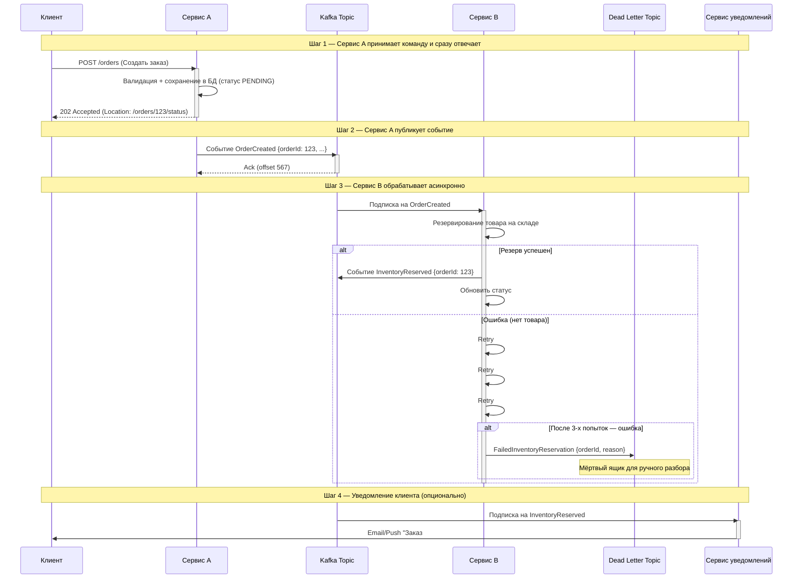
```mermaid
sequenceDiagram
    participant Client as Клиент
    participant ServiceA as Сервис A
    participant Kafka as Kafka Topic
    participant ServiceB as Сервис B
    participant DLT as Dead Letter Topic
    participant Notify as Сервис уведомлений

    Note over Client,Notify: Шаг 1 — Сервис A принимает команду и сразу отвечает

    Client->>ServiceA: POST /orders (Создать заказ)
    activate ServiceA
    ServiceA->>ServiceA: Валидация + сохранение в БД (статус PENDING)
    ServiceA-->>Client: 202 Accepted (Location: /orders/123/status)
    deactivate ServiceA

    Note over Client,Notify: Шаг 2 — Сервис A публикует событие

    ServiceA->>Kafka: Событие OrderCreated {orderId: 123, ...}
    activate Kafka
    Kafka-->>ServiceA: Ack (offset 567)
    deactivate Kafka

    Note over Client,Notify: Шаг 3 — Сервис B обрабатывает асинхронно

    Kafka->>ServiceB: Подписка на OrderCreated
    activate ServiceB
    ServiceB->>ServiceB: Резервирование товара на складе

    alt Резерв успешен
        ServiceB->>Kafka: Событие InventoryReserved {orderId: 123}
        ServiceB->>ServiceB: Обновить статус
    else Ошибка (нет товара)
        ServiceB->>ServiceB: Retry #1 (backoff 1с)
        ServiceB->>ServiceB: Retry #2 (backoff 2с)
        ServiceB->>ServiceB: Retry #3 (backoff 4с)

        alt После 3-х попыток — ошибка
            ServiceB->>DLT: FailedInventoryReservation {orderId, reason}
            Note over DLT: Мёртвый ящик для ручного разбора
        end
    end
    deactivate ServiceB

    Note over Client,Notify: Шаг 4 — Уведомление клиента (опционально)

    Kafka->>Notify: Подписка на InventoryReserved
    activate Notify
    Notify->>Client: Email/Push "Заказ #123 подтверждён"
    deactivate Notify
```

#### Сравнительная таблица — когда что выбирать

| Критерий | Синхронный (Request-Response) | Асинхронный (Event-Driven) |
|----------|------------------------------|---------------------------|
| **Latency** | Высокая. Сумма всех вызовов | Низкая. Клиент сразу получает 202 |
| **Связанность** | Жёсткая. Gateway знает все сервисы | Слабая. Сервисы знают только события |
| **Отказоустойчивость** | Отказ одного = отказ всей цепочки | Изолированная. Остальные работают |
| **Повторные попытки** | Ручные, на каждом уровне | Встроенные в брокер (retry + backoff) |
| **Трассировка** | Сложно. Нужна распределённая трассировка | Удобно. Каждое событие — шаг, видно offset и lag |
| **Масштабирование** | Вертикальное + балансировка | Горизонтальное, через consumer groups |
| **Консистентность** | Сильная (в пределах транзакции) | Eventual (согласованность со временем) |
| **Транзакции** | ACID / 2PC (блокирующие) | SAGA с компенсациями (неблокирующие) |
| **Сложность отладки** | Низкая — стек вызовов перед глазами | Выше — нужно собирать трейс по correlationId |
| **Подходит для** | Запросы в реальном времени (авторизация, оплата) | Долгие бизнес-процессы (заказ, доставка, onboarding) |

---

#### Комбинированный подход — что применяют на практике

Чистый синхронный или чистый асинхронный стиль встречается редко.
В реальных системах почти всегда используют **гибрид**:

| Сценарий | Тип взаимодействия | Почему |
|----------|-------------------|--------|
| `POST /orders` (создать заказ) | **Синхронный** → `202 Accepted` | Клиент должен сразу узнать, принят ли заказ. Дальше — асинхронная кухня |
| `GET /orders/123` (статус заказа) | **Синхронный**, чтение своей БД | Чтение своей проекции — быстро и консистентно |
| `GET /products` (каталог товаров) | **Синхронный**, чтение своей БД | Поиск и фильтры требуют мгновенного ответа |
| Заказ → Резерв склада → Оплата → Доставка | **Асинхронный**. SAGA через события | Процесс длится минуты/часы, много точек отказа |
| Отправка email клиенту | **Асинхронный**. Fire-and-forget | Письмо не влияет на бизнес-транзакцию |
| Списание денег (payment) | **Синхронный** (иногда 2PC/XA) | Деньги любят строгую консистентность |
| Скоринг кредита (занимает 30 сек) | **Асинхронный** с callback | Клиент не должен висеть 30 секунд на одном соединении |
| Генерация отчёта (занимает 2 мин) | **Асинхронный** с polling | Nginx отрубит синхронный вызов по таймауту через 60 сек |
| Авторизация пользователя | **Синхронный** | Ответ нужен немедленно, иначе не пускаем дальше |
| Онбординг сотрудника (HR → IT → Бухгалтерия) | **Асинхронный**. SAGA | Процесс идёт часами/днями, шаги независимы |

---

> 💡 **[ДОПОЛНЕНИЕ SA]** **Совет системного аналитика:** На диаграмме выше показан классический каскадный отказ. В реальной спецификации ТЗ обязательно фиксируйте **timeout-ы для каждого звена** и политику retry (количество попыток, интервал, exponential backoff). Без этого разработчики ставят дефолтные 30 секунд — и вся цепочка подвисает. **[КОНЕЦ ДОПОЛНЕНИЯ SA]**

---

**[ДОПОЛНЕНИЕ SA: Блок 1 — Проектирование контрактов API]**

### 1.1. Проектирование контрактов: OpenAPI и AsyncAPI

В реальной работе системный аналитик пишет или ревьюит спецификации API. Ниже — примеры, которые вы встретите в продакшене.

#### 1.1.1. OpenAPI 3.0 — синхронный REST-эндпоинт

```yaml
openapi: "3.0.3"
info:
  title: Order Service API
  version: "1.0.0"
  description: |
    API для создания и управления заказами интернет-магазина.
    Все эндпоинты требуют JWT-аутентификации в заголовке Authorization.

paths:
  /api/v1/orders:
    post:
      summary: Создать новый заказ
      operationId: createOrder
      tags:
        - Orders
      requestBody:
        required: true
        content:
          application/json:
            schema:
              $ref: '#/components/schemas/CreateOrderRequest'
      responses:
        '201':
          description: Заказ успешно создан
          content:
            application/json:
              schema:
                $ref: '#/components/schemas/OrderResponse'
        '400':
          description: Ошибка валидации (некорректные данные)
          content:
            application/json:
              schema:
                $ref: '#/components/schemas/ErrorResponse'
        '422':
          description: Бизнес-ошибка (товара нет на складе)
          content:
            application/json:
              schema:
                $ref: '#/components/schemas/ErrorResponse'
        '429':
          description: Превышен лимит запросов (rate limit)
          headers:
            Retry-After:
              schema:
                type: integer
                description: Секунд до следующего допустимого запроса

components:
  schemas:
    CreateOrderRequest:
      type: object
      required:
        - customerId
        - items
        - deliveryAddress
      properties:
        customerId:
          type: string
          format: uuid
          description: Идентификатор клиента
          example: "a1b2c3d4-e5f6-7890-abcd-ef1234567890"
        items:
          type: array
          minItems: 1
          maxItems: 50
          description: Позиции заказа
          items:
            $ref: '#/components/schemas/OrderItem'
        deliveryAddress:
          $ref: '#/components/schemas/Address'
        promoCode:
          type: string
          maxLength: 20
          description: Промокод (опционально)
          example: "WELCOME2024"

    OrderItem:
      type: object
      required:
        - productId
        - quantity
      properties:
        productId:
          type: string
          format: uuid
        quantity:
          type: integer
          minimum: 1
          maximum: 999
        price:
          type: number
          format: decimal
          description: Цена за единицу на момент добавления
          example: 1499.99

    Address:
      type: object
      required:
        - country
        - city
        - street
        - building
      properties:
        country:
          type: string
          example: "Россия"
        city:
          type: string
          example: "Москва"
        street:
          type: string
          example: "Тверская"
        building:
          type: string
          example: "12"
        apartment:
          type: string
          example: "45"
        zipCode:
          type: string
          pattern: '^\d{6}$'
          example: "125009"

    OrderResponse:
      type: object
      properties:
        orderId:
          type: string
          format: uuid
        status:
          type: string
          enum: [CREATED, CONFIRMED, PAID, SHIPPED, DELIVERED, CANCELLED]
        totalAmount:
          type: number
          format: decimal
        createdAt:
          type: string
          format: date-time

    ErrorResponse:
      type: object
      properties:
        code:
          type: string
          example: "VALIDATION_ERROR"
        message:
          type: string
          example: "Поле 'quantity' должно быть от 1 до 999"
        details:
          type: array
          items:
            type: object
            properties:
              field:
                type: string
              reason:
                type: string
```

> ⚠️ **Замечание системного аналитика:** Самая частая ошибка новичков — не указывать `required` поля в схеме. Разработчик на фронтенде не поймёт, какие поля обязательны, и начнёт гадать. Второй камень — забыть про `maxLength` / `pattern` для строк. Без них в БД прилетит 100500-символьная строка и упадёт индекс. **Всегда валидируйте на уровне контракта то, что валидируется на уровне БД.**

---

#### 1.1.2. AsyncAPI — событийная интеграция через Kafka

```yaml
asyncapi: "2.6.0"
info:
  title: Order Events
  version: "1.0.0"
  description: |
    Событийная шина для обмена сообщениями между сервисами
    в процессе оформления заказа. Гарантия доставки: at-least-once.

channels:
  order.events:
    description: |
      Канал для событий жизненного цикла заказа.
      Ключ сообщения — orderId (UUID).
    publish:
      summary: Сервисы публикуют события заказа
      operationId: publishOrderEvent
      message:
        oneOf:
          - $ref: '#/components/messages/OrderCreated'
          - $ref: '#/components/messages/OrderPaid'
          - $ref: '#/components/messages/OrderCancelled'
          - $ref: '#/components/messages/OrderShipped'

    subscribe:
      summary: Сервисы подписываются на события заказа
      operationId: consumeOrderEvent
      message:
        oneOf:
          - $ref: '#/components/messages/OrderCreated'
          - $ref: '#/components/messages/OrderPaid'
          - $ref: '#/components/messages/OrderCancelled'
          - $ref: '#/components/messages/OrderShipped'

components:
  messages:
    OrderCreated:
      name: OrderCreated
      title: Заказ создан
      summary: Событие возникает при успешном создании заказа
      contentType: application/json
      payload:
        type: object
        required:
          - eventId
          - eventType
          - eventVersion
          - timestamp
          - data
        properties:
          eventId:
            type: string
            format: uuid
            description: Уникальный идентификатор события
          eventType:
            type: string
            const: "OrderCreated"
          eventVersion:
            type: integer
            const: 1
            description: Версия схемы события для обратной совместимости
          timestamp:
            type: string
            format: date-time
            description: Момент возникновения события (UTC)
          data:
            type: object
            required:
              - orderId
              - customerId
              - items
              - totalAmount
            properties:
              orderId:
                type: string
                format: uuid
              customerId:
                type: string
                format: uuid
              items:
                type: array
                items:
                  type: object
                  properties:
                    productId:
                      type: string
                      format: uuid
                    productName:
                      type: string
                    quantity:
                      type: integer
                    unitPrice:
                      type: number
                      format: decimal
              totalAmount:
                type: number
                format: decimal
              deliveryDate:
                type: string
                format: date
                description: Планируемая дата доставки

    OrderPaid:
      name: OrderPaid
      title: Заказ оплачен
      payload:
        type: object
        required:
          - eventId
          - eventType
          - eventVersion
          - timestamp
          - data
        properties:
          eventId:
            type: string
            format: uuid
          eventType:
            type: string
            const: "OrderPaid"
          eventVersion:
            type: integer
            const: 1
          timestamp:
            type: string
            format: date-time
          data:
            type: object
            required:
              - orderId
              - paymentId
              - paymentMethod
              - amount
            properties:
              orderId:
                type: string
                format: uuid
              paymentId:
                type: string
                format: uuid
              paymentMethod:
                type: string
                enum: [CARD, SBP, YANDEX_PAY, APPLE_PAY]
              amount:
                type: number
                format: decimal

    OrderCancelled:
      name: OrderCancelled
      title: Заказ отменён
      payload:
        type: object
        required:
          - eventId
          - eventType
          - eventVersion
          - timestamp
          - data
        properties:
          eventId:
            type: string
            format: uuid
          eventType:
            type: string
            const: "OrderCancelled"
          eventVersion:
            type: integer
            const: 1
          timestamp:
            type: string
            format: date-time
          data:
            type: object
            required:
              - orderId
              - reason
            properties:
              orderId:
                type: string
                format: uuid
              reason:
                type: string
                enum: [PAYMENT_FAILED, OUT_OF_STOCK, CUSTOMER_CANCELLED, FRAUD_DETECTED]
              refundId:
                type: string
                format: uuid
                description: Идентификатор возврата (если оплата прошла)

    OrderShipped:
      name: OrderShipped
      title: Заказ отгружен
      payload:
        type: object
        required:
          - eventId
          - eventType
          - eventVersion
          - timestamp
          - data
        properties:
          eventId:
            type: string
            format: uuid
          eventType:
            type: string
            const: "OrderShipped"
          eventVersion:
            type: integer
            const: 1
          timestamp:
            type: string
            format: date-time
          data:
            type: object
            required:
              - orderId
              - trackingNumber
              - carrier
            properties:
              orderId:
                type: string
                format: uuid
              trackingNumber:
                type: string
              carrier:
                type: string
                enum: [CDEK, BOXBERRY, RUSSIAN_POST, PICKPOINT]
```

> 💡 **Совет системного аналитика:** В AsyncAPI-контракте всегда указывайте `eventVersion`. Когда через полгода вы измените структуру события, старые потребители не сломаются — они увидят версию и смогут обработать или проигнорировать новое поле. Без версионирования миграция событий — это боль и продовольственные ночные деплои.

**[КОНЕЦ ДОПОЛНЕНИЯ SA]**

---

SAGA — это не аббревиатура в строгом смысле (не S.A.G.A.), а название паттерна, отсылающее к «саге» — длинной истории, состоящей из множества эпизодов. Каждый «эпизод» — это отдельная локальная транзакция в своём сервисе, а вместе они образуют целостный бизнес-процесс.

#### Saga Choreography

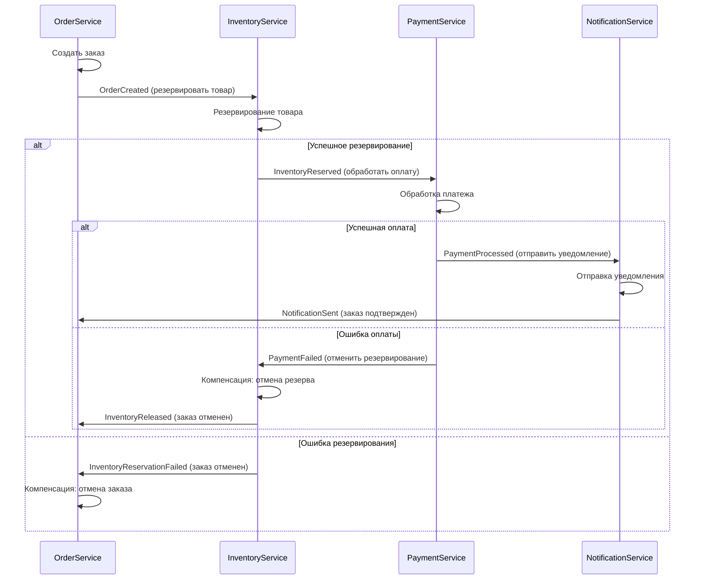
```mermaid
sequenceDiagram
    participant OrderService as OrderService
    participant InventoryService as InventoryService
    participant PaymentService as PaymentService
    participant NotificationService as NotificationService
    
    OrderService->>OrderService: Создать заказ
    OrderService->>InventoryService: OrderCreated (резервировать товар)
    InventoryService->>InventoryService: Резервирование товара
    alt Успешное резервирование
        InventoryService->>PaymentService: InventoryReserved (обработать оплату)
        PaymentService->>PaymentService: Обработка платежа
        alt Успешная оплата
            PaymentService->>NotificationService: PaymentProcessed (отправить уведомление)
            NotificationService->>NotificationService: Отправка уведомления
            NotificationService->>OrderService: NotificationSent (заказ подтвержден)
        else Ошибка оплаты
            PaymentService->>InventoryService: PaymentFailed (отменить резервирование)
            InventoryService->>InventoryService: Компенсация: отмена резерва
            InventoryService->>OrderService: InventoryReleased (заказ отменен)
        end
    else Ошибка резервирования
        InventoryService->>OrderService: InventoryReservationFailed (заказ отменен)
        OrderService->>OrderService: Компенсация: отмена заказа
    end
```

> ⚠️ **[ДОПОЛНЕНИЕ SA]** **Замечание системного аналитика:** В Choreography-подходе легко потерять сквозную трассировку. Когда 5 сервисов обмениваются событиями, а заказ не доехал до доставки — кто виноват? **Обязательно требуйте Correlation ID** (он же `eventId` в контракте выше) и логирование на каждом шаге. Иначе расследование инцидента превратится в гадание. **[КОНЕЦ ДОПОЛНЕНИЯ SA]**

---

#### Saga Orchestration

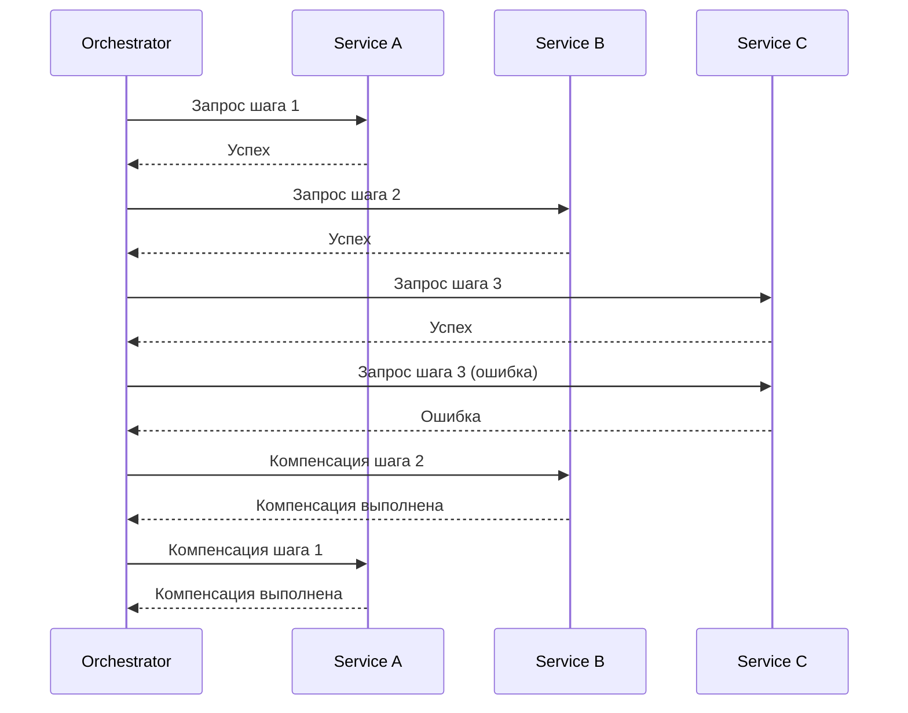
```mermaid
sequenceDiagram
    participant Orchestrator as Orchestrator
    participant ServiceA as Service A
    participant ServiceB as Service B
    participant ServiceC as Service C

    Orchestrator->>ServiceA: Запрос шага 1
    ServiceA-->>Orchestrator: Успех
    Orchestrator->>ServiceB: Запрос шага 2
    ServiceB-->>Orchestrator: Успех
    Orchestrator->>ServiceC: Запрос шага 3
    ServiceC-->>Orchestrator: Успех

    Orchestrator->>ServiceC: Запрос шага 3 (ошибка)
    ServiceC-->>Orchestrator: Ошибка
    Orchestrator->>ServiceB: Компенсация шага 2
    ServiceB-->>Orchestrator: Компенсация выполнена
    Orchestrator->>ServiceA: Компенсация шага 1
    ServiceA-->>Orchestrator: Компенсация выполнена
```

> 💡 **[ДОПОЛНЕНИЕ SA]** **Совет системного аналитика:** Orchestration проще отлаживать — вся логика в одном оркестраторе. Но он становится единой точкой отказа (SPOF). В ТЗ обязательно закладывайте **репликацию оркестратора** и **persistence его состояния** (например, в PostgreSQL), чтобы при падении он мог восстановиться с последнего успешного шага, а не начинать заново. **[КОНЕЦ ДОПОЛНЕНИЯ SA]**

---

#### 2PC vs Saga

Two-Phase Commit (2PC) — это протокол распределённых транзакций, который гарантирует строгую согласованность (strong consistency) между несколькими участниками. В отличие от SAGA, где согласованность достигается со временем (eventual consistency), 2PC даёт жёсткую гарантию «все или никто» прямо сейчас.

| Критерий | 2PC (2-Phase Commit) | Saga |
|----------|----------------------|------|
| Тип | Синхронная блокировка | Асинхронная |
| Консистентность | Сильная (Strong) | Конечная (Eventual) |
| Блокировка | Да (замки на время транзакции) | Нет (компенсация при ошибке) |
| Производительность | Низкая при большом числе участников | Высокая |
| Применимость в микросервисах | Крайне редка | Стандарт де-факто |

**[ДОПОЛНЕНИЕ SA: Блок 2 — Работа с данными и маппинг]**

### 1.2. Трансформация данных: маппинг реляционной модели в событие Kafka

Системному аналитику постоянно приходится описывать, как данные перетекают из одной системы в другую. Ниже — реальный кейс: заказ из реляционной БД маппится в JSON-событие для Kafka.

#### 1.2.1. Исходная реляционная модель (упрощённо)

```sql
-- Таблица заказов
CREATE TABLE orders (
    id              UUID PRIMARY KEY,
    customer_id     UUID NOT NULL,
    status          VARCHAR(20) NOT NULL DEFAULT 'CREATED',
    total_amount    DECIMAL(12,2) NOT NULL,
    promo_code      VARCHAR(20),
    delivery_date   DATE,
    created_at      TIMESTAMP NOT NULL DEFAULT NOW(),
    updated_at      TIMESTAMP NOT NULL DEFAULT NOW()
);

-- Таблица позиций заказа
CREATE TABLE order_items (
    id          UUID PRIMARY KEY,
    order_id    UUID NOT NULL REFERENCES orders(id),
    product_id  UUID NOT NULL,
    product_name VARCHAR(255) NOT NULL,
    quantity    INTEGER NOT NULL CHECK (quantity > 0),
    unit_price  DECIMAL(12,2) NOT NULL,
    CONSTRAINT fk_order FOREIGN KEY (order_id) REFERENCES orders(id)
);

-- Таблица адресов доставки
CREATE TABLE delivery_addresses (
    id          UUID PRIMARY KEY,
    order_id    UUID NOT NULL REFERENCES orders(id),
    country     VARCHAR(100) NOT NULL,
    city        VARCHAR(100) NOT NULL,
    street      VARCHAR(200) NOT NULL,
    building    VARCHAR(20) NOT NULL,
    apartment   VARCHAR(20),
    zip_code    VARCHAR(10),
    CONSTRAINT fk_order_address FOREIGN KEY (order_id) REFERENCES orders(id)
);
```

#### 1.2.2. Целевой JSON (событие OrderCreated для Kafka)

```json
{
  "eventId": "a1b2c3d4-e5f6-7890-abcd-ef1234567890",
  "eventType": "OrderCreated",
  "eventVersion": 1,
  "timestamp": "2024-11-20T14:30:00.123Z",
  "data": {
    "orderId": "b2c3d4e5-f6a7-8901-bcde-f12345678901",
    "customerId": "c3d4e5f6-a7b8-9012-cdef-123456789012",
    "status": "CREATED",
    "totalAmount": 4599.97,
    "promoCode": "WELCOME2024",
    "deliveryDate": "2024-11-25",
    "deliveryAddress": {
      "country": "Россия",
      "city": "Москва",
      "street": "Тверская",
      "building": "12",
      "apartment": "45",
      "zipCode": "125009"
    },
    "items": [
      {
        "productId": "d4e5f6a7-b8c9-0123-defa-234567890123",
        "productName": "Смартфон X Pro",
        "quantity": 1,
        "unitPrice": 3499.99
      },
      {
        "productId": "e5f6a7b8-c9d0-1234-efab-345678901234",
        "productName": "Чехол силиконовый",
        "quantity": 2,
        "unitPrice": 549.99
      }
    ]
  }
}
```

#### 1.2.3. Таблица маппинга (mapping table)

| Поле в БД (orders) | Поле в JSON | Тип в БД | Тип в JSON | Трансформация |
|---|---|---|---|---|
| `orders.id` | `data.orderId` | UUID | string (uuid) | Прямое копирование |
| `orders.customer_id` | `data.customerId` | UUID | string (uuid) | Прямое копирование |
| `orders.status` | `data.status` | VARCHAR(20) | string (enum) | Прямое копирование |
| `orders.total_amount` | `data.totalAmount` | DECIMAL(12,2) | number (decimal) | CAST to decimal |
| `orders.promo_code` | `data.promoCode` | VARCHAR(20) | string | Прямое копирование; если NULL — не включать в JSON |
| `orders.delivery_date` | `data.deliveryDate` | DATE | string (date) | Форматирование в ISO 8601: `yyyy-MM-dd` |
| `orders.created_at` | `timestamp` | TIMESTAMP | string (date-time) | Форматирование в ISO 8601: `yyyy-MM-dd'T'HH:mm:ss.SSS'Z'` |
| `delivery_addresses.*` | `data.deliveryAddress` | — | object | JOIN по `order_id`, все поля маппятся 1:1 |
| `order_items.*` | `data.items[]` | — | array | JOIN по `order_id`, каждая строка → элемент массива |

> ⚠️ **Замечание системного аналитика:** В таблице маппинга критически важно указывать **обработку NULL**. Пример: `promo_code` может быть NULL. Если вы просто скопируете NULL в JSON, потребитель получит `"promoCode": null`, что может сломать его десериализацию. **Правило:** опциональные поля с NULL-значением либо не включаются в JSON вообще, либо включаются с дефолтным значением. Прописывайте это в контракте явно.

#### 1.2.4. SQL-запрос для сборки денормализованной витрины

Типовая задача аналитика: собрать плоскую таблицу для отчёта «Заказы с детализацией по товарам и адресам».

```sql
WITH order_base AS (
    SELECT
        o.id                                                          AS order_id,
        o.customer_id,
        o.status,
        o.total_amount,
        o.promo_code,
        o.delivery_date,
        o.created_at,
        da.country,
        da.city,
        da.street,
        da.building,
        da.apartment,
        da.zip_code
    FROM orders o
    LEFT JOIN delivery_addresses da ON da.order_id = o.id
    WHERE o.created_at >= '2024-01-01'  -- фильтр по дате для инкрементальной загрузки
)
SELECT
    ob.order_id,
    ob.customer_id,
    ob.status,
    ob.total_amount,
    ob.promo_code,
    ob.delivery_date,
    ob.created_at,
    ob.country          AS delivery_country,
    ob.city             AS delivery_city,
    ob.street           AS delivery_street,
    ob.building         AS delivery_building,
    ob.apartment        AS delivery_apartment,
    ob.zip_code         AS delivery_zip,
    oi.id               AS item_id,
    oi.product_id,
    oi.product_name,
    oi.quantity,
    oi.unit_price,
    (oi.quantity * oi.unit_price) AS item_total
FROM order_base ob
LEFT JOIN order_items oi ON oi.order_id = ob.order_id
ORDER BY ob.order_id, oi.id;
```

> 💡 **Совет системного аналитика:** Этот запрос — классическая «звезда» (star schema) в действии. Обратите внимание: я использую `LEFT JOIN`, а не `INNER JOIN`, потому что заказ может быть без товаров (крайний случай — отменён до добавления позиций). В реальной витрине для отчётов **всегда проверяйте бизнес-правило**: может ли быть заказ без позиций? Если нет — смело ставьте `INNER JOIN`, это ускорит запрос.

**[КОНЕЦ ДОПОЛНЕНИЯ SA]**

---

#### Outbox Pattern

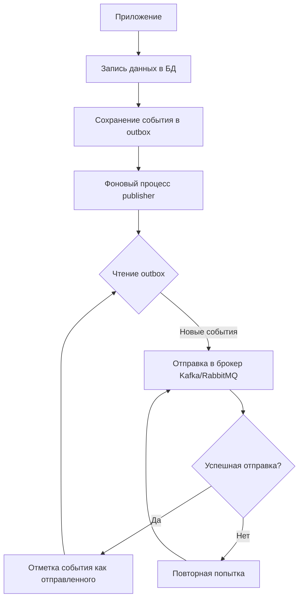
```mermaid
flowchart TD
    A[Приложение] --> B[Запись данных в БД]
    B --> C[Сохранение события в outbox]
    C --> D[Фоновый процесс publisher]
    D --> E{Чтение outbox}
    E -->|Новые события| F[Отправка в брокер Kafka/RabbitMQ]
    F --> G{Успешная отправка?}
    G -->|Да| H[Отметка события как отправленного]
    G -->|Нет| I[Повторная попытка]
    I --> F
    H --> E
```

### Пример: Saga Choreography на Spring/Kafka

```java
// === OrderService ===
@Service
public class OrderService {
    @EventListener
    public void onOrderCreated(OrderCreatedEvent event) {
        // Логика создания заказа
    }
    
    @EventListener
    public void onPaymentProcessed(PaymentProcessedEvent event) {
        // Заказ подтверждён
    }
    
    @EventListener
    public void onPaymentFailed(PaymentFailedEvent event) {
        // Компенсация: отмена заказа
    }
}

// === Событие (Kafka) ===
public record OrderCreatedEvent(Long orderId, Long productId, int quantity) {}
```

### Пример: Outbox Pattern на Spring + JDBC

```sql
-- Таблица outbox
CREATE TABLE outbox (
    id UUID PRIMARY KEY,
    aggregate_type VARCHAR(255) NOT NULL,
    aggregate_id VARCHAR(255) NOT NULL,
    event_type VARCHAR(255) NOT NULL,
    payload JSONB NOT NULL,
    created_at TIMESTAMP NOT NULL DEFAULT NOW(),
    sent_at TIMESTAMP NULL
);

CREATE INDEX idx_outbox_unsent ON outbox WHERE sent_at IS NULL;
```

```java
// === Outbox Service ===
@Service
@Transactional
public class OutboxService {
    private final JdbcTemplate jdbc;
    
    public void saveEvent(String aggregateType, String aggregateId, 
                          String eventType, Object payload) {
        jdbc.update(
            'INSERT INTO outbox (id, aggregate_type, aggregate_id, event_type, payload) VALUES (?, ?, ?, ?, ?::jsonb)',
            UUID.randomUUID(), aggregateType, aggregateId, eventType, toJson(payload)
        );
    }
}

// === Outbox Publisher ===
@Component
public class OutboxPublisher {
    @Scheduled(fixedDelay = 1000)
    @Transactional
    public void publishPendingEvents() {
        List<OutboxEvent> events = jdbc.query(
            'SELECT * FROM outbox WHERE sent_at IS NULL ORDER BY created_at LIMIT 100',
            eventRowMapper
        );
        for (OutboxEvent event : events) {
            try {
                kafkaTemplate.send(event.getEventType(), event.getPayload());
                jdbc.update('UPDATE outbox SET sent_at = NOW() WHERE id = ?', event.getId());
            } catch (Exception e) {
                log.error('Failed to send event: {}', event.getId(), e);
            }
        }
    }
}
```

> ⚠️ **[ДОПОЛНЕНИЕ SA]** **Замечание системного аналитика:** В Outbox Publisher выше есть классическая проблема **двойной отправки** (duplicate delivery). Если Kafka-брокер ответил с таймаутом, но сообщение всё же было записано, publisher повторит отправку. Потребитель получит дубль. **Решение:** делайте идемпотентность на стороне потребителя — храните `eventId` обработанных событий и игнорируйте повторные. **[КОНЕЦ ДОПОЛНЕНИЯ SA]**

---

### Ингос-секция: Паттерны в нашей системе

- Saga: Используем Choreography для процесса оформления полиса
- Outbox: Используется для гарантированной отправки событий в Kafka
- Риски: Синхронные вызовы между микросервисами приводят к каскадным таймаутам

### Практика

Спроектируйте Saga для процесса 'Оформление страхового полиса':
1. Клиент отправляет заявку
2. Система проверяет данные (андеррайтинг)
3. Расчёт тарифа
4. Оплата
5. Выпуск полиса
6. Отправка уведомления

**Вопрос:** Какие компенсирующие действия нужны для каждого шага?

<details>
<summary>Ожидаемый ответ</summary>

| Шаг | Компенсирующее действие |
|-----|------------------------|
| 2. Андеррайтинг | Отменить проверку (если данные были заблокированы) |
| 3. Расчёт тарифа | Отменить расчёт (удалить кэш) |
| 4. Оплата | Возврат средств (refund) |
| 5. Выпуск полиса | Аннулировать полис |
| 6. Уведомление | Отправить уведомление об отмене |

</details>

### Контрольные вопросы

1. В чём разница между Saga (Choreography) и Saga (Orchestration)?
2. Как Outbox Pattern решает проблему dual-write?
3. Почему 2PC не рекомендуется в микросервисной архитектуре?
4. Какой паттерн выбрать, если нужна строгая консистентность?

---

**[ДОПОЛНЕНИЕ SA: Блок 3 — Диаграммы и визуализация систем]**

### 1.3. ASCII-диаграммы для спецификаций

В реальной работе вы не всегда сможете вставить Mermaid или картинку в ТЗ (например, заказчик просит текстовый документ или Wiki без поддержки графики). Ниже — ASCII-диаграммы, которые можно вставить в любой текстовый документ.

#### 1.3.1. Sequence diagram (ASCII): «Пользователь оформляет заказ»

```
Фронт                Бэк              Kafka/Warehouse         Склад (WMS)
  |                   |                    |                      |
  |--- POST /orders -->|                   |                      |
  |                   |--- validate ---->  |                      |
  |                   |<-- ok -----------  |                      |
  |                   |                    |                      |
  |                   |--- save to DB ---> |                      |
  |                   |<-- saved --------- |                      |
  |                   |                    |                      |
  |                   |--- outbox: ------->|                      |
  |                   |    OrderCreated    |                      |
  |                   |                    |                      |
  |<-- 201 Created ---|                    |                      |
  |                   |                    |                      |
  |                   |                    |--- InventoryService  |
  |                   |                    |    .reserve() ------>|
  |                   |                    |                      |
  |                   |                    |<-- reserved ---------|
  |                   |                    |                      |
  |                   |                    |--- PaymentService    |
  |                   |                    |    .charge() ------->|
  |                   |                    |                      |
  |                   |                    |<-- charged ----------|
  |                   |                    |                      |
  |                   |                    |--- NotificationSvc   |
  |                   |                    |    .sendEmail() ---->|
  |                   |                    |                      |
```

>

## Модуль I-3. Многопоточность

### Цели модуля

После изучения вы сможете:
- Идентифицировать race condition и deadlock
- Применять примитивы синхронизации
- Рассчитывать размер пула потоков

### Красные флаги многопоточности — чек-лист системного аналитика

Если в проектируемой системе видишь хотя бы один из этих признаков —
проблемы с конкурентным доступом в продакшене гарантированы.
Не нужно ждать нагрузочного тестирования, чтобы это понять.

---

#### Флаг 1. Разделяемое изменяемое состояние

> **Признак:** Одна и та же переменная, запись в БД, строка кэша или поле конфигурации
> меняется из нескольких потоков, сессий или экземпляров приложения.

**Пример:** Счётчик посещений, хранящийся в статическом поле.

**Что произойдёт:** Race condition. Два потока прочитали `count = 5`, оба увеличили до 6,
оба записали 6. Потеряно одно увеличение.

**Где проявляется:** При нагрузке больше одного пользователя. Воспроизводится нестабильно.

---

#### Флаг 2. Операция «прочитать — подумать — записать»

> **Признак:** Бизнес-логика читает значение из БД или памяти, принимает решение на его основе,
> затем пишет обновлённое значение обратно. Между чтением и записью нет блокировки.

**Пример:** Прочитал баланс = 1000, вычел 500, записал 500.
Другая сессия в это же время тоже прочитала 1000.

**Что произойдёт:** Потерянное обновление (lost update).
Обе операции применятся к устаревшему значению.

**Где проявляется:** Периодические неконсистентные данные, которые невозможно
воспроизвести под отладчиком.

---

#### Флаг 3. Нет упоминания транзакций или блокировок в ТЗ

> **Признак:** В техническом задании описана бизнес-логика, но ни слова про
> `SELECT FOR UPDATE`, `lock`, `synchronized`, `transaction`, `isolation level`.

**Пример:** «Система должна списать товар со склада при оформлении заказа».

**Что произойдёт:** Разработчик реализует простым `UPDATE` без проверки остатка
и без блокировки. При 10 одновременных заказах на последнюю единицу товара —
уйдёт в минус или продастся дважды.

**Где проявляется:** Первая же реальная нагрузка. На стейдже с одним пользователем всё работало.

---

#### Флаг 4. Кустарная генерация уникальных идентификаторов

> **Признак:** В коде или ТЗ встречается `SELECT MAX(id) + 1`, `COUNT(*) + 1`,
> GUID на клиенте, `DateTime.Now.Ticks` как идентификатор.

**Пример:** `SELECT NVL(MAX(order_no), 0) + 1 FROM orders`.

**Что произойдёт:** Две параллельные сессии получат одинаковый номер.
Дубликаты ключей, нарушение уникальности, ошибки вставки.

**Где проявляется:** Как только два пользователя создают сущность одновременно.
Может не проявляться месяцами, если пользователей мало.

---

#### Флаг 5. Справочник обновляется без блокировки на время чтения

> **Признак:** Один процесс обновляет справочник (тарифы, курсы валют, скидки),
> а другой в этот же момент читает его для расчёта.

**Пример:** Финансовый расчёт читает курс валюты. В середине расчёта курс обновляется
фоновым заданием. Часть строк посчитана по старому курсу, часть — по новому.

**Что произойдёт:** «Грязное чтение» (dirty read) или «фантомное чтение» (phantom read).
Неконсистентный отчёт, который невозможно перепроверить.

**Где проявляется:** Редкие, плавающие баги. Расхождение итогов на копейки,
которые накапливаются в миллионы.

---

#### Флаг 6. Списание или резервирование без атомарной проверки остатка

> **Признак:** Операция списания реализована как два отдельных действия:
> проверить остаток, затем списать. Либо проверка есть, но без блокировки строки.

**Пример:**

```sql
SELECT quantity INTO v_qty FROM inventory WHERE sku = :sku;
IF v_qty >= :requested THEN
    UPDATE inventory SET quantity = quantity - :requested WHERE sku = :sku;
END IF;
```

**Что произойдёт:** Две сессии одновременно прошли проверку (остаток = 1, запросили по 1).
Обе списали. Остаток стал -1.

**Где проявляется:** Пик нагрузки, распродажи, чёрная пятница.
Самый дорогой баг — отрицательные остатки на складе.

#### Флаг 7. Фоновый процесс и пользовательский сценарий меняют одни и те же данные

> **Признак:** Есть ночной батч, крон или фоновый job, который меняет те же таблицы,
> что и пользовательские операции днём. Либо дневной батч, пересекающийся с активностью.

**Пример:** Закрытие финансового периода (батч, 2 часа) + бухгалтер вручную
сторнирует проводку в этом же периоде.

**Что произойдёт:** Непредсказуемый порядок изменений. Батч может перетереть
ручную правку. Или наоборот — ручная правка сломает агрегацию батча.

**Где проявляется:** Ночные инциденты. Утром данные не сходятся.

---

#### Флаг 8. Упомянут «кеш в памяти» без плана инвалидации и синхронизации

> **Признак:** В архитектуре или коде встречаются слова «in-memory cache»,
> «статическая переменная», `ConcurrentDictionary`, `HashMap`, но нет
> описания того, как экземпляры приложения синхронизируют этот кеш.

**Пример:** Кеш справочника товаров в `static Dictionary`. Обновили товар
через админку на одном инстансе — второй инстанс продолжает отдавать старые данные.

**Что произойдёт:** Разные пользователи видят разные данные в зависимости от того,
на какой инстанс попали. Баг не воспроизводится при повторном запросе — попал на другой инстанс.

**Где проявляется:** При масштабировании на несколько экземпляров приложения.
На одном инстансе всё работало идеально.

---

#### Флаг 9. API возвращает 200 OK до фактической фиксации данных

> **Признак:** Сервис принял запрос, поставил задачу в очередь, ответил 200 или 202,
> но данные ещё не сохранены и не закоммичены. Клиент немедленно делает GET
> и не находит свои данные.

**Пример:** `POST /orders` → сообщение в Kafka → `200 OK`. Клиент сразу делает
`GET /orders/123` → `404 Not Found`.

**Что произойдёт:** Повторные запросы от клиента, дубликаты заказов,
жалобы в поддержку «мой заказ потерялся».

**Где проявляется:** Асинхронные сценарии, высокая нагрузка, перезагрузка брокера.

---

#### Флаг 10. Таймауты и retry описаны без идемпотентности

> **Признак:** В ТЗ написано: «При ошибке повторить запрос 3 раза с задержкой».
> Но не написано, как отличить повторный запрос от нового, и как предотвратить
> двойное выполнение.

**Пример:** П платёжный шлюз. Таймаут на ответе. Сервис делает retry.
Деньги списались дважды. Или заказ создался дважды.

**Что произойдёт:** Двойные списания, дубликаты заказов, повторная отправка уведомлений.

**Где проявляется:** Сетевые сбои, перезагрузка сервисов, высокая нагрузка.

---

#### Итоговая таблица: проблема → решение

| Флаг | Суть проблемы | Направление решения |
|------|--------------|---------------------|
| **1. Разделяемое изменяемое состояние** | Race condition. Два потока читают одно значение, оба изменяют, оба пишут. Одно изменение потеряно | C#: `lock(obj)`, `Interlocked.Increment`<br/>Java: `synchronized`, `AtomicInteger`<br/>Oracle: `SELECT FOR UPDATE`, атомарный `UPDATE` |
| **2. Операция «прочитал — подумал — записал»** | Lost update. Две сессии читают устаревшее значение и применяют к нему изменения | C#/Java: `SELECT FOR UPDATE` + транзакция<br/>Oracle: `SELECT ... FOR UPDATE`<br/>Либо оптимистичная блокировка: `UPDATE ... SET version = version + 1 WHERE version = :old_version` |
| **3. Нет транзакций или блокировок в ТЗ** | Разработчик реализует без синхронизации. Неопределённое поведение под нагрузкой | Явно описать в ТЗ:<br/>— Границы транзакций<br/>— Уровень изоляции (`READ COMMITTED`, `REPEATABLE READ`)<br/>— Где нужны `SELECT FOR UPDATE`<br/>— Где нужен `lock` / `synchronized` |
| **4. Кустарная генерация уникальных ID** | Дубликаты ключей. Две сессии получают одинаковый `MAX(id) + 1` | Oracle: `SEQUENCE` + `NEXTVAL`<br/>PostgreSQL: `SERIAL`, `BIGSERIAL`<br/>MSSQL: `IDENTITY`<br/>Распределённо: UUID v7, Snowflake, `NEWSEQUENTIALID()` |
| **5. Справочник обновляется без блокировки на время чтения** | Грязное чтение. Отчёт частично по старому, частично по новому значению справочника | Минимум: `READ COMMITTED` (значение фиксируется на момент начала чтения строки)<br/>Для отчётов: `REPEATABLE READ` или `SERIALIZABLE`<br/>Альтернатива: снапшот справочника на момент начала расчёта |
| **6. Списание или резервирование без атомарной проверки остатка** | Отрицательные остатки. Две сессии проходят проверку и обе списывают | Один атомарный запрос:<br/>`UPDATE inventory SET quantity = quantity - :n WHERE sku = :sku AND quantity >= :n`<br/>Проверить `rows affected = 1`, иначе отказать |
| **7. Фоновый процесс и пользователь меняют одни и те же данные** | Перетирание данных. Батч перезаписывает ручную правку или наоборот | Статусная модель сущности: `ACTIVE → PROCESSING → ACTIVE`<br/>Явные блокировки: `SELECT FOR UPDATE` на время обработки<br/>Разведение по времени: батч только ночью, днём запрет на ручные правки |
| **8. Кеш в памяти без плана инвалидации** | Рассогласование экземпляров. Разные инстансы приложения отдают разные данные | Вынести кеш во внешнее хранилище: Redis, Hazelcast<br/>Либо: инвалидация по TTL + Pub/Sub (Redis `PUBLISH` / `SUBSCRIBE`)<br/>Либо: отказаться от кеша, читать из БД |
| **9. API возвращает 200 до фактической фиксации данных** | Клиент получает успех, но данных ещё нет. Повторные запросы, дубликаты, потерянные заказы | Read-your-writes гарантия: перед ответом 200 дождаться фиксации в своей БД<br/>Либо: явно документировать eventual consistency («данные появятся через N секунд»)<br/>Либо: `POST` возвращает `202 Accepted` + `Location` header для polling |
| **10. Retry без идемпотентности** | Двойное выполнение. Деньги списаны дважды, заказ создан дважды, уведомление отправлено дважды | Идемпотентность через `idempotencyKey` (клиент генерирует, сервер дедуплицирует)<br/>Статусная модель: `PENDING → PROCESSING → COMPLETED` (повторный запрос видит финальный статус)<br/>Уникальный constraint на бизнес-ключ операции |

---

> **Короткое правило:** Если в ТЗ описана операция с состоянием и нет ни слова
> про атомарность, блокировки или транзакции — ты только что нашёл баг,
> который проявится на первом же нагрузочном тесте. Лучше исправить сейчас,
> чем в 3 часа ночи в день запуска.

#### Диаграмма состояний потока

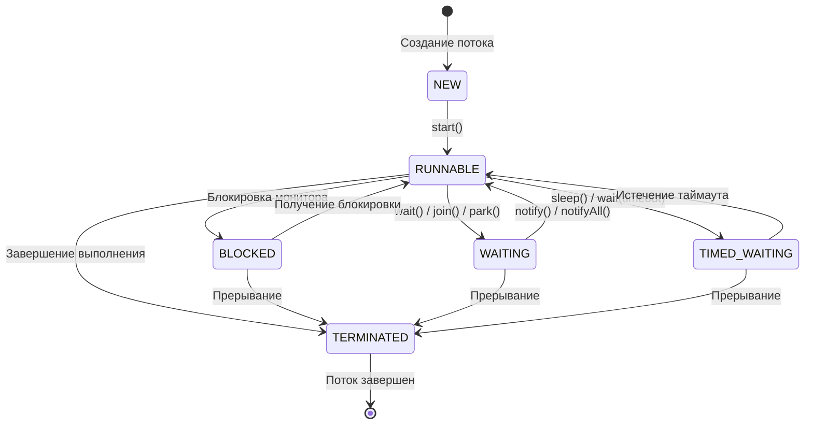
```mermaid
stateDiagram-v2
    [*] --> NEW : Создание потока
    NEW --> RUNNABLE : start()
    RUNNABLE --> BLOCKED : Блокировка монитора
    RUNNABLE --> WAITING : wait() / join() / park()
    RUNNABLE --> TIMED_WAITING : sleep() / wait(timeout)
    BLOCKED --> RUNNABLE : Получение блокировки
    WAITING --> RUNNABLE : notify() / notifyAll()
    TIMED_WAITING --> RUNNABLE : Истечение таймаута
    RUNNABLE --> TERMINATED : Завершение выполнения
    BLOCKED --> TERMINATED : Прерывание
    WAITING --> TERMINATED : Прерывание
    TIMED_WAITING --> TERMINATED : Прерывание
    TERMINATED --> [*] : Поток завершен
```

#### Deadlock: причины и решение

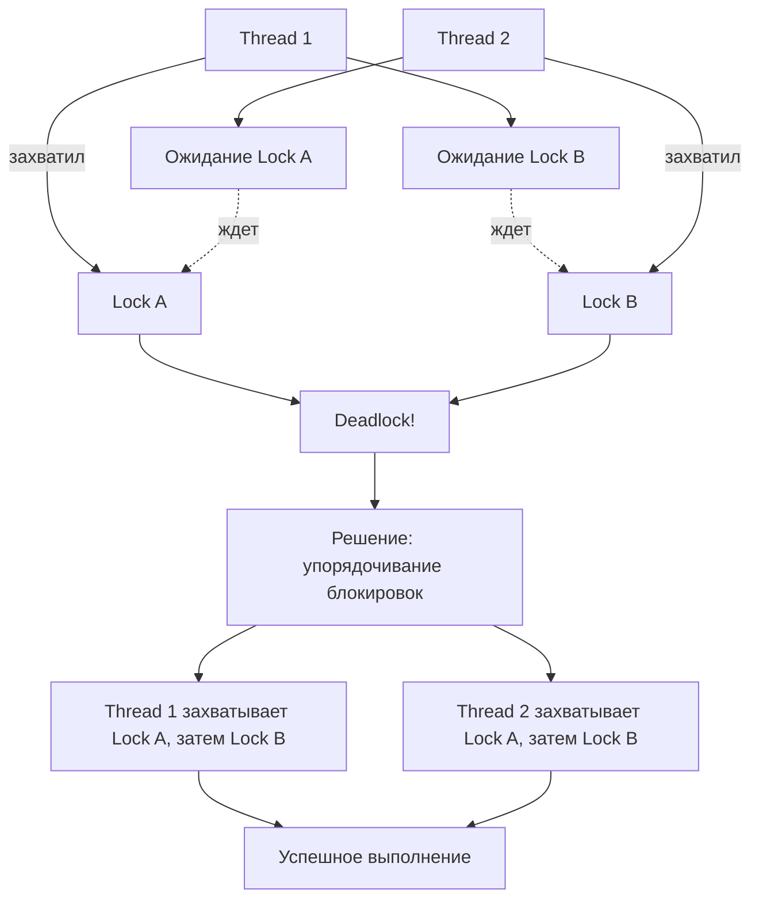
```mermaid
flowchart TD
    T1[Thread 1]
    T2[Thread 2]
    LA[Lock A]
    LB[Lock B]
    WAIT1[Ожидание Lock B]
    WAIT2[Ожидание Lock A]
    DEADLOCK[Deadlock!]
    SOL1[Решение: упорядочивание блокировок]
    T1_OK[Thread 1 захватывает Lock A, затем Lock B]
    T2_OK[Thread 2 захватывает Lock A, затем Lock B]
    SUCCESS[Успешное выполнение]

    T1 -->|захватил| LA
    T1 --> WAIT1
    WAIT1 -.->|ждет| LB
    T2 -->|захватил| LB
    T2 --> WAIT2
    WAIT2 -.->|ждет| LA
    LA --> DEADLOCK
    LB --> DEADLOCK

    DEADLOCK --> SOL1
    SOL1 --> T1_OK
    SOL1 --> T2_OK
    T1_OK --> SUCCESS
    T2_OK --> SUCCESS
```

#### Формула расчёта пула потоков

```
N_threads = N_cores * (1 + W / C)

где:
- N_cores - количество ядер процессора
- W (wait) - время ожидания (I/O, сеть)
- C (compute) - время вычислений
```

| Тип задачи | W/C | Пример N_threads (8 cores) |
|-----------|-----|---------------------------|
| CPU-bound | 0 | 8 |
| I/O-bound (БД) | ~10 | 88 |
| I/O-bound (сеть) | ~100 | 808 |
| Смешанный | ~3 | 32 |

---

[ДОПОЛНЕНИЕ SA]

#### ⚠️ Замечание системного аналитика: W/C — не константа, а распределение

Формула `N_threads = N_cores * (1 + W/C)` — это **приближение для steady-state**. В реальности W/C меняется от запроса к запросу. Если вы проектируете SLA для сервиса расчёта тарифов, учитывайте **p99 времени ответа**, а не среднее. Типичная ошибка: берут средний W/C, а на пике (когда БД тормозит) W/C улетает в 10 раз выше, и пул потоков перегружается.

> 💡 **Совет:** закладывайте в ТЗ не только `N_threads`, но и **механизм backpressure** (например, rejection policy в ThreadPoolExecutor) и **timeout на каждый внешний вызов**. Без timeout при зависании БД пул потоков схлопнется за 30 секунд.
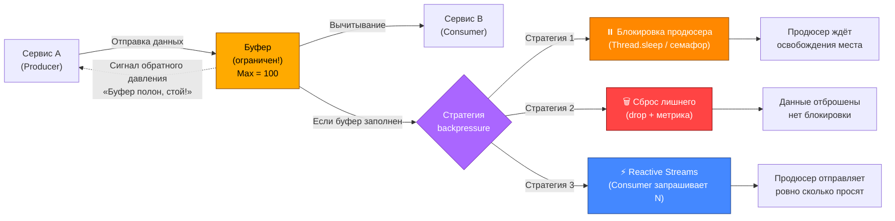
``` mermaid
graph LR
    A["Сервис A<br/>(Producer)"] -->|"Отправка данных"| B["Буфер<br/>(ограничен!)<br/>Max = 100"]
    B -->|"Вычитывание"| C["Сервис B<br/>(Consumer)"]

    B -.->|"Сигнал обратного давления<br/>«Буфер полон, стой!»"| A

    B -->|"Если буфер заполнен"| D{"Стратегия<br/>backpressure"}

    D -->|"Стратегия 1"| E["⏸️ Блокировка продюсера<br/>(Thread.sleep / семафор)"]
    D -->|"Стратегия 2"| F["🗑️ Сброс лишнего<br/>(drop + метрика)"]
    D -->|"Стратегия 3"| G["⚡ Reactive Streams<br/>(Consumer запрашивает N)"]

    E --> H["Продюсер ждёт<br/>освобождения места"]
    F --> I["Данные отброшены<br/>нет блокировки"]
    G --> J["Продюсер отправляет<br/>ровно сколько просят"]

    style B fill:#ffaa00,stroke:#884400,color:#000
    style D fill:#aa66ff,stroke:#6622aa,color:#fff
    style E fill:#ff8800,stroke:#884400,color:#fff
    style F fill:#ff4444,stroke:#880000,color:#fff
    style G fill:#4488ff,stroke:#224488,color:#fff
```			  
[КОНЕЦ ДОПОЛНЕНИЯ SA]

---

[ДОПОЛНЕНИЕ BA]

#### ⚠️ Внимание, грабли! W/C — не константа, а распределение

Формула `N_threads = N_cores * (1 + W/C)` — это **приближение для steady-state**. В реальности W/C меняется от запроса к запросу. Если вы проектируете SLA для сервиса расчёта тарифов, учитывайте **p99 времени ответа**, а не среднее. Типичная ошибка: берут средний W/C, а на пике (когда БД тормозит) W/C улетает в 10 раз выше, и пул потоков перегружается.

> 💡 **Совет BA:** закладывайте в ТЗ не только `N_threads`, но и **механизм backpressure** (например, rejection policy в ThreadPoolExecutor) и **timeout на каждый внешний вызов**. Без timeout при зависании БД пул потоков схлопнется за 30 секунд.

[КОНЕЦ ДОПОЛНЕНИЯ BA]

---

> 🔗 **Связующий комментарий:** Оба аналитика (SA и BA) независимо указали на одну и ту же проблему — нестабильность W/C. Это подтверждает, что вопрос критически важен. SA акцентирует техническую сторону (распределение, p99), BA — управленческую (закладывать в ТЗ, согласовывать со стейкхолдерами). Рекомендуется учитывать обе перспективы.

---

### Примеры кода

Race condition (состояние гонки) — это ситуация, когда два или более потока одновременно обращаются к общим данным, и итоговый результат зависит от того, как перекрываются их операции во времени. Результат непредсказуем, потому что ты не контролируешь, в каком порядке планировщик ОС переключит потоки.

#### Race Condition и её решение

```java
// Race Condition
public class Counter {
    private int count = 0;
    public void increment() { count++; } // НЕ атомарно!
}

// Решение 1: synchronized
public synchronized void increment() { count++; }

// Решение 2: AtomicInteger
private AtomicInteger count = new AtomicInteger(0);
public void increment() { count.incrementAndGet(); }

// Решение 3: ReentrantLock
private final ReentrantLock lock = new ReentrantLock();
public void increment() {
    lock.lock();
    try { count++; } finally { lock.unlock(); }
}
```

```sql
-- Race Condition — ТАК НЕЛЬЗЯ
-- Сессия 1 и Сессия 2 одновременно вызывают процедуру

CREATE OR REPLACE PROCEDURE increment_counter AS
    v_count NUMBER;
BEGIN
    SELECT counter_value INTO v_count 
    FROM counters 
    WHERE counter_id = 1;
    
    v_count := v_count + 1;  -- Обе сессии прочитали одно и то же значение!
    
    UPDATE counters 
    SET counter_value = v_count 
    WHERE counter_id = 1;
    
    COMMIT;
END;

// 1 - Атомарный update

// 2 - dbms_lock

// 3 - select ... for update
```

[ДОПОЛНЕНИЕ SA]

#### ⚠️ Замечание системного аналитика: race condition на уровне данных — ваша зона ответственности

Как системный аналитик, вы должны описать **границы транзакций** в спецификации. Race condition возникает не только в коде, но и на уровне интеграций. Пример: два микросервиса одновременно обновляют статус полиса через REST. Если нет версионирования (optimistic lock), последний запрос перетирает данные первого.

> 💡 **Совет:** в контракте API для ресурса, который может изменяться конкурентно, всегда добавляйте поле `version` (или `etag`). В спецификации OpenAPI это выглядит так:

```yaml
components:
  schemas:
    Policy:
      type: object
      properties:
        id:
          type: string
          format: uuid
        version:
          type: integer
          description: "Используется для optimistic locking. При обновлении клиент обязан передать текущую версию."
        status:
          type: string
          enum: [DRAFT, ACTIVE, CANCELLED]
      required: [id, version, status]
```

[КОНЕЦ ДОПОЛНЕНИЯ SA]

---

#### C# (.NET): Task + async/await (аналог CompletableFuture в java)

```csharp
// Асинхронный пайплайн расчёта цены полиса
public class PolicyCalculator
{
    // Собственный пул потоков (ограниченный, с backpressure)
    private readonly SemaphoreSlim _throttle = new SemaphoreSlim(10);
    
    public async Task<Policy> CalculatePriceAsync(QuoteRequest request)
    {
        await _throttle.WaitAsync();  // Backpressure: ждём, пока освободится слот
        try
        {
            var validated = await ValidateQuoteAsync(request);
            var tariff = await CalculateTariffAsync(validated);
            var discounted = await ApplyDiscountsAsync(tariff);
            return discounted;
        }
        catch (Exception ex)
        {
            _logger.LogError(ex, "Failed to calculate price");
            return Policy.DefaultFallback();
        }
        finally
        {
            _throttle.Release();  // Освобождаем слот
        }
    }
    
    private async Task<ValidatedQuote> ValidateQuoteAsync(QuoteRequest request)
    {
        // Имитация: валидация через внешний API
        await Task.Delay(50);  // Не блокирует поток!
        return new ValidatedQuote();
    }
    
    private async Task<Tariff> CalculateTariffAsync(ValidatedQuote validated)
    {
        await Task.Delay(100);
        return new Tariff();
    }
    
    private async Task<Policy> ApplyDiscountsAsync(Tariff tariff)
    {
        await Task.Delay(30);
        return new Policy();
    }
}

// Использование: параллельный расчёт для множества запросов
var calculator = new PolicyCalculator();
var tasks = requests.Select(r => calculator.CalculatePriceAsync(r));
Policy[] results = await Task.WhenAll(tasks);  // Все запускаются параллельно
```

#### C# (.NET): Channel<T> — асинхронный Producer/Consumer с backpressure

```csharp
// Аналог BlockingQueue, но полностью асинхронный
var channel = Channel.CreateBounded<QuoteRequest>(new BoundedChannelOptions(100)
{
    FullMode = BoundedChannelFullMode.Wait  // Backpressure: продюсер ЖДЁТ
});

// Producer
async Task ProduceAsync()
{
    foreach (var request in requests)
    {
        await channel.Writer.WriteAsync(request);  // Если канал полон — ждём
    }
    channel.Writer.Complete();
}

// Consumer (множество параллельных)
async Task ConsumeAsync()
{
    await foreach (var request in channel.Reader.ReadAllAsync())
    {
        await CalculatePriceAsync(request);
    }
}
```

#### PL/SQL (Oracle): DBMS_SCHEDULER + асинхронные задания

```sql
-- 1. Параллельное выполнение через DBMS_PARALLEL_EXECUTE
-- 2. Планирование асинхронных заданий (fire-and-forget)
-- 3. Асинхронный вызов HTTP-сервиса (Oracle 21c+)
DECLARE
    v_response CLOB;
BEGIN
    -- Отправляем запрос к внешнему API расчёта тарифа и НЕ ЖДЁМ
    APEX_WEB_SERVICE.MAKE_REST_REQUEST_ASYNC(
        p_url         => 'https://tariff-api.internal/calculate',
        p_http_method => 'POST',
        p_body        => '{ "requestId": ' || p_request_id || ' }',
        p_callback    => 'calculate_price_pkg.handle_tariff_response'  -- Колбэк
    );
    -- Управление вернулось сразу, ответ придёт позже в handle_tariff_response
END;
```

### Нефункциональные требования к модулю расчёта цены

| Параметр | Значение |
|----------|----------|
| **Платформа** | .NET 8, ASP.NET Core |
| **Модель асинхронности** | Task + async/await + SemaphoreSlim для backpressure |
| **Максимальная конкурентность (throttle)** | 10 одновременных расчётов |
| **Очередь ожидания** | BoundedChannel (Max = 100), стратегия Wait |
| **Fallback** | Policy.DefaultFallback() при ошибке |
| **Распараллеливание** | `Task.WhenAll()` для независимых запросов |
| **Таймаут операции** | 30 секунд через `CancellationToken` |
| **Ожидаемый p99 latency** | < 500 мс |
| **Целевой throughput** | 200 запросов/сек |

---

[ДОПОЛНЕНИЕ SA]

### Проектирование контрактов: OpenAPI и AsyncAPI для многопоточных сервисов

Системный аналитик должен уметь описывать **интеграционные контракты** для сервисов, работающих с многопоточностью. Ниже — реальные примеры.

#### 1. OpenAPI-спецификация для REST-эндпоинта расчёта тарифа

Этот эндпоинт вызывается фронтом и внутри использует пул потоков для параллельного сбора данных.

```yaml
openapi: 3.0.3
info:
  title: Tariff Calculation Service
  version: 1.0.0
  description: |
    Сервис расчёта страховых тарифов.
    Внутренняя многопоточность: запросы к БД, внешним API скоринга и истории
    выполняются параллельно через CompletableFuture.
    Пул потоков: fixed (8 потоков), rejection policy — CallerRunsPolicy.

paths:
  /api/v1/tariff/calculate:
    post:
      summary: Рассчитать тариф по заявке
      operationId: calculateTariff
      requestBody:
        required: true
        content:
          application/json:
            schema:
              $ref: '#/components/schemas/QuoteRequest'
      responses:
        '200':
          description: Успешный расчёт
          content:
            application/json:
              schema:
                $ref: '#/components/schemas/TariffResponse'
        '429':
          description: Too Many Requests — сервис перегружен
          content:
            application/json:
              schema:
                $ref: '#/components/schemas/ErrorResponse'
        '503':
          description: Service Unavailable — пул потоков исчерпан
          content:
            application/json:
              schema:
                $ref: '#/components/schemas/ErrorResponse'
      x-ratelimit:
        limit: 1000
        period: "1s"
        description: "Максимум 1000 запросов в секунду. При превышении — 429."

components:
  schemas:
    QuoteRequest:
      type: object
      required: [clientId, productCode, sumInsured]
      properties:
        clientId:
          type: string
          format: uuid
          example: "a1b2c3d4-1234-5678-9abc-def012345678"
        productCode:
          type: string
          example: "KASKO-2024"
        sumInsured:
          type: number
          format: double
          example: 1500000.00
        additionalData:
          type: object
          description: "Доп. поля для скоринга (опционально)"
          properties:
            vehicleYear:
              type: integer
              example: 2022
            driverExperience:
              type: integer
              example: 5

    TariffResponse:
      type: object
      properties:
        calculationId:
          type: string
          format: uuid
        premium:
          type: number
          format: double
          description: "Итоговая премия"
        breakdown:
          type: object
          properties:
            baseTariff:
              type: number
            discount:
              type: number
            loading:
              type: number
        processingTimeMs:
          type: integer
          description: "Фактическое время обработки (для мониторинга SLA)"

    ErrorResponse:
      type: object
      properties:
        code:
          type: string
          example: "THREAD_POOL_EXHAUSTED"
        message:
          type: string
          example: "All worker threads are busy. Retry later."
        retryAfterMs:
          type: integer
          example: 500
```

> 💡 **Совет:** в OpenAPI-спецификации для многопоточного сервиса обязательно указывайте **лимиты (rate limiting)** и **коды ошибок, связанные с перегрузкой** (429, 503). Это часть нефункциональных требований, которую аналитик должен согласовать с заказчиком.

#### 2. AsyncAPI-контракт для событийной интеграции (Kafka)

Когда сервис расчёта завершает обработку, он публикует событие в Kafka. Другие сервисы (уведомления, история, аналитика) подписываются асинхронно.

```yaml
asyncapi: 2.6.0
info:
  title: Tariff Events
  version: 1.0.0
  description: |
    События, публикуемые сервисом расчёта тарифов.
    Каждое событие — результат асинхронной обработки в пуле потоков.
    Гарантия доставки: at-least-once.
    Порядок сообщений: не гарантируется (ключ партиции — calculationId).

channels:
  tariff.calculation.completed:
    publish:
      operationId: onTariffCalculationCompleted
      message:
        $ref: '#/components/messages/TariffCalculated'
      bindings:
        kafka:
          topic: tariff.calculation.completed
          partitions: 6
          replicas: 2

  tariff.calculation.failed:
    publish:
      operationId: onTariffCalculationFailed
      message:
        $ref: '#/components/messages/TariffCalculationFailed'
      bindings:
        kafka:
          topic: tariff.calculation.failed
          partitions: 3
          replicas: 2

components:
  messages:
    TariffCalculated:
      name: TariffCalculatedEvent
      title: Тариф рассчитан успешно
      contentType: application/json
      payload:
        type: object
        required: [calculationId, clientId, premium, timestamp]
        properties:
          calculationId:
            type: string
            format: uuid
            description: "Идентификатор расчёта"
          clientId:
            type: string
            format: uuid
          premium:
            type: number
            format: double
          timestamp:
            type: string
            format: date-time
          breakdown:
            type: object
            properties:
              baseTariff:
                type: number
              discount:
                type: number
              loading:
                type: number

    TariffCalculationFailed:
      name: TariffCalculationFailedEvent
      title: Ошибка расчёта тарифа
      contentType: application/json
      payload:
        type: object
        required: [calculationId, clientId, reason, timestamp]
        properties:
          calculationId:
            type: string
            format: uuid
          clientId:
            type: string
            format: uuid
          reason:
            type: string
            enum: [VALIDATION_ERROR, EXTERNAL_TIMEOUT, INTERNAL_ERROR, THREAD_POOL_EXHAUSTED]
          timestamp:
            type: string
            format: date-time
```

> ⚠️ **Замечание системного аналитика:** AsyncAPI-контракт — это аналог OpenAPI для событийных систем. Если ваш сервис публикует события в Kafka/RabbitMQ, **обязательно** описывайте контракт. Типичная ошибка: разработчик-потребитель узнаёт структуру события из логов, а не из документации. AsyncAPI решает эту проблему.

[КОНЕЦ ДОПОЛНЕНИЯ SA]

---

### Ингос-секция: Многопоточность у нас

- Расчётные задачи: Fixed thread pool (8 потоков для CPU-bound расчётов)
- I/O-задачи (запросы к внешним API): Cached thread pool
- Проблемы: Race condition при параллельном обновлении полиса
- Решение: Оптимистическая блокировка через version-поле


### Практика

У вас сервис расчёта страховых тарифов. Нагрузка: 1000 RPS, время вычисления на одном ядре - 50ms, время чтения из БД - 20ms. Сколько ядер CPU нужно для сервиса при utilisation target 80%?

**Формула:** CPU_cores_needed = RPS * CPU_time_per_request / utilization_target

<details>
<summary>Ожидаемый ответ</summary>

- RPS = 1000
- CPU_time_per_request = 50ms / 1000 = 0.05 сек (на одном ядре)
- utilisation_target = 0.8

CPU_cores_needed = 1000 * 0.05 / 0.8 = 62.5 ~ 64 cores

Для I/O-bound (50ms compute + 20ms wait): N = 64 * (1 + 20/50) ~ 90 потоков

</details>

---

[ДОПОЛНЕНИЕ SA]

### Работа с данными и маппинг: от реляционной БД к событию Kafka

Системный аналитик часто проектирует **трансформацию данных** между системами. Ниже — реальный пример маппинга объекта «Заказ» из реляционной БД в JSON-событие для Kafka.

#### Пример маппинга: Order → OrderCreatedEvent

**Исходная схема БД (реляционная):**

```sql
-- Таблица заказов
CREATE TABLE orders (
    order_id       UUID PRIMARY KEY,
    client_id      UUID NOT NULL,
    product_code   VARCHAR(20) NOT NULL,
    sum_insured    DECIMAL(15,2) NOT NULL,
    status         VARCHAR(20) NOT NULL DEFAULT 'DRAFT',
    created_at     TIMESTAMP NOT NULL DEFAULT NOW(),
    updated_at     TIMESTAMP NOT NULL DEFAULT NOW(),
    version        INTEGER NOT NULL DEFAULT 1
);

-- Таблица позиций заказа (1:N)
CREATE TABLE order_items (
    item_id        UUID PRIMARY KEY,
    order_id       UUID NOT NULL REFERENCES orders(order_id),
    item_type      VARCHAR(50) NOT NULL,
    item_value     DECIMAL(15,2) NOT NULL,
    description    TEXT
);

-- Таблица скидок (1:1)
CREATE TABLE order_discounts (
    order_id       UUID PRIMARY KEY REFERENCES orders(order_id),
    discount_type  VARCHAR(20) NOT NULL,
    discount_value DECIMAL(5,2) NOT NULL,
    promo_code     VARCHAR(20)
);
```

**Целевой JSON (событие Kafka):**

```json
{
  "eventId": "evt-001",
  "eventType": "OrderCreated",
  "eventVersion": "1.0",
  "timestamp": "2024-11-20T10:30:00Z",
  "payload": {
    "orderId": "ord-123",
    "clientId": "cl-456",
    "product": {
      "code": "KASKO-2024",
      "sumInsured": 1500000.00
    },
    "items": [
      {
        "itemId": "itm-001",
        "type": "BASE_TARIFF",
        "value": 45000.00,
        "description": "Базовый тариф КАСКО"
      },
      {
        "itemId": "itm-002",
        "type": "RISK_LOADING",
        "value": 5000.00,
        "description": "Надбавка за риск (водитель до 25 лет)"
      }
    ],
    "discount": {
      "type": "PROMO",
      "value": 10.00,
      "promoCode": "WELCOME10"
    },
    "totalPremium": 45000.00,
    "status": "DRAFT",
    "version": 1
  }
}
```

**Таблица маппинга (промежуточная):**

| Поле в БД (orders) | Тип в БД | Поле в JSON | Тип в JSON | Трансформация |
|---|---|---|---|---|
| `order_id` | UUID | `payload.orderId` | string | Без изменений |
| `client_id` | UUID | `payload.clientId` | string | Без изменений |
| `product_code` | VARCHAR | `payload.product.code` | string | Без изменений |
| `sum_insured` | DECIMAL | `payload.product.sumInsured` | number | CAST to double |
| `status` | VARCHAR | `payload.status` | string | Без изменений |
| `version` | INTEGER | `payload.version`

## Модуль I-4. Нефункциональные требования (НФТ)

См. [4_NFR_and_CAP.md](https://github.com/DAndreev91/course_creator/blob/main/4_NFR_and_CAP.md)

### Цели модуля

После изучения вы сможете:
- Формулировать НФТ совместно с заказчиком
- Использовать CAP-теорему для выбора БД
- Определять метрики производительности

### Теоретическая часть

#### CAP-треугольник

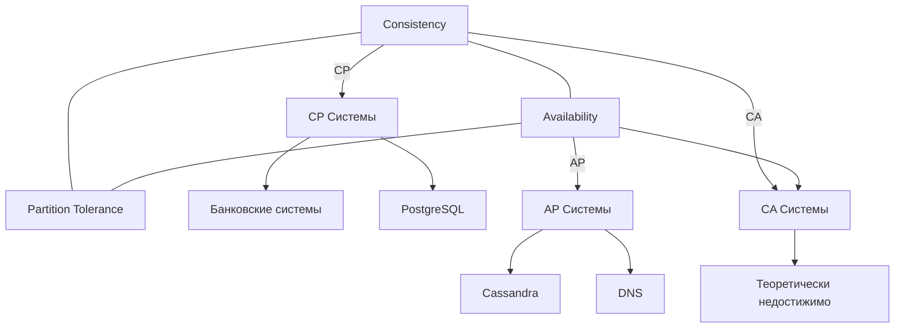
```mermaid
flowchart TD
    C[Consistency] --- A[Availability]
    C --- P[Partition Tolerance]
    A --- P

    C -->|CP| CP_Zone[CP Системы]
    CP_Zone --> Bank[Банковские системы]
    CP_Zone --> PostgreSQL[PostgreSQL]

    A -->|AP| AP_Zone[AP Системы]
    AP_Zone --> Cassandra[Cassandra]
    AP_Zone --> DNS[DNS]

    C -->|CA| CA_Zone[CA Системы]
    A --> CA_Zone
    CA_Zone --> Theoretical[Теоретически недостижимо]
```

#### CAP + PACELC

| Теорема | Суть |
|---------|------|
| CAP | В распределённой системе из 3 свойств (Consistency, Availability, Partition Tolerance) можно гарантировать только 2 |
| PACELC | Расширение CAP: если Partition - выбор (Availability или Consistency). Иначе (Else) - выбор (Latency или Consistency) |

#### Метрики производительности

| Метрика | Определение | Целевое значение |
|---------|------------|------------------|
| Latency | Время ответа сервиса | P99 < 500ms |
| Throughput | Количество запросов в секунду | 1000+ RPS |
| Availability | Процент времени, когда сервис доступен | 99.9% |
| Error Rate | Доля ошибочных ответов | < 0.1% |

---

[ДОПОЛНЕНИЕ BA]

## 1. Бизнес-требования и KPI

### Реальный кейс: цепочка «Боль клиента → Бизнес-цель → KPI → Бизнес-требование → Функциональное требование»

**Контекст:** Интернет-магазин электроники «ТехноМаркет». Клиенты массово уходят после добавления товара в корзину, не оформляя заказ. Отток на этапе корзины — 72%.

| Уровень | Описание |
|---------|----------|
| **Боль клиента** | «Я добавил товар в корзину, но не знаю, есть ли он на складе. Жду подтверждения менеджера часами, а иногда и сутками. В итоге покупаю в другом магазине, где вижу реальный остаток онлайн». |
| **Бизнес-цель** | Снизить отток клиентов на этапе корзины с 72% до 45% за 6 месяцев. |
| **KPI** | • Процент брошенных корзин — снижение с 72% до 45%<br>• Время подтверждения наличия товара — с 4 часов до 30 секунд<br>• NPS (индекс лояльности) — рост с 32 до 55 |
| **Бизнес-требование** | Система должна в реальном времени показывать клиенту актуальный остаток товара на складе при добавлении в корзину и автоматически резервировать товар на 15 минут. |
| **Функциональное требование** | • При добавлении товара в корзину — GET-запрос к Warehouse API (timeout 500ms)<br>• Если остаток > 0 — показать зелёную метку «В наличии», зарезервировать через POST /api/v1/reserve<br>• Если остаток = 0 — показать «Нет в наличии», предложить подписку на уведомление<br>• Если Warehouse API не ответил за 500ms — показать «Уточняется у менеджера», поставить задачу в очередь |

### Шаблон карточки бизнес-требования

| Поле | Описание | Пример заполнения |
|------|----------|-------------------|
| **ID** | Уникальный идентификатор | BRQ-001 |
| **Название** | Краткое название требования | Отображение реального остатка товара в корзине |
| **Описание** | Что именно должна делать система | Система должна показывать клиенту актуальный остаток товара на складе в реальном времени при добавлении в корзину |
| **Бизнес-обоснование** | Почему это важно для бизнеса | Снижение оттока на этапе корзины с 72% до 45% |
| **Метрика успеха** | Как измерим, что требование выполнено | Время подтверждения наличия ≤ 30 сек; % брошенных корзин ≤ 45% |
| **Стейкхолдер** | Кто отвечает за требование и кто его утверждает | Product Owner — Иванов И.И.; Бизнес-заказчик — Петрова А.С. |
| **Приоритет** | Must Have / Should Have / Could Have / Won't Have | Must Have |
| **Зависимости** | От каких систем/требований зависит | Warehouse API (интеграция), каталог товаров (данные) |
| **Риски** | Что может пойти не так | Warehouse API недоступен — нужен fallback-сценарий |

> 💡 **Совет BA:** всегда заполняйте поле «Метрика успеха» цифрами. Если стейкхолдер говорит «сделать удобно» — спросите: «Как мы измерим, что стало удобно? Какой конкретный показатель изменится и на сколько?» Без цифр требование — это хотелка.

[КОНЕЦ ДОПОЛНЕНИЯ BA]

---

#### Таблица времён простоя

| Availability | Допустимый downtime в год |
|-------------|--------------------------|
| 99% (две девятки) | 3.65 дня |
| 99.9% (три девятки) | 8.76 часа |
| 99.99% (четыре девятки) | 52.56 минуты |
| 99.999% (пять девяток) | 5.26 минуты |

---

[ДОПОЛНЕНИЕ BA]

## 2. Управление приоритетами и scope

### Матрица MoSCoW для гипотетического проекта

**Проект:** Внедрение онлайн-калькулятора КАСКО в интернет-банке.

| Категория | Описание | Примеры требований | % от объёма |
|-----------|----------|-------------------|-------------|
| **M**ust Have | Без этого релиз не имеет смысла. Система не работает. | • Расчёт базового тарифа по формуле<br>• Интеграция с АИС страхования<br>• Вывод итоговой премии на экран | 40% |
| **S**hould Have | Важно, но можно отложить на следующий спринт, если не успеваем. | • Сохранение черновика расчёта<br>• Отправка расчёта на email | 25% |
| **C**ould Have | Хорошо бы, но без этого можно жить. | • Сравнение с тарифами конкурентов<br>• Чат с консультантом на странице калькулятора | 20% |
| **W**on't Have | Сознательно исключаем из текущего релиза. | • Интеграция с телемедициной<br>• Мобильное приложение для агентов | 15% |

#### Как защищать MoSCoW перед заказчиком (скрипт переговоров)

**Ситуация:** Заказчик говорит: «А давайте в первый релиз запихнём всё! И чат, и сравнение с конкурентами, и мобильное приложение для агентов».

**Ваш ответ (техника «Сэндвич»):**

> **Слой 1 — Согласие:** «Иван Иванович, я полностью разделяю ваше желание сделать максимально функциональный продукт. Все перечисленные фичи действительно важны для бизнеса».
>
> **Слой 2 — Аргументация (факты и цифры):** «Но давайте посмотрим на дату релиза. Если мы берём всё — мы выходим через 8 месяцев. Если берём только Must Have и Should Have — через 3 месяца. По нашей статистике, 80% ценности продукта дают первые 40% функционала. Остальное — это полировка. Я предлагаю: выпускаем через 3 месяца с базовым функционалом, собираем обратную связь от 1000 первых пользователей, и на основе данных дорабатываем. Это снижает риск провала на 60%».
>
> **Слой 3 — Предложение:** «Давайте составим две дорожные карты: Release 1 (Must + Should) за 3 месяца и Release 2 (Could + остальное) ещё через 2 месяца. Если рынок потребует — мы скорректируем приоритеты».

> 💡 **Совет BA:** MoSCoW — это не просто список. Это **инструмент переговоров**. Ваша задача — перевести «хотелки» в «стоимость задержки релиза». Каждый Could Have отодвигает дату выхода на рынок. Покажите заказчику цену его хотелок в деньгах и времени.

### Кейс «Остановка Gold Plating»

**Контекст:** Ритейл-сеть «Продукты 24/7» (500 магазинов). Внедряем систему управления заказами поставщикам.

**Ситуация:** Заказчик (директор по закупкам) требует: «Сделайте мне дашборд с прогнозом спроса на основе нейросети. Я хочу видеть, сколько бананов продастся через 2 недели с точностью 95%».

**Что я сделал как BA:**

1. **Задал 5 вопросов:**
   - «Как вы сейчас прогнозируете спрос на бананы?» — «Берём среднее за прошлую неделю».
   - «Какая текущая точность?» — «Примерно 80%».
   - «Сколько вы теряете из-за неточности?» — «Около 2 млн руб/мес на списаниях и упущенной выручке».
   - «Сколько стоит внедрение нейросети?» — Оценка разработки: 8 млн руб + 6 месяцев.
   - «Какой бюджет на проект?» — 5 млн руб.

2. **Посчитал ROI:**
   - Текущие потери: 2 млн руб/мес.
   - Улучшение с 80% до 95% точности: сокращение потерь на 30% (оценка эксперта) = 600 тыс руб/мес.
   - Стоимость нейросети: 8 млн руб.
   - Окупаемость: 8 / 0,6 = 13,3 месяца.
   - Бюджет проекта: 5 млн руб — нейросеть не влезает.

3. **Предложил альтернативу:**
   - Улучшить текущий метод: добавить сезонные коэффициенты (2 недели разработки).
   - Стоимость: 200 тыс руб.
   - Ожидаемый эффект: повышение точности с 80% до 87% (сокращение потерь на 15% = 300 тыс руб/мес).
   - Окупаемость: 0,67 месяца.
   - ROI: (300 000 × 12 − 200 000) / 200 000 = 1700% годовых.

**Аргументы, которые сработали:**
- «Нейросеть окупится через 13 месяцев при бюджете 8 млн. У нас бюджет 5 млн и сроки — 3 месяца».
- «Альтернатива окупится за 3 недели и даст 87% точности. Если этого мало — через 3 месяца внедрим нейросеть, уже имея 87% базу».
- «Давайте не будем делать идеально — давайте сделаем работающе и дёшево, а потом улучшим».

**Результат:** Заказчик согласился на альтернативу. Через 3 недели точность выросла до 87%. Через 6 месяцев внедрили нейросеть (уже на заработанные деньги).

> ⚠️ **Внимание, грабли!** Gold Plating (позолота) — это когда заказчик или команда добавляют функционал, который не нужен для достижения бизнес-цели, но кажется «крутым». Ваша задача как BA — каждый раз возвращать к вопросу: **«Какая бизнес-метрика изменится от этой фичи? И сколько это стоит?»**

[КОНЕЦ ДОПОЛНЕНИЯ BA]

---

### Ингос-секция: Какие НФТ мы используем

- SLA с бизнесом: 99.9% availability в рабочее время (8:00-20:00)
- Latency target: P99 < 1s для синхронных API
- Throughput: capacity planning на 2x от текущей нагрузки
- PACELC-выбор: Для core-данных (полисы) - CP; Для аналитики - AP

### Практика

Заказчик говорит: "Система должна быть отказоустойчивой". Как перевести это в измеримые НФТ?

<details>
<summary>Ожидаемый ответ</summary>

1. Определить SLA: 99.9% availability (8.76 ч/год downtime)
2. SLO: 99.95% uptime за месяц
3. SLI: доля успешных запросов за 5-минутное окно
4. RTO (Recovery Time Objective): < 15 минут
5. RPO (Recovery Point Objective): < 1 минута
6. Стратегия: active-active или active-passive

</details>

### Контрольные вопросы

1. Почему CA-комбинация в CAP-теореме недостижима на практике?
2. Какую из CAP выбрать для банковской транзакции? Для логов?
3. Чем отличается SLA от SLO?
4. Что такое PACELC и как он дополняет CAP?

---

## Модуль I-5. DDD, CQS/CQRS, TDD/BDD, API First

См. [DDD и 4 принципа](https://github.com/DAndreev91/course_creator/blob/main/5_DDD_and_so_on.md)

### Цели модуля

После изучения вы сможете:
- Применять стратегическое моделирование DDD (Bounded Context, Ubiquitous Language)
- Разделять команды и запросы (CQS/CQRS)
- Использовать TDD/BDD-цикл в разработке

### Теоретическая часть

#### Bounded Context Map (DDD)

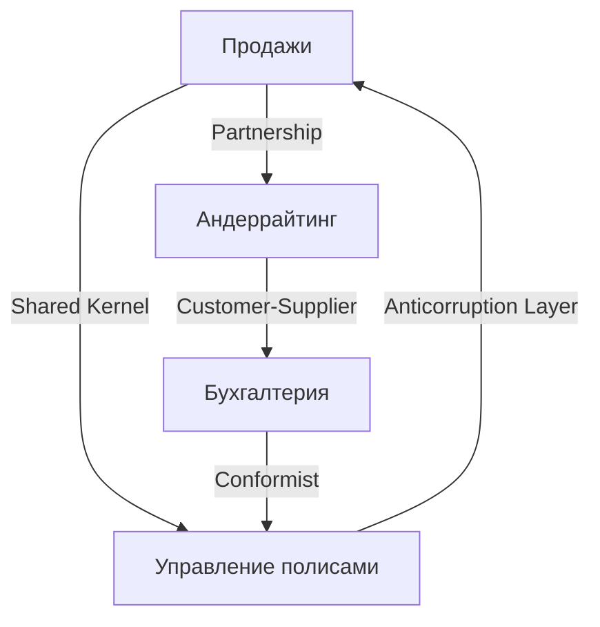
```mermaid
flowchart TD
    Sales[Продажи]
    Underwriting[Андеррайтинг]
    Accounting[Бухгалтерия]
    PolicyMgmt[Управление полисами]

    Sales -->|Partnership| Underwriting
    Sales -->|Shared Kernel| PolicyMgmt
    Underwriting -->|Customer-Supplier| Accounting
    Accounting -->|Conformist| PolicyMgmt
    PolicyMgmt -->|Anticorruption Layer| Sales
```

#### CQRS-поток

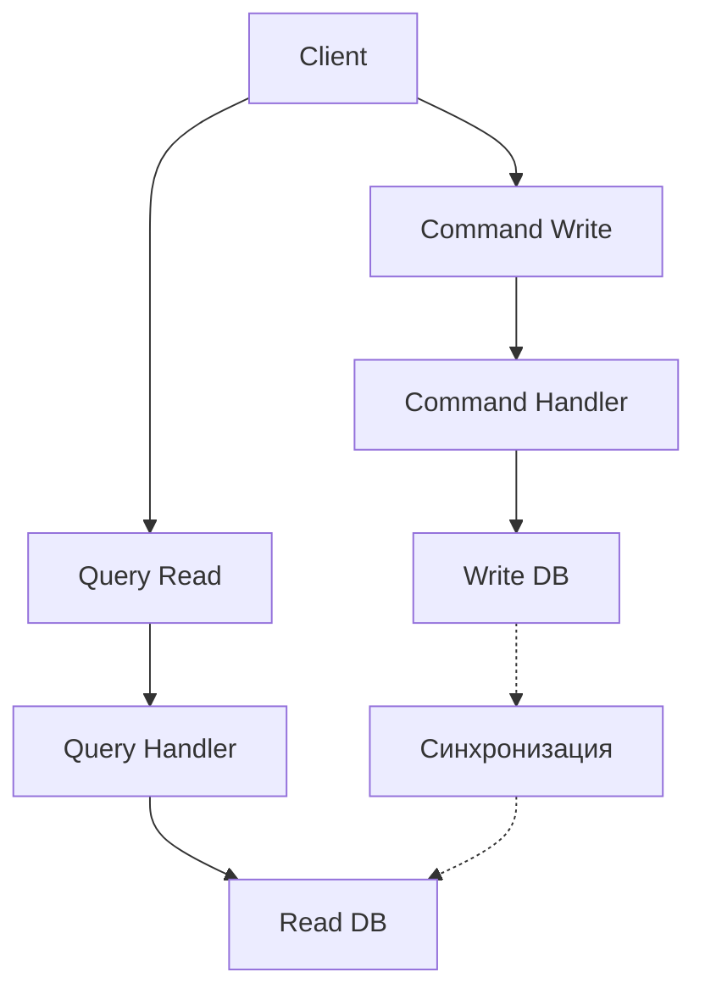
```mermaid
flowchart TD
    Client[Client] --> Command[Command Write]
    Command --> CommandHandler[Command Handler]
    CommandHandler --> WriteDB[Write DB]
    Client --> Query[Query Read]
    Query --> QueryHandler[Query Handler]
    QueryHandler --> ReadDB[Read DB]
    WriteDB -.-> Sync[Синхронизация]
    Sync -.-> ReadDB
```

#### TDD-цикл

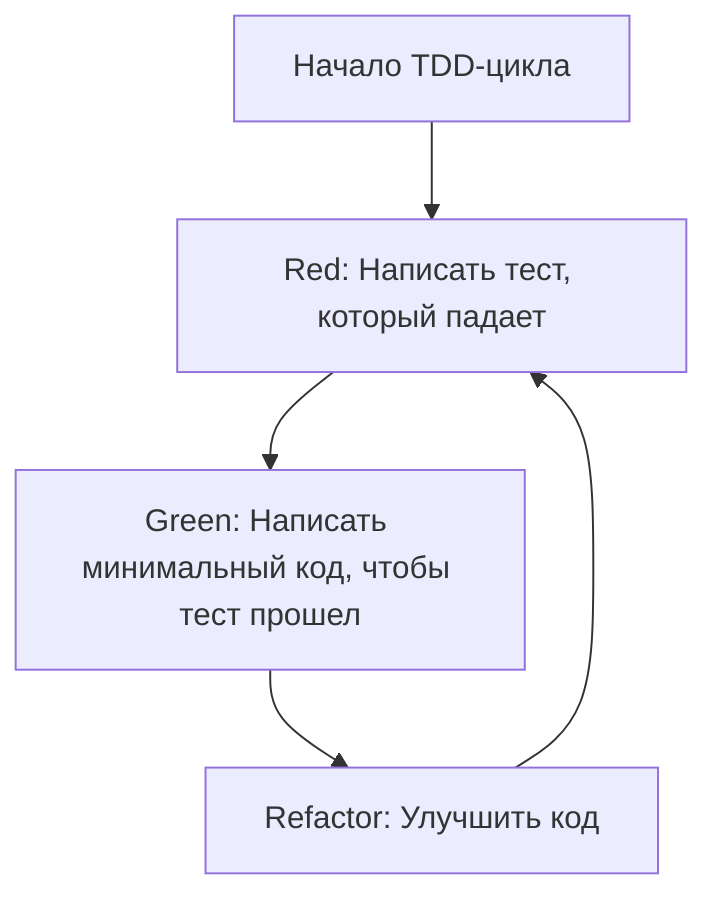
```mermaid
flowchart TD
    A[Начало TDD-цикла] --> B[Red: Написать тест, который падает]
    B --> C[Green: Написать минимальный код, чтобы тест прошел]
    C --> D[Refactor: Улучшить код]
    D --> B
```

### Пример кода: Value Object (DDD)

```java
// Value Object - иммутабельный, с behaviour
public record Money(BigDecimal amount, Currency currency) {
    public Money {
        if (amount.compareTo(BigDecimal.ZERO) < 0) {
            throw new IllegalArgumentException("Amount must be non-negative");
        }
        if (currency == null) {
            throw new IllegalArgumentException("Currency must not be null");
        }
    }
    
    public Money add(Money other) {
        if (!this.currency.equals(other.currency)) {
            throw new IllegalArgumentException("Currency mismatch");
        }
        return new Money(this.amount.add(other.amount), this.currency);
    }
}
```

### Ингос-секция: Методологии

- DDD: Используем Bounded Context для границ микросервисов
- CQRS: Только для read-heavy операций (дашборды, отчёты)
- TDD: Для core-доменов обязателен
- API First: OpenAPI спецификация для всех новых сервисов

### Практика

Создайте BDD-сценарий (Gherkin) для функции "Расчёт стоимости страховки водителя":

```gherkin
Feature: Расчёт стоимости страховки
  As a клиент
  I want получить стоимость страховки
  So that принять решение о покупке

  Scenario: Водитель младше 25 лет
    Given водитель возрастом 22 года
    And водитель со стажем 3 года
    When запрашивается стоимость полиса
    Then стоимость должна быть увеличена на коэффициент 1.5
```

### Контрольные вопросы

1. В чём разница между Entity и Value Object в DDD?
2. Когда CQRS оправдан, а когда - overengineering?
3. Как TDD влияет на дизайн API?
4. Что такое Ubiquitous Language и как её создать?

---

## Модуль I-6. Управление общими данными

См. [Управление общими данными](https://github.com/DAndreev91/course_creator/blob/main/6_Shared_data_management.md)

### Цели модуля

После изучения вы сможете:
- Проектировать единый источник правды (SSOT)
- Реализовывать идемпотентность на уровне API
- Использовать versioning для оптимистической блокировки

### Теоретическая часть

#### SSOT - Единый источник правды

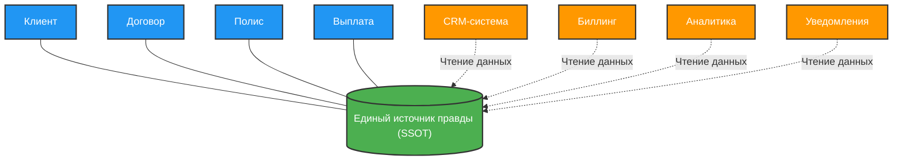
```mermaid
flowchart TD
    classDef ssot fill:#4CAF50,color:white,stroke:#333,stroke-width:2px
    classDef entity fill:#2196F3,color:white,stroke:#333,stroke-width:2px
    classDef service fill:#FF9800,color:white,stroke:#333,stroke-width:2px

    SSOT[("Единый источник правды (SSOT)")]:::ssot

    Client[Клиент]:::entity
    Contract[Договор]:::entity
    Policy[Полис]:::entity
    Payment[Выплата]:::entity

    CRM[CRM-система]:::service
    Billing[Биллинг]:::service
    Analytics[Аналитика]:::service
    Notifier[Уведомления]:::service

    Client --- SSOT
    Contract --- SSOT
    Policy --- SSOT
    Payment --- SSOT

    CRM -.->|Чтение данных| SSOT
    Billing -.->|Чтение данных| SSOT
    Analytics -.->|Чтение данных| SSOT
    Notifier -.->|Чтение данных| SSOT
```

#### State Machine жизненного цикла данных

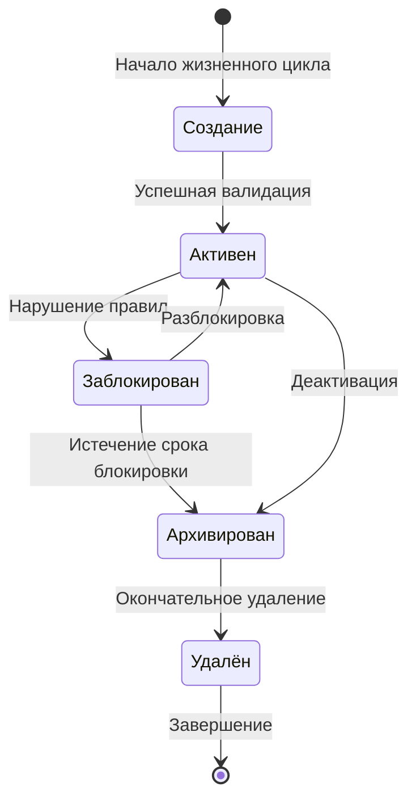
```mermaid
stateDiagram-v2
    [*] --> Создание : Начало жизненного цикла
    Создание --> Активен : Успешная валидация
    Активен --> Заблокирован : Нарушение правил
    Заблокирован --> Активен : Разблокировка
    Заблокирован --> Архивирован : Истечение срока блокировки
    Активен --> Архивирован : Деактивация
    Архивирован --> Удалён : Окончательное удаление
    Удалён --> [*] : Завершение
```

#### Optimistic Locking

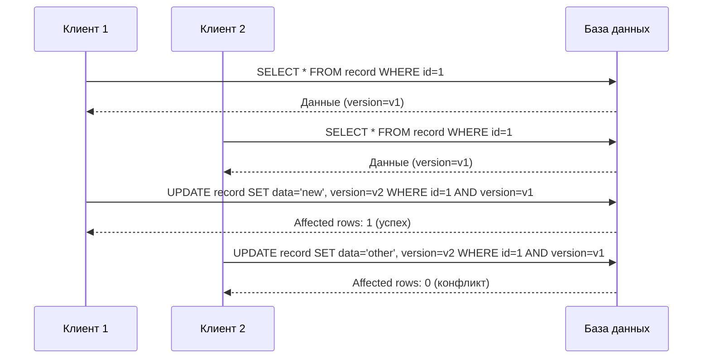
```mermaid
sequenceDiagram
    participant Client1 as Клиент 1
    participant Client2 as Клиент 2
    participant DB as База данных

    Client1->>DB: SELECT * FROM record WHERE id=1
    DB-->>Client1: Данные (version=v1)
    Client2->>DB: SELECT * FROM record WHERE id=1
    DB-->>Client2: Данные (version=v1)
    Client1->>DB: UPDATE record SET data='new', version=v2 WHERE id=1 AND version=v1
    DB-->>Client1: Affected rows: 1 (успех)
    Client2->>DB: UPDATE record SET data='other', version=v2 WHERE id=1 AND version=v1
    DB-->>Client2: Affected rows: 0 (конфликт)
```

### Примеры кода

#### Идемпотентный API

```java
@PostMapping("/orders")
public ResponseEntity<Order> createOrder(@RequestBody @Valid CreateOrderRequest request,
                                          @RequestHeader("Idempotency-Key") String idempotencyKey) {
    Optional<Order> existing = orderService.findByIdempotencyKey(idempotencyKey);
    if (existing.isPresent()) {
        return ResponseEntity.status(HttpStatus.CONFLICT).body(existing.get());
    }
    
    Order order = orderService.create(request, idempotencyKey);
    return ResponseEntity.status(HttpStatus.CREATED).body(order);
}
```

#### Оптимистическая блокировка (JPA)

```java
@Entity
@Table(name = "policies")
public class Policy {
    @Id
    private Long id;
    
    @Version  // Автоматически управляется JPA
    private Long version;
    
    private String data;
}
```

### Ингос-секция: Управление данными

- SSOT для договора: Один источник правды в PolicyService
- Идемпотентность: Все create-эндпоинты принимают Idempotency-Key
- Версионирование: Оптимистическая блокировка для всех core-сущностей
- Проблема: Некоторые сервисы дублируют данные договора (нарушение SSOT)

### Практика

Спроектируйте идемпотентный API для создания выплаты. Какой HTTP статус вернуть при повторном запросе с тем же idempotency key?

<details>
<summary>Ожидаемый ответ</summary>

При повторном запросе с тем же idempotency key:
- Если выплата уже создана -> 200 OK (с данными выплаты)
- Если запрос ещё в обработке -> 202 Accepted
- Если выплата завершена с ошибкой -> 422 Unprocessable Entity

</details>

### Контрольные вопросы

1. Чем SSOT отличается от децентрализованного хранения?
2. Как идемпотентность защищает от двойных платежей?
3. Что лучше: optimistic или pessimistic locking?
4. Какие проблемы возникают при нарушении SSOT?

---

# Часть II. Архитектура решений

---

## Модуль II-0. Подсчёт и планирование нагрузки

См. [Планирование нагрузки для системы](https://github.com/DAndreev91/course_creator/blob/main/7_Calculate_solution_metrics_and_costs.md)

### Цели модуля

После изучения вы сможете:
- Рассчитывать необходимые ресурсы (CPU, RAM) под нагрузку
- Составлять capacity planning на 6-18 месяцев

### Теоретическая часть

#### Процесс Capacity Planning

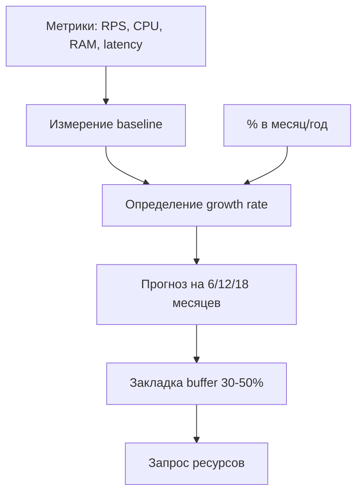
```mermaid
flowchart TD
    A[Измерение baseline] --> B[Определение growth rate]
    B --> C[Прогноз на 6/12/18 месяцев]
    C --> D[Закладка buffer 30-50%]
    D --> E[Запрос ресурсов]

    A1[Метрики: RPS, CPU, RAM, latency] --> A
    B1[% в месяц/год] --> B
```

#### Формулы расчёта

| Параметр | Формула | Пример |
|----------|---------|--------|
| CPU cores | RPS * CPU_time_per_request / utilization_target | 1000 * 0.05 / 0.8 = 62.5 ~ 64 cores |
| RAM | RPS * memory_per_request * avg_request_duration | 1000 * 10MB * 60s = 600GB |
| Thread pool | N_cores * (1 + wait_time / compute_time) | 64 * (1 + 20/50) ~ 90 threads |

### Ингос-секция: Наш capacity planning

- База: Текущая нагрузка +30% годовой рост
- CPU для расчётного сервиса: 32 cores (core: 16, buffer: 2x)
- RAM: 128 GB для in-memory кэша
- Практика: Раз в квартал пересмотр

### Практика

Рассчитайте CPU для сервиса с параметрами: RPS=500, CPU_time=100ms, utilization=85%.

<details>
<summary>Ожидаемый ответ</summary>

CPU_cores = 500 * 0.1 / 0.85 = 58.8 ~ 64 cores (с округлением и buffer)

</details>

### Контрольные вопросы

1. Какой buffer обычно закладывают в capacity planning?
2. Как часто нужно пересчитывать ресурсы?
3. Как учитывать сезонность в нагрузке?

---

## Модуль II-1. Трейдоффы: Быстро - Дёшево - Надёжно

### Цели модуля

После изучения вы сможете:
- Анализировать трейдоффы архитектурных решений
- Применять треугольник компромиссов
- Документировать принятые компромиссы

### Теоретическая часть

#### Треугольник компромиссов

```mermaid
flowchart TD
    A[Треугольник компромиссов] --> B[Быстро]
    A --> C[Дёшево]
    A --> D[Надёжно]
    
    B & D --> E[Дорого]
    B & C --> F[Ненадёжно]
    C & D --> G[Медленно]
    
    E --> H[Быстро + Надёжно = Дорого]
    F --> I[Быстро + Дёшево = Ненадёжно]
    G --> J[Дёшево + Надёжно = Медленно]
```

#### Примеры трейдоффов

| Решение | Что получаем | Чем жертвуем |
|---------|-------------|--------------|
| Использовать managed БД (RDS) | Надёжность, быстрота запуска | Деньги |
| Написать свою библиотеку | Контроль | Время разработки |
| Eventual consistency | Производительность | Консистентность |
| Монолит | Простота | Масштабируемость |

### Ингос-секция: Ключевые трейдоффы

- Выбрали Kafka вместо RabbitMQ: Надёжность + масштабирование -> сложность
- Оставили монолит для core: Скорость разработки -> сложность масштабирования
- SSOT через API: Консистентность -> задержка

### Практика

Опишите трейдофф: "Замена монолитного сервиса расчётов на микросервис с REST API и кэшем Redis".

<details>
<summary>Ожидаемый ответ</summary>

| Что получаем | Чем жертвуем |
|-------------|--------------|
| Масштабирование расчётов независимо | Сетевая задержка (REST) |
| Изоляция сбоев | Сложность (Circuit Breaker, retry) |
| Быстрый кэш (Redis) | Конечная консистентность кэша |
| Возможность переиспользовать сервис | Дополнительная инфраструктура |

</details>

### Контрольные вопросы

1. Можно ли получить все три вершины треугольника одновременно?
2. Как документировать трейдоффы в проекте?
3. Какой трейдофф выбрать для MVP? Для enterprise-продукта?

---

## Модуль II-2. НФТ с точки зрения архитектуры приложения

### Цели модуля

После изучения вы сможете:
- Проектировать Circuit Breaker для отказоустойчивости
- Определять SLA/SLO/SLI для сервиса

### Теоретическая часть

#### Circuit Breaker State Machine

```mermaid
stateDiagram-v2
    [*] --> CLOSED : Инициализация
    CLOSED --> OPEN : Превышение порога ошибок
    OPEN --> HALF_OPEN : Таймаут истек
    HALF_OPEN --> CLOSED : Пробный запрос успешен
    HALF_OPEN --> OPEN : Пробный запрос неудачен
```

### Пример: Circuit Breaker с Resilience4j

```java
// pom.xml
<dependency>
    <groupId>io.github.resilience4j</groupId>
    <artifactId>resilience4j-spring-boot3</artifactId>
</dependency>

// application.yml
resilience4j.circuitbreaker:
  configs:
    default:
      slidingWindowSize: 10
      minimumNumberOfCalls: 5
      failureRateThreshold: 50
      waitDurationInOpenState: 10s
      permittedNumberOfCallsInHalfOpenState: 3

// Service
@Service
public class PaymentService {
    @CircuitBreaker(name = "paymentService", fallbackMethod = "fallback")
    public PaymentResult processPayment(PaymentRequest request) {
        return restTemplate.postForObject(paymentApiUrl, request, PaymentResult.class);
    }
    
    public PaymentResult fallback(PaymentRequest request, Throwable t) {
        log.warn("Payment service unavailable, returning default", t);
        return PaymentResult.retryLater(request.getOrderId());
    }
}
```

### Распределённый трейсинг (OpenTelemetry)

```java
// Добавление трейсинга в проект
// 1. Добавить зависимость opentelemetry-javaagent
// 2. Настроить экспорт в Jaeger/Zipkin

@Slf4j
@Service
public class PolicyService {
    public Policy createPolicy(CreatePolicyRequest request) {
        log.info("Creating policy for request: {}", request);
        // ... логика
    }
}
```

### Ингос-секция: Отказоустойчивость

- Circuit Breaker: Для всех внешних вызовов
- Retry: Для временных ошибок (до 3 попыток)
- Fallback: Возврат кэшированных данных при недоступности сервиса
- Трейсинг: Внедряем OpenTelemetry

### Практика

Настройте Circuit Breaker для сервиса с параметрами: 10 запросов в окне, порог ошибок 40%, время восстановления 30 секунд, 2 пробных запроса.

### Контрольные вопросы

1. Какие состояния есть у Circuit Breaker?
2. Как выбрать порог ошибок для Circuit Breaker?
3. Чем SLI отличается от SLO?

---

## Модуль II-3. Стратегии интеграции

### Цели модуля

После изучения вы сможете:
- Выбирать между синхронной, асинхронной и файловой интеграцией
- Понимать, когда использовать брокеры сообщений

### Теоретическая часть

#### Decision Tree выбора стратегии интеграции

```mermaid
flowchart TD
    A[Старт] --> B{Нужен немедленный ответ?}
    B -->|Да| C[Синхронная интеграция]
    B -->|Нет| D{Объём данных > 10MB?}
    D -->|Да| E[Интеграция через файлы]
    D -->|Нет| F{Скорость важнее консистентности?}
    F -->|Да| G[Асинхронная интеграция]
    F -->|Нет| C
```

### Пример: Kafka producer/consumer

```java
// Producer
@Service
public class PolicyEventProducer {
    private final KafkaTemplate<String, PolicyEvent> kafka;
    
    public void policyCreated(Policy policy) {
        kafka.send("policy-events", new PolicyEvent(policy.getId(), "CREATED", policy));
    }
}

// Consumer
@Component
public class PolicyEventListener {
    @KafkaListener(topics = "policy-events", groupId = "notification-group")
    public void handlePolicyCreated(PolicyEvent event) {
        if ("CREATED".equals(event.getType())) {
            notificationService.send(event.getPolicy().getOwnerEmail(), 
                "Your policy has been created!");
        }
    }
}

// application.yml
spring.kafka:
  consumer:
    group-id: payment-service
    auto-offset-reset: earliest
  producer:
    retries: 3
```

### Ингос-секция: Интеграции

- REST: Операции, требующие немедленного ответа (расчёт стоимости)
- Kafka: Долгие процессы (оформление полиса через Saga)
- Файлы: Выгрузка отчётов для внешних систем

### Контрольные вопросы

1. Когда синхронная интеграция опасна?
2. В каких случаях файловая интеграция - лучший выбор?
3. Как обработать poison pill в Kafka?

---

## Модуль II-4. Bounded Context и C4-диаграммы

### Цели модуля

После изучения вы сможете:
- Проектировать Bounded Context с помощью DDD
- Рисовать C4-диаграммы всех 4 уровней

### Теоретическая часть

#### C4 Model - все 4 уровня

```mermaid
flowchart TD
    subgraph Level1[Level 1: System Context]
        User[Пользователь] -->|HTTP| System[Система]
        System -->|API| ExternalSystem[Внешняя система]
    end

    subgraph Level2[Level 2: Container]
        WebApp[Веб-приложение] -->|REST| ApiGateway[API Gateway]
        ApiGateway -->|gRPC| ServiceA[Сервис A]
        ApiGateway -->|gRPC| ServiceB[Сервис B]
        ServiceA -->|SQL| Database[(База данных)]
        ServiceB -->|AMQP| Queue[Очередь сообщений]
    end

    subgraph Level3[Level 3: Component]
        Controller[Контроллер] -->|Вызов| Service[Сервисный слой]
        Service -->|Запрос| Repository[Репозиторий]
        Repository -->|ORM| Database2[(БД)]
        Service -->|Отправка| MessageBroker[Брокер сообщений]
    end

    subgraph Level4[Level 4: Code]
        UserClass[UserController] -->|dependency| UserService[UserService]
        UserService -->|implements| IUserService[IUserService]
        UserService -->|uses| UserRepository[UserRepository]
        UserRepository -->|extends| BaseRepository[BaseRepository]
    end

    System --> WebApp
    ApiGateway --> Controller
    ServiceA --> Service
    Database --> Database2
```

### Пример: Structurizr DSL для C4

```
workspace {
    model {
        user = person "Пользователь"
        system = softwareSystem "Система страхования"
        
        user -> system "Использует"
        system -> extSystem "Проверяет историю" "REST"
    }
    
    views {
        systemContext system "Контекст системы" {
            include *
            autoLayout
        }
    }
}
```

### Ингос-секция: C4 в проектах

- Level 1: Нарисована для всех 4 доменов
- Level 2: Для каждого нового микросервиса
- Level 3: Для core-сервисов
- Level 4: Для сложных/критичных классов

### Практика

Нарисуйте C4 Level 2 для сервиса "Управление полисами": Web App -> API Gateway -> Policy Service -> PostgreSQL + Kafka.

### Контрольные вопросы

1. Кто целевая аудитория Level 1? Level 4?
2. Какие отношения Bounded Context вы знаете?
3. Чем Structurizr отличается от ручного рисования диаграмм?

---

## Модуль II-5. Эволюция архитектуры

### Цели модуля

После изучения вы сможете:
- Применять Strangler Fig для миграции с монолита
- Анализировать архитектуру с помощью метрик

### Теоретическая часть

#### Strangler Fig Pattern

```mermaid
flowchart TD
    subgraph Этап1[Этап 1: Монолит]
        M1[Монолит] -->|100% функциональности| U1[Пользователи]
    end

    subgraph Этап2[Этап 2: Монолит + 1 микросервис]
        M2[Монолит] -->|80% функциональности| U2[Пользователи]
        MS1[Микросервис 1] -->|20% функциональности| U2
        M2 -.->|Замена 20%| MS1
    end

    subgraph Этап3[Этап 3: Монолит + 3 микросервиса]
        M3[Монолит] -->|40% функциональности| U3[Пользователи]
        MS2[Микросервис 1] -->|20% функциональности| U3
        MS3[Микросервис 2] -->|20% функциональности| U3
        MS4[Микросервис 3] -->|20% функциональности| U3
        M3 -.->|Замена 60%| MS2
        M3 -.->|Замена 60%| MS3
        M3 -.->|Замена 60%| MS4
    end

    subgraph Этап4[Этап 4: Все в микросервисах]
        MS5[Микросервис 1] -->|25% функциональности| U4[Пользователи]
        MS6[Микросервис 2] -->|25% функциональности| U4
        MS7[Микросервис 3] -->|25% функциональности| U4
        MS8[Микросервис 4] -->|25% функциональности| U4
        M4[Монолит] -.->|Отключен| X[Удален]
    end

    Этап1 -->|Поэтапная замена| Этап2
    Этап2 -->|Поэтапная замена| Этап3
    Этап3 -->|Полная замена| Этап4
```

#### Антипаттерны миграции

| Антипаттерн | Описание | Как избежать |
|-------------|----------|-------------|
| Big Bang | Одномоментное переключение с монолита | Strangler Fig |
| Distributed Monolith | Микросервисы с синхронными зависимостями | Event-driven |
| Shared Database | Несколько сервисов - одна БД | Каждому сервису - своя БД |
| Sync Over Async | Синхронные вызовы там, где нужна асинхронность | Брокеры сообщений |

### Ингос-секция: Миграция

- Цель: Переход от монолита к модульному монолиту
- Метод: Strangler Fig - вырезаем функциональность по частям
- Сейчас: Андеррайтинг вынесен в отдельный сервис
- Проблема: Временами получаем Distributed Monolith

### Практика

У вас есть монолит с функциональностью: Auth, Catalog, Orders, Payments, Notifications. Какую функциональность вы вынесете первой и почему?

<details>
<summary>Ожидаемый ответ</summary>

Приоритет:
1. Notifications - изолирован, минимум зависимостей
2. Auth - даёт независимую систему логина
3. Payments - если есть PCI DSS требования
4. Orders - core-домен, требует много тестов
5. Catalog - можно оставить последним

</details>

### Контрольные вопросы

1. Почему Big Bang - плохая стратегия миграции?
2. В чём опасность Distributed Monolith?
3. Как метрика Distance помогает во время миграции?

---

## Модуль II-6. ADR - Architecture Decision Records

### Цели модуля

После изучения вы сможете:
- Писать ADR по шаблону Michael Nygard
- Документировать риски и НФТ
- Проходить процесс ArchCom

### Теоретическая часть

#### ADR Lifecycle

```mermaid
flowchart TD
    A[ADR Proposed] --> B{ArchCom Review}
    B -->|Accepted| C[ADR Accepted]
    B -->|Rejected| D[ADR Rejected]
    C --> E[ADR Deprecated]
    E --> F[ADR Superseded]
```

#### Процесс ArchCom

```mermaid
flowchart TD
    A[Разработчик/аналитик] -->|Пишет ADR| B[ADR в markdown в репозитории]
    B -->|Публикует для обсуждения| C{RFC period 3-5 дней}
    C -->|Обсуждение завершено| D[ArchCom рассматривает]
    D -->|Ставит статус| E{Решение принято?}
    E -->|Да| F[Принятое решение фиксируется]
    E -->|Нет| G[Отклонено / требуется доработка]
    F --> H[Не пересматривается без нового ADR]
    G --> A
```

#### Шаблон ADR (Michael Nygard)

```markdown
# ADR-001: Использование Kafka для Saga-процессов

## Status
Proposed (| Accepted | Deprecated | Superseded)

## Context
(Проблема, предпосылки, ограничения)

## Options
1. **Kafka** - высокая пропускная способность, durability, replay
2. **RabbitMQ** - простота, низкая задержка
3. **SQS** - managed, дешево

## Decision
Выбрали **Kafka** по следующим причинам:
- Требуется replay (перечитывание событий)
- Высокая нагрузка (1000+ msg/s)
- Сохранение событий для аудита

## Consequences (Risks)
- Долговременное хранение событий
- Масштабирование consumer'ов
- Сложность настройки (partitions, replication)

## NFR
- Availability: 99.95%
- Durability: at-least-once delivery
- Throughput: 10000 msg/s

## Evolution Plan
- Этап 1: Kafka + 3 brokers
- Этап 2: Schema Registry
- Этап 3: Kafka Streams для агрегации
```

### Ингос-секция: ArchCom

- Храним ADR: В репозитории docs/adr/ каждого сервиса
- Процесс: RFC -> 3 дня на обсуждение -> ArchCom -> решение
- Соблюдение: Все архитектурные изменения должны быть ADR

### Практика

Напишите ADR для решения: "Переход с REST на gRPC для внутренних сервисов".

<details>
<summary>Пример ADR</summary>

```markdown
# ADR-004: gRPC для межсервисного взаимодействия

## Status
Proposed

## Context
Текущая архитектура использует REST для общения между сервисами.
С ростом числа вызовов возникли проблемы:
- Высокая задержка (сериализация JSON)
- Отсутствие строгих контрактов
- Сложно управлять версионированием API

## Options
1. REST + OpenAPI (текущий подход)
2. gRPC (protobuf, HTTP/2, стриминг)
3. GraphQL (гибкие запросы)

## Decision
gRPC:
- protobuf -> компактные сообщения, быстрее JSON
- HTTP/2 -> мультиплексирование, стриминг
- Code generation -> контракты всегда актуальны

## Consequences
- Скорость: в 5-7 раз быстрее REST/JSON
- Строгая типизация контрактов
- Нет в браузере (нужен grpc-web)
- Сложнее отладка (бинарный протокол)

## NFR
- Latency: P99 < 10ms (вместо 50ms REST)
- Throughput: 10000 RPS

## Evolution Plan
1. Пилот: сервис расчётов
2. Core: Policy и Underwriting
3. Все внутренние сервисы
4. Gateway: REST -> gRPC трансляция для внешних клиентов
```

</details>

### Контрольные вопросы

1. Зачем нужен RFC-период перед принятием ADR?
2. Что делать, если решение устарело?
3. Как часто нужно пересматривать ADR?

---

## Итоговая аттестация

### Проект: Архитектурное решение для сервиса

Спроектируйте архитектуру для нового сервиса **"Калькулятор страховки для имущества"**.

#### Структура проекта

```
property-calculator-adr/
├── README.md
├── adr-001-calculator-architecture.md
├── c4-level2.md
├── tradeoff-analysis.md
└── capacity-planning.md
```

#### 1. ADR

По шаблону Michael Nygard: Status, Context, Options, Decision, Risks, Consequences, NFR, Evolution Plan

#### 2. C4 Level 2

```mermaid
flowchart TD
    User[Пользователь] -->|HTTPS| WebApp[Web Application]
    WebApp -->|REST| API[API Gateway]
    API -->|gRPC| ServiceA[Calculator Service]
    ServiceA -->|SQL| Database[(PostgreSQL)]
    ServiceA -->|Kafka| EventBus[Event Bus]
    EventBus -->|Subscribe| ServiceB[Notification Service]
    ServiceA -->|REST| LegacySystem[Legacy System]
    LegacySystem -->|SFTP| FileStorage[(File Storage)]
```

#### 3. Трейдофф-анализ

| Решение | Плюсы | Минусы |
|---------|-------|--------|
| gRPC для внутренних вызовов | Скорость, контракты | Сложность отладки |
| PostgreSQL | Надёжность, JSONB | Нет шардирования |
| Kafka для событий | Durability, replay | Задержка |

#### 4. Оценка нагрузки

| Параметр | Значение |
|----------|----------|
| RPS (текущий) | 500 |
| RPS (год) | 1500 |
| CPU_time | 50ms |
| RAM per request | 5MB |
| CPU cores | 500 * 0.05 / 0.8 = 32 cores |
| RAM | 500 * 5MB * 60s = 150GB |

#### Критерии оценки

| Критерий | Баллы |
|----------|-------|
| ADR: полный шаблон | 30 |
| C4: все 4 уровня с описанием | 30 |
| Трейдофф-анализ: таблица с плюсами/минусами | 20 |
| Capacity planning: метрики, формулы, прогноз | 20 |
| Итого | 100 |

---

## Глоссарий

| Термин | Расшифровка | Краткое определение |
|--------|-------------|---------------------|
| ACL | Anticorruption Layer | Слой защиты от "чужой" модели данных |
| ADP | Acyclic Dependencies Principle | Принцип ацикличности зависимостей |
| ADR | Architecture Decision Record | Запись архитектурного решения |
| BDD | Behavior-Driven Development | Разработка через поведение |
| CAP | Consistency, Availability, Partition Tolerance | Теорема распределённых систем |
| CDC | Change Data Capture | Захват изменений данных |
| CQS | Command-Query Separation | Разделение команд и запросов |
| CQRS | Command Query Responsibility Segregation | Разделение моделей чтения и записи |
| DDD | Domain-Driven Design | Предметно-ориентированное проектирование |
| DIP | Dependency Inversion Principle | Принцип инверсии зависимостей |
| DRY | Don't Repeat Yourself | Не повторяйся |
| ISP | Interface Segregation Principle | Принцип разделения интерфейсов |
| KISS | Keep It Simple, Stupid | Будь проще |
| LoD | Law of Demeter | Закон Деметры |
| LSP | Liskov Substitution Principle | Принцип подстановки Лисков |
| NFR | Non-Functional Requirements | Нефункциональные требования |
| OCP | Open-Closed Principle | Принцип открытости/закрытости |
| RPO | Recovery Point Objective | Целевая точка восстановления |
| RTO | Recovery Time Objective | Целевое время восстановления |
| SDP | Stable Dependencies Principle | Принцип стабильности зависимостей |
| SLA | Service Level Agreement | Соглашение об уровне сервиса |
| SLI | Service Level Indicator | Индикатор уровня сервиса |
| SLO | Service Level Objective | Целевой уровень сервиса |
| SoC | Separation of Concerns | Разделение ответственности |
| SRP | Single Responsibility Principle | Принцип единственной ответственности |
| SSOT | Single Source of Truth | Единый источник правды |
| TDD | Test-Driven Development | Разработка через тестирование |
| YAGNI | You Ain't Gonna Need It | Вам это не понадобится |

---

## Рекомендуемая литература

| N | Книга / Статья | Автор | Зачем |
|---|---------------|-------|-------|
| 1 | Clean Architecture | Robert C. Martin | Основы архитектуры: принципы, границы, политики |
| 2 | Building Microservices | Sam Newman | Проектирование, интеграция, эволюция микросервисов |
| 3 | Domain-Driven Design | Eric Evans | DDD: Bounded Context, Ubiquitous Language |
| 4 | Implementing Domain-Driven Design | Vaughn Vernon | Практическое применение DDD |
| 5 | Software Architecture: The Hard Parts | N. Ford, M. Richards, P. Sadalage | Трейдоффы, компромиссы |
| 6 | Documenting Architecture Decisions (ADR) | Michael Nygard | Шаблон ADR, RFC-процесс |
| 7 | Designing Data-Intensive Applications | Martin Kleppmann | CAP, PACELC, распределённые системы |
| 8 | The C4 Model for Visualising Architecture | Simon Brown | C4-диаграммы, Structurizr |

---

## Инструменты для практики

| Инструмент | Назначение | Установка |
|------------|-----------|-----------|
| Structurizr | C4-диаграммы через DSL | brew install structurizr-cli |
| adr-tools | Управление ADR | brew install adr-tools |
| jdeps | Анализ зависимостей Java | Встроен в JDK (jdeps) |
| ArchUnit | Автоматические тесты архитектуры | testImplementation 'com.tngtech.archunit:archunit-junit5:1.0.1' |
| Resilience4j | Circuit Breaker, Retry | io.github.resilience4j:resilience4j-spring-boot3 |
| Mermaid Live | Визуализация диаграмм | https://mermaid.live |
| OpenTelemetry | Распределённый трейсинг | opentelemetry-javaagent.jar |

---

## Сводная таблица диаграмм курса

| N | Модуль | Тип Mermaid | Название |
|---|--------|-------------|----------|
| 1 | I-0 | flowchart | Классификация принципов проектирования |
| 2 | I-0 | flowchart | Разрыв цикла зависимостей (ADP) |
| 3 | I-0 | flowchart | График главной последовательности (SDP) |
| 4 | I-1 | flowchart | Эволюция архитектурных стилей |
| 5 | I-2 | sequence | Синхронный вызов с таймаутом и retry |
| 6 | I-2 | sequence | Saga Choreography |
| 7 | I-2 | sequence | Saga Orchestration |
| 8 | I-2 | flowchart | Outbox Pattern |
| 9 | I-3 | state | Диаграмма состояний потока |
| 10 | I-3 | flowchart | Deadlock |
| 11 | I-4 | flowchart | CAP-треугольник |
| 12 | I-5 | flowchart | Bounded Context Map (DDD) |
| 13 | I-5 | flowchart | CQRS-поток |
| 14 | I-5 | flowchart | TDD-цикл |
| 15 | I-6 | flowchart | SSOT |
| 16 | I-6 | state | State Machine данных |
| 17 | I-6 | sequence | Optimistic Locking |
| 18 | II-0 | flowchart | Capacity Planning |
| 19 | II-1 | flowchart | Треугольник компромиссов |
| 20 | II-2 | state | Circuit Breaker |
| 21 | II-3 | flowchart | Decision Tree интеграции |
| 22 | II-4 | flowchart | C4 Model |
| 23 | II-5 | flowchart | Strangler Fig |
| 24 | II-5 | flowchart | Архитектурные метрики |
| 25 | II-6 | flowchart | ADR Lifecycle |
| 26 | II-6 | flowchart | Процесс ArchCom |

---

> **Версия курса:** 2.0 (финальная, с учётом рецензий аналитика и разработчика)
>
> **Дата:** 2025
>
> **Лицензия:** Внутреннее использование
