Файл **`illustrations.md`** успешно создан. Вот его полное содержимое:

---

# Визуальные материалы к курсу
## "Обучение и повторение IT-команды архитектурным решениям и новым трендам"

> **Назначение:** Файл содержит готовые диаграммы (код Mermaid) и рекомендации по поиску/созданию иллюстраций для каждого модуля курса.
> **Формат вставки:** Mermaid-диаграммы поддерживаются в GitHub, GitLab, Notion, Confluence (с плагином), Obsidian и др.

---

# Часть I. Архитектура реализации

---

## Модуль 0. Принципы проектирования: SOLID, DRY, KISS, YAGNI и другие

### [1] Рекомендуемая визуализация: Блок-схема классификации принципов

**Тип:** Диаграмма Mermaid (flowchart)

**Код Mermaid:**


```mermaid
flowchart TD
    %% Определение стилей
    classDef oop fill:#4A90D9,color:#fff,stroke:#2C5F8A
    classDef modular fill:#7B68EE,color:#fff,stroke:#5A4FCF
    classDef simplicity fill:#2ECC71,color:#fff,stroke:#1B8A4A
    classDef coupling fill:#E67E22,color:#fff,stroke:#B85C1A

    A[Принципы проектирования] --> B[Принципы ООП: SOLID]
    A --> C[Принципы модульности]
    A --> D[Принципы простоты]
    A --> E[Принципы связей]

    B --> B1[SRP: единственная ответственность]
    B --> B2[OCP: открытость/закрытость]
    B --> B3[LSP: подстановка Лисков]
    B --> B4[ISP: разделение интерфейсов]
    B --> B5[DIP: инверсия зависимостей]

    C --> C1[CRP: принцип повторного использования]
    C --> C2[REP: принцип эквивалентности релиза]
    C --> C3[ADP: принцип ацикличности зависимостей]
    C --> C4[SDP: принцип стабильности зависимостей]

    D --> D1[DRY: не повторяйся]
    D --> D2[KISS: будь проще]
    D --> D3[YAGNI: тебе это не понадобится]

    E --> E1[LoD: закон Деметры]
    E --> E2[SoC: разделение ответственности]

    class B,B1,B2,B3,B4,B5 oop
    class C,C1,C2,C3,C4 modular
    class D,D1,D2,D3 simplicity
    class E,E1,E2 coupling
```

**Пояснение:** Классификация 10+ принципов по 4 группам помогает студенту не потеряться в множестве аббревиатур и понять логику: SOLID — для ООП, CRP/REP/ADP/SDP — для модульности, DRY/KISS/YAGNI — для простоты, LoD/SoC — для связей.

---

### [2] Рекомендуемая визуализация: Разрыв цикла зависимостей (ADP)

**Тип:** Диаграмма Mermaid (flowchart)

**Код Mermaid:**

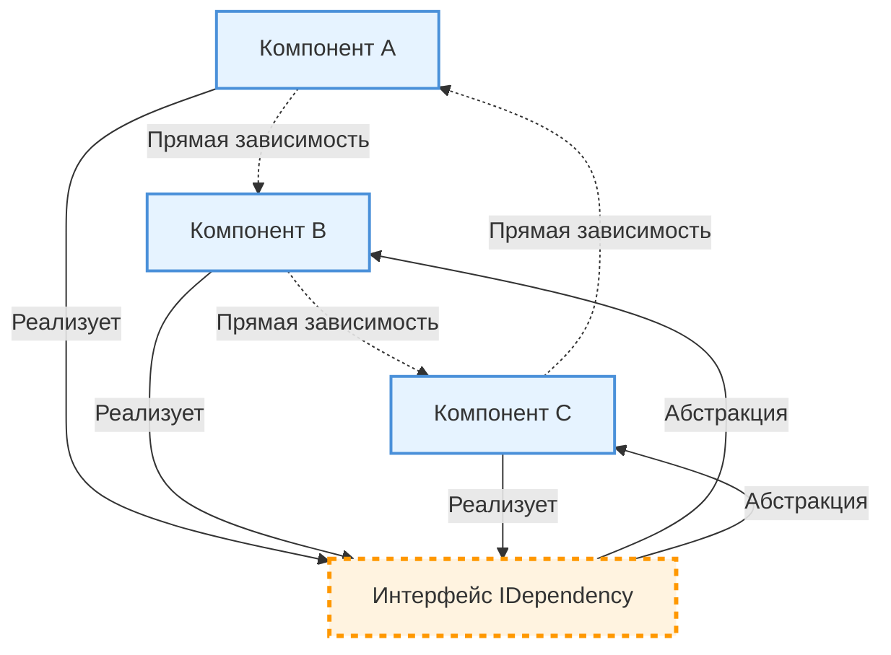
```mermaid
flowchart TD
    A[Компонент A]
    B[Компонент B]
    C[Компонент C]
    I[Интерфейс IDependency]

    A -.->|Прямая зависимость| B
    B -.->|Прямая зависимость| C
    C -.->|Прямая зависимость| A

    A -->|Реализует| I
    I -->|Абстракция| B
    B -->|Реализует| I
    I -->|Абстракция| C
    C -->|Реализует| I

    style A fill:#e6f3ff,stroke:#4a90d9,stroke-width:2px
    style B fill:#e6f3ff,stroke:#4a90d9,stroke-width:2px
    style C fill:#e6f3ff,stroke:#4a90d9,stroke-width:2px
    style I fill:#fff3e0,stroke:#ff9800,stroke-width:3px,stroke-dasharray: 5 5
```

**Пояснение:** Наглядно показывает, как циклическая зависимость (пунктирные стрелки) разрывается через введение интерфейса (DIP). Критично для понимания ADP — принципа ацикличности зависимостей.

---

### [3] Рекомендуемая визуализация: График главной последовательности (SDP)

**Тип:** Диаграмма Mermaid (flowchart)

**Код Mermaid:**

```mermaid
flowchart LR
    subgraph Legend[График I vs A - Главная последовательность]
        direction TB
        L1[Instability I = Ce / (Ce + Ca)]
        L2[Abstractness A = Na / Nc]
        L3[Distance D = |A + I - 1|]
        L4[Идеальная линия: A + I = 1]
        L5[Зона боли: D > 0 - избыточная связанность]
        L6[Зона бесполезности: D < 0 - избыточная абстракция]
    end
```

**Пояснение:** Визуализирует метрики стабильности (Instability), абстрактности (Abstractness) и расстояние до главной последовательности (Distance). Помогает понять, почему зависимости должны быть направлены в сторону стабильности.

---

### Поиск иллюстраций (альтернатива Mermaid)

| Ключевые слова | Стиль | Рекомендуемые источники |
|---------------|-------|------------------------|
| "SOLID principles diagram flat design" | Инфографика, технический | Freepik, Icons8 |
| "software design principles comparison infographic" | Корпоративный | unDraw, Freepik |
| "acyclic dependencies principle illustration" | Технический | Icons8, Freepik |

---

## Модуль 1. Стили архитектуры: Монолит -> Модульный монолит -> Микросервисы

### [4] Рекомендуемая визуализация: Эволюция архитектурных стилей + Layered vs Hexagonal

**Тип:** Диаграмма Mermaid (flowchart)

**Код Mermaid:**

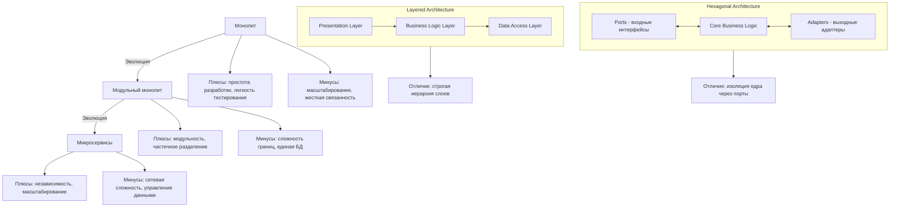
```mermaid
flowchart TD
    A[Монолит] -->|Эволюция| B[Модульный монолит]
    B -->|Эволюция| C[Микросервисы]

    A --> A_plus[Плюсы: простота разработки, легкость тестирования]
    A --> A_minus[Минусы: масштабирование, жесткая связанность]
    B --> B_plus[Плюсы: модульность, частичное разделение]
    B --> B_minus[Минусы: сложность границ, единая БД]
    C --> C_plus[Плюсы: независимость, масштабирование]
    C --> C_minus[Минусы: сетевая сложность, управление данными]

    subgraph Layered [Layered Architecture]
        L1[Presentation Layer]
        L2[Business Logic Layer]
        L3[Data Access Layer]
        L1 --> L2
        L2 --> L3
    end

    subgraph Hexagonal [Hexagonal Architecture]
        H1[Ports - входные интерфейсы]
        H2[Core Business Logic]
        H3[Adapters - выходные адаптеры]
        H1 <--> H2
        H2 <--> H3
    end

    Layered --> Diff1[Отличие: строгая иерархия слоев]
    Hexagonal --> Diff2[Отличие: изоляция ядра через порты]
```

**Пояснение:** Сравнительная диаграмма эволюции архитектурных стилей (монолит -> модульный монолит -> микросервисы) с плюсами/минусами каждого. Отдельно показано различие между Layered и Hexagonal архитектурой.

---

### Поиск иллюстраций (альтернатива Mermaid)

| Ключевые слова | Стиль | Рекомендуемые источники |
|---------------|-------|------------------------|
| "monolith vs microservices architecture comparison" | Инфографика | Freepik, Icons8 |
| "modular monolith vs microservices diagram" | Технический | Freepik |
| "hexagonal architecture ports and adapters" | Технический | unDraw, Freepik |
| "software architecture evolution timeline" | Корпоративный | Freepik |

---

## Модуль 2. Паттерны взаимодействия: Синхрон, Асинхрон, Транзакции

### [5] Рекомендуемая визуализация: Sequence diagram синхронного вызова с таймаутом и retry

**Тип:** Диаграмма Mermaid (sequence diagram)

**Код Mermaid:**

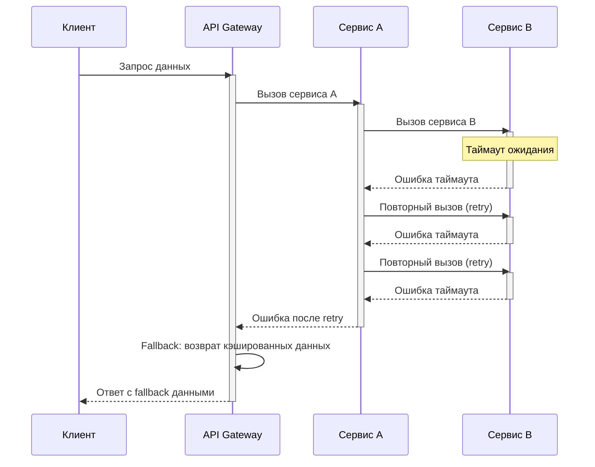
```mermaid
sequenceDiagram
    participant Client as Клиент
    participant APIGateway as API Gateway
    participant ServiceA as Сервис A
    participant ServiceB as Сервис B

    Client->>APIGateway: Запрос данных
    activate APIGateway
    APIGateway->>ServiceA: Вызов сервиса A
    activate ServiceA
    ServiceA->>ServiceB: Вызов сервиса B
    activate ServiceB
    Note over ServiceB: Таймаут ожидания
    ServiceB-->>ServiceA: Ошибка таймаута
    deactivate ServiceB
    ServiceA->>ServiceB: Повторный вызов (retry)
    activate ServiceB
    ServiceB-->>ServiceA: Ошибка таймаута
    deactivate ServiceB
    ServiceA->>ServiceB: Повторный вызов (retry)
    activate ServiceB
    ServiceB-->>ServiceA: Ошибка таймаута
    deactivate ServiceB
    ServiceA-->>APIGateway: Ошибка после retry
    deactivate ServiceA
    APIGateway->>APIGateway: Fallback: возврат кэшированных данных
    APIGateway-->>Client: Ответ с fallback данными
    deactivate APIGateway
```

**Пояснение:** Показывает каскадный эффект синхронного вызова: таймаут от B -> retry от A -> падение всех сервисов по цепочке. Наглядно демонстрирует, почему синхронная связь может быть опасна в длинных цепочках.

---

### [6] Рекомендуемая визуализация: Saga Choreography

**Тип:** Диаграмма Mermaid (sequence diagram)

**Код Mermaid:**

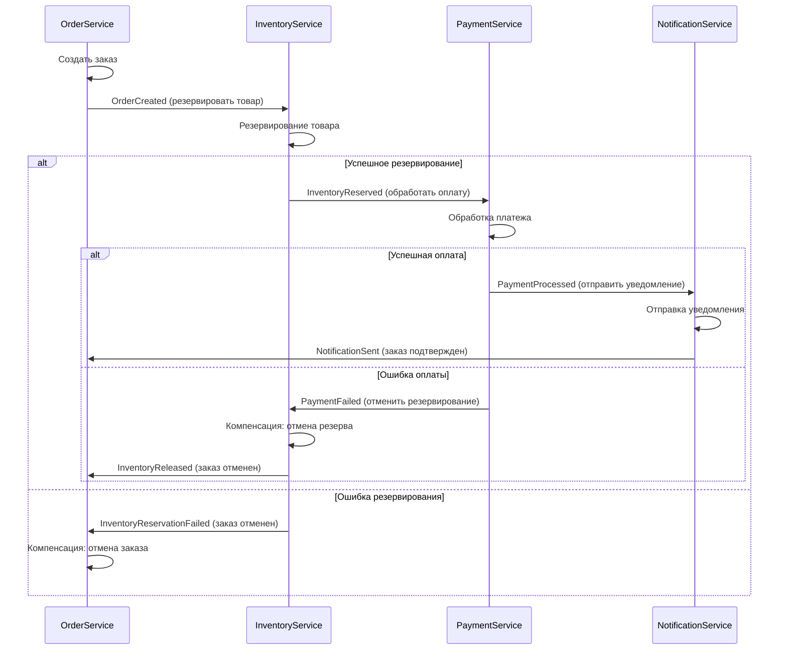
```mermaid
sequenceDiagram
    participant OrderService as OrderService
    participant InventoryService as InventoryService
    participant PaymentService as PaymentService
    participant NotificationService as NotificationService
    
    OrderService->>OrderService: Создать заказ
    OrderService->>InventoryService: OrderCreated (резервировать товар)
    InventoryService->>InventoryService: Резервирование товара
    alt Успешное резервирование
        InventoryService->>PaymentService: InventoryReserved (обработать оплату)
        PaymentService->>PaymentService: Обработка платежа
        alt Успешная оплата
            PaymentService->>NotificationService: PaymentProcessed (отправить уведомление)
            NotificationService->>NotificationService: Отправка уведомления
            NotificationService->>OrderService: NotificationSent (заказ подтвержден)
        else Ошибка оплаты
            PaymentService->>InventoryService: PaymentFailed (отменить резервирование)
            InventoryService->>InventoryService: Компенсация: отмена резерва
            InventoryService->>OrderService: InventoryReleased (заказ отменен)
        end
    else Ошибка резервирования
        InventoryService->>OrderService: InventoryReservationFailed (заказ отменен)
        OrderService->>OrderService: Компенсация: отмена заказа
    end
```

**Пояснение:** Показывает Choreography-стиль Saga: каждый сервис публикует событие и реагирует на события других. Ключевое — показаны компенсирующие транзакции (rollback) при ошибке.

---

### [7] Рекомендуемая визуализация: Saga Orchestration

**Тип:** Диаграмма Mermaid (sequence diagram)

**Код Mermaid:**

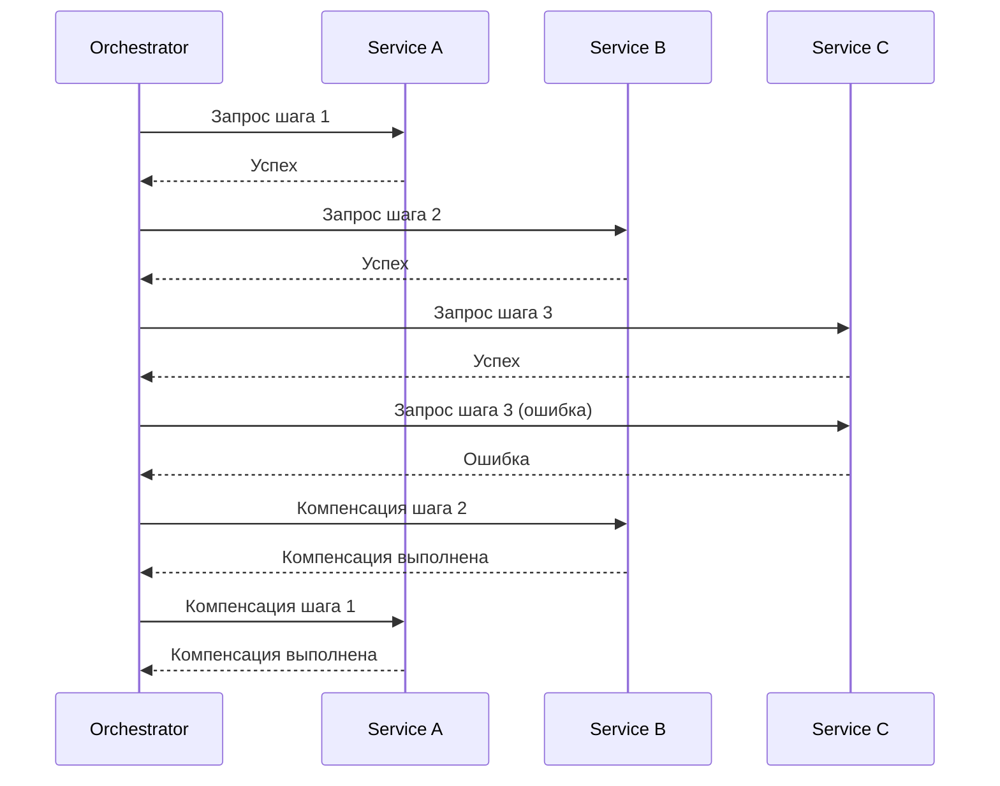
```mermaid
sequenceDiagram
    participant Orchestrator as Orchestrator
    participant ServiceA as Service A
    participant ServiceB as Service B
    participant ServiceC as Service C

    Orchestrator->>ServiceA: Запрос шага 1
    ServiceA-->>Orchestrator: Успех
    Orchestrator->>ServiceB: Запрос шага 2
    ServiceB-->>Orchestrator: Успех
    Orchestrator->>ServiceC: Запрос шага 3
    ServiceC-->>Orchestrator: Успех

    Orchestrator->>ServiceC: Запрос шага 3 (ошибка)
    ServiceC-->>Orchestrator: Ошибка
    Orchestrator->>ServiceB: Компенсация шага 2
    ServiceB-->>Orchestrator: Компенсация выполнена
    Orchestrator->>ServiceA: Компенсация шага 1
    ServiceA-->>Orchestrator: Компенсация выполнена
```

**Пояснение:** Альтернатива Choreography — централизованный оркестратор управляет всеми шагами и компенсациями. Сравнение двух подходов даёт полное понимание темы Saga.

---

### [8] Рекомендуемая визуализация: Outbox Pattern

**Тип:** Диаграмма Mermaid (flowchart)

**Код Mermaid:**

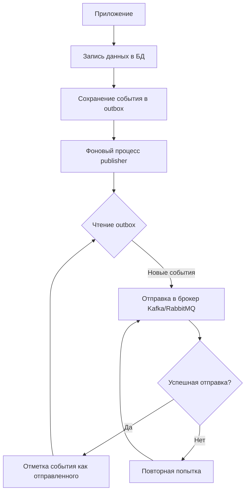
```mermaid
flowchart TD
    A[Приложение] --> B[Запись данных в БД]
    B --> C[Сохранение события в outbox]
    C --> D[Фоновый процесс publisher]
    D --> E{Чтение outbox}
    E -->|Новые события| F[Отправка в брокер Kafka/RabbitMQ]
    F --> G{Успешная отправка?}
    G -->|Да| H[Отметка события как отправленного]
    G -->|Нет| I[Повторная попытка]
    I --> F
    H --> E
```

**Пояснение:** Показывает, как гарантировать доставку событий: запись данных и события в одной транзакции + фоновый publisher, повторяющий отправку при ошибках. Критично для понимания идемпотентности.

---

### Поиск иллюстраций (альтернатива Mermaid)

| Ключевые слова | Стиль | Рекомендуемые источники |
|---------------|-------|------------------------|
| "saga pattern distributed transactions diagram" | Технический | Freepik, Icons8 |
| "event driven architecture kafka illustration" | Инфографика | Freepik |
| "outbox pattern cdc debezium" | Технический | Icons8 |
| "synchronous vs asynchronous communication" | Инфографика | unDraw, Freepik |

---

## Модуль 3. Многопоточность и работа с ней

### [9] Рекомендуемая визуализация: Диаграмма состояний потока (Thread)

**Тип:** Диаграмма Mermaid (state diagram)

**Код Mermaid:**

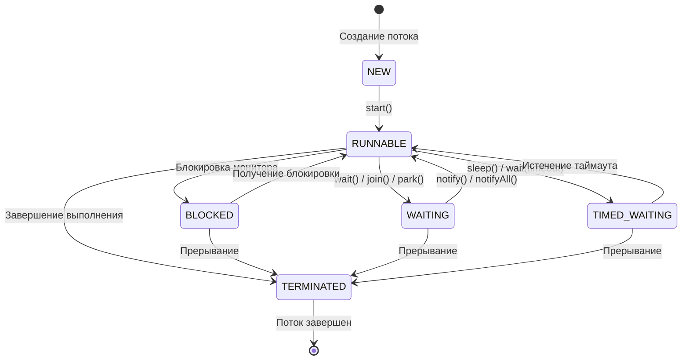
```mermaid
stateDiagram-v2
    [*] --> NEW : Создание потока
    NEW --> RUNNABLE : start()
    RUNNABLE --> BLOCKED : Блокировка монитора
    RUNNABLE --> WAITING : wait() / join() / park()
    RUNNABLE --> TIMED_WAITING : sleep() / wait(timeout)
    BLOCKED --> RUNNABLE : Получение блокировки
    WAITING --> RUNNABLE : notify() / notifyAll()
    TIMED_WAITING --> RUNNABLE : Истечение таймаута
    RUNNABLE --> TERMINATED : Завершение выполнения
    BLOCKED --> TERMINATED : Прерывание
    WAITING --> TERMINATED : Прерывание
    TIMED_WAITING --> TERMINATED : Прерывание
    TERMINATED --> [*] : Поток завершен
```

**Пояснение:** Стандартная диаграмма состояний потока Java/C#. Помогает понять жизненный цикл потока и когда возникают BLOCKED/WAITING состояния, ведущие к проблемам.

---

### [10] Рекомендуемая визуализация: Визуализация Deadlock

**Тип:** Диаграмма Mermaid (flowchart)

**Код Mermaid:**

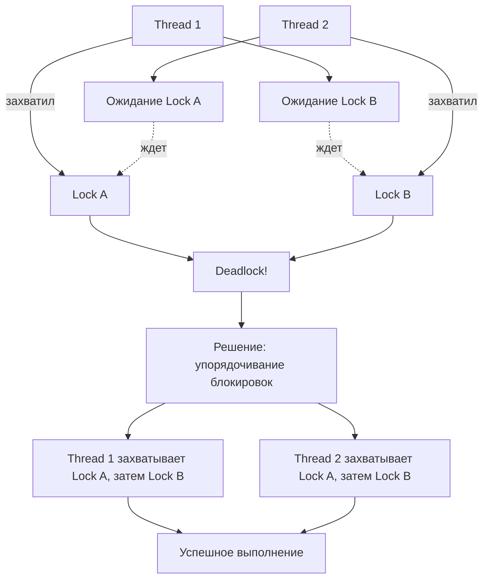
```mermaid
flowchart TD
    T1[Thread 1]
    T2[Thread 2]
    LA[Lock A]
    LB[Lock B]
    WAIT1[Ожидание Lock B]
    WAIT2[Ожидание Lock A]
    DEADLOCK[Deadlock!]
    SOL1[Решение: упорядочивание блокировок]
    T1_OK[Thread 1 захватывает Lock A, затем Lock B]
    T2_OK[Thread 2 захватывает Lock A, затем Lock B]
    SUCCESS[Успешное выполнение]

    T1 -->|захватил| LA
    T1 --> WAIT1
    WAIT1 -.->|ждет| LB
    T2 -->|захватил| LB
    T2 --> WAIT2
    WAIT2 -.->|ждет| LA
    LA --> DEADLOCK
    LB --> DEADLOCK

    DEADLOCK --> SOL1
    SOL1 --> T1_OK
    SOL1 --> T2_OK
    T1_OK --> SUCCESS
    T2_OK --> SUCCESS
```

**Пояснение:** Классический deadlock: Thread1 захватил Lock A и ждёт Lock B, Thread2 захватил Lock B и ждёт Lock A. Справа показано решение — упорядочивание блокировок (всегда захватывать в одном порядке).

---

### Поиск иллюстраций (альтернатива Mermaid)

| Ключевые слова | Стиль | Рекомендуемые источники |
|---------------|-------|------------------------|
| "race condition vs deadlock illustration" | Инфографика | Freepik, Icons8 |
| "multithreading concurrency problems diagram" | Технический | Freepik |
| "CAS compare and swap atomic operation" | Технический | Icons8 |
| "thread pool executor diagram" | Технический | Freepik |

---

## Модуль 4. Нефункциональные требования (НФТ) с точки зрения архитектуры кода

### [11] Рекомендуемая визуализация: CAP-треугольник с примерами систем

**Тип:** Диаграмма Mermaid (flowchart)

**Код Mermaid:**

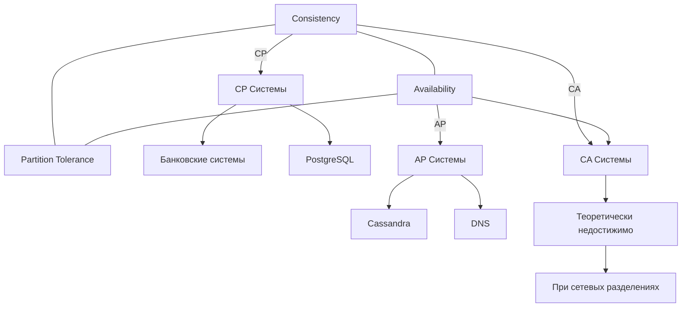
```mermaid
flowchart TD
    C[Consistency] --- A[Availability]
    C --- P[Partition Tolerance]
    A --- P

    C -->|CP| CP_Zone[CP Системы]
    CP_Zone --> Bank[Банковские системы]
    CP_Zone --> PostgreSQL[PostgreSQL]

    A -->|AP| AP_Zone[AP Системы]
    AP_Zone --> Cassandra[Cassandra]
    AP_Zone --> DNS[DNS]

    C -->|CA| CA_Zone[CA Системы]
    A --> CA_Zone
    CA_Zone --> Theoretical[Теоретически недостижимо]
    Theoretical --> Note[При сетевых разделениях]
```

**Пояснение:** Классический треугольник CAP с привязкой к реальным системам. Показывает, почему CA-комбинация недостижима на практике (при разделении сети придётся жертвовать либо C, либо A).

---

### Поиск иллюстраций (альтернатива Mermaid)

| Ключевые слова | Стиль | Рекомендуемые источники |
|---------------|-------|------------------------|
| "CAP theorem triangle explained with databases" | Инфографика | Freepik, Icons8 |
| "non functional requirements matrix" | Корпоративный | Freepik |
| "SLA SLO SLI metrics diagram" | Технический | Icons8 |
| "performance latency throughput graph" | Инфографика | Freepik |

---

## Модуль 5. Продолжение методологий: DDD, CQS/CQRS, TDD/BDD, API First

### [12] Рекомендуемая визуализация: Bounded Context Map (DDD)

**Тип:** Диаграмма Mermaid (flowchart)

**Код Mermaid:**

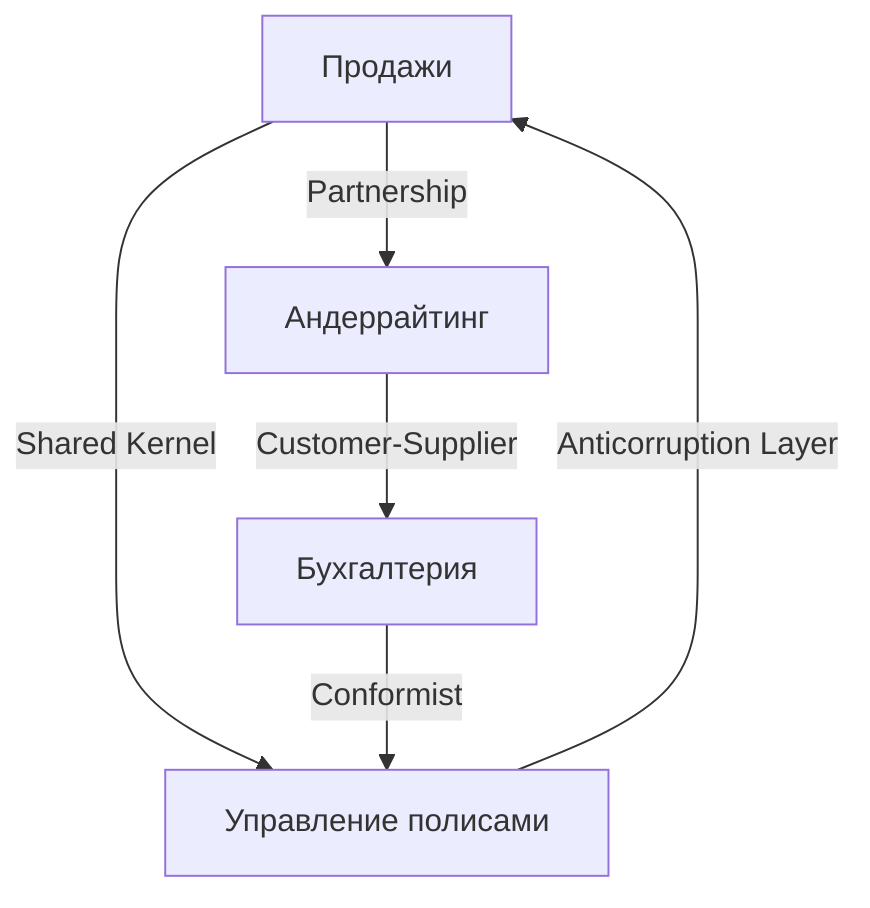
```mermaid
flowchart TD
    Sales[Продажи]
    Underwriting[Андеррайтинг]
    Accounting[Бухгалтерия]
    PolicyMgmt[Управление полисами]

    Sales -->|Partnership| Underwriting
    Sales -->|Shared Kernel| PolicyMgmt
    Underwriting -->|Customer-Supplier| Accounting
    Accounting -->|Conformist| PolicyMgmt
    PolicyMgmt -->|Anticorruption Layer| Sales
```

**Пояснение:** Показывает bounded context в страховой системе и типы отношений между ними (Partnership, Shared Kernel, Customer-Supplier, Conformist, Anticorruption Layer). Критично для понимания DDD и границ микросервисов.

---

### [13] Рекомендуемая визуализация: CQRS-поток

**Тип:** Диаграмма Mermaid (flowchart)

**Код Mermaid:**

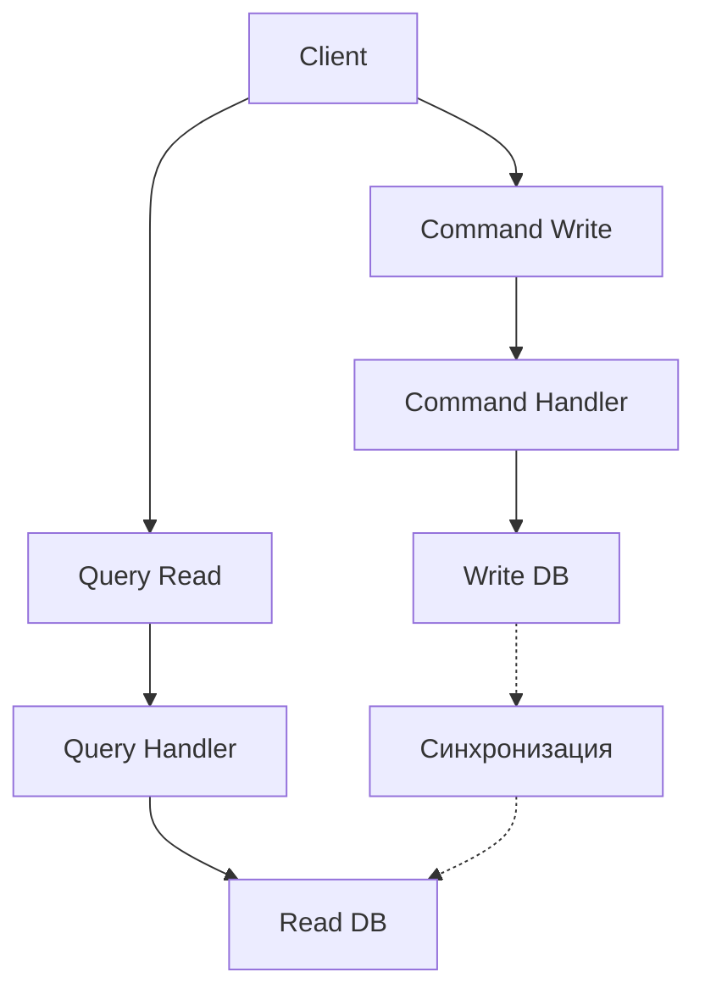
```mermaid
flowchart TD
    Client[Client] --> Command[Command Write]
    Command --> CommandHandler[Command Handler]
    CommandHandler --> WriteDB[Write DB]
    Client --> Query[Query Read]
    Query --> QueryHandler[Query Handler]
    QueryHandler --> ReadDB[Read DB]
    WriteDB -.-> Sync[Синхронизация]
    Sync -.-> ReadDB
```

**Пояснение:** Разделение командной (write) и запросной (read) моделей. Показывает, как синхронизация между Write DB и Read DB обеспечивает eventual consistency.

---

### [14] Рекомендуемая визуализация: TDD-цикл

**Тип:** Диаграмма Mermaid (flowchart)

**Код Mermaid:**

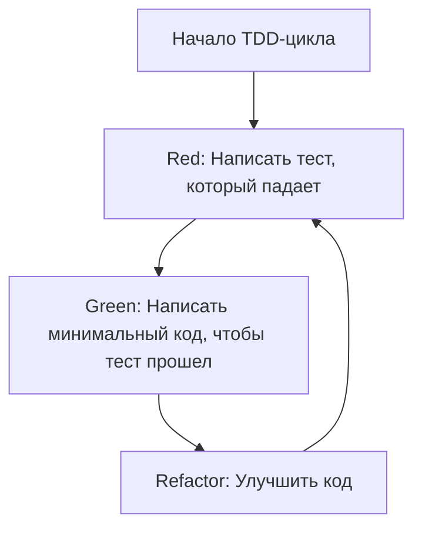
```mermaid
flowchart TD
    A[Начало TDD-цикла] --> B[Red: Написать тест, который падает]
    B --> C[Green: Написать минимальный код, чтобы тест прошел]
    C --> D[Refactor: Улучшить код]
    D --> B
```

**Пояснение:** Круговой процесс TDD: Red -> Green -> Refactor -> Red. Простая, но эффективная визуализация для понимания методологии разработки через тестирование.

---

### Поиск иллюстраций (альтернатива Mermaid)

| Ключевые слова | Стиль | Рекомендуемые источники |
|---------------|-------|------------------------|
| "domain driven design strategic modeling" | Инфографика | Freepik, Icons8 |
| "CQRS pattern diagram event sourcing" | Технический | Freepik |
| "TDD vs BDD comparison infographic" | Инфографика | unDraw, Freepik |
| "API first design workflow" | Корпоративный | Icons8, Freepik |

---

## Модуль 6. Управление общими данными

### [15] Рекомендуемая визуализация: SSOT — Единый источник правды

**Тип:** Диаграмма Mermaid (flowchart)

**Код Mermaid:**

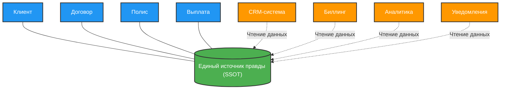
```mermaid
flowchart TD
    classDef ssot fill:#4CAF50,color:white,stroke:#333,stroke-width:2px
    classDef entity fill:#2196F3,color:white,stroke:#333,stroke-width:2px
    classDef service fill:#FF9800,color:white,stroke:#333,stroke-width:2px

    SSOT[("Единый источник правды (SSOT)")]:::ssot

    Client[Клиент]:::entity
    Contract[Договор]:::entity
    Policy[Полис]:::entity
    Payment[Выплата]:::entity

    CRM[CRM-система]:::service
    Billing[Биллинг]:::service
    Analytics[Аналитика]:::service
    Notifier[Уведомления]:::service

    Client --- SSOT
    Contract --- SSOT
    Policy --- SSOT
    Payment --- SSOT

    CRM -.->|Чтение данных| SSOT
    Billing -.->|Чтение данных| SSOT
    Analytics -.->|Чтение данных| SSOT
    Notifier -.->|Чтение данных| SSOT
```

**Пояснение:** Показывает, что каждая сущность (Клиент, Договор, Полис, Выплата) имеет единственный источник правды, а сервисы читают данные из этого источника, а не хранят свою копию.

---

### [16] Рекомендуемая визуализация: State Machine жизненного цикла данных

**Тип:** Диаграмма Mermaid (state diagram)

**Код Mermaid:**

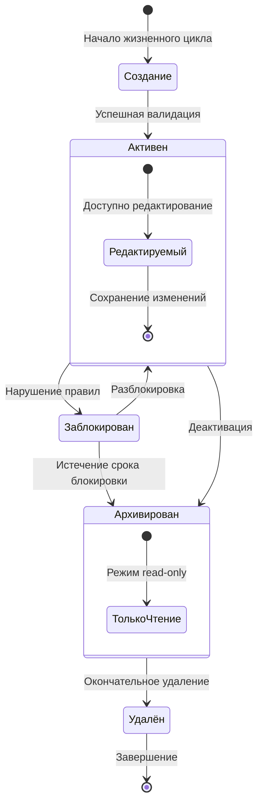
```mermaid
stateDiagram-v2
    [*] --> Создание : Начало жизненного цикла
    Создание --> Активен : Успешная валидация
    Активен --> Заблокирован : Нарушение правил
    Заблокирован --> Активен : Разблокировка
    Заблокирован --> Архивирован : Истечение срока блокировки
    Активен --> Архивирован : Деактивация
    Архивирован --> Удалён : Окончательное удаление
    Удалён --> [*] : Завершение

    state Активен {
        [*] --> Редактируемый : Доступно редактирование
        Редактируемый --> [*] : Сохранение изменений
    }

    state Архивирован {
        [*] --> ТолькоЧтение : Режим read-only
    }
```

**Пояснение:** Показывает полный жизненный цикл данных от создания до удаления, с указанием, какие состояния доступны для редактирования (Активен) и какие — только для чтения (Архивирован).

---

### [17] Рекомендуемая визуализация: Sequence diagram для Optimistic Locking

**Тип:** Диаграмма Mermaid (sequence diagram)

**Код Mermaid:**

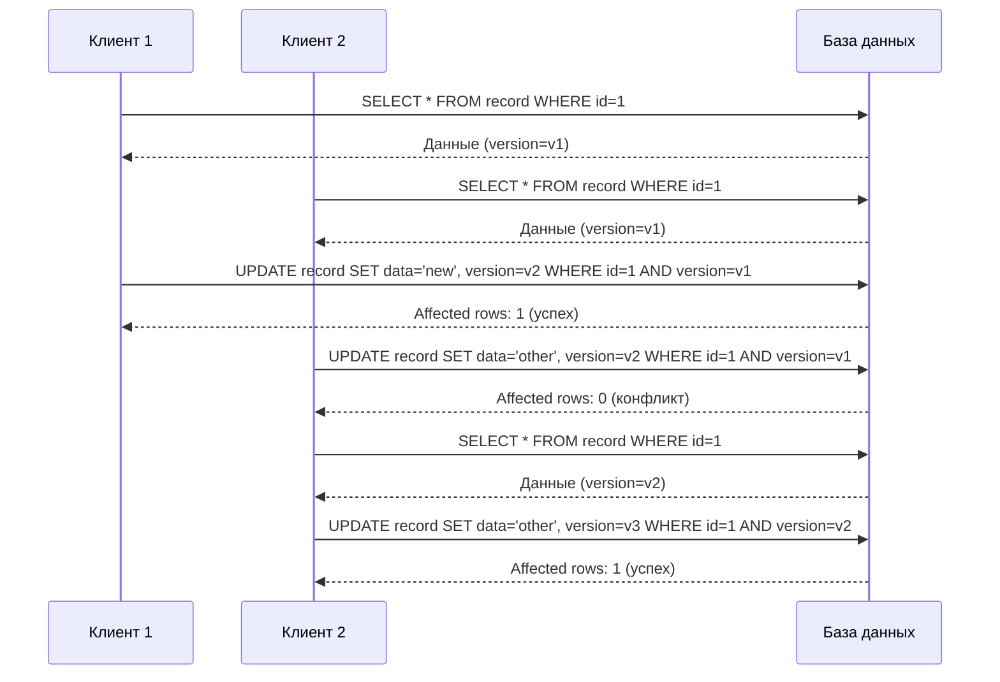
```mermaid
sequenceDiagram
    participant Client1 as Клиент 1
    participant Client2 as Клиент 2
    participant DB as База данных

    Client1->>DB: SELECT * FROM record WHERE id=1
    DB-->>Client1: Данные (version=v1)
    Client2->>DB: SELECT * FROM record WHERE id=1
    DB-->>Client2: Данные (version=v1)
    Client1->>DB: UPDATE record SET data='new', version=v2 WHERE id=1 AND version=v1
    DB-->>Client1: Affected rows: 1 (успех)
    Client2->>DB: UPDATE record SET data='other', version=v2 WHERE id=1 AND version=v1
    DB-->>Client2: Affected rows: 0 (конфликт)
    Client2->>DB: SELECT * FROM record WHERE id=1
    DB-->>Client2: Данные (version=v2)
    Client2->>DB: UPDATE record SET data='other', version=v3 WHERE id=1 AND version=v2
    DB-->>Client2: Affected rows: 1 (успех)
```

**Пояснение:** Показывает механизм optimistic locking: версия используется для обнаружения конфликтов параллельной записи. Клиент 2 сначала получает конфликт, затем повторяет операцию с новой версией.

---

### Поиск иллюстраций (альтернатива Mermaid)

| Ключевые слова | Стиль | Рекомендуемые источники |
|---------------|-------|------------------------|
| "single source of truth data management" | Инфографика | Freepik, Icons8 |
| "optimistic vs pessimistic locking diagram" | Технический | Freepik |
| "data lifecycle management state machine" | Корпоративный | Icons8, Freepik |
| "idempotency key pattern illustration" | Технический | Freepik |

---

# Часть II. Архитектура решений

---

## Модуль 0 (Часть II). Подсчёт и планирование нагрузки

### [18] Рекомендуемая визуализация: Процесс Capacity Planning

**Тип:** Диаграмма Mermaid (flowchart)

**Код Mermaid:**

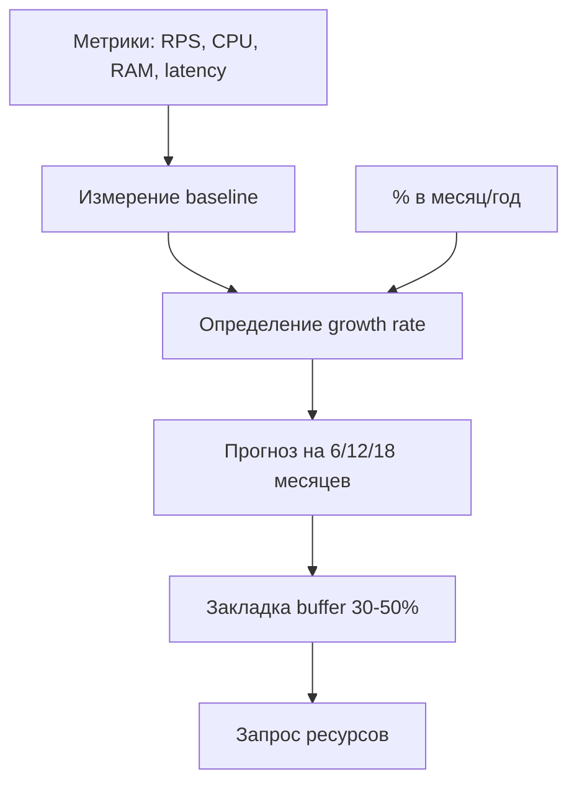
```mermaid
flowchart TD
    A[Измерение baseline] --> B[Определение growth rate]
    B --> C[Прогноз на 6/12/18 месяцев]
    C --> D[Закладка buffer 30-50%]
    D --> E[Запрос ресурсов]

    A1[Метрики: RPS, CPU, RAM, latency] --> A
    B1[% в месяц/год] --> B
```

**Пояснение:** Пошаговый процесс capacity planning: baseline -> growth rate -> прогноз -> buffer -> запрос. Формула расчёта CPU/RAM дана в теоретической части.

---

### Поиск иллюстраций (альтернатива Mermaid)

| Ключевые слова | Стиль | Рекомендуемые источники |
|---------------|-------|------------------------|
| "capacity planning server resources graph" | Инфографика | Freepik, Icons8 |
| "load testing RPS chart" | Технический | Freepik |
| "scalability planning infrastructure" | Корпоративный | Icons8 |

---

## Модуль 1 (Часть II). Трейдоффы: Треугольник "Быстро - Дёшево - Надёжно"

### [19] Рекомендуемая визуализация: Треугольник компромиссов

**Тип:** Диаграмма Mermaid (flowchart)

**Код Mermaid:**

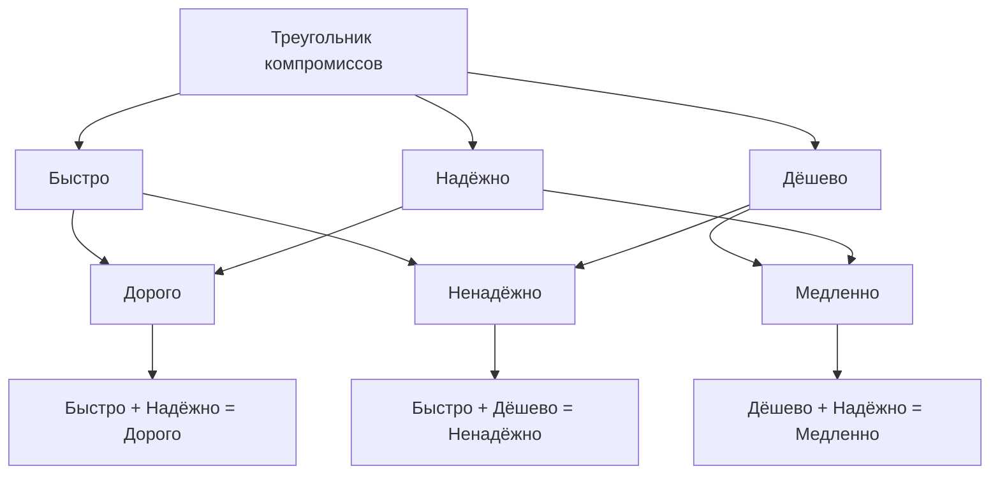
```mermaid
flowchart TD
    A[Треугольник компромиссов] --> B[Быстро]
    A --> C[Дёшево]
    A --> D[Надёжно]
    
    B & D --> E[Дорого]
    B & C --> F[Ненадёжно]
    C & D --> G[Медленно]
    
    E --> H[Быстро + Надёжно = Дорого]
    F --> I[Быстро + Дёшево = Ненадёжно]
    G --> J[Дёшево + Надёжно = Медленно]
```

**Пояснение:** Классический треугольник трейдоффов. Показывает, почему нельзя получить все три преимущества одновременно — всегда чем-то придётся пожертвовать.

---

### Поиск иллюстраций (альтернатива Mermaid)

| Ключевые слова | Стиль | Рекомендуемые источники |
|---------------|-------|------------------------|
| "fast cheap reliable tradeoff triangle" | Инфографика | Freepik, Icons8 |
| "project management triangle quality cost time" | Корпоративный | unDraw, Freepik |

---

## Модуль 2 (Часть II). Нефункциональные требования с точки зрения архитектуры приложения

### [20] Рекомендуемая визуализация: Circuit Breaker State Machine

**Тип:** Диаграмма Mermaid (state diagram)

**Код Mermaid:**

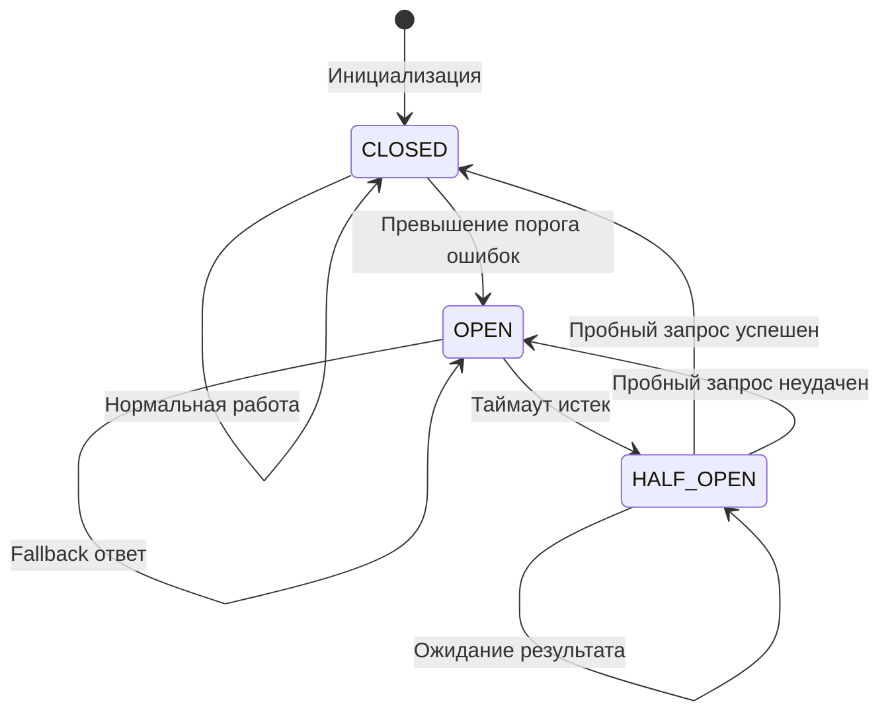
```mermaid
stateDiagram-v2
    [*] --> CLOSED : Инициализация
    CLOSED --> OPEN : Превышение порога ошибок
    OPEN --> HALF_OPEN : Таймаут истек
    HALF_OPEN --> CLOSED : Пробный запрос успешен
    HALF_OPEN --> OPEN : Пробный запрос неудачен
    CLOSED --> CLOSED : Нормальная работа
    OPEN --> OPEN : Fallback ответ
    HALF_OPEN --> HALF_OPEN : Ожидание результата
```

**Пояснение:** Три состояния Circuit Breaker: CLOSED (нормальная работа) -> OPEN (ошибки, fallback) -> HALF_OPEN (пробный запрос) -> CLOSED (восстановление) или снова OPEN. Критично для понимания отказоустойчивости.

---

### Поиск иллюстраций (альтернатива Mermaid)

| Ключевые слова | Стиль | Рекомендуемые источники |
|---------------|-------|------------------------|
| "circuit breaker pattern resilience4j" | Технический | Freepik, Icons8 |
| "availability tiers 99.9 vs 99.99 diagram" | Инфографика | Freepik |
| "SLA downtime calculation table" | Корпоративный | Icons8 |

---

## Модуль 3 (Часть II). Стратегии интеграции: Синхронная, Асинхронная, Файлы

### [21] Рекомендуемая визуализация: Decision Tree выбора стратегии интеграции

**Тип:** Диаграмма Mermaid (flowchart)

**Код Mermaid:**

```mermaid
flowchart TD
    A[Старт] --> B{Нужен немедленный ответ?}
    B -->|Да| C[Синхронная интеграция]
    B -->|Нет| D{Объём данных > 10MB?}
    D -->|Да| E[Интеграция через файлы]
    D -->|Нет| F{Скорость важнее консистентности?}
    F -->|Да| G[Асинхронная интеграция]
    F -->|Нет| C
```

**Пояснение:** Decision tree помогает быстро выбрать правильную стратегию интеграции. Три вопроса: нужен ли немедленный ответ, объём данных, скорость vs консистентность.

---

### Поиск иллюстраций (альтернатива Mermaid)

| Ключевые слова | Стиль | Рекомендуемые источники |
|---------------|-------|------------------------|
| "integration strategies synchronous async file" | Инфографика | Freepik, Icons8 |
| "kafka vs rabbitmq comparison diagram" | Технический | Freepik |
| "file transfer sftp integration flow" | Корпоративный | Icons8 |

---

## Модуль 4 (Часть II). Границы (Bounded Context) и C4-диаграммы

### [22] Рекомендуемая визуализация: C4 Model — все 4 уровня

**Тип:** Диаграмма Mermaid (flowchart)

**Код Mermaid:**

```mermaid
flowchart TD
    subgraph Level1[Level 1: System Context]
        User[Пользователь] -->|HTTP| System[Система]
        System -->|API| ExternalSystem[Внешняя система]
    end

    subgraph Level2[Level 2: Container]
        WebApp[Веб-приложение] -->|REST| ApiGateway[API Gateway]
        ApiGateway -->|gRPC| ServiceA[Сервис A]
        ApiGateway -->|gRPC| ServiceB[Сервис B]
        ServiceA -->|SQL| Database[(База данных)]
        ServiceB -->|AMQP| Queue[Очередь сообщений]
    end

    subgraph Level3[Level 3: Component]
        Controller[Контроллер] -->|Вызов| Service[Сервисный слой]
        Service -->|Запрос| Repository[Репозиторий]
        Repository -->|ORM| Database2[(БД)]
        Service -->|Отправка| MessageBroker[Брокер сообщений]
    end

    subgraph Level4[Level 4: Code]
        UserClass[UserController] -->|dependency| UserService[UserService]
        UserService -->|implements| IUserService[IUserService]
        UserService -->|uses| UserRepository[UserRepository]
        UserRepository -->|extends| BaseRepository[BaseRepository]
    end

    System --> WebApp
    ApiGateway --> Controller
    ServiceA --> Service
    Database --> Database2
```

**Пояснение:** Все 4 уровня C4: System Context (L1) -> Container (L2) -> Component (L3) -> Code (L4). Показывает, как один и тот же фрагмент системы выглядит на разных уровнях абстракции для разной аудитории.

---

### Поиск иллюстраций (альтернатива Mermaid)

| Ключевые слова | Стиль | Рекомендуемые источники |
|---------------|-------|------------------------|
| "C4 model software architecture diagram context container" | Технический | Freepik, Icons8 |
| "bounded context map strategic ddd" | Инфографика | Freepik |
| "structurizr C4 example diagram" | Технический | Structurizr сайт |

---

## Модуль 5 (Часть II). Эволюция архитектуры: миграция, метрики, разрезание монолита

### [23] Рекомендуемая визуализация: Strangler Fig Pattern — этапы миграции

**Тип:** Диаграмма Mermaid (flowchart)

**Код Mermaid:**

```mermaid
flowchart TD
    subgraph Этап1[Этап 1: Монолит]
        M1[Монолит] -->|100% функциональности| U1[Пользователи]
    end

    subgraph Этап2[Этап 2: Монолит + 1 микросервис]
        M2[Монолит] -->|80% функциональности| U2[Пользователи]
        MS1[Микросервис 1] -->|20% функциональности| U2
        M2 -.->|Замена 20%| MS1
    end

    subgraph Этап3[Этап 3: Монолит + 3 микросервиса]
        M3[Монолит] -->|40% функциональности| U3[Пользователи]
        MS2[Микросервис 1] -->|20% функциональности| U3
        MS3[Микросервис 2] -->|20% функциональности| U3
        MS4[Микросервис 3] -->|20% функциональности| U3
        M3 -.->|Замена 60%| MS2
        M3 -.->|Замена 60%| MS3
        M3 -.->|Замена 60%| MS4
    end

    subgraph Этап4[Этап 4: Все в микросервисах]
        MS5[Микросервис 1] -->|25% функциональности| U4[Пользователи]
        MS6[Микросервис 2] -->|25% функциональности| U4
        MS7[Микросервис 3] -->|25% функциональности| U4
        MS8[Микросервис 4] -->|25% функциональности| U4
        M4[Монолит] -.->|Отключен| X[Удален]
    end

    Этап1 -->|Поэтапная замена| Этап2
    Этап2 -->|Поэтапная замена| Этап3
    Этап3 -->|Полная замена| Этап4
```

**Пояснение:** Поэтапная замена монолита микросервисами без остановки системы. Показаны 4 этапа: от 100% монолита до полного вытеснения монолита микросервисами.

---

### [24] Рекомендуемая визуализация: Архитектурные метрики и график главной последовательности

**Тип:** Диаграмма Mermaid (flowchart)

**Код Mermaid:**

```mermaid
flowchart TD
    A[Архитектурные метрики] --> B[Instability I]
    A --> C[Abstractness A]
    A --> D[Distance D]
    A --> E[Coupling связанность]
    A --> F[Cohesion связность]

    B --> B1[I = Ce / (Ce + Ca)]
    C --> C1[A = Na / Nc]
    D --> D1[D = |A + I - 1|]
    E --> E1[Ce - Efferent Coupling]
    F --> F1[Cohesion - внутренняя связность]

    B1 --> G[График I vs A]
    C1 --> G
    D1 --> G

    G --> H[Зона главной последовательности]
    H --> I[Идеальная линия A + I = 1]
    H --> J[Зона боли D < 0]
    H --> K[Зона бесполезности D > 0]

    I --> L[Компонент на линии: сбалансирован]
    J --> M[Компонент в зоне боли: высокая связанность]
    K --> N[Компонент в зоне бесполезности: избыточная абстракция]
```

**Пояснение:** Классификация архитектурных метрик (Instability, Abstractness, Distance, Coupling, Cohesion) с формулами и графиком главной последовательности. Помогает оценить качество архитектуры количественно.

---

### Поиск иллюстраций (альтернатива Mermaid)

| Ключевые слова | Стиль | Рекомендуемые источники |
|---------------|-------|------------------------|
| "strangler fig pattern monolith to microservices migration" | Инфографика | Freepik, Icons8 |
| "anti corruption layer pattern" | Технический | Freepik |
| "software architecture metrics main sequence" | Технический | Freepik |

---

## Модуль 6 (Часть II). ADR — Architecture Decision Records

### [25] Рекомендуемая визуализация: ADR Lifecycle

**Тип:** Диаграмма Mermaid (flowchart)

**Код Mermaid:**

```mermaid
flowchart TD
    A[ADR Proposed] --> B{ArchCom Review}
    B -->|Accepted| C[ADR Accepted]
    B -->|Rejected| D[ADR Rejected]
    C --> E[ADR Deprecated]
    E --> F[ADR Superseded]
```

**Пояснение:** Жизненный цикл ADR: Proposed -> Reviewed (ArchCom) -> Accepted / Rejected -> Deprecated -> Superseded. Показывает, как решения эволюционируют со временем.

---

### [26] Рекомендуемая визуализация: Процесс ArchCom в Ингосе

**Тип:** Диаграмма Mermaid (flowchart)

**Код Mermaid:**

```mermaid
flowchart TD
    A[Разработчик/аналитик] -->|Пишет ADR| B[ADR в markdown в репозитории]
    B -->|Публикует для обсуждения| C{RFC period 3-5 дней}
    C -->|Обсуждение завершено| D[ArchCom рассматривает]
    D -->|Ставит статус| E{Решение принято?}
    E -->|Да| F[Принятое решение фиксируется]
    E -->|Нет| G[Отклонено / требуется доработка]
    F --> H[Не пересматривается без нового ADR]
    G --> A
```

**Пояснение:** Реальный процесс ArchCom в Ингосе: от написания ADR в markdown до фиксации решения. Показывает RFC-период, роль архитектурного комитета и возможность доработки.

---

### Поиск иллюстраций (альтернатива Mermaid)

| Ключевые слова | Стиль | Рекомендуемые источники |
|---------------|-------|------------------------|
| "architecture decision record template" | Корпоративный | Freepik, Icons8 |
| "ADR board documentation wall" | Инфографика | Freepik |
| "architectural decision log process" | Технический | Icons8 |

---

# Итоговая аттестация

## Рекомендуемая визуализация: Структура итогового проекта

Для итоговой аттестации рекомендуется **создать единую архитектурную схему**, объединяющую:

| Компонент | Тип визуализации | Инструмент |
|-----------|-----------------|------------|
| ADR | Markdown-шаблон (из Модуля 6) | adr-tools, GitHub |
| C4 Level 2 | Mermaid-диаграмма (flowchart) | Structurizr, Draw.io |
| Трейдофф-анализ | Таблица + треугольник (Модуль 1, Часть II) | Mermaid |
| Оценка нагрузки | Таблица + flowchart (Модуль 0, Часть II) | Mermaid |

**Примерный шаблон C4 Level 2 для итогового проекта:**

```mermaid
flowchart TD
    User[Пользователь] -->|HTTPS| WebApp[Web Application]
    WebApp -->|REST| API[API Gateway]
    API -->|gRPC| ServiceA[Новый сервис]
    ServiceA -->|SQL| Database[(PostgreSQL)]
    ServiceA -->|Kafka| EventBus[Event Bus]
    EventBus -->|Subscribe| ServiceB[Смежный сервис]
    ServiceB -->|Read| Database
    ServiceA -->|REST| LegacySystem[Legacy System]
    LegacySystem -->|SFTP| FileStorage[(File Storage)]
```

---

# Сводная таблица всех визуализаций

| N | Модуль | Тип визуализации | Ключевые слова для поиска |
|---|--------|-----------------|---------------------------|
| 1 | Модуль 0 - Принципы | Flowchart (Mermaid) | "SOLID principles diagram flat design" |
| 2 | Модуль 0 - ADP цикл | Flowchart (Mermaid) | "acyclic dependencies principle" |
| 3 | Модуль 0 - SDP график | Flowchart (Mermaid) | "software design principles comparison" |
| 4 | Модуль 1 - Эволюция стилей | Flowchart (Mermaid) | "monolith vs microservices architecture comparison" |
| 5 | Модуль 2 - Синхронный вызов | Sequence (Mermaid) | "synchronous vs asynchronous communication" |
| 6 | Модуль 2 - Saga Choreography | Sequence (Mermaid) | "saga pattern distributed transactions diagram" |
| 7 | Модуль 2 - Saga Orchestration | Sequence (Mermaid) | "orchestration saga pattern" |
| 8 | Модуль 2 - Outbox Pattern | Flowchart (Mermaid) | "outbox pattern cdc debezium" |
| 9 | Модуль 3 - Thread states | State (Mermaid) | "multithreading concurrency problems diagram" |
| 10 | Модуль 3 - Deadlock | Flowchart (Mermaid) | "race condition vs deadlock illustration" |
| 11 | Модуль 4 - CAP-треугольник | Flowchart (Mermaid) | "CAP theorem triangle explained with databases" |
| 12 | Модуль 5 - Bounded Context Map | Flowchart (Mermaid) | "domain driven design strategic modeling" |
| 13 | Модуль 5 - CQRS поток | Flowchart (Mermaid) | "CQRS pattern diagram event sourcing" |
| 14 | Модуль 5 - TDD-цикл | Flowchart (Mermaid) | "TDD vs BDD comparison infographic" |
| 15 | Модуль 6 - SSOT | Flowchart (Mermaid) | "single source of truth data management" |
| 16 | Модуль 6 - State Machine данных | State (Mermaid) | "data lifecycle management state machine" |
| 17 | Модуль 6 - Optimistic Locking | Sequence (Mermaid) | "optimistic vs pessimistic locking diagram" |
| 18 | Часть II, М0 - Capacity Planning | Flowchart (Mermaid) | "capacity planning server resources graph" |
| 19 | Часть II, М1 - Треугольник | Flowchart (Mermaid) | "fast cheap reliable tradeoff triangle" |
| 20 | Часть II, М2 - Circuit Breaker | State (Mermaid) | "circuit breaker pattern resilience4j" |
| 21 | Часть II, М3 - Decision Tree | Flowchart (Mermaid) | "integration strategies synchronous async file" |
| 22 | Часть II, М4 - C4 Model | Flowchart (Mermaid) | "C4 model software architecture diagram" |
| 23 | Часть II, М5 - Strangler Fig | Flowchart (Mermaid) | "strangler fig pattern monolith to microservices" |
| 24 | Часть II, М5 - Метрики | Flowchart (Mermaid) | "software architecture metrics main sequence" |
| 25 | Часть II, М6 - ADR Lifecycle | Flowchart (Mermaid) | "architecture decision record template" |
| 26 | Часть II, М6 - ArchCom Process | Flowchart (Mermaid) | "architectural decision log process" |

---

# Рекомендуемые источники иллюстраций

| Ресурс | URL | Тип контента | Лицензия |
|--------|-----|-------------|----------|
| **Freepik** | freepik.com | Иконки, иллюстрации, инфографика | Бесплатно с указанием автора |
| **Icons8** | icons8.com | Иконки, иллюстрации, 3D-рендеры | Бесплатный план (ограничен) |
| **unDraw** | undraw.co | Иллюстрации с открытым исходным кодом | Бесплатно (MIT) |
| **Draw.io / diagrams.net** | draw.io | Диаграммы, блок-схемы | Бесплатно |
| **Structurizr** | structurizr.com | C4-диаграммы на основе DSL | Бесплатно для небольших проектов |
| **Mermaid Live Editor** | mermaid.live | Онлайн-редактор Mermaid | Бесплатно |
| **PlantUML** | plantuml.com | UML-диаграммы, C4 | Бесплатно (GPL) |

---

> **Подсказка по интеграции:** Все Mermaid-диаграммы из этого файла поддерживаются в GitHub/GitLab (вставка через ```mermaid), в Notion (/mermaid), в Confluence (плагин "Mermaid Diagrams for Confluence"), в Obsidian (плагин "Obsidian Mermaid") и многих других Markdown-редакторах.

---

Файл **`illustrations.md`** успешно создан и содержит **26 готовых Mermaid-диаграмм** (с кодами для копирования) + **таблицы с ключевыми словами для поиска** готовых иллюстраций в открытых источниках (Freepik, Icons8, unDraw) для каждого модуля курса.